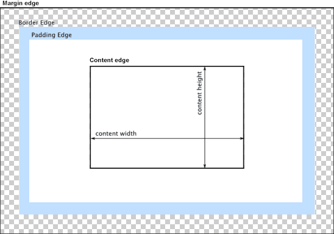
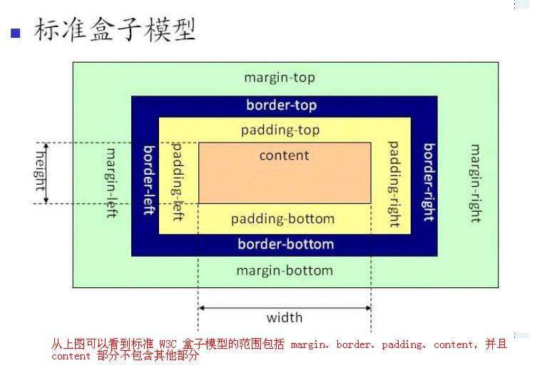
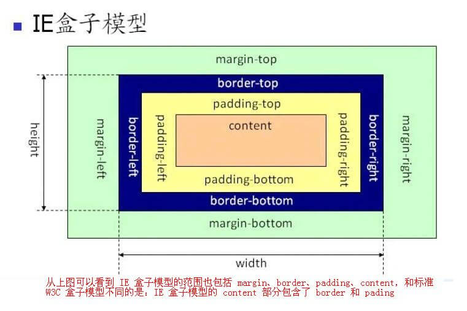

阅读前先带几个问题：
1. 什么是 CSS 盒模型
2. 有哪些盒模型？
3. 各自的差异？

## 什么是 CSS 盒模型？

CSS 盒模型本质上是一个盒子，将所有元素表示为一个个矩形的盒子，CSS 决定这些盒子的大小、位置以及属性等等。每个盒子由四个部分组成：外边距--Margin、边框--Border、内边距--Padding 和实际内容--Content。

盒模型实际上是用来设计和布局时使用的。它允许我们在其他元素和周围元素边框之间的控件放置其他元素。

## 有哪些盒模型？

**基础框盒模型或者标准盒模型** 和 **怪异盒模型**。

## 各自的差异？

### 标准盒模型

在标准盒模型中，`width` 指的是内容区域 content 的宽度，height 指的是 content 的高度，盒子大小等于：width + border + padding + margin。

### 怪异盒模型-IE 盒模型

在怪异盒模型中，`width` 指的是内容区域 content 的宽度加上边框和内边距的宽度，height 指的是 content 的高度加上边框和内边距的高度，盒子大小等于：width(border + padding + content) + margin。

在 CSS3 中，我们通过设置 `box-sizing` 属性来指定盒模型类型。

- `box-sizing: content-box`：标准盒模型
- `box-sizing: border-box`：怪异盒模型
- `box-sizing: inherit`：从父元素继承 box-sizing 属性的值