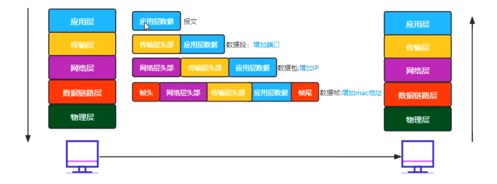
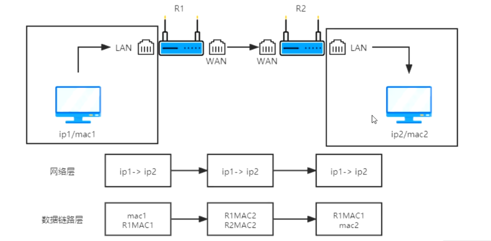

### OSI 七层模型

这是一个理想化的模型，给我们的网络划分了层次。

> 我们可以将复杂的内容简单化，每一层都专人做专事

1. [最底层]物理层：只关心如何传输数据，传输的是比特流的
2. 数据链路层：主要关心的是将两个设备连接起来，用来连接数据
3. 网络层：网络层是寻址
4. 传输层：把数据传递给对方（怎么传，以及丢失后的重新传递）
5. 会话层：建立会话和管理会话
6. 表示层：怎么把数据进行描述、压缩等
7. 应用层：用户最终使用的接口（微信、QQ、网页等）

> 底层都是为上一层做服务的

在实际应用中，我们会将5、6、7统称为应用层；而将1、2统称为网络接口层。

我们来看一个例子：

> 给女朋友写信：
>
> 1. 要说的话——> 应用层
> 2. 整理话术——> 表示层
> 3. 建立会话 ——>会话层
> 4. 我家504号到女朋友家301号——>传输层
> 5. 增加你家的具体位置和对象地址——>网络层
> 6. 传输你的信——>数据链路层
> 7. 最终的交通工具——>物理层

### 七层协议真正都做了什么事情

- 报文：应用层 + 数据
- 数据段：传输层 + 数据 + 端口号
- 数据包：网络层 + 数据 + 端口 + IP 地址
- 数据帧：链路层 + 数据 + 端口 + IP 地址 + MAC 地址

> IPv4：IP 地址的第四个版本，最大值：42亿个（255的四次方）
>
> IPv6：这个太大了，自行百度
>
> IP 地址不是固定的（因为连接的网络不同），但是我们的 MAC 地址是唯一的（也是可以更改的），每个网卡都会有一个固定的 MAC 地址。

### 物理层有哪些设备？

- 光纤
- 同轴电缆
- 网线
- wifi
- 集线器（多口的中继器）--淘汰了
- 中继器（信号放大器）--也淘汰了
- ......

物理层就是关心怎么传输数据的，它不关心安全问题。

### 链路层设备

- 交换机（局域网通信）

### 网络层设备

- 路由器：路由器有 wan 口可以充当网关进行上网，没有 wan 口的路由器可以看成是交换机。默认两个不同的网络，不能相互通信，想让两个不同区域的设备来通信，要经历网关。

  - wan 口：外网网口，网关
  - lan 口：内网网口，可以做局域网

  

  ### 网络中的协议

  