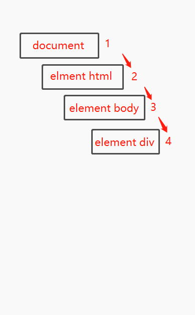
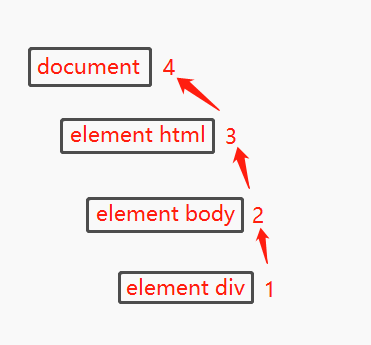
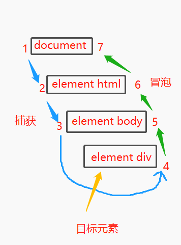

首先我们知道 JavaScript 与 HTML 的交互式通过**事件**实现的，事件代表文档或浏览器窗口中某个有意义的时候，可以使用尽在事件发生时执行的**监听器**（也叫处理程序）订阅事件。在传统软件工程领域，这个模型叫“观察者模式”。

## 事件流

什么是事件流呢？事件流说白了其实就是描述了页面接收事件的顺序。

DOM2 Events 规范规定事件流分为 3 个阶段：事件捕获、到达目标（目标阶段）和事件冒泡。

### 事件捕获

首先是事件捕获阶段，为提前拦截事件提供了可能。

它的具体意思其实是最不具体的节点应该先收到事件，而最具体的节点应该最后收到事件。实际上它就是为了在事件到达最终目标前而拦截事件。

比如我们点击一个 html 中的 div 元素，则会以下列图示顺序触发点击事件：



在事件捕获中， click 事件首先由 document 元素捕获，然后沿着 DOM 树依次向下传播，直至到达实际的目标元素 div。

实际上，现在所有浏览器都是从 window 对象开始捕获事件，而 DOM2 Events 规范规定的是从 document 开始。但是由于旧版本浏览器不支持，因此实际当中几乎不会使用事件捕获。通常建议使用事件冒泡，特殊情况下可以使用事件捕获。

### 目标阶段

在目标阶段，实际的目标元素接收到了事件。

### 事件冒泡

最后到达冒泡，最迟要在这个阶段响应事件。

它与事件捕获刚好是相反的，事件被定义为从最具体的元素（文档树中的目标节点）开始触发，然后向上传播至没有那么具体的元素（文档）。以事件捕获的图为例，我们会得到一个相反的顺序图出来。



所有现代浏览器都支持事件冒泡，只是在实现方式上会有一些变化。现代浏览器中的事件会一直冒泡到 window 对象。

> **注意**  所有现代浏览器都支持 DOM 事件流，只有 IE8 及更早版本不支持。

对于事件流来说，stopPropagation() 方法会立即阻止事件流在 DOM 结构中的传播，取消后续的事件捕获或者冒泡。比如：

```js
let btn = document.getElementById('btn');
btn.onclick = function (event) {
    console.log('Clicked');
    event.stopPropagation();
}

document.body.onclick = function (event) {
    console.log('body clicked');
}
```

如果这个例子中不调用 stopPropagation 方法，那么点击按钮就会打印两条日志。但是由于这里 click 事件不会传播到 document.body 上去，因此 onclick 事件处理程序永远不会执行。

在事件中，eventPhase 属性可用于确定事件流当前所处的阶段。如果事件处理程序在捕获阶段被调用，则 eventPhase 等于 1；如果事件处理程序在目标上被调用，则 eventPhase 等于2；如果事件处理程序在冒泡阶段被调用，则 eventPhase 等于3。这里需要注意的一点是，目标阶段通常在事件处理时会被认为是冒泡阶段的一部分，但是虽然如此，eventPhase 仍然会等于2。

下面是一个完整的 DOM 事件流。



## 补充

对于 DOM 事件处理程序来说，这里会细化为 DOM0 事件处理程序，也就是我们平常会见到的这种方式：

```js
let btn = document.getElementById('btn');
btn.onclick = function() {
    console.log('Clicked')
}
```

它是把一个函数赋值给（DOM元素的）一个事件处理程序属性。而以这种方式添加事件处理程序是注册在事件流的冒泡阶段的。

而在 DOM2 事件处理程序中又新增了 addEventListener 方法，这个方法暴露在所有的 DOM 节点上，接收三个参数：事件名、事件处理函数和一个布尔值，**true 表示在捕获阶段调用事件处理程序，false （默认值）表示在冒泡阶段调用事件处理程序**。

所以在之前说到的 eventPhase 属性上来讲：

```js
let btn = document.getElementById('btn');
btn.onclick = function (event) {
    console.log(event.eventPhase); // 2
}
document.body.addEventListener('click', (event) => {
    console.log(event.eventPhase);  // 1
}, true)
document.body.onclick = function (event) {
    console.log(event.eventPhase); // 3
}
```

> **注意**   event 对象只在事件处理程序执行期间存在，一旦执行完毕，就会被销毁。