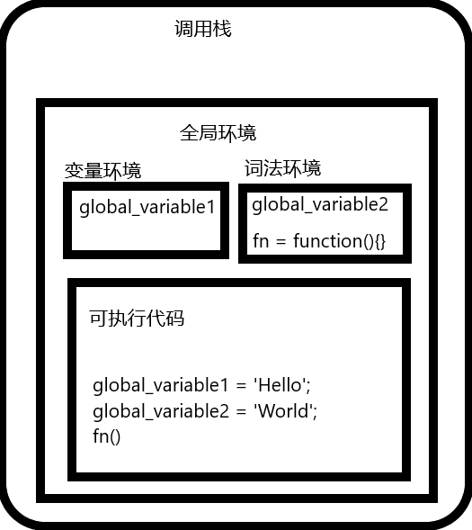
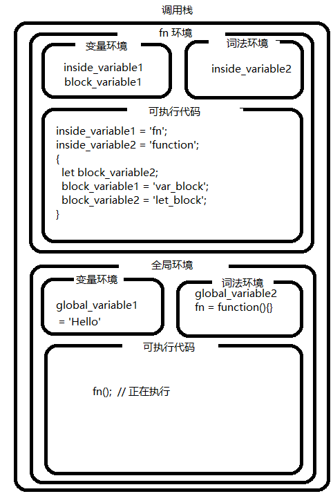

今天聊聊词法环境以及它跟闭包的联系：
1. 什么是词法环境
2. 跟闭包有啥联系

## 什么是词法环境

词法环境是由内部 JavaScript 引擎构造，用来保存标识符变量映射关系。它还保存对父词法环境的引用。

那么这里的标识符就是指变量或者函数的名称，变量是对实际对象（包括函数类型对象）或者原始值的引用。

而当每次 JavaScript 引擎创建执行上下文来执行函数或者全局代码时，就会创建一个新的词法环境，以存储在该函数执行期间在该函数中定义的变量。

词法环境有两个组成部分：
1. 环境记录：存储变量和函数声明的实际位置
2. 对外部环境的引用：实际上就是对外部或者说是父级词法环境的引用。这对理解闭包是如何工作的尤为重要。

我们可以下面例子理解词法环境：
```js
lexicalEnvironment = {
  environmentRecord: {        // 环境记录
    <identifier>: <value>,
    <identifier>: <value>
  }
  outer: < Reference to the parent lexical environment >  // 外部环境引用
}
```

来看个实际例子：
```js
const text = 'Hello Lexical Environment'

function fn() {
  const fnText = 'Inside Lexical Environment'
  console.log('Inside function') 
}
fn();
console.log('Inside global execution context')
```

当 JavaScript 创建一个全局执行上下文来执行全局代码时，它还会创建一个新的词法环境用来存储全局范围内定义的变量和函数。所以对于这个全局的词法环境就有：
```js
globalLexicalEnvironment = {
  environmentRecord: {
    text: 'Hello Lexical Environment',
    fn: < reference to function object >
  }
  outer: null
}
```

这是全局作用域下的词法环境，所以外层这里是 null.

而当 JavaScript 引擎为函数 fn 创建执行上下文时，它会再创建一个词法环境来存储在函数执行期间在该函数内部定义的变量。函数 fn 的词法环境如下：
```js
functionLexicalEnvironment = {
  environmentRecord: {
    fnText: 'Inside Lexical Environment'
  }
  outer: < globalLexicalEnvironment >
}
```

这里就可以看到 outer 引用的是父级的词法环境。

::: tip
当函数完成时，它的执行上下文将从堆栈中删除，但它的词法环境就不一定了，可能会从内存中删除，也可能不会从内存中删除，这取决于该词法环境是否被其外部词法环境属性中的任何其他词法环境引用。典型的例子就是闭包。
:::

所以我们小小的总结一下：

词法环境就是在**JavaScript 引擎创建一个执行上下文时，创建的用来存储变量和函数声明的环境**，它可以使代码在执行期间，访问到存储在其内部的变量和函数，而在代码执行完毕之后，从内存中释放掉。

> 注意：通过 var 定义的变量，存在于变量环境。变量环境，我们改天再讲

我们来看一个简单的例子，看看变量环境、词法环境、执行上下文（this）和通过作用域查找某个变量这样一个过程：
```js
var global_variable1 = 'Hello';
let global_variable2 = 'World';

function fn() {
  var inside_variable1 = 'fn';
  let inside_variable2 = 'function';
  {
    var block_variable1 = 'var_block';
    let block_variable2 = 'let_block';
  }
}

fn()
```

那实际的代码执行顺序就是：
```js
// 全局代码的执行过程
var global_variable1;
let global_variable2;
fn = function() {}
global_variable1 = 'Hello';
global_variable2 = 'World';
fn()

// fn 内部执行顺序
var inside_variable1;
let inside_variable2;
var block_variable1;
inside_variable1 = 'fn';
inside_variable2 = 'function';
{
  let block_variable2;
  block_variable1 = 'var_block';
  block_variable2 = 'let_block';
}
```

代码在被 JavaScript 引擎编译并创建全局上下文，放入到调用栈中，如下图：


当全局代码执行到函数 fn 的时候，创建函数 fn 的执行上下文，放入到调用栈当中，此时：


而当代码执行到块级作用域时，块级作用域不存在编译过程，词法环境就是一个小型的栈，所以这里块级作用域的执行是将变量加入到当前 fn 环境的词法环境中去。（就懒得画图了，自行脑补）

我们再来看看作用域链的查找是怎样的，加入我们现在要查找全局变量 global_variable1，那么会从 fn 的词法环境向上逐一查找，直到找到为止。

```md
fn 词法环境--》fn 变量环境--》全局词法环境--》全局变量环境
```

最后在代码执行完之后，挨个儿出栈。

## 跟闭包的联系

我们在闭包那一节说过，闭包其实就是**一个函数和其周围状态（其实就是说的词法环境）的引用捆绑在一起**，这样的组合就是闭包。