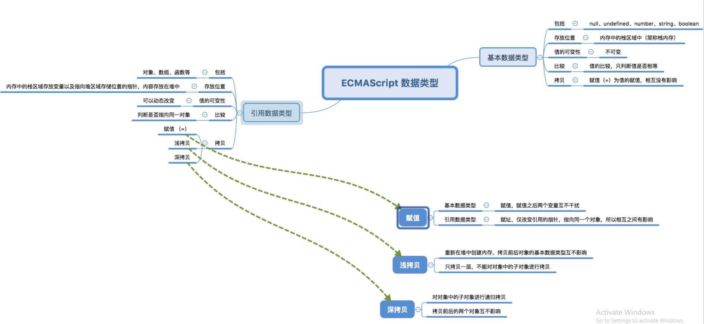
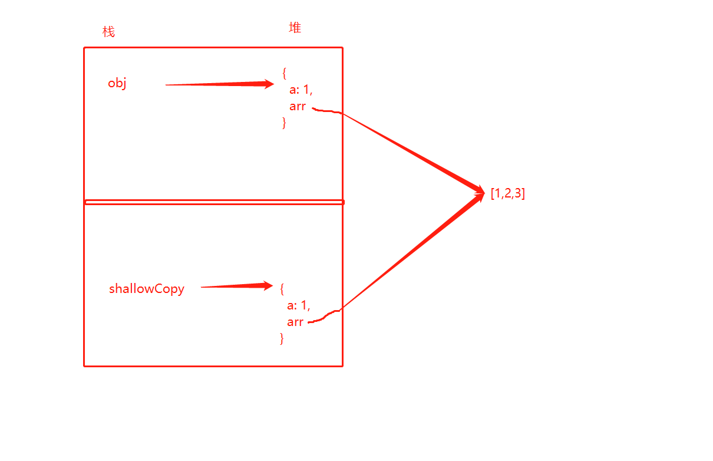

图片转自[js 深拷贝 vs 浅拷贝](https://juejin.cn/post/6844903493925371917)



我们平常说的深拷贝和浅拷贝都是基于对诸如 `Object` 和 `Array` 等引用数据类型的拷贝。对于基本数据而言，拷贝为某个值的赋值。

**基本数据类型**

JavaScript 中基本数据类型有五类——`String、Number、Boolean、null、undefined`，它们的值存放在了内存中的栈中，也就是我们说的栈内存。它们是存放在栈内存中的简单数据段，数据大小确定，内存空间大小可以分配，可以直接访问。

**基本数据类型的值是不可变的**。那这里会有人要问？可以改变啊！我们可以给它赋值啊。但是这里需要注意的是，对一个变量的重新赋值，并没有改变基本数据类型的值。它们的赋值操作是在内存中新开辟一段栈内存，然后再将值赋值到新的栈中去——我们可以称其为传值。

```js
var a = 10;
var b = a;

a ++ ;
console.log(a); // 11
console.log(b); // 10
```

<table>
  <caption style="width: 500px;height: 40px; line-height: 40px;background: #67cc86;color: #fff;">给b初始化后的栈区</caption>
  <tr>
    <td>b</td>
    <td>10</td>
  </tr>
  <tr>
    <td>a</td>
    <td>10</td>
  </tr>
</table>

**引用数据类型**

而在 JavaScript 中还有一种数据类型就是引用数据类型，也叫复杂数据类型。比如 `Object、Array、Function`等，其实我们可以理解为 `Object`。它们的值存放是这样的：在栈内存中存放变量以及指向堆内存中存储位置的指针（说简单点，变量实际上是一个存放在栈内存中的指针），值存放在堆内存中。值是可以动态改变的。

引用类型是可以直接改变其值的：

```js
var a = [1,2,3];
a[1] = 5;
console.log(a[1]);  // 5
```

引用类型的比较实则是引用（指针）的比较，也就是看其引用是否指向同一个对象。

```js
var a = { tt: 1 };
var b = { tt: 1 };

console.log(a === b);   // false
```

虽然他俩的内容都是 { tt: 1 }，但是它们在内存中的位置是不一样的，指向的不是同一个对象，所以不相等。

引用类型的赋值相对而言，不是简单的值的传递，而是引用的传递，可以理解为传址。也就是说引用类型的赋值其实就是对象保存在栈内存中地址的赋值，这样就可以将两个变量都指向一个对象，此时两者之间的操作相互之间都是有影响的。

```js
var a = {}; // a保存了一个空对象的实例
var b = a;  // a和b都指向了这个空对象

a.name = 'jozo';
console.log(a.name); // 'jozo'
console.log(b.name); // 'jozo'

b.age = 22;
console.log(b.age);// 22
console.log(a.age);// 22

console.log(a == b);// true
```

**浅拷贝**

那么经常会有人说赋值也是浅拷贝，其实这种说法是不严谨的，因为赋值本质上只是同一个引用，并不是真正的浅拷贝。

浅拷贝只复制一层对象的属性，并不会进行递归复制，而在浅拷贝之后，源对象与目标对象的引用已经不是同一块内存空间。

JavaScript 存储对象都是存储地址的，浅拷贝导致更深一层的对象可能会指向同一个内存地址。

```js
var obj = { a: 1, arr: [1,2,3] }
var copyObj = shallowCopy(obj);

function shallowCopy(obj) {
  var copy = {}
  for (var key in obj) {
    if (obj.hasOwnProperty(key)) {
      copy[key] = obj[key]
    }
  }
  return copy;
}
```



这样会导致如果改变其中某个对象的 arr 属性，那另一个对象的也会被改变：

```js
obj.arr[0] = 3;
copyObj.arr[0]; // 3
```

**实现浅拷贝的主要方法有**：
1. 循环遍历——看上面 `shallowCopy` 函数；
2. ES6 Object.assign()
   - Object.assign() 方法用于将所有可枚举属性的值从一个或多个源对象分配到目标对象。它将返回目标对象。
   - 拷贝的是对象的属性的引用，而不是对象本身。
   - 源码实现：
```js
if (typeof Object.assign !== 'function') {
  Object.defineProperty(Object, 'assign', {
    value: function assign(target, varArgs) {
      'use strict';
      if (target === null || target === undefined) {
        throw new TypeError('Cannot convert undefined or null to object');
      }

      var to = Object(target);

      for (var index = 1; index < arguments.length; index++) {
        var nextSource = arguments[index];

        if (nextSource !== null && nextSource !== undefined) {
          for (var key in nextSource) {
            if (Object.prototype.hasOwnProperty.call(nextSourcem key)) {
              to[key] = nextSource[key]
            }
          }
        }
      }
      return to;
    },
    writable: true,
    configurable: true,
  })
}
```
3. ES6 扩展运算符
  ```js
  let obj2 = {...obj1};
  ```
4. Array.from()
   ```js
    let arr1 = [1, 2, 3, 4]
    let arr2 = Array.from(arr1);
   ```
5. arr.slice()
   ```js
    let arr1 = [1, 2, 3, 4]
    let arr2 = arr1.slice();
   ```
6. concat 浅拷贝数组
   ```js
    let arr = [1,2,3];
    let newArr = arr.concat();
    newArr[0] = 100;
    console.log(arr); // 1,2,3
   ```

下节再详谈深拷贝。