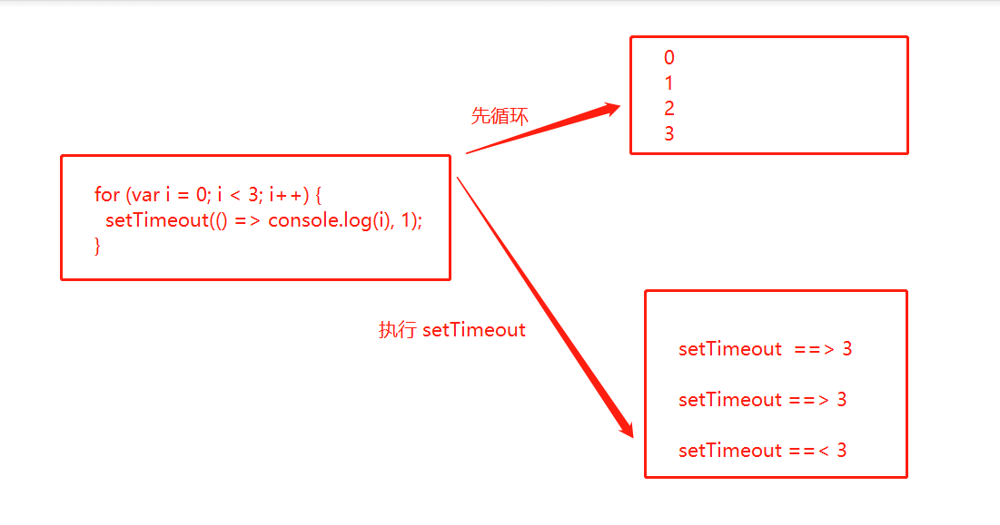
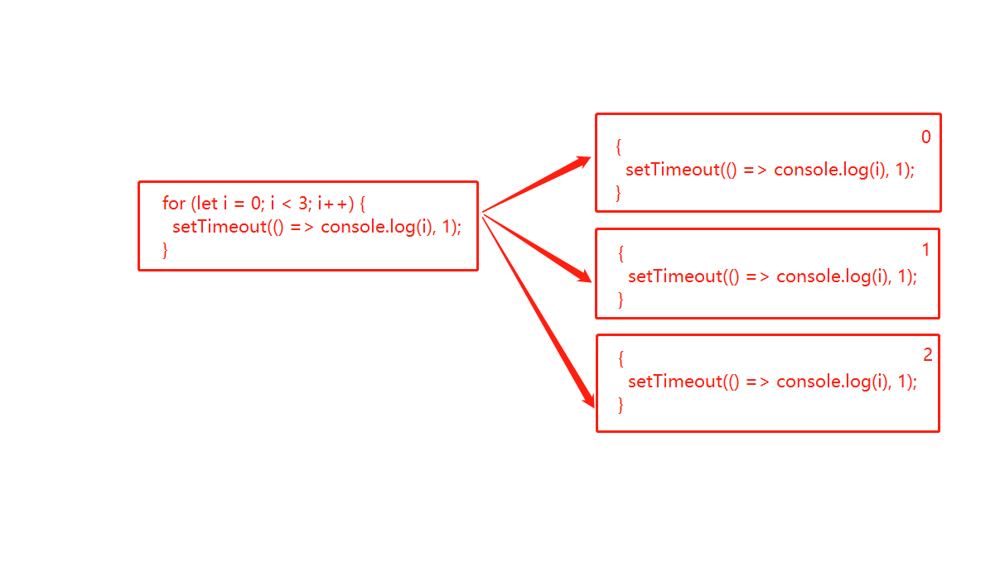

## 1、请输出下面代码结果
```js
class Person {
  constructor() {
    this.name = 'Lydia'
  }
}

Person = class AnotherPerson {
  constructor() {
    this.name = 'Sarah'
  }
}

const member = new Person()
console.log(member.name)
```

::: tip 参考答案
Sarah

我们可以将类被赋值于其他类/函数构造函数。在这种情况下，我们将 AnotherPerson 赋值给 Person。此时 Person 实例的指针指向 AnotherPerson 的实例，所以 member.name 属性的值是 Sarah。
:::

## 2、输出对对象 person 有副作用的表达式
```js
const person = {
  name: 'Lydia Hallie',
  address: {
    street: '100 Main St'
  }
}

Object.freeze(person)
```

::: tip 参考答案
`person.address.street = "101 Main St"`

使用 `Object.freeze` 方法是对一个对象进行**冻结**。即不能对其属性进行修改、添加、删除等操作。但是，这里只是对对象本身做了一个浅冻结，什么意思呢？这意味着只有当前对象的**直接属性**被冻结。如果属性是另一个 object，像上述代码中的 address，那 address 中的 street 属性并没有被冻结，仍然可以被修改。
:::

## 3、请输出下面代码结果
```js
const person = { name: 'Lydia' }

function sayHi(age) {
  console.log(`${this.name} is ${age}`)
}

sayHi.call(person, 21)
sayHi.bind(person, 21)
```

::: tip 参考答案
Lydia is 21 and function

在使用 call 和 bind 时都会改变 this 的指向，但不同的是，调用 call 方法后会立即执行，返回改变 this 指向并执行函数后的结果。而调用 bind 会先返回函数的副本，也就是拷贝，这个副本中带有绑定的上下文，此时函数并不会立即执行，需要手动执行一下。
:::

## 4、请输出下面代码结果
```js
class Conunter {
  #number = 10

  increment() {
    this.#number++
  }

  getNum() {
    return this.#number
  }
}

const counter = new Counter()
counter.increment()

console.log(counter.#number)
```

::: tip 参考答案
SyntaxError

在 ES2020 中，通过 # 我们可以给 class 添加私有变量。在 class 的外部我们无法取得该值。所以当我们尝试输出 counter.#number 时，会抛出异常 SyntaxError。
:::
## 5、请输出下面代码结果
```js
const handler = {
  set: () => console.log('Added a new property!'),
  get: () => console.log('Accessed a property!')
}

const person = new Proxy({}, handler)

person.name = 'Tuo';
person.name;
```

::: tip 参考答案
Added a new property! Accessed a property!

使用 Proxy 对象，我们可以给一个对象添加自定义行为。在上述代码中，包含 set 和 get 方法的 handler 对象在经过 Proxy 实例化后得到 person，设置属性时就会调用 set 方法，获取属性时就会调用 get 方法。
:::

## 6、请输出下面代码结果
```js
for (var i = 0; i < 3; i++) {
  setTimeout(() => console.log(i), 1);
}

for (let i = 0; i < 3; i++) {
  setTimeout(() => console.log(i), 1);
}
```

::: tip 参考答案
3 3 3 and 0 1 2

根据 JavaScript 的事件执行机制，当 setTimeout 函数真正被执行时，循环已经走完。

那么第一个循环中使用 var 关键字定义变量 i，此时该值是全局的。在循环期间，每循环一次该值递增一次，循环完之后该值为 3，然后再去调用 setTimeout 函数时，打印出来三个 3。



而第二个循环中使用 let 关键字定义变量 i，此时的 i 是具有作用域的，每次循环时，i 将被创建为一个新值，且每个值都会存在于循环内的块级作用域。



:::

## 7、下面代码输出什么？

```js
const sum = eval('10*10+5')
```

::: tip 参考答案

105


eval 会为字符串传递的代码求值。如果它是一个表达式，那么它就会计算表达式。因此 10 * 10 + 5 计算得到 105。

:::

## 8、请输出下面代码结果

```js
(() => {
    let x = (y = 10)
})()

console.log(typeof x);
console.log(typeof y);
```

::: tip 参考答案

undefined  number


首先使用 let 关键字声明变量 x 是定义在函数体内的局部变量，它只作用于块级作用域，故而当在外面访问 x 时，是访问不到的，typeof 返回 undefined。

而 y 在这里相当于是给全局对象 window 增加了一个 y 属性，成为了全局变量，所以当我们访问 y 时，typeof 返回 number。

`let x = (y = 10)` 其实是下面这段代码的缩写：

```js
var y;
y = 10;
let x = y;
```

:::

## 9、可以访问多长时间？

```js
seesionStorage.setItem('long', 123)
```

::: tip 参考答案

用户关闭选项卡时


关闭选项卡后，将删除存储在 sessionStorage 中的数据。

:::

## 10、请输出下面代码结果

```js
function Car() {
    this.make = 'Lamborghini';
    return { make: 'Maserati' };
}

const myCar = new Car();
console.log(myCar.make);
```

::: tip 参考答案

Maserati


返回属性的时候，属性的值就是返回值，而不是构造函数中设定的值，所以在这里返回了字符串 'Maserati'，所以 `myCar.make` 等于 'Maserati'。

:::