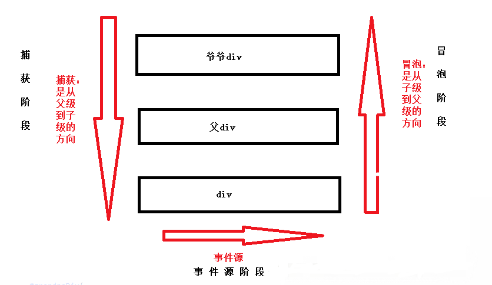

## 1、以下哪些值是假值？

```js
0;
new Number(0);
('');
(' ');
new Boolean(false);
undefined;
```

::: tip 参考答案
0, '', undefined

JavaScript 中只有六个假值：
- undefined
- null
- NaN
- 0
- ''(empty string)
- false

函数构造函数，如 new Number 和 new Boolean 都是真值。
:::

## 2、`setInterval` 方法的返回值是什么？

```js
setInterval(() => console.log('Hi'), 1000)
```

::: tip 参考答案
一个唯一的 id

setInterval 方法返回一个唯一的 id，此 id 用于 clearInterval() 函数清除定时器。
:::

## 3、这个函数做了什么？

```js
JSON.parse()
```

::: tip 参考答案
Parses JSON to a JavaScript value——将 JSON 字符串解析为 JavaScript 值。

JSON.parse 会将 JSON 字符串解析为一段有效的 JavaScript 值，而 JSON.stringify 会将 JavaScript 值解析为有效的 JSON 字符串。
:::

## 4、输出下面代码结果

```js
let c = { greeting: 'Hey!' };
let d;

d = c;
c.greeting = 'Hello';
console.log(d.greeting);
```

::: tip 参考答案
Hello

在 JavaScript 中，当设置它们彼此之间相等时，所有对象都通过引用进行交互。

首先变量 c 在栈内存中会有一个指针指向存储在堆内存当中的值。之后我们将 c 赋值给 d，此时 d 也会指向相同的值，也就是说他们的引用相同，所以更改 c 的属性时，d 的属性也会发生变化。
:::

## 5、会发生什么？

```js
function bark() {
  console.log('Woof!');
}

bark.animal = 'dog';
```

::: tip 参考答案
Nothing, this is totally fine!

这在 JavaScript 中是可能的，因为函数也是对象！（基本数据类型之外的所有数据都是对象）。

函数是一种特殊类型的对象。它是具有属性的对象，此属性是可调用的。
:::

## 6、输出下面代码结果

```js
const person = { name: 'Lydia' };

Object.defineProperty(person, 'age', { value: 21 })

console.log(person);
console.log(Object.keys(person));
```

::: tip 参考答案
{ name: 'Lydia', age: 21 } ['name']

通过 defineProperty 方法，可以给对象添加一个新属性，或者修改已经存在的对象属性。但是使用 defineProperty 方法添加的属性默认是*不可枚举*的，且是*不可变*的。可以在设置的时候通过 writable, configurable 和 enumerable 属性来改变这种默认行为。
:::

## 7、输出下面代码结果

```js
// index.js
console.log('running index.js')
import { sum } from './sum.js'
console.log(sum(1, 2));

// sum.js
console.log('running sum.js')
export const sum = (a, b) => a + b;
```


::: tip 参考答案
running sum.js running index.js 3

import 命令是编译阶段执行的，是在代码执行之前。所以被导入的模块（`sum.js`）会先运行，而导入模块的文件（`index.js`）会后执行。

这是 CommonJS 中 require() 和 import 之间的区别。使用 require()，我们可以在运行代码时按需加载，这时就会按顺序打印 runing index.js => running sum.js => 3
:::

## 8、下面说法正确吗？为什么？

```md
所有对象都有原型
```

::: tip 参考答案
错误

因为基础对象是没有原型的，或者说基础对象的原型是 null，基础对象指的是原型链重点的对象。除基础对象之外的所有对象都有原型。
:::

## 9、事件传播的三个阶段是什么？

::: tip 参考答案
捕获 > 目标 > 冒泡

在捕获阶段，事件通过父元素传递到目标元素。当达到目标元素后，冒泡开始。


:::

## 10、输出下面代码结果

```js
const randomValue = 21;

function getInfo() {
  console.log(typeof randomValue);
  const randomValue = 'Lydia';
}

getInfo();
```

::: tip 参考答案
ReferenceError

通过 const 关键字声明的变量在被初始化之前是不可被引用的，这被称之为*暂时性死区*。在 getInfo 函数里面，变量 randomValue 声明在此函数的作用域词法环境中。当使用 typeof 时，randomValue 并没有被初始化，ReferenceError 错误被抛出。有人说外层定义了变量 randomValue，但是需要注意的是 JS 引擎并不会根据作用域链网去寻找该变量，因为在 getInfo 函数中我们已经声明了此变量。
:::