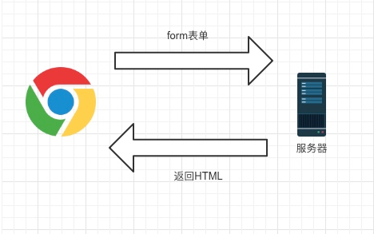
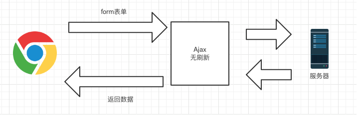
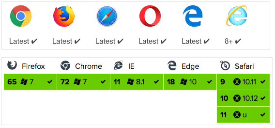

[原文链接](http://axios-js.com/zh-cn/blogs/)

## Ajax

我们说的 Ajax 是 `Asynchronous JavaScript and XML` 的缩写，意思是异步网络请求。区别于传统 web 开发中采用的同步方式。

Ajax 带来的最大影响就是页面可以无属性的请求数据。

传统 web 请求方式：



使用 Ajax 后请求：



**实现一个 ajax 请求**

在现代浏览器上实现一个 ajax 请求：

```js
var request = new XMLHttpRequest();  // 创建 XMLHttpRequest 对象

// ajax 是异步的，设置回调函数
request.onreadystatechange = function () {  // 状态发生变化时，函数被回调
  if (request.readyState === 4) {  // 成功完成
    // 判断响应状态码
    if (request.status === 200) {
      // 成功，通过 responseText 拿到响应的文本
      return success(request.responseText)
    } else {
      // 失败，根据响应码判断失败原因
      return fail(request.status)
    }
  } else {
    // HTTP 请求还在继续...
  }
}

// 发送请求
request.open('GET', '/api/details')
request.setRequestHeader('Content-Type', 'application/json')  // 设置请求头
request.send()  // 到这一步，请求才正式发出
```

实际项目中我们还是会采用一些封装好的库来使用，原生方法比较繁琐，比如经典的 jQuery 就有封装好的 ajax 方法，而且很好的解决了浏览器兼容的问题。

## axios

其实 axios 并不是一种新的技术。它是基于 Promise 用于浏览器和 nodejs 的 HTTP 客户端，本质上也是对原生 XHR 的封装，只不过它是 Promise 的实现版本，符合最新的 ES 规范，有以下特点：
- 从浏览器中创建 XMLHttpRequests
- 从 nodejs 创建 http 请求
- 支持 Promise API
- 拦截请求和响应
- 转换请求数据和响应数据
- 取消请求
- 自动转换 JSON 数据
- 客户端支持防御 XSRF

在浏览器支持性上：



axios 在兼容性上只对现代浏览器友好，对于版本较低的浏览器不支持。

因为 axios 设计简洁，API 简单，支持浏览器和 node，所以现在已经被广泛使用。

## fetch

fetch 是前端发展的一种新技术产物。

Fetch API 提供了一个 JavaScript 接口，用于访问和操纵 HTTP 管道的部分，例如请求和响应。它还提供了一个全局 fetch() 方法，该方法提供了一种简单、合理的方式来实现跨网络异步获取资源。

这种功能以前是使用 XMLHttpRequests 实现的。Fetch 提供了一个更好的替代方法，可以很容易地被其他技术使用。例如 Serive Workers。Fetch 还提供了单个逻辑位置来定义其他 HTTP 相关概念，例如 CORS 和 HTTP 的扩展。

在使用 fetch 的时候需要注意：
- 当接收到一个代表错误的 HTTP 状态码时，从 fetch() 返回的 Promise 不会被标记为 reject，即使该 HTTP 响应的状态码是 404 或 500.相反，它会将 Promise 状态标记为 resolve （但是会将 resolve 的返回值的 ok 属性设置为 false）。仅当网络故障或者请求被阻时，才会标记为 reject。
- 默认情况下，fetch 不会从服务端发送或接收任何 cookies，如果站点依赖于用户 session，则会导致未经认证的请求（要发送 cookies，必须设置 credentials 选项）。

来看个例子：

```js
fetch('http://example.com/movies.json')
  .then(function(response) {
    return response.json();
  })
  .then(function(myJson) {
    console.log(myJson);
  });
```

fetch代表着更先进的技术方向，但是目前兼容性不是很好，在项目中使用的时候得慎重。