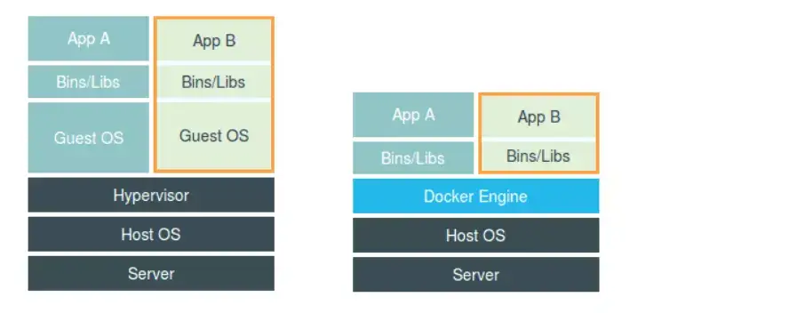
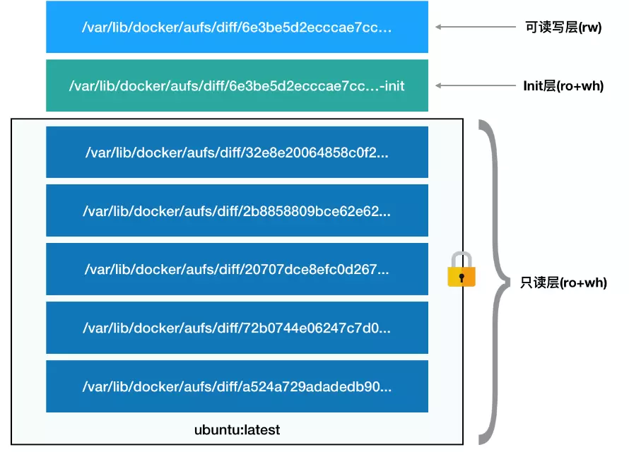
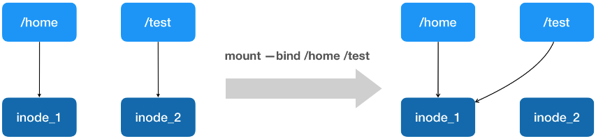
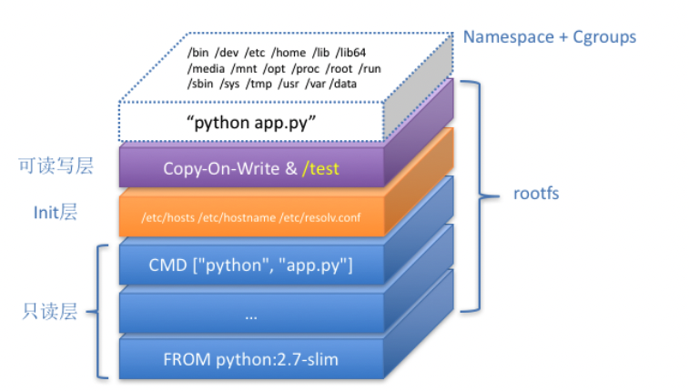

### 从进程说起

先对上一章的内容做一个总结，主要是容器技术的来龙去脉：

- 容器技术的兴起源于 PaaS 技术的普及
- Docker 公司发布的 Docker 项目具有里程碑式的意义
- Docker 项目通过容器镜像，解决了应用打包这个根本性难题

> 容器本身是没有价值的，有价值的部分是**容器编排**

那么，容器到底是怎么一回事儿？

在上一章中说到过，容器其实就是一种沙盒技术。顾名思义，沙盒就是能够像一个集装箱一样，把你的应用装起来的技术。这样，应用之间就有了边界而不会相互干扰，它们都有自己独立的空间，并方便被“搬运”。

说到边界，其实就是**通过约束和修改进程的动态表现**，而这也是容器技术的核心功能。

对于 Docker 等大多数 Linux 容器来说，Cgroups 技术是用来制造约束的主要手段，而 Namespace 技术则是用来修改进程视图的主要方法。

我们来看一个例子，我们在一台服务器上创建并运行一个容器：

```shell
docker run -it busybox /bin/sh
```

`docker run` 命令即创建并启动一个容器。

而 `-it` 参数告诉来 Docker 项目在启动容器后，需要给我们分配一个文本输入/输出环境，也就是 TTY（虚拟终端控制台），跟容器的标准输入相关联，这样我们就可以和这个 Docker 容器进行交互了。

`/bin/sh` 就是我们要在 Docker 容器里运行的程序。

`busybox` 其实就是一个镜像，如果在宿主机上没有找到这个镜像，就会到远程 Docker 仓库进行查找并拉取，如果远程仓库也没有，则会提示没有该镜像。

所以，上面这个指令翻译成人类的语言就是：请帮我启动一个容器，在容器里执行 `/bin/sh`，并给我分配一个命令行终端跟这个容器进行交互。

此时，你的服务器就是一个宿主机，而一个运行着 `/bin/sh` 的容器，就跑在了这个宿主机里。

接下来，我们在容器里面执行一下 `ps` 指令：

```shell
/ # ps
PID USER  TIME   COMMAND
1   root  0:00   /bin/sh
10  root  0:00   ps
```

可以看到，我们在 Dokcer 里最开始执行的 `/bin/sh` ，就是这个容器内部的第 1 号进程（PID=1），而这个容器里一共只有两个进程在运行。这就意味着，前面执行的 `/bin/sh` ，以及我们刚刚执行的 `ps` ，以及被 Docker 隔离在了一个跟宿主机完全不同的环境当中去了。

我们来一起看下这是如何做到的？

本来，每当我们在宿主机上运行一个 `/bin/sh` 程序，操作系统都会给它分配一个进程编号，比如 `PID = 100`。这个编号是进程的唯一标识，就像员工的工牌一样。所以 `PID = 100`，可以看成是 `/bin/sh` 是我们公司的第 100 位员工，而第一个员工自然是公司老大这样的人物。

现在，我们要通过 Docker 把这个 `/bin/sh` 程序运行在一个容器中。这时候，Docker 就会在这个第 100 号员工入职时给它一个障眼法，让它永远看不到前面的 99 个员工，这个时候它自然而然的以为自己就是这家公司的 1 号员工。

这种机制，其实就是对被隔离应用的进程空间做了手脚，使得这些进程只能看到重新计算过的进程编号，比如 `PID = 1`。可实际上，它们在宿主机上的进程编号还是原来的 100 号。

这种技术，就是 Linux 里面的 Namespace 机制。

Namespace 的使用方式其实只是 Linux 里创建新进程的一个可选参数。我们使用 `clone()` 方法在 Linux 中创建线程：

```shell
int pid = clone(main_function, stack_size, SIGCHLD, NULL)
```

这个系统调用就会为我们创建一个新的进程，并且返回它的进程号 ID。

而当我们在用 `clone()` 系统调用创建一个新进程时，就可以在参数中指定 `CLONE_NEWPID` 参数，比如：

```shell
int pid = clone(main_function, stack_size, CLONE_NEWPID | SIGCHLD, NUll)
```

这时，新创建的这个进程将会看到一个全新的进程空间，在这个进程空间中，它的 PID 是 1，之所以说看到，是因为这只是一个障眼法，在宿主机中，这个进程的 PID 其实还是真实的数值，比如 100。

除了刚刚用到的 PID Namespace，Linux 操作系统还提供了 Mount、UTS、IPC、Network 和 User 这些 Namespace，用来对各种不同的进程上下文进行障眼法操作：

- Mount Namespace：用于让被隔离进程只看到当前 Namespace 里的挂载点信息
- Network Namespace：用于让隔离进程看到当前 Namespace 里的网络设备和配置

这就是 Linux 容器最基本的实现原理了。

> 所以，Docker 容器实际上是在创建容器进程时，指定了这个进程所需要启用的一组 Namespace 参数。这样，容器就只能看到当前 Namespace 所限定的资源、文件、设备、状态、或者配置。
>
> 所以说，容器其实就是一种特殊的进程而已。



这是一张网上盛传的虚拟机和容器的对比图。

这幅图的左边，画出了虚拟机的工作原理。其中，名为 `Hypervisor` 的软件是虚拟机最主要的部分。它通过硬件虚拟化功能，模拟出了运行一个操作系统需要的各种硬件，比如 CPU、内存、I/O 设备等等。然后，它在这些虚拟的硬件上安装了一个新的操作系统，即 Guest OS。

这样，用户的应用进程就可以运行在这个虚拟的机器中，它能看到的自然也只有 Guest OS 的文件和目录，以及这个机器里的虚拟设备。这就是为什么虚拟机也能起到将不同的应用进程相互隔离的作用。

而这幅图的右边，则用一个名为 Docker Engine 的软件替换了 `Hypervisor` 。这也是为什么，很多人会把 Docker 项目称为**轻量级**虚拟化技术的原因，实际上就是把虚拟机的概念套在了容器上，但是这样的说法是不严谨的。

跟真实存在的虚拟机不同，在使用 Docker 的时候，并没有一个真正的 Docker 容器运行在宿主机里面。Docker 项目帮助用户启动的，还是原来的应用进程，只不过在创建这些进程的时候，Docker 为它们加上了各种各样的 Namespace 参数。

### 隔离与限制

 我们刚刚说到，在上面的虚拟机与容器技术的对比图中，不应该把 Docker Engine 或者任何容器管理工具放在跟 Hypervisor 相同的位置，因为它们并不像 Hypervisor 那样对应用进程的隔离环境负责，也不会创建任何实体的容器，真正对隔离环境负责的是宿主机操作系统本身；


所以，在这个对比图里，我们应该把 Docker 画在跟应用同级别并且靠边的位置。这意味着，用户运行在容器里的应用进程，跟宿主机上的其他进程一样，都由宿主机操作系统统一管理，只不过这些被隔离的进程拥有额外设置过的 Namespace 参数。而 Docker 项目在这里扮演的角色，更多的是旁路式的辅助和管理工作。

> 其实像 Docker 这样的角色甚至可以去掉

这个架构也解释了为什么 Docker 项目比虚拟机更受欢迎。

使用虚拟化技术作为应用沙盒，就必须要由 Hypervisor 来负责创建虚拟机，这个虚拟机是真实存在的，并且它里面必须运行一个完整的 Guest OS 才能执行用户的应用进程。这就不可避免地带来了额外的资源消耗和占用。

根据实验，一个运行着 CentOS 的 KVM 虚拟机启动后，在不做优化的情况下，虚拟机自己就需要占用 100-200 MB 的内存。此外，用户应用运行在虚拟机里，它对宿主机操作系统的调用就不可避免地要经过虚拟化软件的拦截和处理，这本身又是一层性能消耗，尤其对计算资源、网络和磁盘I/O的损耗非常大。

而相比之下，容器化后的用户应用，实际上还是宿主机的一个普通进程，这就意味着上述说的损耗是不存在的；而另一方面，使用 Namespace 作为隔离手段的容器并不需要单独的 Guest OS，这就使得额外的资源占用几乎可以忽略不计。

所以说，**敏捷**和**高性能**是容器相较于虚拟机最大的优势，也是它能够在 PaaS 这种更细粒度的资源管理平台上大行其道的重要原因。

不过，凡事都有两面性，Docker 虽好，但是也有不足，其中最主要的问题就是：**隔离得不彻底**。

<strong style="color: orange">首先，既然容器只是运行在宿主机上的一种特殊的进程，那么多个容器之间使用的就还是一个宿主机的操作系统内核。</strong>

这表示虽然你可以在容器里使用 Mount Namespace 单独挂载其他不同版本的操作系统文件，比如 CentOS 或者 Ubuntu，但这并不能改变共享宿主机内核的事实。所以，假如你想要在 Windows 宿主机上运行 Linux 容器，或者在低版本的 Linux 宿主机上运行高版本的 LInux 容器，都是不可以的。

而相比之下，拥有硬件虚拟化技术和独立 Guest OS 的虚拟机就要方便得多了。

<strong style="color: orange">其次，在 Linux 内核中，有很多资源和对象是不能被 Namespace 化的，最典型的例子就是：时间。</strong>

举个例子，假如你的容器中的程序使用了 settimeofday(2) 系统调用修改了时间，那么整个宿主机的时间都会被随之修改，这显然不符合用户的预期。

而这些问题，尤其是共享宿主机内核的事实，容器给应用暴露出来的攻击面是相当大的，应用越狱的难度自然也比虚拟机低得多。	

以上都是说的隔离技术。现在我们来研究一下容器的**限制**技术。

那为什么有了 Namespace 之后，还需要对容器做限制呢？

这是因为使用 Namespace 只能达到障眼法的作用，而在宿主机上，容器本身和其他进程之间依然是平等的竞争关系。这意味着容器表面上被隔离了起来，但是它要使用的资源，却是可以随时被宿主机上的其他进程占用，也有可能它将所有资源都吃光。这显然是不合理的。

而 Linux Cgroups 就是 Linux **内核中用来为进程设置资源限制的一个重要功能**。

**Linux Cgroups** 的全称是 Linux Control Group。它最主要的作用，就是限制一个进程组能够使用的**资源上限**，包括 CPU、内存、磁盘和网络带宽等等。

此外，Cgroups 还能够对进程进行优先级设置、审计，以及将进程挂起和恢复等操作。

在 Linux 中，Cgroups 给用户暴露出来的操作接口是文件系统，即它以文件和目录的方式组织在操作系统的 `/sys/fs/cgroup` 路径下。我们可以使用 `mount` 指令把它们展示出来：


可以看到，在 `/sys/fs/cgroup` 下面有很多诸如 `cpuset` 、`cpu` 、`memory` 这样的子目录，也叫做子系统。这些都是当前机器上可以被 Cgroups 进行限制的资源种类。而在子系统对应的资源种类下，我们就可以看到该类资源具体可以被限制的方法。比如，对 CPU 子系统来说，我们就可以看到如下几个配置文件：

```shell
ls /sys/fs/cgroup/cpu
cgroup.clone_chilren cpu.cfs_period_us cpu.rt_period_us cpu.shares notify_on_release
cgroup.procs.        cpu.cfs_quita_us  cpu.rt_runtime_us cpu.stat tasks
```

可以看到它的输出中有 `cfs_period` 和 `cos_quota` 这样的关键词。这两个参数需要组合使用，可以用来限制进程在长度为 `cfs_period` 的一段时间内，只能分配到总量为 `cfs_quota` 的 CPU 时间。

那如何使用这样的配置文件？

你需要在对应的子系统下面创建一个目录，比如，我们现在进入 `/sys/fs/cgroup/cpu` 目录下：

```shell
root@ubuntu:/sys/fs/cgroup/cpu $ mkdir container
ls container/
cgroup.clone_children cpu.cfs_period_us cpu.rt_period_us cpu.shares notify_on_release
cgroup.procs cpu.cfs_quota_us cpu.rt_runtime_us cpu.stat tasks
```

这个目录就称为一个**控制组**。而在我们创建好 container 目录的时候，操作系统会在该目录下，自动生成该子系统对应的资源限制文件。

假如我们现在在后台执行一个死循环的命令：

```shell
$ while : ; do : ; done &
[1] 226
```

它就可以把计算机的 CPU 干到 100%，根据它的输出，我们可以看到这个脚本在后台运行的进程号为 226.

我们还可以直接使用 `top` 命令来查看一下 CPU 有没有被打满：

```shell
$ top
%Cpu0 :100.0 us, 0.0 sy, 0.0 ni, 0.0 id, 0.0 wa, 0.0 hi, 0.0 si, 0.0 st
```

很明显，此时 CPU 使用率已经到了 100% 了（%Cpu0: 100.0 us）。

我们再回过头查看 container 目录下的文件，看到 container 控制组里的 CPU quota 还没有任何限制（即：-1），CPU period 则是默认的 100ms （100000 us）：

```shell
$ cat /sys/fs/cgroup/cpu/container/cpu.cfs_quota_us
-1

$ cat /sys/fs/cgroup/cpu/container/cpu.cfs_period_us
100000
```

我们可以通过直接修改这些文件的内容来设置限制。

比如，向 container 组里的 cos_quota 文件写入 20ms（即 20000 us）：

```shell
$ echo 20000 > /sys/fs/cgroup/cpu/container/cpu.cfs_quota_us
```

什么意思呢？它表示着在每 100ms 的时间里，被该控制组限制的进程只能使用 20ms 的 CPU 时间，也就是说这个进程只能使用到 20% 的 CPU 带宽。

到这一步我们只是配置了一下限额，要想让这个设置对该进程生效，还需要把对应的进程 PID 写入 container 组里的 tasks 文件中去：

```shell
$ echo 226 > /sys/fs/cgroup/cpu/container/tasks
```

然后再使用 top 命令查看一下：

```shell
$ top
%Cpu0 :20.3 us, 0.0 sy, 0.0 ni, 79.7 id, 0.0 wa, 0.0 hi, 0.0 si, 0.0 st
```

CPU 的使用率一下子就降到了 20% 不是么。

除了 CPU 子系统外，Cgroups 的每一项子系统都有其独有的资源限制能力，比如：

- blkio，为块设备设定I/O限制，一般用于磁盘等设备
- cpuest：为进程分配单独的 CPU 核和对应的内存节点
- memory：为进程设定内存使用的限制

Linux Cgroups 的设计就是一个子系统目录加上一组资源限制文件的组合。而对于 Docker 等 Linux 容器项目来说，它们只需要在每个子系统下面，为每个容器创建一个控制组（即上面创建的 container 目录），然后在启动容器进程之后，把这个进程的 PID 填写到对应控制组的 tasks 文件中就可以了。

至于在这些控制组下面的资源文件里填什么信息，就是通过用户执行 docker run 命令时的参数指定了：

```shell
$ docker run -it --cpu-period=100000 --cpu-quota=20000 ubuntu /bin/bash
```

这就很明显的在告诉计算机，在启动容器后，docker 这个控制组里的资源限制为智能使用到 20% 的 CPU 带宽：

```shell
$ cat /sys/fs/cgroup/cpu/docker/5d5c9f67d/cpu.cfs_period_us
100000
$ cat /sys/fs/cgroup/cpu/docker/5d5c9f67d/cpu.cfs_quota_us
20000
```

### 深入理解容器镜像

首先，我们还是要强调**容器的本质是一种特殊的进程**这个最重要的概念。

其次，在前面的讲述中，我们了解了 Linux 容器最基础的两种技术：Namespace 和 Cgroups。而这两种基础带来的作用是**隔离**和**限制**，那么用一句话来形容就是：一个进程在一个空间里被围上了一堵墙，且被施展了障眼法，从此它就被隔离在了一个封闭的环境里。这个环境就是 PaaS 项目赖以生存的应用**沙盒**。

但是，我们还有一个问题，虽然这个环境四周有了墙，那如果容器进程环绕四周，想要查看容器内的其他物件，又是怎样一副景象呢？

换句话说，**容器里的进程看到的文件系统又是什么样子的呢？**

> 理想化的状态：容器里的应用进程，理应看到一份完全独立的文件系统。这样，它就可以在自己的容器目录（比如 `/tmp`）下进行操作，而完全不受宿主机以及其他容器的影响。

但是，真实情况是这样吗？

我们来看一个小例子，在创建子进程时开启指定的 Namespace：

```shell
#define _GNU_SOURCE
#include <sys/mount.h>
#include <sys/types.h>
#include <sys/wait.h>
#include <stdio.h>
#include <sched.h>
#include <signal.h>
#include <unistd.h>
#define STACK_SIZE (1024 * 1024)
static char container_stack[STACK_SIZE]
char* const container_args[] = {
	"/bin/bash",
	NULL
}

int container_main(void* arg)
{
	printf("Container - inside the container!\n");
	execv(container_args[0], container_args);
	printf("Something's wrong!\n");
	return 1;
}

int main()
{
	printf("Parent - start a container!\n");
	init container_pid = clone(container_main, container_stack+STACK_SIZE, CLONE_NEWNS | SIGCHLD)
	waitpid(container_pid, NULL, 0);
	printf("Parent - container stopped!\n");
	return 0
}
```

我们在 main 函数中，通过 clone 系统调用创建了一个新的子进程 container_mian，并且声明要为它启用 Mount Namespace （即：CLONE_NEWNS 标志）。

而这个子进程执行的，是一个 `/bin/bash` 程序，也就是一个 shell。所以此时这个 shell 就运行在了 Mount Namespace 的隔离环境中。

我们来编译一下这个程序：

```shell
$ gcc -o ns ns.c
$ ./ns
Parent - start a container!
Container - inside the container!
```

这样，我们就进入了这个容器中。可是，如果在容器里执行一下 ls 指令的话，我们看到的还是宿主机的内容。

```shell
$ ls /tmp
# 一堆宿主机的文件
```

也就是说：**即使开启了 Mount Namespace，容器进程看到的文件系统也跟宿主机完全一样。**

这是为什么呢？

其实我们这里只是启用了 Mount Namespace，并没有执行**挂载**操作，**Mount Namespce 修改的，是容器进程对文件系统“挂载点”的认知**。这就意味着，只有在挂载操作发生后，进程的视图才会被改变。而在此之前，新创建的容器会直接继承宿主机的各个挂载点。

那知道这个之后就好办很多了，我们在创建新进程的时候，除了声明要启用 Mount Namespace 之外，还要告诉容器进程，有哪些目录需要重新挂载，就比如这个 `/tmp`目录。我们在容器进程执行之前可以添加一步重新挂载 `/tmp` 目录的操作：

```shell
int container_main(void* arg)
{
	printf("Container - inside the container!\n");
	mount("none", "/tmp", "tmpfs", 0, "");
	execv(container_args[0], container_args);
	printf("Something's wrong!\n");
	return 1;
}
```

我们在修改后的代码里，加上了一句 `mount("none", "/tmp", "tmpfs", 0, "");` 语句。就这样，咱们告诉了容器以 tmpfs （内存盘）格式，重新挂载了 `/tmp` 目录。

再次编译之后，查看 `/tmp` 就会发现它成了一个空目录，这说明我们的重新挂载已经生效了。

我们也可以通过 `mount -l` 来检验一下：

```shell
$ mount -l | grep tmpfs
none on /tmp type tmpfs (rw,relatime)
```

更重要的是，因为我们创建的新进程启用了 Mount Namespace，所以这次重新挂载的操作，只在容器进程的 Mount Namespace 中有效。如果在宿主机上用 `mount -l` 来检查一下这个挂载，你会发现它是不存在的：

```shell
# 在宿主机上
$ mount -l | grep tmpfs
```

**这就是 Mount Namespace 跟其他 Namespace 的使用略有不同的地方：它对容器进程视图的改变，一定是伴随着挂载操作（mount）才能生效**。

但是每个容器都需要我们手动去设置 Mount Namespace 是非常不友好的。我们更希望在创建一个新容器时，容器进程看到的文件系统就是一个独立的隔离环境，而不是继承自宿主机的文件系统。

> 最简单粗暴的方法就是在容器进程启动之前重新挂载它的整个根目录 `/`。而由于 Mount Namespace 的存在，这个挂载对于宿主机是不可见的，所以容器进程就可以在里面随便折腾了。

在 Linux 操作系统里，有一个名为 chroot 的命令可以帮助我们在 shell 中方便的完成这个工作。顾名思义，它的作用就是 `change root file system` ，即改变进程的根目录到你指定的位置。我们来看看它的用法：

```shell
# 我们现在要把一个 $ HOME/test 目录作为一个 /bin/bash 进程的根目录
$ mkdir -p $HOME/test
$ mkdir -p $HOME/test/{bin,lib64,lib}
$ cd $T
```

然后，把 bash 命令拷贝到 test 目录对应的 bin 路径下：

```shell
$ cp -v /bin/{bash,ls} $HOME/test/bin
```

接下来，把 bash 命令需要的所有 so 文件，也拷贝到 test 目录对应的 lib 路径下。找到 so 文件可以用 ldd 命令：

```shell
$ T=$HOME/test
$ list="$(ldd /bin/ls | egrep -o '/lib.*\.[0-9]')"
$ for i in $list;do cp -v "$i" "${T}${i}"; done
```

最后，执行 chroot 命令，告诉操作系统，我们将使用 $HOME/test 目录作为 `/bin/bash` 进程的根目录：

```shell
$ chroot $HOME/test /bin/bash
```

这时，咱们再执行 `ls /`，就会看到，它返回的都是 $HOME/test 目录下的内容，而不是宿主机的内容。

而且对于被 chroot 的进程来说，它并不会感受到自己的根目录已经被修改成 $HOME/test 了。

**这个挂载在容器根目录上，用来为容器进程提供隔离后执行环境的文件系统，就是所谓的“容器镜像”。它还有一个更为专业的名字，叫做：rootfs（根文件系统）。**

那一个最常见的 rootfs，或者说容器镜像，会包括如下所示的一些目录和文件：

```shell
$ ls /
bin dev etc home lib lib64 mnt opt proc root run sbin sys tmp usr var
```

而我们进入容器之后执行的 `/bin/bash` ，就是 `/bin` 目录下的可执行文件，与宿主机的 `/bin/bash` 完全不同。

那么现在，对于 Docker 项目来说，我们**可以理解它最核心的原理实际上就是为待创建的用户进程**：

1. 启用了 Linux Namespace 配置
2. 设置置顶的 Cgroups 参数
3. 切换进程的根目录（ change root）

这样，一个完整的容器就诞生了。不过，Docker 项目在最后一步的切换上会优先使用 `pivot_root` 系统调用，如果系统不支持，才会使用 chroot。

另外，还需要知道的是，rootfs 只是一个操作系统所包含的文件、配置和目录，并不包括操作系统内核。在 Linux 操作系统中，这两部分是分开存放的，操作系统只有在开启启动时才会加载指定版本的内核镜像。

所以说，rootfs 只包括了操作系统的“躯壳”，并没有包括操作系统的“灵魂”。

而对于容器来说，在宿主机上的所有容器都共享宿主机的操作系统内核。

这意味着，如果你的应用程序需要配置内核参数、加载额外的内核模块，以及跟内核进行直接的交互，就需要注意：这些操作和依赖的对象，都是宿主机操作系统的内核，它对该机器上的所有容器来说，是一个全局变量，是共同享有的。

所以，这也是容器相对于虚拟机来说的主要缺陷之一：毕竟后者不仅有模拟出来的硬件机器充当沙盒，而且每个沙盒里还运行着一个完整的 Guest OS 给应用随便折腾。

但是正是因为有了 rootfs 的存在，容器才有了一个被反复宣传至今的重要特性：**一致性**。

> 即应用和它运行所需要的所有依赖，都被封装在了一起。无论在本地、云端，还是在一台任何地方的机器上，用户只需要解压打包好的容器镜像，那么这个应用运行所需要的完整的执行环境就被重现出来了。

不过，我们此时还面临着一个问题：难道我们每开放一个应用，或者升级一下现有的应用，都要重新制作一次吗？

当然不是！

Docker 公司在实现 Docker 镜像时并没有沿用以前制作 rootfs 的标准流程，而是做了一个小小的创新：

> Docker 在镜像的设计中，引入了层（layer）的概念。也就是说，用户制作镜像的每一步操作，都会生成一个层，也就是一个增量的 rootfs。

这里用到了一种叫做**联合文件系统（Union File System）**的能力。

它最主要的功能时将多个不同位置的目录联合挂载到同一目录下。比如，我现在有两个目录 A 和 B：

```text
$ tree
.
|—— A
	|—— a
	|—— x
|—— B
	|—— b
	|—— x
```

然后，我们使用联合挂载的方式，将这两个目录挂载到一个公共的目录 C 上：

```shell
$ mkdir C
$ mount -t aufs -o dirs=./A:./B none ./C
```

这时候，我们再查看目录 C 的内容，就能看到目录 A 和 B 下的文件都被合并到一起：

```text
$ tree ./C
./C
|—— a
|—— b
|—— x
```

可以看到，在这个合并后的目录C里，有 a b x 三个文件，并且 x 文件只有一份。这就是合并的含义。此外，如果你在目录 C 里对 a b x 文件做修改，这些修改也会在对应的目录 A 和 B 中生效。

而在 Docker 中使用的 rootfs，往往由多个 layer 层组成：

```shell
$ docker inspect [image_id]

...
Layers: [
	...
	...
	...
]
...
```

比如一个 Ubuntu 镜像，实际上由五层组成。这五个层就是五个增量 rootfs，每一层都是 Ubuntu 操作系统文件与目录的一部分；而在使用镜像时，Docker 会把这些增量联合挂载在一个统一的挂载点上。

我们可以通过一些操作了解到镜像的层都放置在 `/var/lib/docker/aufs/diff` 目录下，然后被联合挂载在 `/var/lib/docker/aufs/mnt` 里面。

而且，从这个结构可以看出来，容器的 rootfs 由如下图所示的三部分组成：



第一部分，只读层。

它是这个容器的 rootfs 最下面的五层，对应的正是 ubuntu:latest 镜像的五层。它们的挂载方式都是只读的（readonly + whiteout）。

而这些层的内容，都以增量的方式分别包含了 Ubuntu 操作系统的一部分。

第二部分，可读写层。

它是这个容器的 rootfs 最上面的一层，它的挂载方式为 rw，也就是可读写的。在没有写入文件之前，这个目录都是空的。而一旦在这个容器里做了写操作，我们修改产生的内容都会以增量的方式出现在这个层中。

> 如果我们现在要删除只读层的一个文件呢？
>
> 为了实现这样的删除操作，AuFS 会在可读写层创建一个 whiteout 文件，把只读层里的文件遮挡起来。
>
> 比如，我们要删除只读层里一个名叫 foo 的文件，那么这个删除操作时机上是在可读写层创建了一个名叫 `.wh.foo` 的文件。这样，当这两个层被联合挂载之后，foo 文件就会被 `.wh.foo` 文件遮挡起来消失了。这个功能，就是 ro + wh 的挂载方式，即只读 + whiteout 的含义。

所以，最上面这个可读写的作用，就是专门用来存放你修改 rootfs 后产生的增量，无论是增、删、改，都发生在这里。而当我们使用完了这个被修改过的容器之后，还可以使用 docker commit 和 push 指令，保存这个被修改过的可读写层，并上传到 Docker Hub 上，让其他人使用，而于此同时，原先的只读层里的内容则不会有任何变化。这就是增量 rootfs 的好处。

第三部分，Init 层。

它是一个以 `-init` 结尾的层，夹在只读层和读写层之间。init 层是 Docker 项目单独生成的一个内部层，专门用来存放 `/etc/hosts`、`/etc/resolv.conf` 等信息。

需要这样一层的原因是，这些文件本来属于只读的 Ubuntu 镜像的一部分，但是用户往往需要在启动容器时写入一些指定的值比如 `hostname` ，所以就需要在可读写层对它们进行修改。

可是，这些修改往往只对当前的容器有效，我们并不希望执行 `docker commit` 时，把这些信息连同可读写层一起提交掉。所以，Docker 把这些修改的文件，以一个单独的层挂载了出来。而用户执行 `docker commit` 时，只会提交可读写层，而不会包含这些内容。

最终，这 7 个层都被联合挂载到 `/var/lib/docker/aufs/mnt` 目录下，表现为一个完整的 Ubuntu 操作系统供容器使用。

### 重新认识 Docker 容器

在开始实践之前，我们需要准一台 Linux 机器，并且安装 Docker。

我们即将在这个 Docker 上部署一个用 Python 编写的 Web 应用。主要用到的文件有以下几个：

- App.py
- 应用依赖文件——同目录下的 `requirements.txt` 
- Docker 官方提供的制作容器的方式——Dockerfile

```python
# app.py
From flask import Flask
import socket

app = Flask(__name__)

@app.route('/')

def hello():
  	html = "<h3>Hello {name}!</h3>" \
    			 "<b>Hostname:</b> {hostname}</br>"
    return html.format(name=os.getenv("NAME", "world"), hostname=socket.gethostname())
  
if __name__ == "__main__":
    app.run(host='0.0.0.0', port=80)
```

在这段代码中，我们使用 Flask 框架启动了一个 Web 服务器，它的功能就是在当前环境中如果有 “NAME” 这个环境变量，就把它打印在 “Hello“ 后，否则就打印出 `Hello world` ，最后再打印出当前环境的 hostname。

```txt
# requirements.txt
Flask
```

```shell
# dockerfile
# 使用官方提供的 Python 开放镜像作为基础镜像
FROM python:2.7-slim

# 将工作目录切换为 /app
WORKDIR /app

# 将当前目录下的所有内容复制到 /app 下
ADD . /app

# 使用 pip 命令安装这个应用所需要的依赖
RUN pip install --trusted-host pypi.python.org -r requirements.txt

# 允许外界访问容器的 80 端口
EXPOSE 80

# 设置环境变量
ENV NAME World

# 设置容器进程为 python app.py 即：这个 Python 应用的启动命令
CMD ["python", "app.py"]
```

可以看到，Dockerfile 都是使用一些标准的原语（即大写高亮的词语），描述我们所要构建的 Docker 镜像。并且这些原语，都是按照顺序进行处理的。

比如 FROM 原语，指定了 `python:2.7-slim` 这个官方维护的基础镜像，从而免去了安装 `Python` 等语言环境的操作。否则，这一段就需要这么写了：

```shell
FROM ubuntu:latest
RUN apt-get update -yRUN apt-get install -y python-pip python-dev build-essential
```

其中，RUN 原语就是在容器里执行 shell 命令的意思。

而 WORKDIR，意思是在这一句之后，Dockerfile 后面的操作都以这一句指定的 `/app` 目录作为当前目录。

所以，到了最后的 CMD，意思是 Dockerfile 指定 `python app.py` 为这个容器的进程。这里，app.py 的实际路径是 `/app/app.py` 。所以，`CMD ["python", "App.py"]` 等价于 `docker run python app.py`。 

另外，在使用 Dockerfile 时，我们可能还会看到一个叫做 ENTRYPOINT 的原语。实际上，它和 CMD 都是 Docker 容器进程启动必需的参数，完整执行格式是：`ENTRYPOINT CMD` 。

但是，默认情况下，Docker 会为我们提供一个隐含的 ENTRYPOINT，即：`/bin/sh -c` 。所以，在不指定 ENTRYPOINT 时，比如在我们的例子里，实际上运行在容器里的完整进程是 `/bin/sh -c "python app.py"` ，即 CMD 的内容就是 ENTRYPOINT 的参数。

需要注意的是，Dockerfile 里的原语并不都是指对容器内部的操作。比如 ADD，它指的是把当前目录（即 Dockerfile 所在的目录）里的文件，复制到指定容器的目录中。

接下来我们将刚刚看到的脚本内容，保存到当前目录下的一个名叫 `Dockerfile` 的文件中。

然后开始使用 Docker 来制作镜像，咱们在当前目录执行：

```shell
docker build -t hellworld .
```

其中，这个 `-t` 的作用是给这个镜像加一个 Tag，即起一个容器记住的名字。`docker build` 会自动加载当前目录下的 Dockerfile 文件，然后按照顺序，执行文件中的原语。而在这个过程，实际上可以等同于 Docker 使用基础镜像启动了一个容器，然后在容器中依次执行 Dockerfile 中的原语。

**需要注意的是，Dockerfile 中的每个原语执行后，都会生成一个对应的镜像层。**即时原语本身并没有明显地修改文件的操作（比如，ENV 原语），它对应的镜像层也会存在。只不过在外界看来是个空目录而已。

我们在 build 完成之后，使用下这个镜像，通过 docker run 命令来启动容器：

```shell
docker run -p 4000:80 helloworld
```

大家注意到，在这一句命令中，我们在镜像名称 helloworld 后面，什么都没有写。这是因为我们在 Dockerfile 中已经指定了 CMD。不然的话，我们还需要将进程的启动命令加在后面，类似这样：

```shell
docker run -p 4000:80 helloworld python app.py
```

那启动之后，我们就可以使用 `docker ps` 来查看正在运行的容器了：

```shell
$ docker ps 
CONTAINER ID		IMAGE				COMMAND						CREATED
xxxxx						hellworld   "python app.py"		10 seconds ago
```

而这时，我们也可以通过访问宿主机 4000 端口，来看容器内应用返回的结果：

```shell
$ curl http://localhost:4000
<h3>Hello World!</h3><b>Hostname:</b> xxxxx<br/>
```

> 这是我们映射端口的好处就显而易见了，不然就需要先用 `docker inspect` 来查看容器的 IP 地址，然后访问 `http://[container IP]:80` 才可以看到容器内应用的返回。

接下来我们要做的，是想要把这个容器的镜像上传到 DockerHub 上分享给更多的人，那需要怎么做呢？

1. 注册一个 Docker Hub 账号，然后使用 docker login 命令登陆
2. 使用 `docker tag` 命令给容器镜像起一个代表性的名称

```shell
$ docker tag hellworld [dockerhub_name]/[image_name]:[version]
```

`docker hub_name` 就是咱们在 Docker Hub 上的用户名，而它的学名叫做“镜像仓库”。

最后，执行 `docker push` 将镜像推送到 Dockerhub 仓库中去：

```shell
$ docker push [dockerhub_name]/[image_name]:[version]
```

此外，我们还可以使用 `docker commit` 指令，把一个正在运行的容器，直接提交为一个镜像。一般来说，需要这么操作的原因是：这个容器运行起来后，我们又在里面做了一些操作，并且要把这些操作保存在镜像里，比如：

```shell
$ docker exec -it 4fsdfsde32d /bin/sh
# 在容器中新建了一个文件
root@4fsdfsde32d:/app# touch test.txt
root@4fsdfsde32d:/app# exit

# 将这个新建的文件提交到镜像中保存
$ docker commit 4fsdfsde32d geektime/helloworld:v2
```

我们在上面一段脚本中，使用了 `docker exec` 命令进入到了容器中。在了解了 Linux Namespace 的隔离机制后，我们需要思考的一个问题： 

<p style="color: orange">docker exec 是怎么做到进入容器里的呢？</p>

实际上，Linux Namespace 创建的隔离空间虽然看不见摸不着，但一个进程的 Namespace 信息在宿主机上确确实实存在，并且是以一个文件的方式存在。

比如，通过以下指令，我们可以看到当前正在运行的 Docker 容器的进程号（PID）是 25686:

```shell
$ docker inspect --format '{{.State.Pid}}' 4fsdfsde32d
25686
```

然后通过查看宿主机的 proc 文件，看到这个 25686 进程的所有 Namespace 对应的文件：

```shell
$ ls -l /proc/25686/ns
total 0

```

可以看到的是，一个进程的每种 Linux Namespace，都在它对应的 `/proc/[进程号]/ns` 下有一个对应的虚拟文件，并且链接到一个真实的 Namespace 文件上。

有了这样一个可以掌握所有 Linux Namespace 的文件，我们就可以对 Namespace 做一些有意义的事情了。比如：加入到一个已经存在的 Namespace 中。

> 加入到某个进程已有的 Namespace 中，我们可以理解为进入到这个进程所在的容器，这就是 docker exec 的实现原理

而这个操作所依赖的，是一个名叫 `setns()` 的 Linux 系统调用。它的调用方法，我们可以通过一段小程序来说明：

```shell
#define _GNU_SOURCE
#include <fcntl.h>
#include <sched.h>
#include <unistd.h>
#include <stdlib.h>
#include <stdio.h>

#define errExit(msg) do { perror(msg); exit(EXIT_FAILURE); } while (0)

int main(int argc, char *argv[]) {
	int fd;
	
	fd = open(argv[1], O_RDONLY);
	if (setns(fd, 0) == -1) {
		errExit("setns");
	}
	execvp(argv[2], &argv[2]);
	errExit("execvp")
}
```

这段代码功能非常简单：它一共接收两个参数，第一个参数是 argv[1]，即当前进程要加入的 Namespace 文件的路径，比如 `/proc/25686/ns/net` ；而第二个参数，则是你要在这个 Namespace 里运行的进程，比如 `/bin/bash` 。

我们来编译执行以下这个程序，加入到容器进程（PID=25686）的 Network Namespace 中：

```shell
$ gcc -o set_ns set_ns.c
$ ./set_ns /proc/25686/ns/net /bin/bash
$ ifconfig

```

在结果出来的一霎那，如果不明白此时发生了什么，肯定是一脸懵逼的，因为我们执行 `ifconfig` 指令查看网络设备的时候，发现网卡“变少”了！只有两个了，而宿主机应该至少有四个网卡的，这是怎么回事呢？

实际上，在 `setns()` 之后我们看到的这两个网卡，其实是启动的 Docker 容器里的网卡。也就是说，我们新创建的这个 `/bin/bash` 进程，由于加入到了该容器进程（PID=25686）的 Network Namespace，那么它看到的网络设备就会和这个容器里的是一样的。

也就是说，`/bin/bash` 进程的网络设备视图，也被修改了。

而这个加入到其他 Namespace 的进程，在宿主机的 Namespace 文件上，也会有体现：

```shell
# 在宿主机上，找到这个进程的 PID
$ ps aux | grep /bin/bash
root	28499 0.0		0.0		19944 	3612	pts/0		S		14:15		0:00  /bin/bash

# 根据这个 PID 去查看 PID=28499 的 Namespace 
$ ls -l /proc/28499/ns/net
lrwxrwxrwx  root	1	root	0	Aug	13	14:18	/proc/28499/ns/net	->	net:[4026532281]

$ ls -l /proc/25686/ns/net
lrwxrwxrwx	1	root	root	0	Aug	13	14:05	/proc/25686/ns/net	->	net:[4026532281]
```

可以看到这两个不同的 PID 指向的 Network Namespace 文件完全一样。这说明它们俩共享了这个名为 `net:[4026832281]` 的 Network Namespace。

此外，Docker 还专门提供了一个参数，可以让我们启动一个容器的同时加入到另一个容器的 Network Namespace 里，这个参数就是 `--net` ，比如：

```shell
$ docker run -it --net container:4dsdsa7823xs busybox ifconfig
```

这样，我们新启动的这个容器，就会直接加入到 ID=4dsdsa7823xs 的容器，也就是我们前面创建的 Python 应用容器（PID = 25686）的 Network Namespace 中。所以，这里 ifconfig 返回的网卡信息，跟我们前面那个小程序返回的结果是一模一样的。

如果我们这里指定 `--net=host` ，意味着什么呢？此时这个容器不会为进程启用 Network Namespace。这就相当于容器将 Network Namespace 这堵墙给拆掉了。所以，它会和宿主机上的其他普通进程一样，直接共享宿主机的网格线。这就为容器直接操作和使用宿主机网络提供了一个渠道。

> 这种通过操作系统进程相关的只是，逐步剖析 Docker 容器的方法，是理解容器的一个关键思路

我们接着前面说的 `docker commit` 指令，它实际上就是在容器运行起来之后，把最上层的“可读写层”，加上原先容器镜像的只读层，打包组成一个新的镜像。

> 下面的那些只读层在宿主机上是共享的，不会占用额外的空间。

而由于使用了联合文件系统，我们在容器里对镜像的操作，都会被操作系统先复制到这个可读写层，然后再修改。这就是所谓的：`Copy-on-Write` 。

而前面提到的 Init 层的存在，就是为了避免我们在执行 `docker commit` 的时候，把 Docker 自己对 `/etc/hosts` 等文件做的修改，也一起提交掉。

<strong style="color: orange;font-size: 24px;">Volume 数据卷</strong>

来思考两个问题：

1. 容器里进程新建的文件，怎么才能让宿主机也能获取到？
2. 宿主机上的文件和目录，怎么才能让容器里的进程也可以访问到？

而这俩问题正是 Docker Volume 要解决的。它允许我们将宿主机上指定的目录或者文件，挂载到容器里进行读取和修改操作。

支持三种挂载方式：

- 具名挂载
- 匿名挂载
- 指定文件路径

而这三种声明方式的本质，实际上都是相同的：都是把一个宿主机的目录挂载到容器里的指定目录。

只不过，对于匿名挂载来说，由于在挂载时没有显示声明宿主机目录，所以 Docker 会默认在宿主机上创建一个临时目录：`/var/lib/docker/volumes/[VOLUME_ID]/_data`，然后把它挂载到容器的指定目录上。而指定文件路径，Docker 会直接把宿主机的文件目录挂载到容器内的指定目录上去。具名挂载处于这两个中间，它相比匿名挂载而言，存储目录上的 VOLUME_ID 会变成我们指定的名称。

那么，Docker 又是如何做到把一个宿主机上的目录或者文件，挂载到容器里面去呢？

当容器进程被创建之后，尽管开启了 Mount Namespace，但是在它执行 chroot（或者 pivot_root）之前，容器进程一直可以看到宿主机上的整个文件系统。

而宿主机上的文件系统，也自然包括了我们要使用的容器镜像。这个镜像的各个层，保存在 `/var/lib/docker/aufs/diff` 目录下，在容器进程启动后，就会被联合挂载在 `/var/lib/docker/aufs/mnt/` 目录中，这样容器所需的 rootfs 就准备好了。

所以，接下来我们只需要在 rootfs 准备好之后，在执行 chroot 之前，把 Volume 指定的宿主机目录（比如 `/home` 目录），挂载到指定的容器目录（比如 `/test` 目录）在宿主机上对应的目录（即 `/var/lib/docker/aufs/mnt/[可读写层 ID]/test`）上，这个 Volume 的挂载工作就完成了。

而由于执行这个挂载操作时，容器进程已经创建了，这就意味着此时 Mount Namespace 已经开启了。所以，这个挂载事件只在这个容器里可见。在宿主机上是看不见容器内部的这个挂载点的。这就保证了容器的隔离型不会被 Volume 打破。

> 注意：这里提到的容器进程，是 Docker 创建的一个容器初始化进程（dockerinit），而不是应用进程（ENTRYPOINT + CMD）。dockerinit 会负责完成根目录的准备、挂载设备和目录、配置 hostname 等一系列需要在容器内进行的初始化操作。最后，它通过 execv() 系统调用，让应用进程取代自己，成为容器里的 PID = 1 的进程。

那这里要使用到的挂载技术，就是 Linux 的绑定挂载（Bind Mount）机制。它的主要作用就是，允许你将一个目录或者文件，而不是整个设备，挂载到一个指定的目录上。并且，这时我们在挂载点上进行的任何操作都会发生在被挂载的目录或者文件上，而原挂载点的内容则会被隐藏起来而不受影响。

> 了解 Linux 内核的话，就会明白，绑定挂载实际上是一个 inode 替换的过程。在 Linux 操作系统中，inode 可以理解为存放文件内容的“对象”，而 dentry，也叫目录项，就是访问这个 inode 所使用的“指针”



如图，`mount --bind /home /test`，会将 `/home` 挂载到 `/test` 上。其实相当于将 `/test` 的 dentry，重定向到了 `/home` 的 inode。这样当我们修改 `/test` 目录时，实际上修改的是 `/home` 目录的 inode。这也是为何，一旦执行 umount 命令，`/test` 目录原先的内容就会恢复：因为修改真正发生的，是在 `/home` 目录里。

所以，在一个正确的时机，进行一次绑定挂载，Docker 就可以成功地将一个宿主机上的目录或者文件，不动声色地挂载到容器中。

这样，进程在容器里对这个 `/test` 目录进行的所有操作，都实际发生在宿主机的对应目录里，而不会影响容器镜像的内容。

且这个 `/test` 目录里的内容，也不会被 `docker commit` 提交掉。

> 这是因为容器的镜像操作，比如 `docker commit` ，都是发生在宿主机空间的。而由于 Mount Namespace 的隔离作用，宿主机并不知道这个绑定挂载的存在。所以在宿主机看来，容器中可读写层的 `/test` 目录，始终是空的。
>
> 但是，因为我们一开始执行 Docker 的挂载的时候会创建 `/test` 这个目录作为挂载点，所以在 `docker commit` 之后，你会发生新产生的镜像里，会多出来一个空的 `/test` 目录。毕竟，新建目录操作，又不是挂载操作，Mount Namespace 对它起不到障眼法的作用。

### 总结

通过上述的讲解，我们可以理解，一个正在运行的 Docker 容器，其实就是一个启用了多个 Linux Namespace 的应用进程，而这个进程能够使用的资源量，是受 Cgroups 配置的限制。

这也是容器技术的一个非常重要的概念，即：**容器是一个单进程模型**。

由于一个容器的本质就是一个进程，用户的应用进程实际上就是容器里 PID = 1 的进程，也是其他后续创建的所有进程的父进程。这就意味着，**在一个容器中，你没办法同时运行两个不同的应用，除非你能事先找到一个公共的 PID =1 的程序来充当两个不同应用的父进程。**这也是为什么很多人都会用 systemd 或者 supervisord 这样的软件来代替应用本身作为容器的启动进程。

容器本身的设计，是**希望容器和应用能够同生命周期**，这个概念对后续的容器编排非常重要。

另外，跟 Namespace 的情况类似，Cgroups 对资源的限制能力也有很多不完善的地方，被提及最多的就是 `/proc` 文件系统的问题。比如我们在容器中执行 `top` 命令，会发现，它显示的信息居然是宿主机的 CPU 和内存数据，而不是当前容器的数据。

这是因为 `/proc` 文件系统并不知道用户通过 Cgroups 这个容器做了什么样的资源限制，即：`/proc` 文件系统不了解 Cgroups 限制的存在。

> 这个问题是必须进行修正的，否则应用程序在容器里读取到的 CPU 核数、可用内存等信息都是宿主机上的数据，这会给应用的运行带来极大的风险和困惑。

Linux 容器文件系统的实现方式就是我们经常提到的容器镜像，也叫做：rootfs。它只是一个操作系统的所有文件和目录，并不包含内核，所以体积很小。

在此基础上，Docker 公司提出了使用多个增量 rootfs 联合挂载一个完整 rootfs 的方案，这就是容器镜像中**层** 的概念。

最后的 Docker 容器，我们实际上就可以用下面这个全景图来描述：



这个容器进程 `python app.py`，运行在由 Linux Namespace 和 Cgroups 构成的隔离环境里；而它运行所需要的各种文件，比如 `python`，`app.py` ，以及整个操作系统文件，则由多个联合挂载在一起的 rootfs 层提供。

这些 rootfs 层的最下层，是来自 Docker 镜像的只读层。

在只读层之上，是 Docker 自己添加的 Init 层，用来存放被临时修改过的 `/etc/hosts` 等文件。

而 roots 的最上层是一个可读写层，它以 Copy-on-Write 的方式存放任何对只读层的修改，容器声明的 Volume 的挂载点，也出现在这一层。
