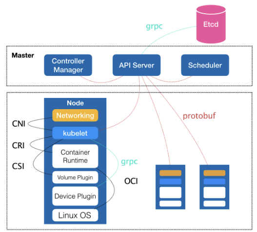
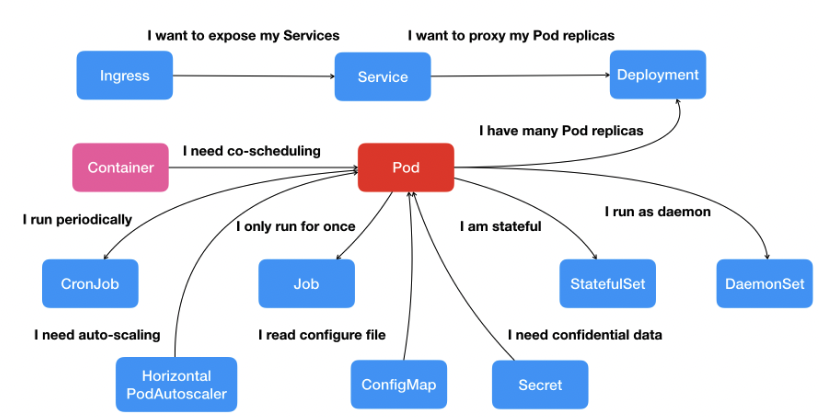

那么通过之前的学习，我们应该能够明白：一个容器，实际上是一个由 Linux Namespace、Linux Cgroups 和 rootfs 三种技术构建出来的进程的隔离环境。

从这个结构中我们不难看出，一个正在运行的 Linux 容器，其实可以被一分为二的看待：

1. 一组联合挂载在 `/var/lib/docker/aufs/mnt` 上的 rootfs，这一部分我们称为**容器镜像**（Container Image），是容器的静态视图
2. 一个由 Namespace + Cgroups 构成的隔离环境，这一部分我们称为**容器运行时**（Container Runtime），是容器的动态视图

作为一名开发者，我们并不需要关心容器运行时的差异。因为，在整个“开发 - 测试 - 发布”的流程中，真正承载着容器信息进行传递的，是容器镜像，而不是容器进行时。

而这个假设，也是容器技术圈在 Docker 项目成功后不久，就迅速走向了“容器编排”这个“上层建筑”的主要原因。我们通过容器镜像，可以和潜在用户（即，开发者）直接关联起来。

在如今，最具代表性的容器编排工具中，当属 Docker 公司的 Compose + Swarm 组合，以及 Google 和 RedHat 公司共同主导的 Kubernetes 项目。

<h3 style="color: orange">首先，Kubernetes 项目要解决的问题是什么？</h3>

- 编排
- 调度
- 容器云
- 集群管理
- ......

实际上，这个问题到目前为止都没有固定的答案。因为在不同的发展阶段，Kubernetes 需要着重解决的问题是不同的。

但是其实对于用户来说，它们希望 k8s 项目带来的体验是明确的：`现在我有了应用的容器镜像，请帮我在一个给定的集群上把这个应用运行起来，并且能够给我提供路由网关、水平扩展、监控、备份、灾难恢复等一系列运维能力`。

当然，它带来的并不仅仅只是这些。它的架构正是依托了 Borg 项目（Google 公司整个基础设施的核心依赖）的理论优势，从而在短短的几个月内迅速站稳了脚跟，进而确定了一个如下图所示的全局架构：



我们可以看到，K8S 项目的架构，是由 Master 和 Node 两种节点组成，而这两种角色分别对应着控制节点和计算节点。

其中，控制节点，即 Master 节点，由三个紧密协作的独立组件组合而成，它们分别是负责 API 服务的 `kube-apiserver` 、负责调度的 `kube-scheduler` ，以及负责容器编排的 `kube-controller-manager`。整个集群的持久化数据，则由 `kube-apiserver` 处理后保存在 Ectd 中。

而计算节点上最核心的部分，则是一个叫做 `kubelet` 的组件。

在 K8S 项目中，`kubelet` 主要负责同容器运行时（比如 Docker 项目）打交道。而这个交互所依赖的，是一个称为 CRI （Container Runtime Interface）的远程调用接口，这个接口定义了容器运行时的各项核心操作。

即只要我们的容器运行时能够运行标准的容器镜像，它就可以通过实现 CRI 接入到 K8S 项目当中。

而具体的容器运行时，比如 Docker 项目，则一般通过 OCI 这个容器运行时规范同底层的 Linux 操作系统进行交互。即：把 CRI 请求翻译成对 Linux 操作系统的调用（操作 Linux Namespace 和 Cgroups 等）。

此外，`kubelet` 还通过 `gRPC` 协议同一个叫做 `Device Plugin` 的插件进行交互。这个插件，是 `Kubernetes` 项目用来管理 GPU 等宿主机物理设备的主要组件，也是基于 Kubernetes 项目进行机器学习训练、高性能作业支持等工作必须关注的功能。

而 `kubelet` 的另一个重要功能，则是调用网络插件和存储插件为容器配置网络和持久化存储。这两个插件与 `kubelet` 进行交互的接口，分别是 CNI（Container Networking Interface）和 CSI（Container Storage Interface）。

> kubelet 完全就是为了实现 K8S 项目对容器的管理能力而实现的一个组件

<h3 style="color: orange">Borg 对于 K8S 项目的指导作用体现在哪里？</h3>

**Master 节点。**

Master 节点的实现出发点：如何编排、管理、调度用户提交的作业？

从一开始，K8S 项目仅仅是把 Docker 作为最底层的一个容器运行时实现，它实际要着重解决的问题，是来自于 Borg 的研究人员在论文中提到的一个非常重要的观点：

> 运行在大规模集群中的各种任务之间，实际上存在着各种各样的关系。这些关系的处理，才是作业编排和管理系统最困难的地方。

在容器技术普及之前，传统虚拟机环境对这种关系的处理方法都是比较**粗粒度**的。我们会经常发现很多功能并不相关的应用被一股脑的部署在同一台虚机中，只是因为它们之间偶尔会互相发起几个 HTTP 请求。

而更为常见的就是，一个应用被部署在虚机之后，我们还要手动维护很多跟它协作的守护进程（Daemon），用来处理它的日志搜集、灾难恢复、数据备份等辅助工作。

但是在容器技术出现以后，在功能单位的划分上，它有着独一无二的**细粒度**优势：即它本身只是一个进程而已。

也就是说，那些原本拥挤在同一个虚拟机里的各个应用、组件、守护进程，都可以被分别做成镜像，然后运行在一个个专属的容器中。它们之间互不干涉，各自有其独有的资源配额，可以被调度在整个集群里的任何一台机器上。而这，正是一个 PaaS 系统最理想的工作状态，也是所谓的“微服务”思想得以落地的先决条件。

如果只是做到“封装微服务，调度单容器”这一层次，Docker Swarm 项目加上 Compose 项目，对于我们来说已经绰绰有余了。

在 Compose 项目中，我们可以为这样的两个容器定义一个 `link`，而 Docker 项目则会负责维护这个 link 关系，其具体做法是：Docker 会在 Web 容器中，将 DB 容器的 IP 地址、端口等信息以环境变量的方式注入进去，供应用进程使用。

而当 DB 容器发生变化时（比如，镜像更新，被迁移到其他宿主机上等等），这些环境变量的值会由 Docker 项目自动更新。这就是平台项目自动地处理容器间关系的例子。

但是这只是针对单一关系而言，如果关系很复杂，种类更多要如何应对呢？

**我们一旦要追求项目的普适性，就一定要从顶层开始做好设计。**

所以，**K8S 项目最主要的设计思想就是，从更宏观的角度，以统一的方式来定义任务之间的各种关系，并且为将来支持更多种类的关系留有余地。**

比如，K8S 项目对容器间的访问进行了分类，首先总结出了一类非常常见的**紧密交互**的关系，即：这些应用之间需要非常频繁的交互和访问；又或者，它们会直接通过本地文件进行信息交换。

在常规环境下，这些应用往往会被直接部署在同一台机器上，通过 Localhost 通信，通过本地磁盘目录交换文件。而在 K8S 中，这些容器会被划分为一个 `Pod` ，`Pod` 里的容器共享同一个 `Network Namespace`、同一组数据卷，从而达到高效率交换信息的目的。

> `Pod` 是 K8S 项目中最基础的一个对象。

而对于另外一种更为常见的需求，比如 Web 应用与数据库之间的访问关系，K8S 项目则提供了一种叫做 `Service` 的服务。像这样的两个应用，往往故意不部署在同一台机器上，这样即使 Web 应用所在的机器宕机了，数据库也完全不会受影响。

但是对于一个容器来说，它的 IP 地址等信息是不固定的，那 Web 应用又怎么找到数据库容器的 Pod 呢？

K8S 的做法是，给 Pod 绑定一个 Service 服务，而 Service 服务声明的 IP 地址等信息是不变的。**这个 Service 服务的主要作用，就是作为 Pod 的代理入口，从而代替 Pod 对外暴露一个固定的网络地址。**

而围绕着容器和 Pod 不断向真实的技术场景扩展，我们就能够摸索出一幅如下所示的 K8S 项目核心功能的全景图。



按照这幅图的线索，我们从容器这个最基础的概念出发，首先遇到了容器间紧密关系的难题，于是就扩展到了 Pod；有了 Pod 之后，我们希望一次能够启动多个应用的实例，这样就需要 `Deployment` 这个 Pod 的多实例管理器；而有了这样一组相同的 Pod 之后，我们又需要通过一个固定的 IP 地址和端口以负载均衡的方式来访问它，于是就有了 Service。

那再设想一下，假如两个 Pod 之间不仅有访问关系，还有授权的需要。比如刚刚说到的 Web 应用对数据库的访问肯定是需要用户名和密码的。那么在 K8S 中是如何处理的呢？

这里它又提供了一个叫做 `Secret` 的对象，它实际上就是一个保存在 Etcd 中的键值对数据。也就是说我们把用户名密码的信息以 Secret 的形式存放在 Etcd 中，K8S 就会在我们指定的 Pod（比如 Web 应用的 Pod）启动时，自动把 Secret 里的信息以 Volume 的方式挂载到容器中。这个 Web 应用就可以访问数据库了。

而除了应用之间的关系外，**应用运行的形态**是影响“如何容器化这个应用”的第二个重要因素。

为此，K8S 定义了新的、基于 Pod 改进后的对象。

- Job：用来描述一次性运行的 Pod
- DaemonSet：用来描述每个宿主机上必须且只能运行一个副本的守护进程服务
- CronJob：用于描述定时任务
- ......

在 K8S 中所推崇的使用方式：

- 首先，通过一个**编排对象**，比如 Pod、Job、CronJob 等，来描述你试图管理的应用；
- 然后，再为它定义一些服务对象，比如 Service、Secret、Horizontal Pod Autoscaler（自动水平扩展器）等。这些对象，会负责具体的平台级功能。

> 这也是 K8S 最核心的设计理念

<h3 style="color: orange">K8S 如何启动一个容器化任务呢？</h3>

比如我们现在有一个需求：

> 现在有一个已经制作好的 Nginx 镜像，希望让平台帮助我们启动这个镜像。并且，需要平台帮助我们运行两个相同的 Nginx 副本，以负载均衡的方式共同对外提供服务

如果是自己 DIY 的话，可能需要启动两台虚拟机，然后分别安装 Nginx，然后使用 keepalived 为这两个虚拟机做一个虚拟 IP。

那 K8S 是如何做的呢？这里我们只需要编写一个 YAML 文件：

```yaml
# file name: nginx-deployment.yaml
apiVersion: apps/v1
kind: Deployment
metadata:
	name: nginx-deployment
	labels:
		app: nginx
spec:
	replicas: 2
	selector:
		matchLabels:
			app: nginx
	template:
		metadata:
			labels:
				app: nginx
		spec:
			containers:
			- name: nginx
				image: nginx:1.7.9
				ports:
				- containerPort: 80
```

在这个 YAML 文件中，我们定义了一个 Deployment 的对象，它的主体部分 `spec.template` 是一个使用 Nginx 镜像的 Pod，而这个 Pod 的副本数是 2.

然后执行：

```shell
$ kubectl create -f nginx-deployment.yaml
```

这样，两个完全相同的 Nginx 容器副本就被启动了。

### 总结

容器其实可以分为两个部分：

- 容器运行时
- 容器镜像

过去很多的集群管理项目（比如 Swarm）所擅长的，都是把一个容器，按照某种规则，放置在某个最佳节点上运行起来。这种功能，我们称为：**调度**。

而 K8S 擅长的，是按照用户的意愿和整个系统的规则，完全自动化地处理好容器之间的各种关系。这个就是我们经常说的：**编排**。

所以说，K8S 的本质，是为用户提供一个具有普遍意义的容器编排工具。

不过更为重要的是它真正的价值是在于提供了一套基于容器构建分布式系统的基础依赖。
