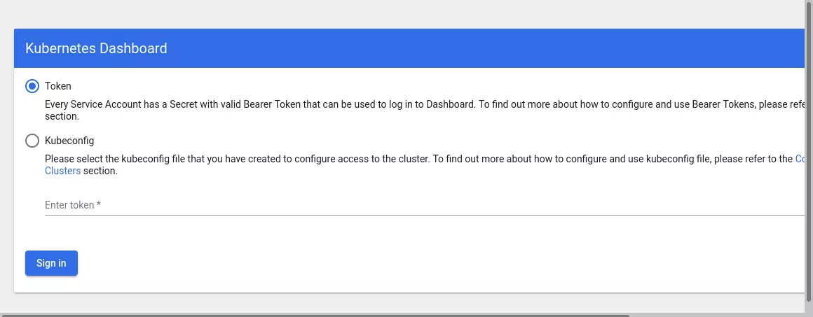

> 注意：这里说的“完整”，指的是这个集群具备 K8S 项目在 Github 上已经发布的所有功能，并能够模拟生产环境的所有使用需求。但这并不代表这个集群是生产级别可用的：类似于高可用、授权、多租户、灾难备份等生产级别集群的功能暂时不在讨论范围内。

### 准备工作

首先，准备机器。最直接的办法，是到公有云上申请几个虚拟机。当然，如果条件允许的话，拿几台本地的物理服务器来组集群是最好不过了。这些机器只要满足如下几个条件即可：

1. 满足安装 Docker 项目所需要的要求，比如 64 位的 Linux 操作系统、3.10 及以上的内核版本；
2. X86 或者 ARM 架构均可
3. 机器之间网络互通，这是将来容器之间网络互通的前提；
4. 有外网访问权限，因为需要拉取镜像
5. 能够访问到 `gcr.io`、`quay.io` 这两个 docker registry，因为有小部分镜像需要在这里拉取；
6. 单机可用资源建议 2 核 CPU、8 GB 内存或以上，再小的话问题也不大，但是能调度的 Pod 数量就比较有限了；
7. 30 GB 或以上的可用磁盘空间，这主要是给 Docker 镜像和日志文件用的。

### 安装 kubeadm 和 Docker

1. 添加 kubeadm 的源
2. 然后直接用 `apt-get` 安装即可
3. `apt-key` 可以直接使用 `apt-get` 进行安装

```shell
$ curl -s https://packages.cloud.google.com/apt/doc/apt-key.gpg | apt-key add -
$ cat <<EOF > /etc/apt/sources.list.d/kubernetes.list
deb http://apt.kubernetes.io/ kubernetes-xenial main
EOF
$ apt-get update
$ apt-get install -y docker.io kubeadm
```

在上述安装 kubeadm 的过程中，kubeadm 和 kubelet、kubectl、kubernetes-cni 这几个二进制文件都会被自动安装好。

> 上述命令是属于 Debian 系列，即 `Debian` 、`Ubuntu` 等，在这些系统上要使用 `apt-get` 和 `apt-key` 等命令。
>
> 而如果使用的是 RedHat 系列的话，就是 `RedHat` 、`CentOS` 、`Fedora` 等，在这些系统上要使用 `yum` 等命令。

- 接下来是在 CentOS 7 上的安装流程（没有科学上网的话，使用阿里云下载）

```shell
# 配置源
$ cat <<EOF > /etc/yum.repos.d/kubernetes.repo
[kubernetes]
name=Kubernetes
baseurl=https://mirrors.aliyun.com/kubernetes/yum/repos/kubernetes-el7-x86_64
enabled=1
gpgcheck=1
repo_gpgcheck=1
gpgkey=https://mirrors.aliyun.com/kubernetes/yum/doc/yum-key.gpg https://mirrors.aliyun.com/kubernetes/yum/doc/rpm-package-key.gpg
EOF

# 安装
$ yum install -y kubelet kubeadm kubectl

# 配置 docker 下载源
yum-config-manager \
    --add-repo \
    https://mirrors.aliyun.com/docker-ce/linux/centos/docker-ce.repo

# 安装 docker
yum install docker-ce docker-ce-cli containerd.io
```

- 验证 Docker 是否安装成功：`docker version`
- 验证 Kubectl 是否安装成功：`kubectl version`
- 验证 kubelet 是否安装成功：`kubelet --version`
- 验证 kubeadm 是否安装成功：`kubeadm version`

1. 我们还需要将 SELinux 设置为 `permissive` 模式（相当于将其禁用），这是允许容器访问主机文件系统所必需的，而这些操作是为了让例如 Pod 网络能够正常工作。

```shell
$ sudo setenforce 0
$ sudo sed -i 's/^SELINUX=enforcing$/SELINUX=permissive/' /etc/selinux/config
```

2. 启动 docker service:

```shell
$ systemctl enable docker.service && systemctl start docker.service
```

3. 并且开放两个端口（否则 init 的时候会有警告）：

```shell
$ firewall-cmd --zone=public --add-port=6443/tcp --permanent && firewall-cmd --zone=public --add-port=10250/tcp --permanent && firewall-cmd --reload

# IPTables 设置
$ sudo bash -c 'cat <<EOF >  /etc/sysctl.d/k8s.conf
net.bridge.bridge-nf-call-ip6tables = 1
net.bridge.bridge-nf-call-iptables = 1
EOF'

# 使上述设置生效
$ sudo sysctl --system

# 检查是否成功，有显示即为成功
sudo lsmod | grep br_netfilter
```

5. 最好是关闭 NetworkManager 和防火墙的自启动：

```shell
[root@k8s-node1 ~]$ systemctl disable firewalld
[root@k8s-node1 ~]$ systemctl disable NetworkManager
```

6. 关闭系统 swap 功能，否则 K8S 无法正常启动，当然在启动的时候，也会提示你关闭 swap：

```shell
$ swapoff -a # 关闭命令
$ free -h		 # 查看 swap 的空间，当为 0 时关闭成功
              total        used        free      shared  buff/cache   available
Mem:           3.7G        975M        1.2G         47M        1.6G        2.4G
Swap:            0B          0B          0B
```

7. 初始化的时候还需要设置主机名解析，否则会有提示：

```shell
# 设置当前主机 IP 为 node（init name）
$ vim /etc/hosts
127.0.0.1   localhost localhost.localdomain localhost4 localhost4.localdomain4
::1         localhost localhost.localdomain localhost6 localhost6.localdomain6
192.168.0.161 node
```

8. 启动 kubelet:

```shell
[root@192 cecil]# systemctl enable kubelet && systemctl start kubelet
Created symlink from /etc/systemd/system/multi-user.target.wants/kubelet.service to /usr/lib/systemd/system/kubelet.service.
```

9. 设置路由

```shell
$ cat <<EOF >  /etc/sysctl.d/k8s.conf
net.bridge.bridge-nf-call-ip6tables = 1
net.bridge.bridge-nf-call-iptables = 1
EOF
$ sysctl --system
```

### 部署 Kubernetes 的 Master 节点

接下来我们通过一份配置文件来执行 `kubeadm init` 命令，这是因为一些更加高级的功能只能通过配置文件来设定。这份配置文件是通过 `--config` 选项参数来指定的，它必须包含 `ClusterConfiguration` 结构，并可能包含更多的由 `---\n` 分隔的结构。

我们先来生成一个默认的 kubeadm 配置文件:

```shell
$ kubeadm config print init-defaults > kubeadm.yaml

# 会在当前目录下生成一个 kubeadm.yaml 的文件
```

我们查看一下该文件的内容 `cat kubeadm.yaml` ：

```YAML
apiVersion: kubeadm.k8s.io/v1beta3
bootstrapTokens:
- groups:
  - system:bootstrappers:kubeadm:default-node-token
  token: abcdef.0123456789abcdef
  ttl: 24h0m0s
  usages:
  - signing
  - authentication
kind: InitConfiguration
controllerManagerExtraArgs:  # 新增
	horizontal-pod-autoscaler-use-rest-clients: "true"
	horizontal-pod-autoscaler-sync-period: "10s"
	node-monitor-grace-period: "10s"
apiServerExtraArgs:         # 新增
	runtime-config: "api/all=true"
localAPIEndpoint:
  advertiseAddress: [自己机器的IP]
  bindPort: 6443
nodeRegistration:
  criSocket: /var/run/dockershim.sock
  imagePullPolicy: IfNotPresent
  name: node
  taints: null
---
apiServer:
  timeoutForControlPlane: 4m0s
apiVersion: kubeadm.k8s.io/v1beta3
certificatesDir: /etc/kubernetes/pki
clusterName: kubernetes
controllerManager: {}
dns: {}
etcd:
  local:
    dataDir: /var/lib/etcd
imageRepository: k8s.gcr.io
kind: ClusterConfiguration
kubernetesVersion: 1.23.0
networking:
  dnsDomain: cluster.local
  serviceSubnet: 10.96.0.0/12
scheduler: {}
```

在这个文件中给 `kube-controller-manager` 设置了：

```YAML
horizontal-pod-autoscaler-use-rest-clients: "true"
```

这意味着，将来部署的 `kube-controller-manager` 能够使用自定义资源（Custom Metrics）进行自动水平扩展。

其中，`v1.23.0` 就是 kubeadm 帮我们部署的 kubernetes 的版本号。

然后，我们只需要执行一句命令：

```shell
$ kubeadm init --config kubeadm.yaml
```

这样，就可以完成 kubernetes master 的部署了，这个过程需要几分钟的时间。

> 这里如果不会科学上网，大概率会失败的，因为 kubeadm 依赖的 images 中有几个镜像是被墙了的，所以我们需要另辟蹊径。

1. 查看下载 kubeadm 依赖的 images：

   ```shell
   $ kubeadm config images list

   k8s.gcr.io/kube-apiserver:v1.23.3
   k8s.gcr.io/kube-controller-manager:v1.23.3
   k8s.gcr.io/kube-scheduler:v1.23.3
   k8s.gcr.io/kube-proxy:v1.23.3
   k8s.gcr.io/pause:3.6
   k8s.gcr.io/etcd:3.5.1-0
   k8s.gcr.io/coredns/coredns:v1.8.6
   ```

2. 实际上 `k8s.gcr.io` 中的镜像，都会被墙掉，拉取它们的实际命令为：

   ```shell
   $ sudo kubeadm config images pull
   ```

   但是我们不能直接执行这句命令，因为依旧会被墙掉，我们要采用其他的方式。

3. 在这里我们需要将刚刚生成的默认 YAML 文件中的镜像源换为国内阿里云的镜像源：

   ```shell
   imageRepository: registry.aliyuncs.com/google_containers 					# 原来的是k8s.gcr.io
   ```

4. 还需要注意的一点是，我们需要设置 docker 的 `cgroupdriver`，在 docker 的 `daemon.json` 中去修改：

   ```json
   {
     "exec-opts": ["native.cgroupdriver=systemd"]
   }
   ```

设置完成之后，我们重新执行 `init` 操作：`kubeadm init --config kubeadm.yaml`

部署完成后，kubeadm 会生成一行指令：

```shell
kubeadm join xxx.xxx.xx.xxx:6443 --token xxxxxx.xxxxxx \
	--discovery-token-ca-cert-hash sha256:xxxxxxxxxxxxxxxxxxxxxxxxxxxxxxxxxxxxxxxxxxxxxxxxxxxxx
```

这个 `kubeadm join` 命令，就是用来给这个 Master 节点添加更多工作节点（Worker）的命令。我们在后面部署 Worker 节点的时候马上会用到它，所以找一个地方把这条命令记录下来。

此外，kubeadm 还会提示我们第一次使用 K8S 集群所需要的配置命令：

```shell
$ mkdir -p $HOME/.kube
$ sudo cp -i /etc/kubernetes/admin.conf $HOME/.kube/config
$ sudo chown $(id -u):$(id -g) $HOME/.kube/config
```

而需要这些配置命令的原因是：K8S 集群默认需要加密方式访问。所以，这几条命令，就是将刚刚部署生成的 K8S 集群的安全配置文件，保存到当前用户的 `.kube` 目录下，kubectl 默认会使用这个目录下的授权信息访问 K8S 集群。

如果不这么做的话，我们每次都需要通过 `export KUBECONFIG` 环境变量告诉 `kubectl` 这个安全配置文件的配置。

现在我们就可以使用 kubectl get 命令来查看当前唯一的一个节点状态了：

```shell
$ kubectl get nodes
NAME		STATUS		ROLES		AGE	VERSION
master 	NotReady	master	1d  v1.11.1
```

可以看到，这个 get 指令输出的结果里，Master 节点的状态是 NotReady，这是为什么呢？

在调试 K8S 集群的时候，最重要的手段就是用 `kubectl describe` 来查看这个节点（Node）对象的详细信息、状态和事件（Event），我们来试一下：

```shell
$ kubectl describe node master

...
Conditions:
...

Ready False ... container runtime network not ready: NetworkReady=false reason:NetworkPluginNotReady message:docker: network plugin is not ready: cni config uninitialized
```

通过 kubectl describe 指令的输出提示，我们可以看到 NodeNotReady 的原因在于，我们尚未部署任何的网络插件。

另外，我们还可以通过 kubectl 检查这个节点上各个系统 Pod 的状态，其中，`kube-system` 是 K8S 项目预留的系统 Pod 的工作空间（Namespace，注意它不是 Linux Namespace，它只是 K8S 划分不同工作空间的单位）：

```shell
$ kubectl get pods -n kube-system

NAME                           READY   STATUS    RESTARTS   AGE
coredns-6d8c4cb4d-tmzss        0/1     Pending   0          10m
coredns-6d8c4cb4d-w2c96        0/1     Pending   0          10m
etcd-node                      1/1     Running   0          10m
kube-apiserver-node            1/1     Running   0          10m
kube-controller-manager-node   1/1     Running   2          10m
kube-proxy-g2xr7               1/1     Running   0          10m
kube-scheduler-node            1/1     Running   2          10m
```

可以看到 CoreDNS 这个依赖于网络的 Pod 都处于 Pending 状态，即调度失败了。这是符合预期的，因为这个节点的网络尚未就绪。

### 部署网络插件

在 K8S 中部署网络插件非常简单，只需要执行一句 `kubectl apply` 指令，以 weava 为例：

```shell
# 安装Calico CNI插件
$ kubectl apply -f "https://docs.projectcalico.org/manifests/calico.yaml"
# 安装weave插件
$ kubectl apply -f "https://cloud.weave.works/k8s/net?k8s-version=$(kubectl version | base64 | tr -d '\n')"
```

部署好以后，我们重新查看一下 Pod 的状态:

```shell
$ kubectl get pods -n kube-system
NAME                                       READY   STATUS    RESTARTS       AGE
calico-kube-controllers-85b5b5888d-xc995   1/1     Running   0              3m58s
calico-node-btmxf                          1/1     Running   0              3m59s
coredns-6d8c4cb4d-tmzss                    1/1     Running   0              80m
coredns-6d8c4cb4d-w2c96                    1/1     Running   0              80m
etcd-node                                  1/1     Running   0              80m
kube-apiserver-node                        1/1     Running   0              80m
kube-controller-manager-node               1/1     Running   2              80m
kube-proxy-g2xr7                           1/1     Running   0              80m
kube-scheduler-node                        1/1     Running   2              80m
weave-net-45hch                            2/2     Running   1 (119s ago)   2m52s
```

可以看到，所有的系统 Pod 都成功启动了，而刚刚部署的 Weave 网络插件则在 `kube-system` 下面新建了一个名叫 `weave-net-45hch` 的 Pod。一般来说，这些 Pod 就是容器网络插件在每个节点上的控制组件。

K8S 支持容器网络插件，使用的是一个名叫 CNI 的通用接口，它也是当前容器网络的事实标准，市面上的所有容器网络开源项目都可以通过 CNI 接入 K8S，比如 Flannel、Calico、Canal、Romana 等，它们的部署方式也都是类似一键部署。

至此，K8S 的 Master 节点就部署完成了。如果你只需要一个单节点的 K8S，现在就可以使用了。不过，在默认情况下，K8S 的 Master 节点是不能运行用户 Pod 的，所以还需要额外做一个小操作。

---

> 还未进行实践

### 部署 K8S 的 Worker 节点

K8S 的 Worker 节点跟 Master 节点几乎是相同的，它们运行着的都是一个 kubelet 组件。唯一的区别在于，在 kubeadm init 的过程中，kubelet 启动后，Master 节点上还会自动运行 `kube-apiserver` 、`kube-scheduler` 、`kube-controller-manager` 这三个系统 Pod。

所以，相比之下，部署 Worker 节点反而是最简单的，只需要两步即可完成。

1. 在所有 Worker 节点上执行安装 kubeadm 和 docker 的操作
2. 执行部署 Master 节点时生成的 kubeadm join 指令

完成。

### 通过 Taint/Toleration 调整 Master 执行 Pod 的策略

我们之前说过默认情况下 Master 节点是不允许运行用户的 Pod 的。而 K8S 做到这一点，依靠的是 K8S 的 Taint/Toleration 机制。

它的原理非常简单：一旦某个节点被加上了一个 Taint，即被打上了污点，那么所有 Pod 就都不能在这个节点上运行，因为 K8S 的 Pod 都有洁癖。

除非有个别的 Pod 声明自己能容忍这个污点，即声明了 Toleration，它才可以在这个节点上运行。

那么，为节点打污点（Taint）的命令是：

```shell
$ kubectl taint node <node_name> foo=bar:NoSchedule
```

上述命令表示会在一个节点里增加一个键值对格式的 Taint，即：foo=bar:NoSchedule。其中 NoSchedule 表示这个 Taint 只会在调度新的 Pod 时产生作用，而不会影响已经在节点中运行的 Pod，哪怕它们没有 Toleration。

那 Pod 如何声明 Toleration 呢？

很简单，只要在 Pod 的 YAML 文件里的 spec 部分，假如 tolerations 字段即可：

```yaml
apiVersion: v1
kind: Pod
...
spec:
	tolerations:
	- key: "foo"
		operator: "Equal"
		value: "bar"
		effect: "NoSchedule"
```

那这个 Toleration 的含义就是，这个 Pod 能够容忍所有键值对为 `foo=bar` 的 Taint（operator：Equal，等于操作）。

现在我们回到刚刚搭建好的集群上来。我们可以查看一下集群上 Master 节点的 Taint 字段，就会有所发现：

```shell
$ kubectl describe node master

Name:               node
Roles:              control-plane,master
Labels:             beta.kubernetes.io/arch=amd64
                    beta.kubernetes.io/os=linux
                    kubernetes.io/arch=amd64
                    kubernetes.io/hostname=node
                    kubernetes.io/os=linux
                    node-role.kubernetes.io/control-plane=
                    node-role.kubernetes.io/master=
                    node.kubernetes.io/exclude-from-external-load-balancers=
Annotations:        kubeadm.alpha.kubernetes.io/cri-socket: /var/run/dockershim.sock
                    node.alpha.kubernetes.io/ttl: 0
                    projectcalico.org/IPv4Address: 10.32.0.1/12
                    projectcalico.org/IPv4IPIPTunnelAddr: 172.16.167.128
                    volumes.kubernetes.io/controller-managed-attach-detach: true
CreationTimestamp:  Sat, 29 Jan 2022 23:36:14 -0800
Taints:             node-role.kubernetes.io/master:NoSchedule
```

可以看到的是，Master 节点默认被加上了 `node-role.kubernetes.io/master:NoSchedule` 这样的一个污点，其中键是 `node-role.kubernetes.io/master` ，而没有提供值。

我们如果想在 Master 节点上运行所有以 foo 为键的 Taint，就需要在 Pod 的 YAML 文件中加上对应的字段，才能让这个 Pod 运行在该 Master 节点上：

```YAML
apiVersion: v1
kind: Pod
...
spec:
  tolerations:
  - key: "foo"
    operator: "Exists"
    effect: "NoSchedule"
```

当让，如果我们只是想要一个单节点的 K8S，删除这个 Taint 才是正确的选择：

```shell
$ kubectl taint nodes --all node-role.kubernetes.io/master-
```

上述命令，我们在后面加了一个短横线，这个格式就表示会移除所有以 `node-role.kubernetes.io/master` 为键的 Taint。

至此，一个基本完整的 K8S 集群就部署完成了。

一些像证书、授权、各个组件的配置等部署中最麻烦的操作，kubeadm 都已经帮我们完成了。

接下来，我们再在这个 K8S 集群上安装一些其他的辅助插件，比如 Dashboard 和存储插件。

### 部署 Dashboard 可视化插件

在 K8S 社区中，有一个很受欢迎的 Dashboard 项目，它的部署非常简单：

```shell
$ kubectl apply -f https://raw.githubusercontent.com/kubernetes/dashboard/v2.4.0/aio/deploy/recommended.yaml
```

但是这里有一个问题就是，这个地址它又是国外的，所以同学们都懂的，所以需要科学上网哦。

安装好以后呢，我们启动 Proxy 在本地进行访问。

```shell
$ kubectl proxy
```

可以在命令行中验证一下是否 OK:

```shell
$ curl 127.0.0.1:8001
{
  "paths": [
    "/.well-known/openid-configuration",
    "/api",
    "/api/v1",
    "/apis",
    "/apis/",
    "/apis/admissionregistration.k8s.io",
    "/apis/admissionregistration.k8s.io/v1",
    "/apis/apiextensions.k8s.io",
    "/apis/apiextensions.k8s.io/v1",
    "/apis/apiregistration.k8s.io",
    "/apis/apiregistration.k8s.io/v1",
    "/apis/apps",
    "/apis/apps/v1",
    "/apis/authentication.k8s.io",
    "/apis/authentication.k8s.io/v1",
    "/apis/authorization.k8s.io",
    "/apis/authorization.k8s.io/v1",
    "/apis/autoscaling",
    "/apis/autoscaling/v1",
    "/apis/autoscaling/v2",
    "/apis/autoscaling/v2beta1",
    "/apis/autoscaling/v2beta2",
    "/apis/batch",
    "/apis/batch/v1",
    "/apis/batch/v1beta1",
    "/apis/certificates.k8s.io",
    "/apis/certificates.k8s.io/v1",
    "/apis/coordination.k8s.io",
    "/apis/coordination.k8s.io/v1",
    "/apis/crd.projectcalico.org",
    "/apis/crd.projectcalico.org/v1",
    "/apis/discovery.k8s.io",
    "/apis/discovery.k8s.io/v1",
    "/apis/discovery.k8s.io/v1beta1",
    "/apis/events.k8s.io",
    "/apis/events.k8s.io/v1",
    "/apis/events.k8s.io/v1beta1",
    "/apis/flowcontrol.apiserver.k8s.io",
    "/apis/flowcontrol.apiserver.k8s.io/v1beta1",
    "/apis/flowcontrol.apiserver.k8s.io/v1beta2",
    "/apis/networking.k8s.io",
    "/apis/networking.k8s.io/v1",
    "/apis/node.k8s.io",
    "/apis/node.k8s.io/v1",
    "/apis/node.k8s.io/v1beta1",
    "/apis/policy",
    "/apis/policy/v1",
    "/apis/policy/v1beta1",
    "/apis/rbac.authorization.k8s.io",
    "/apis/rbac.authorization.k8s.io/v1",
    "/apis/scheduling.k8s.io",
    "/apis/scheduling.k8s.io/v1",
    "/apis/storage.k8s.io",
    "/apis/storage.k8s.io/v1",
    "/apis/storage.k8s.io/v1beta1",
    "/healthz",
    "/healthz/autoregister-completion",
    "/healthz/etcd",
    "/healthz/log",
    "/healthz/ping",
    "/healthz/poststarthook/aggregator-reload-proxy-client-cert",
    "/healthz/poststarthook/apiservice-openapi-controller",
    "/healthz/poststarthook/apiservice-registration-controller",
    "/healthz/poststarthook/apiservice-status-available-controller",
    "/healthz/poststarthook/bootstrap-controller",
    "/healthz/poststarthook/crd-informer-synced",
    "/healthz/poststarthook/generic-apiserver-start-informers",
    "/healthz/poststarthook/kube-apiserver-autoregistration",
    "/healthz/poststarthook/priority-and-fairness-config-consumer",
    "/healthz/poststarthook/priority-and-fairness-config-producer",
    "/healthz/poststarthook/priority-and-fairness-filter",
    "/healthz/poststarthook/rbac/bootstrap-roles",
    "/healthz/poststarthook/scheduling/bootstrap-system-priority-classes",
    "/healthz/poststarthook/start-apiextensions-controllers",
    "/healthz/poststarthook/start-apiextensions-informers",
    "/healthz/poststarthook/start-cluster-authentication-info-controller",
    "/healthz/poststarthook/start-kube-aggregator-informers",
    "/healthz/poststarthook/start-kube-apiserver-admission-initializer",
    "/livez",
    "/livez/autoregister-completion",
    "/livez/etcd",
    "/livez/log",
    "/livez/ping",
    "/livez/poststarthook/aggregator-reload-proxy-client-cert",
    "/livez/poststarthook/apiservice-openapi-controller",
    "/livez/poststarthook/apiservice-registration-controller",
    "/livez/poststarthook/apiservice-status-available-controller",
    "/livez/poststarthook/bootstrap-controller",
    "/livez/poststarthook/crd-informer-synced",
    "/livez/poststarthook/generic-apiserver-start-informers",
    "/livez/poststarthook/kube-apiserver-autoregistration",
    "/livez/poststarthook/priority-and-fairness-config-consumer",
    "/livez/poststarthook/priority-and-fairness-config-producer",
    "/livez/poststarthook/priority-and-fairness-filter",
    "/livez/poststarthook/rbac/bootstrap-roles",
    "/livez/poststarthook/scheduling/bootstrap-system-priority-classes",
    "/livez/poststarthook/start-apiextensions-controllers",
    "/livez/poststarthook/start-apiextensions-informers",
    "/livez/poststarthook/start-cluster-authentication-info-controller",
    "/livez/poststarthook/start-kube-aggregator-informers",
    "/livez/poststarthook/start-kube-apiserver-admission-initializer",
    "/logs",
    "/metrics",
    "/openapi/v2",
    "/openid/v1/jwks",
    "/readyz",
    "/readyz/autoregister-completion",
    "/readyz/etcd",
    "/readyz/informer-sync",
    "/readyz/log",
    "/readyz/ping",
    "/readyz/poststarthook/aggregator-reload-proxy-client-cert",
    "/readyz/poststarthook/apiservice-openapi-controller",
    "/readyz/poststarthook/apiservice-registration-controller",
    "/readyz/poststarthook/apiservice-status-available-controller",
    "/readyz/poststarthook/bootstrap-controller",
    "/readyz/poststarthook/crd-informer-synced",
    "/readyz/poststarthook/generic-apiserver-start-informers",
    "/readyz/poststarthook/kube-apiserver-autoregistration",
    "/readyz/poststarthook/priority-and-fairness-config-consumer",
    "/readyz/poststarthook/priority-and-fairness-config-producer",
    "/readyz/poststarthook/priority-and-fairness-filter",
    "/readyz/poststarthook/rbac/bootstrap-roles",
    "/readyz/poststarthook/scheduling/bootstrap-system-priority-classes",
    "/readyz/poststarthook/start-apiextensions-controllers",
    "/readyz/poststarthook/start-apiextensions-informers",
    "/readyz/poststarthook/start-cluster-authentication-info-controller",
    "/readyz/poststarthook/start-kube-aggregator-informers",
    "/readyz/poststarthook/start-kube-apiserver-admission-initializer",
    "/readyz/shutdown",
    "/version"
  ]
}
```

可以成功链接！

接下来我们要在浏览器中进行访问，毕竟是 Dashboard，访问的地址官网也有介绍：http://localhost:8001/api/v1/namespaces/kubernetes-dashboard/services/https:kubernetes-dashboard:/proxy/



可以看到登录的话需要 `kubeconfig` 和`token` 。

我们以 `token` 为例，做下演示：

1. 创建一个 Service Account 和 ClusterRoleBinding，此时我们需要创建一个 YAML 文件：

```YAML
apiVersion: v1
kind: ServiceAccount
metadata:
  name: admin-user
  namespace: kubernetes-dashboard

---

apiVersion: rbac.authorization.k8s.io/v1
kind: ClusterRoleBinding
metadata:
  name: admin-user
roleRef:
  apiGroup: rbac.authorization.k8s.io
  kind: ClusterRole
  name: cluster-admin
subjects:
- kind: ServiceAccount
  name: admin-user
  namespace: kubernetes-dashboard
```

2. 启用这个 YAML 文件

```shell
$ kubectl apply -f dashborad-adminuser.yaml
```

3. 查看 token 信息：`kubectl -n kubernetes-dashboard get secret $(kubectl -n kubernetes-dashboard get sa/admin-user -o jsonpath="{.secrets[0].name}") -o go-template="\{\{.data.token | base64decode\}\}"`

```shell
eyJhbGciOiJSUzI1NiIsImtpZCI6IkdPdjgtUDFLNjhWQXhNV2NIaW1TQ2pRcmhZNEtaLVBUazVQT0RGU1ZoXzgifQ.eyJpc3MiOiJrdWJlcm5ldGVzL3NlcnZpY2VhY2NvdW50Iiwia3ViZXJuZXRlcy5pby9zZXJ2aWNlYWNjb3VudC9uYW1lc3BhY2UiOiJrdWJlcm5ldGVzLWRhc2hib2FyZCIsImt1YmVybmV0ZXMuaW8vc2VydmljZWFjY291bnQvc2VjcmV0Lm5hbWUiOiJhZG1pbi11c2VyLXRva2VuLXdnYmZxIiwia3ViZXJuZXRlcy5pby9zZXJ2aWNlYWNjb3VudC9zZXJ2aWNlLWFjY291bnQubmFtZSI6ImFkbWluLXVzZXIiLCJrdWJlcm5ldGVzLmlvL3NlcnZpY2VhY2NvdW50L3NlcnZpY2UtYWNjb3VudC51aWQiOiIxOGU5YzRhMS04MzQ0LTQ3OTYtOTk2My0zZjI2ZDMwNzkwYTUiLCJzdWIiOiJzeXN0ZW06c2VydmljZWFjY291bnQ6a3ViZXJuZXRlcy1kYXNoYm9hcmQ6YWRtaW4tdXNlciJ9.axPiEZH7A5zeV7bLKbXjk7Fvy4wCw6ajrXKZY0F4elp5F0Htzrz732LvNi8hbmXrHITuBQsAWGCTlL_9u7EtZkEYS2q1hXJpvKxfTkY5stWA-w6Oaq3Ie-706EuzgSexrH0cycoPhEZd5wkvGtktifvONVltJEfonvbLWIFwM45o1qi-g64e41YiQZtIhvtS-FLbrmzToYs9oD2oMZIRZN1U240jvnt8kNGqt5grKjPmeMyU5M5n7ABto8RlGmevRXDxhTzhcZTZz4xfzJvXWxo_AgAiyzxJUJ4RAbOrnD3X_Dz8BZBa0jiJKoY4qGYHt-ue_h
```

然后将这段 token 复制到 dashboard 登录页中即可。

> MMP，在这里卡住了。token 401


如果想在集群外访问到这个 Dashboard 的话，就需要用到 Ingress。

### 部署容器存储插件

接下来，我们将完成这个 K8S 集群的最后一块拼图：容器持久化存储。

容器的最典型特征是**无状态**。即我们在某一台机器上启动了一个容器，显然是无法看到其他机器上的容器在它们的数据卷里的内容。

而容器的持久化存储，就是用来保存容器存储状态的重要手段：存储插件会在容器里挂载一个基于网络或者其他机制的远程数据卷，使得在容器里创建的文件，**实际上是保存在远程存储服务器上**，**或者以分布式的方式保存在多个节点上**，**而与当前宿主机没有任何绑定关系**。这样，无论我们在哪个宿主机上启动新的容器，都可以请求挂载指定指定的持久化存储卷，从而访问到数据卷里保存的内容。这就是**持久化**的含义。

在这次的部署中，我们选择部署 Rook 存储插件。

Rook 是一个基于 Ceph 的 K8S 存储插件，在 Ceph 的基础上，Rook 在自己的实现中加入了水平扩展、迁移、灾难备份、监控等大量的企业级功能，使得这个项目变成了一个完整的、生产级别可用的容器存储插件。

同样的，我们还是使用两条命令，Rook 就可以把复杂的 Ceph 存储后端部署起来：

1. 先到 rook 的 github，进入到 `rook/deploy/example` 中，然后复制 `common.yaml`、`crds.yaml` 、`operator.yaml` 、`cluster.yaml` 到本地；
2. 使用 `kubectl` 来启用：

```shell
$ kubectl create -f crds.yaml -f common.yaml -f operator.yaml

$ kubectl create -f cluster.yaml
```

3. 部署完成之后，我们就可以看到 Rook 项目会将自己的 Pod 放置在由它自己管理的两个 Namespace 中。

> 问题：没有 `rook-ceph-system` 的 namespace，只有 `rook-ceps` 的 namespace，而且这个 namespace 的状态是 Pending

这样，一个基于 Rook 持久化存储集群就以容器的方式运行起来了，而接下来在 K8S 项目上创建的所有 Pod 就能够通过 PV 和 PVC 的方式，在容器中挂载由 Ceph 提供的数据卷了。

### 小结

可以看到集群的部署过程并不像传说中那么繁琐，这主要得益于：

1. kubeadm 项目大大简化了部署 K8S 的准备工作，尤其是配置文件、证书、二进制文件的准备和制作，以及集群版本管理等操作，都被 kubeadm 接管了
2. K8S 本身“一切皆容器”的设计思想，加上良好的可扩展机制，使得插件的部署非常简单

那么上述四项，也是开发和使用 K8S 的重要指导思想，即：基于 K8S 开展工作时，我们一定要优先考虑这两个问题：

1. 我们的工作是不是可以容器化
2. 我们的工作是不是可以借助 K8S API 和可扩展机制来完成

而一旦这项工作能够基于 K8S 实现容器化，就很有可能像上面的部署过程一样，大幅度简化原本的运维工作。
