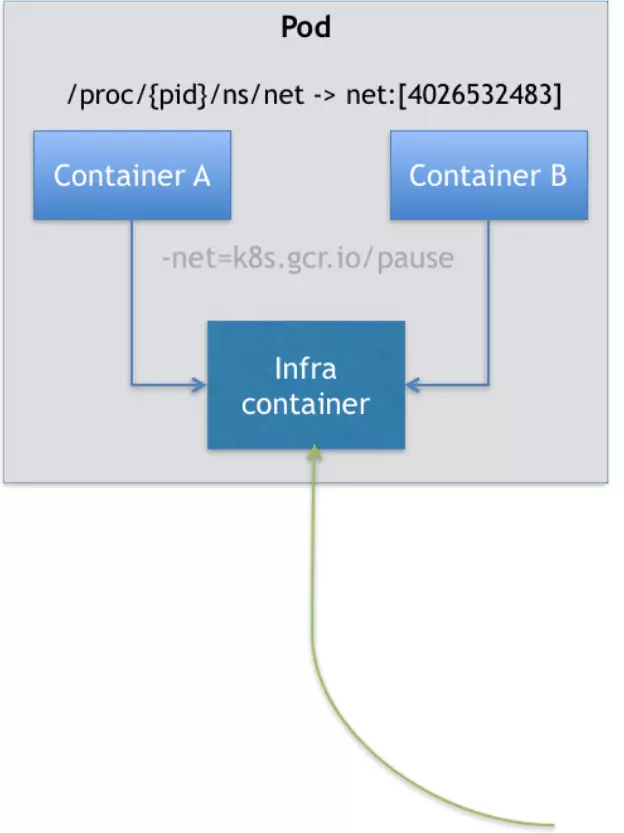

首先，在之前的文章中我们已经知道了 Pod 是 K8S 项目中最小的 API 对象。用更专业的说法是，Pod 是 K8S 中最小的原子调度单位。

<strong style="color: orange">为什么我们会需要 Pod?</strong>

我们根据之前的文章内容，可以总结出三句话：

- Namespace 做隔离
- Cgroups 做限制
- rootfs 做文件系统

而我们也一直在强调容器的本质其实就是进程，容器镜像就是 `.exe` 的安装包，那 K8S 我们就可以将其看成是一个操作系统！

我们登录到一台 Linux 机器里，执行如下命令：

```shell
$ pstree -g
```

这条命令的作用，是展示当前系统中正在运行的进程的树状结构。返回的结果如下：

```shell
systemd(1)─┬─ModemManager(590)─┬─{ModemManager}(590)
           │                   └─{ModemManager}(590)
           ├─NetworkManager(756)─┬─{NetworkManager}(756)
           │                     └─{NetworkManager}(756)
           ├─VGAuthService(599)
           ├─abrt-dbus(606)─┬─{abrt-dbus}(606)
           │                └─{abrt-dbus}(606)
           ├─abrt-watch-log(597)
           ├─abrt-watch-log(683)
           ├─abrtd(595)
           ├─accounts-daemon(598)─┬─{accounts-daemon}(598)
           │                      └─{accounts-daemon}(598)
           ├─alsactl(587)
           ├─at-spi-bus-laun(8278)─┬─dbus-daemon(8278)───{dbus-daemon}(8278)
           │                       ├─{at-spi-bus-laun}(8278)
           │                       ├─{at-spi-bus-laun}(8278)
           │                       └─{at-spi-bus-laun}(8278)
           ├─at-spi2-registr(8278)─┬─{at-spi2-registr}(8278)
           │                       └─{at-spi2-registr}(8278)
           ├─atd(1110)
           ├─auditd(561)─┬─audispd(563)─┬─sedispatch(563)
           │             │              └─{audispd}(563)
           │             └─{auditd}(561)
           ├─avahi-daemon(591)───avahi-daemon(591)
           ├─boltd(6519)─┬─{boltd}(6519)
           │             └─{boltd}(6519)
           ├─chronyd(695)
...
```

可以看到，在一个真正的操作系统中，进程是以进程组的方式，有原则的组织在一起。在这个进程的树状图中，每一个进程后面括号里的数字，就是它的进程组 ID（PGID）。

进程组中的进程相互协作，共同完成一个程序的职责。对于操作系统来说，这样的进程组更方便管理。

而 K8S 项目所做的，其实就是将进程组的概念映射到了容器技术中，并使其成为了这个云计算操作系统中的一等公民。

我们来举个例子，说明一下**组**的重要性。

假如现在我们有一个 rsyslogd。已知它由三个进程组成：

- imklog
- imuxsock
- rsyslogd 自己的 main 函数主进程

这三个进程一定要运行在同一个机器上，否则，它们之间基于 socket 的通信和文件交换，都会出现问题。

现在，我们要把 rsyslogd 这个应用给容器化，由于受限于容器的单进程模型，这三个模块必须被分别制作成三个不同的容器。而在这三个容器运行的时候，它们设置的内存配额都是 1GB。

> ⚠️注意：容器的单进程模型，并不是指容器里只能运行一个进程，而是指容器没有管理多个进程的能力。这是因为容器里 PID = 1 的进程就是应用本身，其他的进程都是这个 PID = 1 进程的子进程。可是，用户编写的应用，并不能像正常操作系统里的 init 进程或者 systemd 那样拥有进程管理的功能。

假设我们的 K8S 集群上有两个节点：`node-1` 上有 3GB 可以使用，`node-2` 上有 2.5GB 可以使用。

这时，如果我们使用 Docker Swarm 运行这个 rsyslogd 程序。为了能够让这三个容器都运行在同一台机器上，我们就必须在另外两个容器上设置一个 `affinity = main` （与 `main` 容器有亲密性）的约束，即：它们俩必须和 `main` 容器运行在同一台机器上。

然后依次执行：

- `docker run main` 
- `docker run imklog` 
- `docker run imuxsock` 

创建这三个容器。

这样，这三个容器都会进入到 Swarm 的待调度队列中去。然后，main 容器和 imklog 容器都先后出队并被调度到了 `node-2` 上（这种场景是完全有可能的）。

可是，当 imuxsock 容器出队列被调度时，Swarm 就有点懵了：`node-2` 上的可用资源只有 0.5GB 了，并不足以运行 imuxsock 容器；可是又由于 `affinity = main` 的约束，imuxsock 容器只能运行在 `node-2` 上，因为 main 就在 `node-2` 上。

这就是一个典型的成组调度没有被妥善处理的例子。

在 K8S 中，这样的问题由于 Pod 的缘故就很好处理了。因为 Pod 是 K8S 中的原子调度单位。这就意味着 K8S 的调度器，是同意按照 Pod 而非容器的资源需求进行计算的。

> 可以这么理解，我们将 K8S 中的细粒度划分集中到了 Pod 上面，而非容器上面，这样一来，更加方便统筹管理。如果以容器为最小单位，那么调度的复杂度会比 Pod 翻上几番。

所以，像 imklog、imuxsock 和 main 函数主进程这样的三个容器，正是一个典型的由三个容器组成的 Pod。K8S 项目在调度时，自然就会去选择可用内存等于 3GB 的 `node-1` 节点进行绑定，而根本不会考虑 `node-2` 。

像这样容器间的紧密协作，我们可以称为**超亲密关系**。这些具有超亲密关系容器的典型特征包括但不限于：互相之间会发生直接的文件交换、使用 localhost 或者 Socket 文件进行本地通信、会发生非常频繁的远程调用、需要共享某些 Linux Namespace（比如，一个容器要加入另一个容器的 NetWork Namespace）等等。

> 这也说明了一件事情，并不是所有有关系的容器都属性一个 Pod。

而这不过是 Pod 的其中一个特点，它在 K8S 中更为重要的点是：**容器设计模式**。

要理解这一层含义，我们需要先了解一下 <strong style="color: orange">Pod 的实现原理</strong>。

首先，我们要知道 Pod **只是一个逻辑概念**。

也就是说，K8S 真正处理的，还是宿主机操作系统上 Linux 容器的 Namespace 和 Cgroups，而并不存在一个所谓的 Pod 的边界或者隔离环境。

那 Pod 到底是怎么被创建出来的呢？——**其实它就是一组共享了某些资源的容器**。

> 具体来说：Pod 里的所有容器，共享的是同一个 Network Namespace，并且可以声明共享同一个 Volume。

这么来看的话，一个有 A、B 两个容器的 Pod，不就是等同于一个容器（A）共享另外一个容器（B）的网络和 Volume 的玩儿法吗？

这也可以通过 `docker run --net --volumes-from` 这样的命令就能实现，如下:

```shell
$ docker run --net=B --volumes-from=b --name=A image-A ...
```

但是，我们这样做的话，容器B 就必须比容器A先启动，这样一个 Pod 里的多个容器就不是对等关系，而是**拓扑关系**了。

所以在 K8S 中，Pod 的实现需要使用一个中间容器，这个容器叫做 `infra` 容器。在这个 Pod 中，Infra 容器永远都是第一个被创建的容器，而其他用户定义的容器，则通过 join Network Namespace 的方式，与 infra 容器关联到一起。



如上图所示，这个 Pod 中有两个用户容器 A 和 B，还有一个 infra 容器。

在 K8S 项目中，infra 容器一定要占用极少的资源，所以它使用的是一个非常特殊的镜像，叫做：`k8s.gcr.io/pause`。这个镜像是一个用会变语言编写的、永远处于暂停状态的容器，解压后的大小也才只有 100-200kb 左右。


