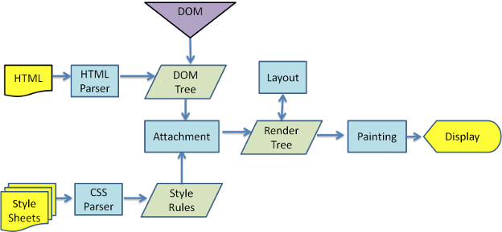
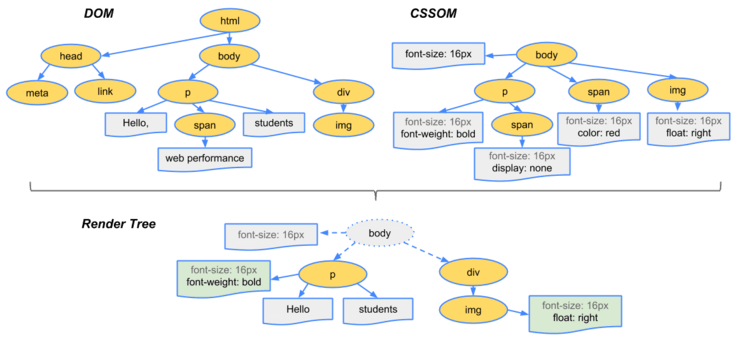

## 前置知识

在讲述主题之前，我们先说一下浏览器的渲染机制。



以 `webkit` 为例：

1. 浏览器使用流式布局模型（Flow Based Layout）
2. 解析 HTML 生成 DOM 树
3. 解析 CSS 生成 CSSOM 规则树
4. 将 DOM 树和 CSSOM 规则树合在一起生成渲染树 Render Tree
5. Layout（回流）：根据 Render Tree 遍历拿到每个节点并计算每个节点的位置大小信息 CSS 及从属关系
6. Painting（重绘）：根据渲染树及回流得到的几何信息，得到节点的绝对像素
7. Display：最后将像素发送给 GPU，展示在页面上



构建 render tree，浏览器主要做了以下工作：

1. 从 DOM 树的根节点开始遍历每个可见节点。
2. 对于每个可见的节点，找到 CSSOM 树中对应的规则，并应用它们。
3. 根据每个可见节点及对应的样式，组合生成 render tree。

> 渲染树只包含可见的节点

## 回流（重排）

当浏览器必须重新处理和绘制部分节点或者全部页面时，回流就会发生（或者说我们称这个过程为回流），例如当一个交互式站点更新后。

这个阶段会将可见 DOM 节点和它对应的样式结合起来，并计算它们在设备视口（viewport）内的确切位置和大小。

会触发回流的一些操作：

- 页面首次渲染
- 浏览器窗口大小发生变化
- 元素尺寸或位置发生改变
- 元素内容发生变化（文字或者图片等）
- 添加或删除 DOM 元素
- 激活伪类元素
- 查询某些属性或调用某些方法（以下会引起回流）

以下是会触发回流的一些常见的 API，更多请看[来自热心网友的统计](https://gist.github.com/paulirish/5d52fb081b3570c81e3a)：

- 盒模型相关
  - `elem.offsetLeft`, `elem.offsetTop`, `elem.offsetWidth`, `elem.offsetHeight`, `elem.offsetParent`
  - `elem.clientLeft`, `elem.clientTop`, `elem.clientWidth`, `elem.clientHeight`
  - `elem.getClientRects()`, `elem.getBoundingClientRect()`
- 滚动事件相关
  - `elem.scrollBy()`, `elem.scrollTo()`
  - `elem.scrollIntoView()`, `elem.scrollIntoViewIfNeeded()`
  - `elem.scrollWidth`, `elem.scrollHeight`
  - `elem.scrollLeft`, `elem.scrollTop` also, setting them

## 重绘

当我们操作的节点上的元素并不导致元素位置发生变化时，比如颜色，背景等等，浏览器会将新的样式赋值给这些节点，我们称这个过程为重绘。

这个阶段将渲染树上的每个节点都转换为屏幕上的实际像素。

> 注意：这里并不是说只有颜色背景等变化时才叫重绘，准确来说，浏览器将受到影响的部分重新绘制到屏幕上的过程称为重绘。

## 比对

其实根据定义可以看到，回流一定会重绘，但是重绘不一定回流。

回流在一定程度上可以说是元素几何属性和位置变化引起的，而重绘是哪怕改变了颜色等不牵扯元素几何属性和位置的属性也会触发。

重绘的代价是小于回流的，毕竟重绘只涉及到了无关位置大小的改变，不涉及布局。重绘只是改变外在，而回流则是需要改变骨架，回流的花销跟 render tree 有多少个节点需要重新构建有关系。

```js
const $bodyStyle = document.body.style;
$bodyStyle.margin = "20px"; // 回流 + 重绘
$bodyStyle.color = "skyblue"; // 重绘
$bodyStyle.border = "1px solid red"; // 回流 + 重绘
$bodyStyle.fontSize = "16px"; // 回流 + 重绘
```

## 影响

回流和重绘在一定程度上都会消耗性能，而且回流的成本是高于重绘的。

## 浏览器的优化机制

浏览器通常都会将多次回流操作放入一个队列中，等过一段时间或者操作达到一定的临界值，然后才会挨个执行，这样能节省一些计算消耗。但是在**获取**布局信息操作的时候，会强制将队列刷新，也就是强制回流。例如：

- offsetTop、offsetLeft、offsetWidth、offsetHeight
- scrollTop、scrollLeft、scrollWidth、scrollHeight
- clientTop、clientLeft、clientWidth、clientHeight
- getComputedStyle()
- getBoundingClientRect

## 减少回流和重绘的方法

1. 避免使用上述中的方法，如果非要使用，也尽量将值缓存起来，而不是一直获取。
2. 对于样式的修改，可以选择将多个样式合并为一个。
3. 对于操作 DOM 而言，将其脱离标准流再对元素进行多次操作，不会触发回流。
   1. 隐藏元素
   2. 使用文档碎片
   3. 拷贝节点

## css3 硬件加速（GPU 加速）

使用 css3 硬件加速，可以让 transform、opacity、filters 这些动画不会引起回流重绘 。但是对于动画的其它属性，比如 background-color 这些，还是会引起回流重绘的，不过它还是可以提升这些动画的性能。

常见的触发硬件加速的 css 属性：

1. transform
2. opacity
3. filters
4. will-change

也不要过度使用 css3 硬件加速，会导致内存占用大，性能受影响。

::: tip 延伸

1. display: none 会引起回流和重绘，因为它所在的元素完全不陈列出来，不占据空间，涉及到了 DOM 结构。
2. visibility: hidden 只产生重绘，因为此时元素虽然不可见，但是存在，保留空间，不影响结构。
   :::

## 参考

[你真的了解回流和重绘吗](https://segmentfault.com/a/1190000017329980)

[什么是回流与重绘 (Reflow & Repaint)](https://www.ahwgs.cn/shenmeshihuiliuyuzhonghui-reflow-repaint.html)

