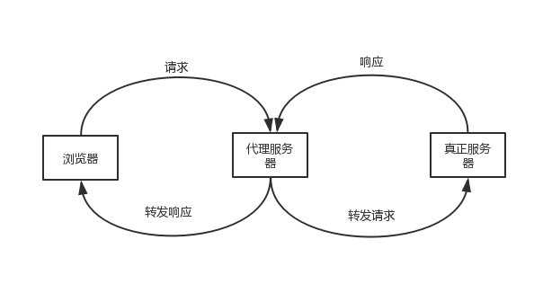

## 什么是跨域问题？

这个场景其实在实际项目里很常见，就是前端调用后端接口的时候，发现前后端不在同一个域或者说端口不同，就会产生跨域问题，也就是说当前应用访问了该应用域名或端口之外的域名或者端口。

那么此时因为浏览器对 JavaScript 的同源策略限制，也就是我们经常会提到的三同：

1. 相同的协议；
2. 相同的主机；
3. 相同的端口号；

只要有一项不同，就会触发同源策略限制，从而导致跨域问题的出现。

::: tip 同源策略

同源策略是一种约定，它是浏览器最核心也是最基本的安全功能，如果缺少了同源策略，则浏览器的正常功能可能都会收到影响。可以说 Web 是构建在同源策略基础之上的，浏览器只是针对同源策略的一种实现。同源策略会阻止一个域的 JavaScript 脚本和另外一个域的内容进行交互。

:::

那么相对的就有一些非同源的限制，表现为以下三点：

1. 无法读取非同源网页的 Cookie、LocalStorage 和 IndexedDB
2. 无法接触非同源网页的 DOM
3. 无法向非同源地址发送 AJAX 请求

## 跨域解决方案

### 1. 设置 document.domain 解决无法获取非同源网页的 Cookie 问题

因为浏览器是通过 document.domain 属性来检查两个页面是否同源，因此只要通过设置相同的 document.domain，两个页面就可以共享 Cookie。

> 此方案仅限主域相同，子域不同的跨域应用场景。

```js
// 两个页面都设置
document.domain = "test.com";
```

### 2. 跨文档通信 API：window.postMessage()

调用 postMessage 方法实现父窗口向子窗口发消息，当然反过来，子窗口也同样可以通过该方法向父窗口发消息。

它可以用于解决以下方面的问题：

- 页面和其打开的新窗口的数据传递
- 多窗口之间消息传递
- 页面与嵌套的 iframe 消息传递
- 上面三个场景的跨域数据传递

```js
// 父窗口向子窗口发消息
// 第一个参数代表发送的内容，第二个参数代表接收消息窗口的url
window.postMessage("message", "http://study.com");
```

在子页面调用 message 事件：

```js
window.addEventListener(
  "message",
  function (e) {
    // ...
  },
  false
);
```

### 3. JSONP

JSONP 是服务端与客户端跨域通信的常用方法。最大的特点就是简单使用，兼容性好，缺点是只支持 get 请求，不支持 post 请求。而且易受到 XSS 攻击。

核心思想：网页通过添加一个 `script` 元素，向服务器请求 JSON 数据，服务器收到请求后，将数据放在一个指定名字的回调函数的参数位置传回来。

① 原生实现：

```html
<script src="http://test.com/data.php?callback=dosomething"></script>
//
向服务器test.com发出请求，该请求的查询字符串有一个callback参数，用来指定回调函数的名字
// 处理服务器返回回调函数的数据
<script type="text/javascript">
  function dosomething(res) {
    // 处理获得的数据
    console.log(res.data);
  }
</script>
```

② jQuery ajax：

```js
$.ajax({
  url: "http://www.test.com:8080/login",
  type: "get",
  dataType: "jsonp", // 请求方式为jsonp
  jsonpCallback: "handleCallback", // 自定义回调函数名
  data: {},
});
```

③ Vue.js

```js
this.$http
  .jsonp("http://www.domain2.com:8080/login", {
    params: {},
    jsonp: "handleCallback",
  })
  .then((res) => {
    console.log(res);
  });
```

### 4. CORS 跨域资源分享

CORS 是跨域资源分享（Cross-Origin Resource Sharing）的缩写。它是 W3C 标准，属于跨源 AJAX 请求的根本解决方法。

**1、普通跨域请求：只需服务器端设置 Access-Control-Allow-Origin**

**2、带 cookie 跨域请求：前后端都需要进行设置**

**【前端设置】**根据 xhr.withCredentials 字段判断是否带有 cookie

① 原生 ajax

```js
var xhr = new XMLHttpRequest(); // IE8/9需用window.XDomainRequest兼容

// 前端设置是否带cookie
xhr.withCredentials = true;

xhr.open("post", "http://www.domain2.com:8080/login", true);
xhr.setRequestHeader("Content-Type", "application/x-www-form-urlencoded");
xhr.send("user=admin");

xhr.onreadystatechange = function () {
  if (xhr.readyState == 4 && xhr.status == 200) {
    alert(xhr.responseText);
  }
};
```

② jQuery ajax

```js
$.ajax({
  url: "http://www.test.com:8080/login",
  type: "get",
  data: {},
  xhrFields: {
    withCredentials: true, // 前端设置是否带cookie
  },
  crossDomain: true, // 会让请求头中包含跨域的额外信息，但不会含cookie
});
```

③ axios

```js
axios.defaults.withCredentials = true;
```

### 5. 代理跨域请求

实现原理：同源策略是浏览器需要遵循的标准，而如果是请求都发给代理服务器代理服务器再向后端服务器请求就可以规避跨域的问题。



例如用 nginx 做代理服务器。
nginx 配置

```shell
server{
    # 监听80端口
    listen 80;
    # 域名是localhost
    server_name localhost;
    #凡是localhost:8080/api这个样子的，都转发到真正的服务端地址http://localhost:8080
    location ^~ /api {
        proxy_pass http://localhost:8080;
    }
}
```

### 6. iframe

通过 iframe 是浏览器非同源标签，加载内容中转，传到当前页面的属性中

### 7. websocket

websocket 是 Html5 一种新的协议，基于该协议可以做到浏览器与服务器全双工通信，允许跨域请求
