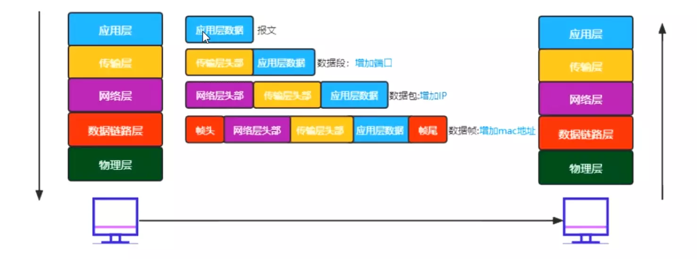
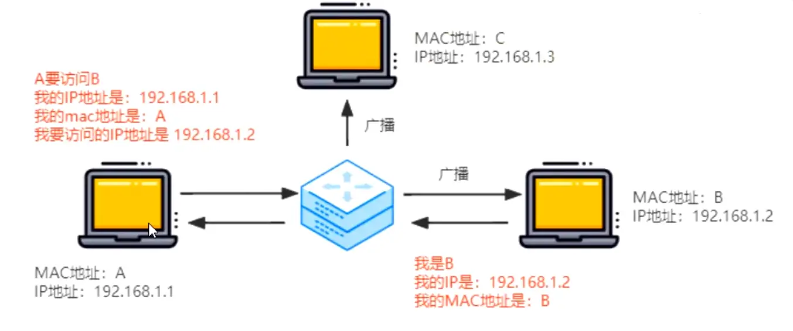

### OSI 七层模型

这是一个理想化的模型，给我们的网络划分了层次。

> 我们可以将复杂的内容简单化，每一层都专人做专事

1. [最底层]物理层：只关心如何传输数据，传输的是比特流
2. 数据链路层：主要关心的是将两个设备连接起来，用来连接数据
3. 网络层：网络层是寻址
4. 传输层：把数据传递给对方（怎么传，以及丢失后的重新传递）
5. 会话层：建立会话和管理会话
6. 表示层：怎么把数据进行描述、压缩等
7. 应用层：用户最终使用的接口（微信、QQ、网页等）

> 底层都是为上一层做服务的

在实际应用中，我们会将 5、6、7 统称为应用层；而将 1、2 统称为网络接口层。

我们来看一个例子：

> 给女朋友写信：
>
> 1. 要说的话——> 应用层
> 2. 整理话术——> 表示层
> 3. 建立会话 ——>会话层
> 4. 我家 504 号到女朋友家 301 号——>传输层
> 5. 增加你家的具体位置和对象地址——>网络层
> 6. 传输你的信——>数据链路层
> 7. 最终的交通工具——>物理层

### 七层协议真正都做了什么事情

- 报文：应用层 + 数据
- 数据段：传输层 + 数据 + 端口号
- 数据包：网络层 + 数据 + 端口 + IP 地址
- 数据帧：链路层 + 数据 + 端口 + IP 地址 + MAC 地址

> IPv4：IP 地址的第四个版本，最大值：42 亿个（255 的四次方）
>
> IPv6：这个太大了，自行百度
>
> IP 地址不是固定的（因为连接的网络不同），但是我们的 MAC 地址是唯一的（也是可以更改的），每个网卡都会有一个固定的 MAC 地址。

### 物理层有哪些设备？

- 光纤
- 同轴电缆
- 网线
- wifi
- 集线器（多口的中继器）--淘汰了
- 中继器（信号放大器）--也淘汰了
- ......

物理层就是关心怎么传输数据的，它不关心安全问题。

### 链路层设备

- 交换机（局域网通信）

### 网络层设备

- 路由器：路由器有 wan 口可以充当网关进行上网，没有 wan 口的路由器可以看成是交换机。默认两个不同的网络，不能相互通信，想让两个不同区域的设备来通信，要经历网关。

  - wan 口：外网网口，网关
  - lan 口：内网网口，可以做局域网

  

### 网络中的协议

我们说协议就是约定和规范。

在七层模型中只有三层以上的才能称之为协议。常见的协议有：

- 应用层协议
  - HTTP
  - DNS：因为用户很难记住 IP 地址，所以出现了 DNS。
  - DHCP：自动获取网络配置信息（动态主机配置协议），自动分配 IP，基于 UDP。
- 传输层协议
  - TCP
  - UDP
- 网络层协议
  - IP
  - ARP：地址转化协议。它是有歧义的，核心价值在于将 IP 地址转化为 MAC 地址（**链路层）**

### DNS 协议

用域名来代替 IP，IP 代替 MAC。

DNS 服务器是进行域名和与之对应的 IP 地址转换的服务器。

那它是怎么进行解析的？或者说，它是怎么将余名转换为 IP 的？

查找过程就是一个递归的过程。

> DNS 服务器会对 IP 以及域名进行缓存，采用的是 UDP （无连接）

### TCP 和 UDP

> 两个协议都是在传输层，我们经常说 TCP 是面向连接的，而 UDP 是面向无连接的

- UDP 发出请求以后，不考虑对方是否能接收到、内容是否完整、顺序是否正确。收到数据也不会进行通知。
- 首部结构简单，在数据传输时能实现最小的开始

#### TCP

TCP 传输控制协议是可靠、面向连接的协议，传输效率低（在不可靠的 IP 层上建立可靠的传输层）。TCP 提供全双工服务，即数据可在同一时间双向传播。

##### 1）TCP 数据格式

##### 2）TCP 为什么需要三次握手

1. 客户端和服务端主动握手
2. 服务端应答后和客户端握手
3. 客户端应答

原因是**确定双方通信正常**。

当 seq 和 ack 都是 1，表示握手完成。`ack = seq + len` 。

那么为什么需要四次挥手，会比握手多一次呢？

如图可知，在客户端和服务端的连接需要断开的时候，需要一方发起断开的信号，然后双方开始进行应答交互，而因为服务端可能还有没有发送完的数据，所以会比握手多一次，最后完成断开。

> 握手和挥手时：ack = 对方的 seq + 1 个标致位
>
> 发送数据时：ack = 对方的 seq + 对方的 len

加入出现了丢包的情况，会怎么办呢？

1. 客户端和服务端说：我们分手吧（如果服务端假装没听到，就会一直发）
2. 收到分手消息
3. 服务端说：我们分手吧
4. 客户端说收到了（假如丢包了，服务端看客户端没有反应，需要重新发送，服务端继续说我们分手吧）
5. 客户端不能立即发送后就关闭，得等待。看着有没有服务端重新发送的包，如果没有就可以断开了
6. 等着就会占用端口号
7. 如果丢包了，但是客户端断开了，服务端就认为客户端挂掉了，出错了。客户端会发送一个 RST 包

> 为了防止最终的 ACK 丢失，发送 ACK 后需要等待一段时间，因为如果丢包服务端需要重新发送 FIN 包，如果客户端已经 closed，那么服务端会将结果解析成错误。从而在高并发非长链接的场景下会有大量端口被占用。

#### UDP

可以基于 UDP 实现可靠的协议。

### 滑动窗口

主要是用来控制流量的。缓存区的缓存被上层（HTTP 等）消费之后，就会把缓存释放掉。

- 滑动窗口：TCP 是全双工的，所以发送端有发送缓存区；接收端有接收缓存区，会根据网络状况调整发送数据的多少。要发送的数据都放到发送者的缓存区，发送窗口（要被发送的数据）就是要发送缓存中的那一部分。
- 我们发送数据的时候是乱序发送的，但是当我们收到某个包后，可能之前的包还没有收到，此时需要等待前面序号的包到了才可以（队头阻塞）
- 服务端和客户端会说明发送数据的个数
- 如果某个数据包丢失了，就会重新发送（超时重传 RTO）
- **核心是流量控制**：在建立连接时，接收端会告诉发送端自己的窗口大小（rwnd），每次接收端收到数据后都会再次确定（rwnd）大小，如果值为 0，停止发送数据，（并发发窗口探测包，持续监测窗口大小），实际上就是控制发送方的频率
- 当接收方的缓存区满了，每隔一段时间，发送方都会发送一个探测包，来询问能否调整窗口大小。而当上层协议消耗掉接收放的数据，接收方也会主动通知发送方调整窗口，从而继续发送和接收数据

#### 粘包

Nagle 算法的基本定义是**任意时刻，最多只能有一个未被确认的小段**（TCP 内部控制）。

Cork 算法：当达到 MSS （Maximum Segment Size) 值时统一进行发送（此值就是帧的大小 - IP 头 - TCP 头 = 1460 字节）

### TCP 拥塞处理（队头阻塞）

注意：如果在非长链接的情况下会有大量端口被占用的问题。

> 距离：假设接收方窗口大小是无限的，接收到数据就能发送 ACK 包，那么传输数据主要是依赖于网络带宽，带宽的大小是有限的。

- TCP 维护一个拥塞窗口 cwnd 变量，在传输过程中没有拥塞就将此值增加。如果出现拥塞（超时重传 RTO）就将窗口值减少
- cwnd < ssthresh 使用慢开始算法
- cwnd > ssthresh 使用拥塞避免算法
- RTO 时更新 ssthresh 值为当前窗口的一半，更新 cwnd = 1

- 传输轮次：RTT （Round-trip time），从发送到确认信号的时间
- cwnd 控制发送窗口的大小

> 快重传，可能在发送的过程中出现丢包的情况。此时不要立即回退到慢开始阶段，而是对已经收到的报文重复确认，如果确认次数达到 3 次，则立即进行重传**快恢复算法**（减少超时重传机制的出现和降低重置 cwnd 的频率）

### HTTP

- 1999 年广泛使用 HTTP/1.1，正式标准，允许持久连接，允许响应数据分块，增加了缓存管理和控制，增加了 PUT、DELETE 等新的方法。（问题是多个请求并发、管线化、http 队头阻塞的问题）
- 2015 年 HTTP/2，使用 HP ACK 算法压缩头部，减少数据传输量。允许服务器主动向客户端推送数据，二进制协议可发送多个请求，使用时需要对请求进行加密通信。（多路服用 1 条 TCP 链接来通信数据）

- 2018 年 HTTP/3 基于 UDP 的 QUIC 协议

#### HTTP/1.1

- HTTP/1.1 是可靠的传输协议，基于 TCP/IP 协议
- 采用应答模式，客户端主动发起请求，服务器被动回复请求
- HTTP 是无状态的，每个请求都是相互独立的，默认 TCP 不能在没有应答完成后复用 TCP 通道继续发送消息
- HTTP 协议的请求报文和响应报文的结构基本相同，由三部分组成
  - 请求行 响应行：主要的目的就是描述我要做什么事情，服务端告诉客户端可以
  - 请求头 响应头：描述我们传输的数据内容，自定义我们的 header （HTTP 中自己所做的规范）
  - 请求体 响应体：两者的数据

### TCP 的一些问题

- TCP 顺序问题，后面的包先到达需要等待前面的包返回之后才可以继续传输（队头阻塞问题）
- 慢启动的问题，非常消耗性能
- Time-wait 客户端连接服务器后不会立即断开，在高并发、短连接的情况下，会出现端口全被占用的情况

### 请求头和响应头

- 核心在于内容协商

客户端和服务端进行协商，返回对应的结果

| 客户端 Header   | 服务端 Header    |                                                       |
| --------------- | ---------------- | ----------------------------------------------------- |
| Accept          | Content-Type     | 我发送给你的数据是什么类型                            |
| Accept-encoding | Content-Encoding | 我发送给你的数据是用什么格式压缩（gzip、deflate、br） |
| Accept-language |                  | 根据客户端支持的语言返回                              |
| Range           | Content-Range    | 范围请求数据                                          |

- 实现长连接会默认在请求的时候，增加 `connection: keep-alive`，关闭长连接 `connection: close` 。复用 TCP 通道传递数据（必须在一次应答后才能复用）
- 多个请求要发送——管线化的方式
  - 我们针对每个域名分配 6 个 TCP 通道
  - 不够的话，可以使用域名分片（即多个域名）
  - 当然域名也不宜过多，不然会导致 DNS 解析大量域名
  - 虽然请求是并发的，但是应答依旧是按顺序的，因为管道的特点就是先发送的先回来，这依旧可能会导致队头阻塞问题

### 可以采用 cookie 使用用户身份

在客户端增加 cookie 字段，服务端 `set-cookie` 每次请求的时候都会自动携带 `cookie` （cookie 不要过大）

### 缓存

- 强制缓存：就是当客户端访问服务器后，服务器返回一个过期时间，在这个时间内，都可以直接在客户端的缓存中查找。`Cache-Control: max-age` 缓存的最大时间。

- 协商缓存：当强制缓存失效后会再次向服务器发起请求，服务器需要比对客户端的缓存文件是否和自己的是一样，如果一样则返回 304 状态。反之，则返回新的文件。
  - Last-modified / if-modified-since
  - 修改时间变了，内容没变，也会重新拉取最新文件（比如把一个字符删除，又撤销删除）
  - 同一时间内无法检测多次修改

- 摘要算法：md5 算法——不同的内容，摘要的结果肯定不同，但是长度相同；两个相同的内容，摘要的结果肯定是相同，无法通过最新的结果反推原内容

### HTTPS

1. 保证密文
2. 防止篡改

HTTP 采用明文传输，中间人可以获取到明文数据（从而实现对数据的篡改）。这时候 HTTPS 登场了。HTTPS 事什么呢？

HTTPS = HTTP + SSL/TLS，SSL 是安全套接层，发展到 V3 时改名为 TLS 传输层安全，主要的目的是提供数据的**完整性和保密性**。

怎么保证数据完整和保密呢？

- 给内容增加一个摘要，传递到服务端后，再把内容做一次摘要，看下两次摘要前后是否一致（可以根据摘要来辨别数据有没有被篡改，因为篡改后的数据和之前的肯定不同）
- 对称加密：发送方和接收方都有一把共同的钥匙
  - AES
  - chacha20

- 非对称加密：发送方和接收方都有一把钥匙，发送方拿到公钥，接收方手里拿着私钥
  - 私钥加密，公钥解密
  - 公钥加密，私钥解密
  - 也可以用两套钥匙实现通信（性能不好，效率问题，数据越大解密越复杂）

- 混合加密：对称 + 非对称
  - 通过非对称来解决密钥传输问题
  - 数据传输利用对称加密
  - 缺陷是不知道公钥是谁发来的——中间商可以伪造公钥

- 数字证书和 CA

  > 因为谁都可以发布公钥，所以我们需要验证对方身份，从而防止中间人攻击

  

以上就是「网络分层的含义」，其实这部分内容是对网络基础的一个复习和巩固。

> 文章内容来源于珠峰公开课的分享！感谢
