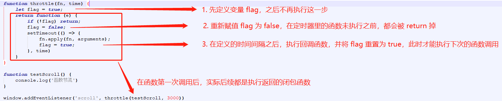

## 函数节流

在实际项目中，我们会经常遇到一些高频触发事件，比如 resize、scroll 等等，如果在这些事件上绑定一个回调函数，那么在触发这些事件的时候，这个函数就会被疯狂调用，这对性能有很大影响。所以为了解决这个问题，引申出了函数节流的概念。

### 基本概念

让高频触发事件，在 n 秒内只会执行一次，节流就是通过这样来稀释函数执行的频率。举个例子，古时候人们治水，一般都是直接用堵起来的方式，把水堵住。但是后来发现，堵不如疏，你不能让水越聚越多，而是需要减缓水流的速度。那么放在 JS 中其实就是在较少高频事件执行的频率，从而降低性能消耗。

::: tip 实现思路

首先我们定义一个标记 `flag`，当标记为 true 的时候执行函数，然后我们在闭包中去判断一下，如果这个标记为 false 的时候，则直接 return 掉，不在向下执行。反之继续向下执行，并将这个标记立马赋值为 false，紧接着我们在 setTimeout 里将目标函数包装进来，并改变函数的 this 指向。

为什么要改变这个 this 指向呢？是因为如果我们的目标函数里使用了 this 之后，没有改变上下文环境中的 this，那么 this 会直接指向 window 对象，而不是指向 fn 。当执行完目标函数之后，再跟着将标记重置为 true，保证方法的执行。

:::

### 实例代码

```js
function throttle(fn, time) {
  let flag = true;
  return function (e) {
    if (!flag) return;
    flag = false;
    setTimeout(() => {
      fn.apply(this, arguments);
      flag = true;
    }, time);
  };
}

function testScroll() {
  console.log("函数节流");
}

window.addEventListener("scroll", throttle(testScroll, 300));
```



函数节流的适用场景会在一些 scroll 和 resize 事件中用到。

## 函数防抖

我们在项目中会经常用到 input 事件，这个时候 input 上的回调会在我们按键时频繁触发，这也是非常不友好的，为了解决这个问题，有引申出了函数防抖。

### 基本概念

函数防抖的基本思路就是将多个信号合并为一个信号；触发高频事件后 n 秒内函数只会执行一次。如果 n 秒内高频事件再次触发，则重新计算时间。也可以说是任何频繁触发的情况下，只有任务触发的间隔超过指定间隔的时候，任务才会执行。

::: tip 实现思路
我们先创建一个 debounce 函数，这个方法是某个事件（比如 oninput）的回调，在这个函数体内，我们先定义一个 timeout 变量，用来表示后面要用到的计时器 setTimeout；然后再返回一个闭包，闭包内先清除掉 timeout 定义的计时器，然后重新定义一个计时器，并在 setTimeout 的回调中调用传进来的函数方法，使用 apply 改变 this 的指向。

此时当我们触发高频事件时，相对应的会执行事件里的回调，也就是防抖函数。在函数里，当次事件里的闭包会把上次事件里的定时器给清除掉，这样就不会去调用定时器里的目标函数（这是建立在事件还在继续触发的基础上）。而当用户不再触发这个事件的时候，clearTimeout 将上一次的定时器清除掉以后，紧接着执行 setTimeout，待设定好的时间间隔过去之后就可以触发函数了。
:::

### 实例代码

```js
function debounce(fn, time) {
  let timeout;
  return function () {
    clearTimeout(timeout);
    timeout = setTimeout(function () {
      fn.apply(this, arguments);
    }, time);
  };
}

function testDebounce() {
  console.log("函数防抖");
}

var inputDom = document.getElementById("inputId");
inputDom.addEventListener("input", debounce(testDebounce, 300));
```
