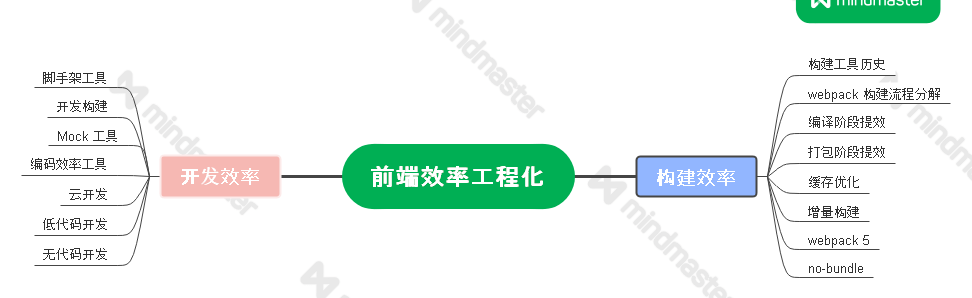

通常，一个中高级前端工程师，除了要完成业务功能开发目标外，还要对所开发项目的效率、性能、质量等工程化维度去制定和实施技术优化目标，其中以提升效率为目标的优化技术和工具就属于**效率工程化**的范畴。

对于公司而言，团队效率可以直接带来人工投入产出比的提升，因此效率提升通常会被作为技术层面的一个重点优化方向。而在面试中，对效率工程化的理解程度和实践中的优化产出情况，也是衡量前端工程师能力高低的常见标准。

