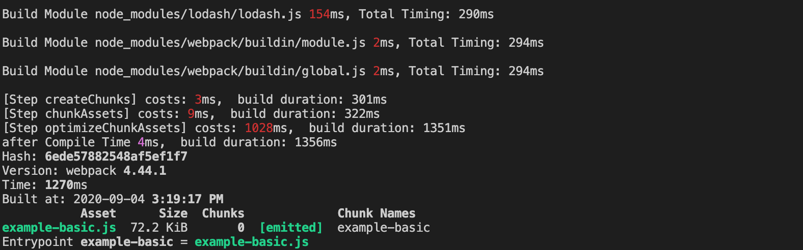
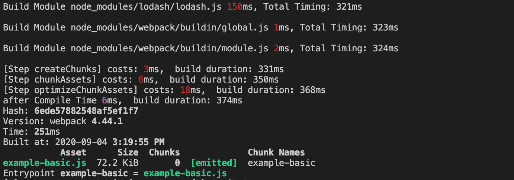
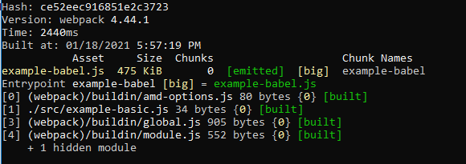
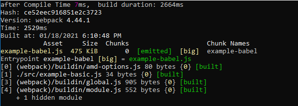
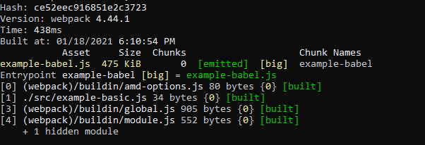
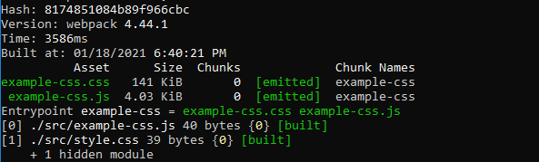
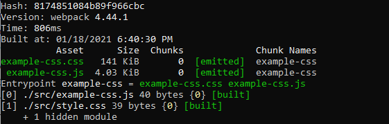

本文是笔者笔记，原文[传送门](https://kaiwu.lagou.com/course/courseInfo.htm?courseId=416#/detail/pc?id=4427)。
[[toc]]

## 缓存优化的基本原理
我们在构建构成中加入缓存后，会大大减少再次构建所用的时间，如下两个图，图一是初次构建所需时间，图二是再次构建所需时间：



这是在没有增加任何优化设置的情况下所耗时间，初次构建时在 optimizeChunkAssets 阶段的耗时是 1000ms，而再次构建的耗时直接降到了 18ms，几乎可以忽略不计。

这里的原因就在于，webpack4 内置了压缩插件 `TerserWebpackPlugin`，且默认开启了**缓存**参数。在初次构建的压缩代码过程中，就将这一阶段的结果写入了缓存目录（node_modules/.cache/terser-webpack-plugin/）中，当再次构建时，即可对比读取已有缓存。
```js
// terser-webpack-plugin/src/index.js

...

if (cache.isEnabled()) {
  let taskResult;
  try {
    taskResult = await cahe.get(task);  // 读取缓存
  } catch (ignoreError) {
    return enqueue(task);  // 缓存未命中的情况下执行任务
  }
  task.callback(taskResult);  // 缓存命中的情况下返回缓存结果
  ...
  const enqueue = async (task) => {
    let taskResult;
    if (cache.isEnabled() && !taskResult.error) {
      await cache.store(task, taskResult);  // 写入缓存
    }
  }
}
```
以上就是 TerserWebpackPlugin 插件中利用缓存的基本原理。

## 编译阶段的缓存优化
编译阶段的耗时主要在使用不同的加载器（Loader）来编译模块的过程。我们来看两个典型的loader缓存处理。
### babel-loader
babel-loader 是绝大部分项目中会使用到的 JS/JSX/TS 编译器。在 Babel-loader 中，与缓存相关的设置主要有：
- **cacheDirectory**：默认为 false，即不开启缓存。当值为 true 时开启缓存并使用默认缓存目录（./node_modules/.cache/babel-loader/），也可以指定其他路径值作为缓存目录。
- **cacheIdentifier**：用于计算缓存标识符。默认使用 babel 相关依赖包的版本、babelrc 配置文件的内容，以及环境变量等与模块内容一起参与计算缓存标识符。如果上述内容发生变化，即使模块内容不变，也不能命中缓存。
- **cacheCompression**：默认为 true，将缓存内容压缩为 gz 包以减小缓存目录的体积。在设为 false 的情况会跳过压缩和解压的过程，从而提升这一阶段的速度。

```js
{
    test: /\.js$/,
    exclude: /node_modules/,
    options: {
        presets: [],
        // 开启 babel 缓存
        // 第二次构建时，会读取之前的缓存
        cacheDirectory: true
    }
}
```

开启了缓存选项前后的构建时长如图：



可以看到由于开启了 babel 的缓存，再次构建速度比初次构建快了很多。

### cache-loader
在编译过程中利用缓存的第二种方式是使用 cache-loader。在使用时，需要将 cache-loader 添加到对构建效率影响较大的 loader（如 babel-loader 等）之前：
```js
// ./webpack.cache.config.js
...
module: {
  rules: [
    {
      test: /\.js$/,
      use: ['babel-loader', 'cache-loader']
    }
  ]
}
...
```
执行两次构建可以明显看到，使用 cache-loader，比使用 babel-loader 的开启缓存选项后的构建时间更短：



主要原因是 babel-loader 中的**缓存信息较少**，而 cache-loader 中存储的**Buffer 形式的数据处理效率更高**。下面的示例代码，是 babel-loader 和 cache-loader 入口模块的缓存信息对比：
```js
//babel-loader中的缓存数据
{"ast":null,"code":"import _ from 'lodash';","map":null,"metadata":{},"sourceType":"module"}
//cache-loader中的缓存数据
{"remainingRequest":"...lessons_fe_efficiency/13_cache/node_modules/babel-loader/lib/index.js!.../lessons_fe_efficiency/13_cache/src/example-basic.js","dependencies":[{"path":"...lessons_fe_efficiency/13_cache/src/example-basic.js","mtime":1599191174705},{"path":"...lessons_fe_efficiency/13_cache/node_modules/cache-loader/dist/cjs.js","mtime":499162500000},{"path":".../lessons_fe_efficiency/13_cache/node_modules/babel-loader/lib/index.js","mtime":499162500000}],"contextDependencies":[],"result":[{"type":"Buffer","data":"base64:aW1wb3J0IF8gZnJvbSAnbG9kYXNoJzs="},null]}
```

::: tip

文件资源缓存：

假使我们在项目里新建了一个 server.js

```js
const express = require('express');
const app = express();

app.use(express.static('build', { maxAge: 1000 * 3600 }));

app.listen(3000)
```

这样启动服务后 `node server.js`，就会强制将打包后的资源缓存下来，而又因为缓存问题，我们还需要在打包后的资源文件上加上 hash 值，来应对修改文件后让浏览器重新加载修改后的资源：

- hash：每次 webpack 构建时都会生成一个唯一的 hash 值，但是有一个问题是因为 js 和 css 同时使用一个 hash 值，所以可能会导致只改动了一个文件，从而项目重新打包，会致使所有缓存失效。
- chunkhash：针对上述问题，根据 chunk 生成的 hash 值。如果打包来源于同一个 chunk，那么 hash 值就一样。但是这个还是有问题，假如 css 文件是在 js 中被引入的，那么还是同属于一个 chunk，当修改 css 后，js 和 css 的 hash 值还是一样的。
- contenthash: 根据文件的内容生成 hash 值。不同文件 hash 值一定不一样。

让代码上线运行缓存更好使用。

:::

## 优化打包阶段的缓存优化

### 生成 ChunkAssets 时的缓存优化
在 webpack 4 中，生成 ChunkAsset 过程中的缓存优化是受限的；只有在 watch 模式下，且配置中开启 cache 时才能在这一阶段执行缓存的配置。这是因为，在 webpack 4 中，缓存插件是基于内存的，只有在 watch 模式下才能在内存中获取到相应的缓存数据对象。在 webpack 5 中这一问题已经解决。

### 代码压缩时的缓存优化
其实也就是 JS 压缩缓存优化和 CSS 压缩缓存优化。JS 压缩我们在之前的文章中已经说过了，就不在赘述。CSS 压缩，只有目前最新发布的 `CSSMinimizerWebpackPlugin` 支持且默认开启缓存。其他插件目前还不支持。
以下 CSSMinimizerWebpackPlugin 的缓存效果对比：



如图，开启该插件缓存后，再次构建的时长降低到了初次构建的 1/4.

## 缓存的失败
尽管上面例子所显示的再次构建时间要比初次构建时间要短得多，但前提是两次构建都没有任何代码发生变化，也就是说，最佳效果是在缓存完全命中的情况下。而现实中，通常需要重新构建的原因是代码发生了变化。因此**如何最大程度上让缓存命中**，成为我们选择缓存方案后首先要考虑的。

### 缓存标识符发生变化导致缓存失败

在支持缓存的插件和 loader 中，会根据一些固定字段的值加上所处理的模块或 Chunk 的数据 hash 值来生成对应缓存的标识符，例如特定依赖包的版本、对应插件的配置项信息、环境变量等。一旦其中的值发生变化，对应的缓存标识符就会发生改变。这也就意味着对应工具中，**所有之前的缓存都将失效**。因此，通常情况下我们需要尽可能少的变更会影响到缓存标识符生成的字段。

其中尤其需要注意的是，在许多项目的集成构建环境中，特定依赖包由于安装时所生成的语义化版本，导致构建版本时常自动更新，并造成缓存失效。因此，建议大家还是在使用缓存时根据项目的构建使用场景来合理设置对应缓存标识符的计算属性，从而尽可能地减少因为标识符变化而导致缓存失效的情况。

### 编译阶段的缓存失效

编译阶段的执行时间由每个模块的编译时间相加而成。在开启缓存的情况下，代码发生变化的模块将被重新编译，但不影响它所依赖的及依赖它的其他模块，其他模块将继续使用缓存。因此，这一阶段不需要考虑缓存失效扩大化的问题。

### 优化打包阶段的缓存失效

当我们任意修改入口文件的代码后会发现，代码压缩阶段的时间再次变为和初次构建时间相近。也就是说，这一 Chunk 的 Terser 插件的缓存失效了。

之所以会出现这种情况，是因为尽管模块编译阶段每个模块是单独执行编译的，但是当进入到代码压缩环节时，各模块已经被组织到了相关联的 Chunk 中。比如几个模块最后只生成一个 Chunk，任何一个模块发生变化都会导致整个 Chunk 的内容发生变化，而使之保存的缓存失效。

那其实对应的优化思路也是显而易见的：**尽可能将那些不变的、处理成本高昂的模块打入单独的 Chunk 中**。这就涉及了 webpack 中的分包配置——`splitChunks`。

### 使用 splitChunks 优化缓存利用率

构建分包的好处：

- 合并通用依赖
- 提高构建缓存利用率
- 提高资源访问的缓存利用率
- 资源懒加载等

我们在配置文件中设置分包：

```js
// ./webpack.cache-miss.config.js
...
optimization: {
    splitChunks: {
        chunks: 'all'
    }
}
...
```

## 其他使用缓存的注意事项

### 缓存的清理

缓存的便利性本质在于用磁盘空间换取构建时间。对于一个大量使用缓存的项目，随着时间的流逝，缓存空间会不断增大。这在只有少数项目的个人电脑中还不是非常大的问题，但对于上述多项目的集成环境而言，则需要考虑对缓存区域的定期清理。

那么这几个支持缓存的插件（`TerserWebpack`，`CSSMinimizerWebpackPlugin`和 Loader-(`babel-loader`, `cache-loader`)）有哪些相同的配置项呢？
- 是否开启缓存，以及指定缓存目录（值为 true 时使用默认目录，指定目录时也表示开启），配置名称通常是 `cache` 或 `cacheDirectory`
- 指定缓存标识符的计算参数，通常默认值是一个包含多维度参数的对象。例如这个工具模块的版本号、配置项对象、文件路径和内容等。这个配置项是为了确保缓存使用的安全性，防止源代码不变但是相关的构建参数改变而导致对旧缓存的引用。
