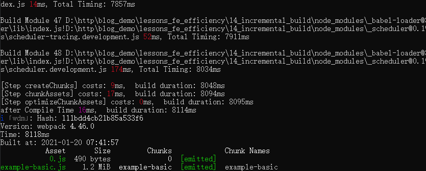
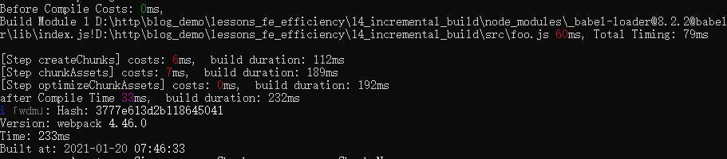
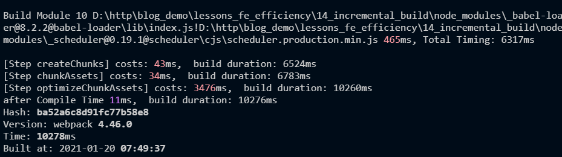
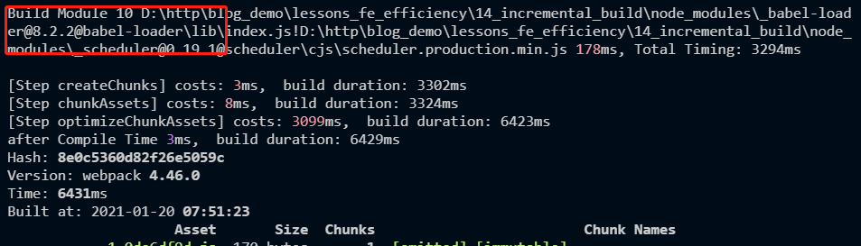
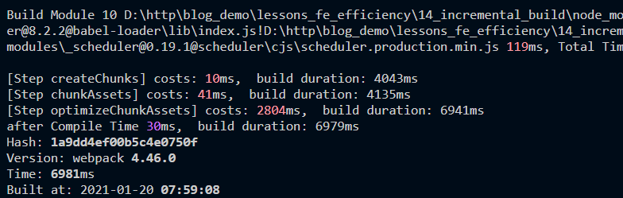
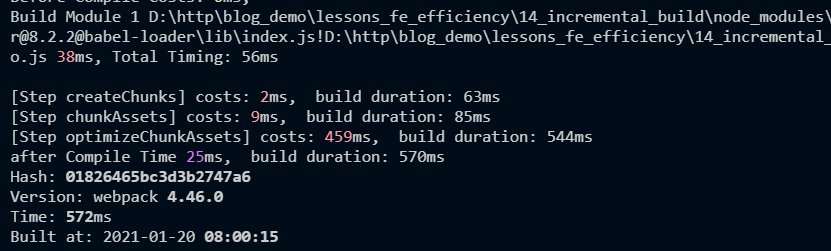

本文是笔者笔记，原文[传送门](https://kaiwu.lagou.com/course/courseInfo.htm?courseId=416#/detail/pc?id=4428)

什么是增量构建？增量构建的作用是什么？

[[toc]]

场景：只修改一行代码，却在执行构建时，要完整执行所有模块的编译、优化和生成产物的处理过程，而不是只需要处理所改动的文件。想要实现再次构建只需要处理被修改的文件。

那么这就引出了第一个问题——什么是增量构建？
## 什么是增量构建？
我们其实在开发时，经常会用到增量构建的场景——**开启 devServer**的时候。当我们启动 webpack-dev-server 的时候，webpack 会进行一次初始化构建，并在构建后启动服务并进入到等待更新的状态。当本地文件变更时，webpack 几乎瞬间将变更的文件进行编译，然后将编译后的结果推送到浏览器端。这个文件变更后的处理过程就符合上面所说的只编译打包改动的文件的操作，这就称为**增量构建**。我们通过示例代码进行验证（npm run dev）：





可以看到，在开发模式下，初次构建编译了47个模块，完整的构建时间为 8118ms。当我们改动其中一个源码文件后，日志显示 webpack 只再次构建了这一个改动的模块，因此再次构建的时间非常短（233ms）。那么在开发模式下可以实现的增量构建，在生产模式不可以了呢？

## 增量构建的影响因素

### watch 配置

那在上面的增量构建过程中，第一个想到的就是**需要监控文件的变化**。只有得知变更的是哪一个文件，才能进行后续的针对性处理。那么在 webpack中**启用watch配置**即可，此外在使用 devServer 的情况下，该选项会**默认开启**。我们在生产模式下开启 watch 配置来看看会不会在再次构建时按增量的方式执行。





我们发现在生产模式下开启 watch 模式后，相比初次构建，再次构建所编译的模块数量并没有减少，还是10个，即使你只改动了一个文件，也仍然会对所有模块进行编译。所以在生产环境下只开启 watch 配置后的再次构建并不能实现增量构建。

### cache 配置

那在webpack配置中，有一个 cache 选项（webpack4）。这一选项的值有两种类型：

- **布尔值**：一般情况下默认为 **false**，即不使用缓存，但是在开发模式开启 watch 配置的情况下，cache 的默认值变更为 **true**。
- **对象**：若 cache 传值为对象类型，则表示使用该对象作为缓存对象，这往往用于多个编译器 compiler 的调用情况。

在生产环境下，我们结合 watch 和 cache 都为 true 时，会不会实现增量构建呢？





可以看到，确实实现了增量构建，在编译模块阶段只对有变化的文件进行了重新编译。

## 增量构建的实现原理

## watch 配置的作用

watch 配置的具体逻辑在webpack 的 watching.js 中。查看源码可以看到，在它构建相关的 _go 方法中，执行的依然是 compiler 实例的 compile 方法，这一点与普通构建流程并无区别。真正的区别是，在 watch 模式下，构建完成后并不自动退出，因此构建上下文的对象（包括前一次构建后的缓存数据对象）都可以保留在内存中，并在 rebuild 时重复使用。

```js
// lib/Watching.js
_go() {
    ...
    this.compiler.hooks.watchRun.callAsync(this.compiler, err => {
        const onCompiled = (err, compilation) => {
            ...
        }
        this.compiler.compile(onCompiled);
    })
}
```

## cache 配置的作用

cache 配置的源码逻辑主要涉及两个文件：CachePlugin.js 和 Compilation.js。其中 CachePlugin.js 的核心作用是将该插件实例的 cache 属性传入 compilation实例中。

```js
// lib/CachePlugin.js
...
compiler.hooks.thisCompilation.tap("CachePlugin", compilation => {
    compilation.cache = cache;
    ...
})
...
```

而在 Compilation.js 中，运用到 cache 的地方有两处：

1. **在编译阶段添加模块时**，若命中缓存**module**，则直接跳过该模块的编译过程（与 cache-loader 等作用于加载器的缓存不同，此处的缓存可直接跳过 webpack 内置的编译阶段）。
2. 在创建 Chunk 产物代码阶段，若命中缓存**Chunk**，则直接跳过该 Chunk 的产物代码生成过程。

```js
// lib/Compilation.js
...
addModule(module, cacheGroup) {
    ...
    if (this.cache && this.cache[cacheName]) {
        const cacheModule = this.cache[cacheName];
        ...
        // 缓存模块存在的情况下判断是否需要 rebuild
        rebuild = ...
        if (!rebuild) {
            ...
            // 无需 rebuild 情况下返回 cacheModule，并标记 build:false
            return {
                module: cacheModule,
                issuer: true,
                build: false,
                dependencies: true
            }
        }
        ...
    }
    if (this.cache) {
        this.cache[cacheName] = module;
    }
    ...
    // 无缓存或需要 rebuild 情况下需要返回 module，并标记 build: true
    return {
        module: module,
        issuer: true,
        build: true,
        dependencies: true
    }
}
...
createChunkAssets() {
    ...
    if (this.cache && this.cache[cacheName] && this.cache[cacheName].hash === usedHash) {
        source = this.cache[cacheName].source;
    } else {
        source = fileManifest.render();
        ...
    }
}
```

通过 webpack 内置的 cache 插件，将整个构建中相对耗时的两个内部处理环节——编译模块和生成产物，进行缓存的读写处理，从而实现增量构建处理。但是我们并不是直接就可以在生产环境下直接使用咱们说的这个方案。

## 生产环境下使用增量构建的阻碍

增量构建之所以快是因为将构建所需的数据（项目文件、node_modules 中的文件数据、历史构建后的缓存数据等）都**保留在内存中**。在 watch 模式下保留着构建使用的 Node 进程，使得下一次构建时可以直接读取内存中的数据。

而生产环境下的构建通常在集成部署系统中进行。那么对于管理多项目的构建系统而言，构建过程是任务式的：任务结束后即结束进程并回收系统资源。对于这样的系统而言，增量构建所需的保留进程与长时间占用内存，通常都是**不可接受的**。

因此，**基于内存的缓存数据**注定无法运用到生产环境中。要想在生产环境下提升构建速度，**首要条件是将缓存写入到文件系统中**。只有将文件系统中的缓存数据持久化，才能脱离对保持进程的依赖，然后只需要在每次构建时将缓存数据读取到内存中进行处理即可。

遗憾的是，webpack4 中的 cache 配置只支持基于内存的缓存，我们只能通过一些支持缓存的第三方处理插件将局部的构建环节应用“**增量处理**”。不过好消息是 webpack 5 中**正式支持基于文件系统的持久化缓存**。

## 小结

增量构建：增量构建在每次执行构建时，只编译处理内容有修改的少量文件，从而极大地提升了构建效率。

从内部原理的角度分析，watch 的作用是保留进程，使得初次构建后的数据对象能够在再次构建时复用。而 cache 的作用则体现在构建过程中，在添加模块与生成产物代码时可以利用 cache 对象进行相应阶段结果数据的读写。显然，这种基于内存的缓存方式无法在生辰环境下广泛使用。