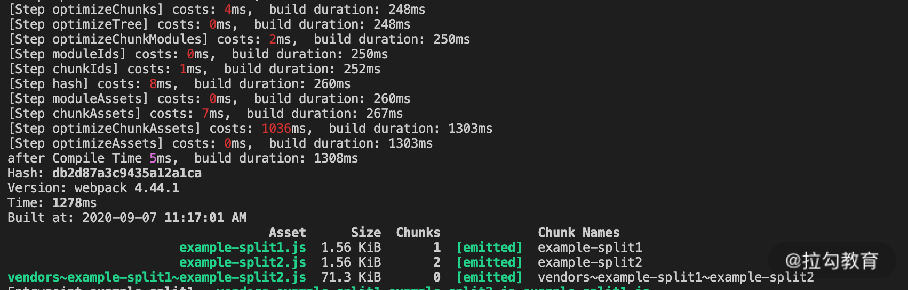

本文为笔者笔记，原文[传送门](https://kaiwu.lagou.com/course/courseInfo.htm?courseId=416#/detail/pc?id=4426)

[[toc]]

## 准备分析工具
同样的，我们需要一个分析统计时间的工具。在优化阶段对应的生命周期Hooks有很多。因此在编写统计插件时，我们要将需要统计的 Hooks 划分为不同区间：

```js
// ./WebpackTimingPlugin.js

const lifeHooks = [
    {
        name: 'optimizeDependencies',
        start: 'optimizeDependencies',
        end: 'afterOptimizeDependencies'
    },
    {
        name: 'createChunks', start: 'beforeChunks', end: 'afterChunks'
    }
]

let startTime
compilation.hooks[start].tap(PluginName, () => {
    startTime = Date.now()
})

compilation.hooks[end].tap(PluginName, () => {
    const cost = Date.now() - startTime
    console.log(`[Step ${name}] costs: ${chalk.red(cost)}ms`)
})
```

使用后的效果如下：


通过这样的插件，我们可以分析目前项目中的效率瓶颈，从而进一步为选取优化方案及评估方案效果提供依据。

## 以提升当前任务工作效率为目标的方法
一般在项目的优化阶段，主要耗时的项目有两个：
1. 生成 ChunkAssets，即根据 Chunk 信息**生成 Chunk 的产物代码**；
2. 优化 Assets，即**压缩 Chunk 产物代码**。

第一个任务主要在 webpack 引擎内部的模块中处理，相对而言优化手段较少，主要集中在利用缓存方面。而在压缩 Chunk 产物代码的过程中会用到一些第三方插件，选择不同的插件，以及插件中的不同配置都会对其中的效率产生影响。

所以本节重点看压缩代码的优化方案。

## 面向 JS 的压缩工具

webpack4 中内置了 `TerserWebpackPlugin` 作为默认的 JS 压缩工具。它是基于 `Terser` 的。

在作为 webpack 插件的 TerserWebpackPlugin 中，对执行效率产生影响的配置主要分为 3 个方面：

1. **Cache选项**：默认开启，使用缓存能够极大程度上提升再次构建时的工作效率。

2. **Paraller选项**：默认开启，并发选项在大多数情况下能够提升该插件的工作效率，但是具体提升的程度则因项目而异。在小型项目中，多进程通信的额外消耗可能会抵消其带来的益处。

3. **terserOptions选项**：即 Terser 工具中 [minify选项集合](https://github.com/terser/terser#minify-options)。这些选项是对具体压缩处理过程产生影响的配置项。我们主要来看其中的**compress**和**mangle**选项，不同选项的压缩结果如下：

   ```js
   function HelloWorld() {
       const foo = '1234'
       console.log(HelloWorld, foo)
   }
   HelloWorld()
   
   // 默认配置项 compress={}, mangle=true 的压缩代码
   function(e,t){!function e(){console.log(e,"1234")}()}});
   // compress = false 的压缩后代码
   function(e,r){function t(){var e="1234";console.log(t,e)}t()}});
   // mangle=false 的压缩代码
   function(module,exports){!function HelloWorld(){console.log(HelloWorld,"1234")}()}});
   // compress=false, mangle=false 的压缩后代码
   function(module,exports){function HelloWorld(){var foo="1234";console.log(HelloWorld,foo)}HelloWorld()}});
   ```

   从上面的例子可以看到：

   1. **compress 参数的作用**是执行特定的压缩策略，例如省略变量赋值的语句，从而将变量的值直接替换到引入变量的位置上，减小代码体积。而当 compress 参数为 false 时，这类压缩策略不再生效，示例代码压缩后的体积从1.16KB增加到1.2KB，对压缩质量的影响有限。
   2. **mangle 参数的作用**是对源代码中的变量与函数名进行压缩，当参数为 false 时，示例代码压缩后的体积从1.16KB 增加到 1.84KB，对代码压缩的效果影响非常大。

在了解了两个参数对压缩质量的影响之后，我们来看下对比（以example-antd为例）：

| compress 参数 | mangle 参数  | 产物代码大小 (MB) | 压缩阶段耗时 (ms) |
| :-----------: | :----------: | :---------------: | :---------------: |
|  {}（默认）   | true（默认） |       1.45        |       4008        |
|     false     |     true     |        1.5        |       1794        |
|      {}       |    false     |       1.68        |       3258        |

从结果可以看到，当**compress**参数为 false 时，压缩阶段的效率有明显提升，同时对压缩的质量影响较小。在需要对压缩阶段的效率进行优化的情况下，**可以优先选择设置该参数**。

## 面向 CSS 的压缩工具

CSS 同样有几种压缩工具可供选择：`OptimizeCSSAssetsPlugin` （在 Create-React-App 中使用）、`OptimizeCSSNanoPlugin`（在 VUE-CLI 中使用），以及`CSSMinimizerWebpackPlugin`（2020年Webpack社区新发布的CSS压缩插件）。

这三个插件在压缩 CSS 代码功能方面，都默认基于 cssnano 实现，因此在压缩质量方面没有什么差别。

最新发布的`CSSMinimizerWebpackPlugin`，它**支持缓存和多进程**，这是另外两个工具不具备的。其他方面整体上这三个工具相差不大。

## 以提升后续环节工作效率为目标的方案

优化阶段的另一类优化方向是通过对本环节的处理减少后续环节处理内容，以便提升后续环节的工作效率。我们这里说两个典型的案例：**Split Chunks（分包）和 Tree Shaing（摇树）。

### Split Chunks

Split Chunks 是指在 Chunk 生成之后，将原先以入口点来划分的 Chunks 根据一定的规则（例如异步导入或者分离公共依赖等原则），分离出子 Chunk 的过程。

Split Chunks 有很多优点，例如有利于缓存命中、有利于运行时的持久化文件缓存等。其中有一类情况能提升后续环节的工作效率，即通过分包来抽离多个入口点引用的共用依赖。

```js
// example-split.js
import { silce } from 'lodash'
console.log('slice', slice([1]))

// example-split2.js
import { join } from 'lodash'
console.log('join', join([1], [2]))

// ./webpack.split.config.js
...
optimization: {
    ...
    splitChunks: {
        chunks: 'all'
    }
}
...
```

在这个示例中，有两个入口文件引入了相同的依赖包 lodash，在没有额外设置分包的情况下， lodash 被同时打入到两个产物文件中，在后续的压缩代码阶段耗时 1740ms。**而在设置分包规则为 chunk: 'all' 的情况下，通过分离公共依赖到单独的 Chunk，使得在后续压缩代码阶段，只需要压缩一次 lodash 的依赖包代码，从而减少了压缩时长，总耗时为 1036ms。通过下面两张图也可以看到变化：





这里起作用的是 webpack 4 中内置的 SplitChunksPlugin，该插件在 production 模式下默认开启。其默认的分包规则是 **`chunks: 'async'`**，作用是分离动态引入的模块 (import('...'))，在处理动态引入的模块时能够自动分离出其中的公共依赖。

但是对于多入口静态引用相同依赖包的情况，则**不会处理分包。而设置为 chunks: 'all'，则能够将所有的依赖情况都进行分包处理，从而减少了重复引入相同代码的情况。SplitChunksPlugin 的工作阶段是在 optimizeChunks 阶段（webpack4 中是在 optimizeChunksAdvanced，而在 webpack 5 中去掉了 basic 和 advanced，合并为 optimizeChunks），而压缩代码是在 optimizeChunksAssets 阶段，从而起到提升后续环节工作效率的作用。

### Tree Shaking
`Tree Shaking` 是指在构建打包过程中，移除那些引入但未被使用的无效代码（Dead-code-elimination）。
| 执行语句 | 压缩代码阶段时长 | 产物大小 |
| :-----------: | :----------: | :---------------: |
| import _ from 'lodash' // 不调用 | 1013ms | 72.2kb |
| import _ from 'lodash-es' // 不调用 | 40ms | 951bytes |
| import _ from 'lodash'<br/>console.log(_.slice) | 1012ms | 72.2kb |
| import _ from 'lodash-es'<br/>console.log(_.slice) | 1036ms | 85.5kb |
| import * as _ from 'lodash-es'<br/>console.log(_.slice) | 99ms | 3.32kb |
| import { slice } from 'lodash'<br/>console.log(slice) | 1036ms | 72.2kb |
| import { slice } from 'lodash-es'<br/>console.log(slice) | 97ms | 3.32kb |
| // use babel & rule.sideEffects: true<br/>import _ from 'lodash' // 不调用 | 1039ms | 85.5kb |
| // optimizations.sideEffects: false<br/>import _ from 'lodash' // 不调用 | 1029ms | 85.5kb |
| // use babel & babel-preset-env<br/>import _ from 'lodash-es' // 不调用 | 2008ms<br>（构建总时长6478ms） | 275kb |
| // use babel & @babel/preset-env<br/>import _ from 'lodash-es' // 不调用 | 39ms<br>（构建总时长3223ms） | 951bytes |

可以看到，引入不同的依赖包（lodash & lodash-es）、不同的引入方式，以及是否引用 babel 等，都会对 Tree Shaking 的效果产生影响。
1. **ES6模块**：首先，**只有ES6类型的模块才能进行 Tree Shaking**。因为 ES6 模块的依赖关系是确定的，因此可以进行不依赖运行时的**静态分析**，而 CommonJS 类型的模块则不能。所以 CommonJS 类型的模块 lodash，在无论哪种引入方式下都不能实现 Tree Shaking，而需要依赖第三方提供的插件（例如 babel-plugin-lodash 等）才能实现动态删除无效代码。而 ES6 风格的模块 lodash-es，则可以进行 Tree Shaking 优化。
2. **引入方式**：以 default 方式引入的模块，无法被 Tree Shaking；而引入单个导出对象的方式，无论是使用 `import * as xxx` 的语法，还是 `import {xxx}` 的语法，都可以进行 Tree Shaking。
3. **sideEffects**：在webpack4中，会根据依赖模块 package.json 中的 sideEffects 属性来确认对应的依赖包代码是否会产生副作用。只有 sideEffects 为 false 的依赖包（或不在 sideEffects 对应数组中的文件），才可以实现安全移除未使用代码的功能。此外，在 webpack 配置的加载器规则和优化配置中，分别有 rule.sideEffects（默认为 false）和 optimization.sideEffects（默认为 true）选项，前者指代在要处理的模块中是否有副作用，后者指代在优化过程中是否遵循依赖模块的副作用描述。尤其前者，常用于对 CSS 文件模块开启副作用模式，以防止被移除。
4. **Babel**：在 Babel 7 之前的**babel-preset-env**中，modules 的默认选项是**commonjs**，因此在使用 babel 处理模块时，即使模块本身是 ES6 风格的，也会在转换过程中，因为被转换而导致无法在后续优化阶段应用 Tree Shaking。而在 Babel 7 之后的 @babel/preset-env 中，modules 选项默认为 ‘auto’，它的含义是对 ES6 风格的模块不做转换（等同于 modules: false），而将其他类型的模块默认转换为 CommonJS 风格。因此我们会看到，后者即使经过 babel 处理，也能应用 Tree Shaking。

## 小结
代码优化阶段效率提升的方向和方法，大致可以分为两类：
1. 以提升当前任务工作效率为目标
   - 压缩JS与CSS
2. 以提升后续工作效率为目标
   - SplitChunks
   - Tree Shaking
3. 要让引入的模块支持Tree Shaking，一般有4点需要注意：
   1. 引入的模块需要是 ES6 类型的，CommonJS 类型的则不支持。
   2. 引入方式不能使用 default 。
   3. 引入第三方依赖包的情况下，对应的 package.json 需要设置 sideEffects: false 来表明无副作用。
   4. 使用 babel 的情况下，需要注意不同版本 babel 对于模块化的预设不同。