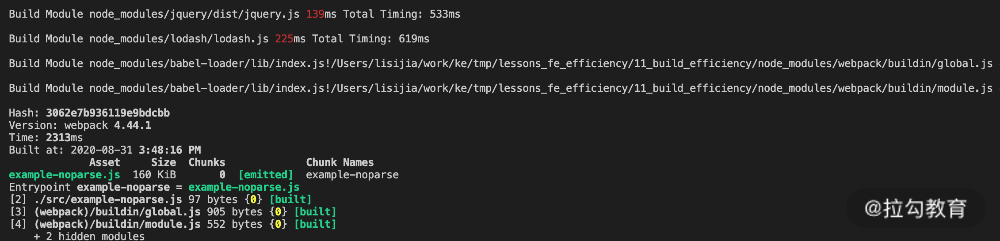

本文是笔者笔记，原文[传送门](https://kaiwu.lagou.com/course/courseInfo.htm?courseId=416#/detail/pc?id=4425)。

说到提速，那首先我们应该想到耗时。对于 webpack 中的两个核心—— Compiler 和 Compilation 工作流程，最耗时的阶段分别是哪个。

对于 Compiler 实例而言，耗时最长的显然是生成编译过程实例后的 make 阶段，在这个阶段里，会执行模块编译到优化的完整过程。

而对于 Compilation 实例的工作流程来说，不同的项目和配置各有不同，但总体而言，编译模块和后续优化阶段的生成产物并压缩代码的过程都是比较耗时的。

那么不同项目的构建，在整个流程的前期初始化阶段和最后的产物生成阶段的构建时间区别不大。真正影响整个构建效率的还是 Compilation 实例的处理过程，这一过程又可以分为两个阶段：**编译模块和优化处理**。

[[toc]]

#### 优化前的准备工作

1. **准备基于时间的分析工具**：我们需要一类插件，来帮助我们统计项目构建过程中在编译阶段的耗时情况。例如[speed-measure-webpack-plugin](https://github.com/stephencookdev/speed-measure-webpack-plugin)。
2. **准备基于产物内容的分析工具**：从产物内容着手分析是另一个可行的方式，因为从中我们可以找到对产物包体积影响最大的包的构成，从而找到那些冗余的、可以被优化的依赖项。通常，减少这些冗余的依赖包模块，不仅能减小最后的包体积大小，也能提升构建模块时的效率。通常使用 [webpack-bundle-analyzer](https://www.npmjs.com/package/webpack-bundle-analyzer) 分析产物内容。

在准备好相应的分析工具后，接下来，就开始分析编译阶段的具体提效方向。编译模块阶段所耗的时间是从单个入口点开始，编译每个模块的时间的总和。要提升这一阶段的构建效率，大致可以分为三个方法：

1. 减少执行编译的模块；
2. 提升单个模块的构建速度；
3. 并行构建以提升总体效率。

## 减少执行构建的模块

提升编译模块阶段效率的第一个方向就是减少执行编译的模块。显而易见，如果一个项目每次构建都需要编译 1000 个模块，但是通过分析后发现其中有 500 个不需要编译，显而易见，经过优化后，构建效率可以大幅提升。当然，前提是找到原本不需要进行构建的模块。

### IgnorePlugin

有的依赖包，除了项目所需的模块内容外，还会附带一些多余的模块。典型的例子是 moment 这个包，一般情况下在构建时会自动引入其 locale 目录下的多国语言包。


但对于大多数情况而言，项目中只需要引入本国语言包即可。而 Webpack 提供的 IgnorePlugin 即可在构建模块时直接剔除那些需要被排除的模块，从而提升构建模块的速度，并减少产物体积。

```js
// webpack.config.js
module.exports = {
    ...
    plugins: [
        new webpack.IgnorePlugin({
            resourceRegExp: /^\.\/locale$/,
            contextRegExp: /moment$/
        })
    ]
    ...
}
```

### 按需引入类库模块

第二种典型的减少执行模块的方式就是按需引入了。这种方式一般适用于工具类库性质的依赖包的优化，比如`lodash`。通常我们在项目中只用到了几个`lodash` 的方法，但是构建时却发现引入了整个依赖包。

要解决这个问题，效果最佳的方式就是在导入声明时只导入用到的模块，这样就可以在构建时减少构建时间，以及产物的体积。

当然，除了上述方式，还能使用 `babel-plugin-lodash` 或 `babel-plugin-import` 等插件达到相同的效果。

其实 `Tree Shaking` 也能实现减少产物包体积的效果，但是有两点需要注意：

1. Tree Shaking 需要这些依赖包使用 ES6 模块化。而类似于 `lodash` 是基于 CommonJS，需要替换为 lodash-es 才能生效。
2. 相应的操作是在优化阶段进行的，换句话说，Tree Shaking 并不能减少模块编译阶段的构建时间。

### DllPlugin

DllPlugin 也是一种减少构建模块的方式。它的核心思想是**将项目依赖的框架等模块单独打包，与普通的构建流程区分开来**。


而在使用了 DllPlugin 和 DllReferencePlugin 分别配置后的构建时间就变成了如下图所示：


由于构建时减少了最耗时的模块，构建效率瞬间提升了十倍。

### Externals

webpack 配置中的 externals 和 DllPlugin 解决的是同一类问题：将项目中的依赖框架等模块从构建过程中移除。它们的区别在于：

1. 在配置方面，externals 更简单，而 DllPlugin 需要独立的配置文件；
2. DllPlugin 包含了依赖包的独立构建流程，而 externals 配置中不包含依赖框架的生产方式，通常是使用已传入 CDN 的依赖包。
3. externals 配置的依赖包需要单独指定其加载方式：全局对象、CommonJS、AMD等。
4. 在引入依赖包的子模块时，DllPlugin 无需更改，但是 externals 会将子模块打入项目包中。

## 提升单个模块构建的速度

提升编译阶段效率的第二个方法，就是在保持构建模块数量不变的情况下，提升单个模块构建的速度。

具体来说，就是通过减少构建单个模块时的一些优化处理来提升速度。主要有以下几种优化方式：

### include/exclude

webpack 加载器中的 include/exclude，是常用的优化特定模块构建速度的方式之一。

include 的用途是只对符合条件的模块使用指定 loader 进行转换处理。而 exclude 则刚好相反，不对特定的模块使用该 loader （例如不使用 babel-loader 处理 node_modules 中的模块）。


这里有两点需要注意：

1.  从第二张图可以看出，jQuery 和 lodash 的编译过程仍然花了数百毫秒，说明通过 include/exclude 排除的模块，并非不需要编译，而是使用 webpack 默认的JS模块编译器进行编译。
2. 在一个 loader 中的 include 和 exclude 配置存在冲突的情况下，优先使用 exclude 的配置，而忽略冲突的 include 部分的配置。

#### noParse

webpack 配置中的 module.noParse 则是在上述 include/exclude 的基础上，进一步省略了使用默认JS模块编译器进行编译的时间。




### Source Map

对于生产环境的代码构建而言，会根据项目实际情况判断是否开启 Source Map。在开启 Source Map 的情况下，优先选择与源文件分离的类型，例如 "source-map"。有条件也可以配合错误监控系统，将 Source Map 的构建和使用在线下监控后台中进行，以提升普通构建部署流程的速度。

### TypeScript

Webpack 中编译 TS 有两种方式：使用 ts-loader 或使用 babel-loader。其中，在使用 ts-loader 时，由于 ts-loader 默认在编译前进行类型检查，因此编译时间往往比较慢。

通过加上配置项 transpileOnly: true，可以在编译时忽略类型检查，从而大大提升 TS 模块的编译速度。

而 babel-loader 则需要单独安装 @babel/preset-typescript 来支持编译 TS（Babel 7 之前的版本则还是需要使用 ts-loader）。babel-loader 的编译效率与上述 ts-loader 优化后的效率相当。

不过单独使用这一功能就丧失了 TS 中重要的类型检查功能，因此在许多脚手架中往往配合 ForkTsCheckerWebpackPlugin 一同使用。

### Resolve

webpack 中的 resolve 配置制定的是在构建时指定查找模块文件的规则：

- **resolve.modules**：指定查找模块的目录范围。
- **resolve.extensions**：指定查找模块的文件类型范围。
- **resolve.mainFields**：指定查找模块的 package.json 中主文件的属性名。
- **resolve.symlinks**：指定在查找模块时是否处理软连接。

这些规则在处理每个模块时都会有所应用，因此尽管对小型项目的构建速度来说影响不大，但对于大型的模块众多的项目而言，这些配置的变化就可能产生客观的构建时长区别。

## 并行构建以提升总体效率

第三个编译阶段提效的方向是使用并行的方式来提升构建的效率。并行构建的方案早在 Webpack 2 时代已经出现，随着目前最新稳定版本 Webpack 4 的发布，人们发现在一般项目的开发阶段和小型项目的各构建流程中已经用不到这种并发的思路了，因为在这些情况下，并发所需要的多进程管理与通信所带来的额外时间成本可能会超过使用工具带来的收益。但是在大中型项目的生产环境构建时，这类工具仍有发挥作用的空间。这里我们介绍两类并行构建的工具： HappyPack 与 thread-loader，以及 parallel-webpack。

### HappyPack 与 thread-loader

这两种工具的本质作用相同，都作用于模块编译的 Loader 上，用于在特定 Loader 的编译过程中，以开启多进程的方式加速编译。HappyPack 诞生较早，而 thread-loader 参照它的效果实现了更符合 Webpack 中 Loader 的编写方式。

### parallel-webpack

并发构建的第二种场景是针对与多配置构建。Webpack 的配置文件可以是一个包含多个子配置对象的数组，在执行这类多配置构建时，默认串行执行，而通过 parallel-webpack，就能实现相关配置的并行处理。