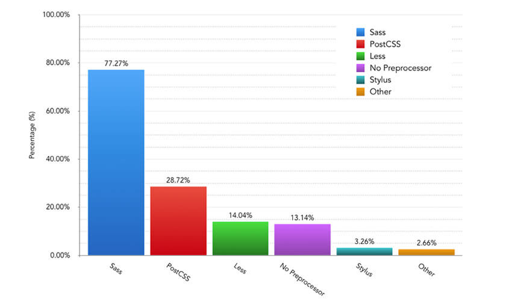
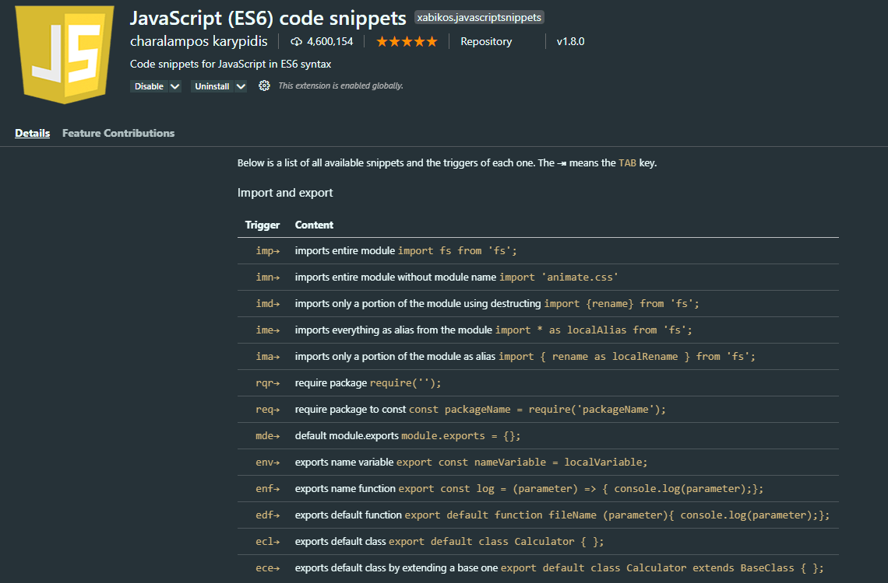
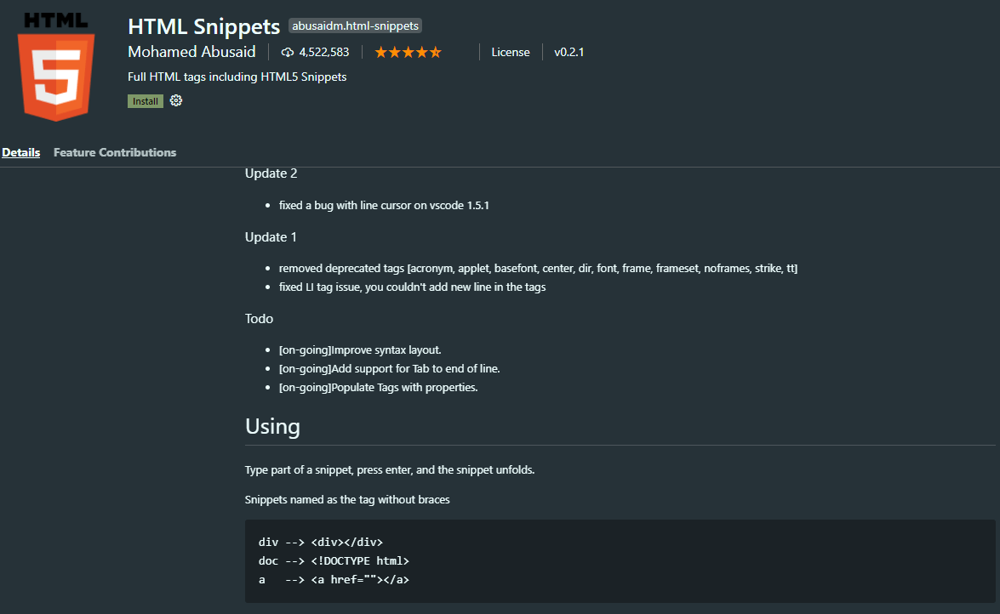

本文是笔者笔记，[原文链接](https://kaiwu.lagou.com/course/courseInfo.htm?courseId=416#/detail/pc?id=4419)

以最终实现相同代码产出为目标，开发时提高编码效率的方式大致可以分为两种：

1. 使用**预处理语言**：相对原语言而言，预处理语言通常抽象程度更高，提供更多封装好的工具方法，更有利于提高编码效率。可以通过对应的预处理器将预处理语言在编译时转换为更完整的普通语法代码（如 sass 到 css）.
2. 通过**代码生成**（例如IDE的自动完成）：以达到编写时自动生成代码的作用，因为无法在编译时进行额外处理。

## 使用预处理语言和预处理器

预处理语言指的是在原有语言的基础上，提供更多新的内置功能及精简语法，以便提高代码复用性和书写效率。

### Sass/Less/Stylus

Sass（2006），Less（2009）和 Stylus（2010） 是三种目前主流的 CSS 预处理语言，那么我们在创建新项目时可能不知道该选择哪一种，下面是一个比较，可以作为选择使用的依据：

1. react-scripts 中集成了sass-loader，而 vue-cli-service 则同时支持这三种预处理器。

2. 几个主流的 UI 库的使用情况是：Bootstrap4、Antd 和 iView 使用 Less，ElementUI 使用 Sass。

3. 下图是 2019年前端工具调查，即使用人数最多的是 Sass、 其次是 Less、最后是 Stylus。

   | **Preprocessor**    | **Number of Votes** | **Percentage** | **% Diff (to 2018)** |
   | ------------------- | ------------------- | -------------- | -------------------- |
   | **Sass**            | 2322                | 77.27%         | +11.88%              |
   | **PostCSS**         | 863                 | 28.72%         | +20.06%              |
   | **Less**            | 422                 | 14.04%         | +7.52%               |
   | **No Preprocessor** | 395                 | 13.14%         | -1.44%               |
   | **Stylus**          | 98                  | 3.26%          | +1.08%               |
   | **Other**           | 80                  | 2.66%          | -0.01%               |

   

   

在**实现功能**方面：

- 共同点：都实现了变量（Variables）、嵌套（Nesting）、混合（Mixins）、运算（Operators）、父选择器引用（Parent Reference）、扩展（Extend）和大量内建函数（Build-in Functions）。
- 不同点：Less缺少自定义函数的功能（可以使用Mixins 结合 Guard 实现类似效果），而 Stylus 提供了超过60个内建函数，更有利于编写复杂的计算函数。

在**语法方面**：

- Sass：支持 .scss 和 .sass
  - .scss 在语法上更接近css
  - .sass 在语法上做了简化，去掉了 css 规则的括号分号等（增加对应标识符会导致报错）
- Less：语法上整体更接近 .scss
- Stylus：同时支持精简语法和普通CSS语法

示例吐下：

```scss
//scss
$red: '#900';
div {
  color: $red;
}

//sass
$red: '#900'
div
  color: $red

//less
@green: '#090';
div {
  color: @green;
}

//stylus
$blue = '#009'
div
  color: $blue
```

从**安装使用**来看：

- Sass
  - 基于 LibSass 的 node-sass
  - 基于 dart-sass 的 Sass。官方推荐 dart-sass，它不仅在安装速度上更快，而且支持更多 Sass 内置特性，且支持 Yarn 的 PnP 功能。
- 如果使用 Webpack 构建，三种语言对应的预处理器分别是 sass-loader、less-loader、stylus-loader。需要注意的是 sass-loader 和 stylus-loader 安装时都需要同时安装独立编译包 Sass / node-sass 和 Stylus，而 less-loader 则不强制要求。

## Pug

对于 HTML 模板的预处理语言选择而言，目前主流的还是[Pug](https://pugjs.org/api/getting-started.html)（这里考虑的是预处理语言对于效率的提升，因此一些纯模板语言，如**EJS**，则不在讨论范围内。此外，基于其他技术栈的模板语言，例如 Ruby 的**Haml**和**Slim**，在前端工程化中的应用也并不多，因此也不在这里讨论）。

Pug的前身叫 **Jade**(2010)，2016年时因为和同名软件商标冲突而改名为 Pug。示例如下：

```html
//pug
html
  head
  body
    p.foo Hello World

//html
<html><head></head><body><p class="foo">Hello World</p></body></html>
```

在功能方面，除了简化标签书写外，还支持迭代（Iteration）、条件（Condition）、扩展（Extend）、包含（Include）、混合（Mixins）等逻辑功能。

在 Vue 开发中，Vue 文件的 template 支持添加 lang="pug"，相应的在 vue-cli-service 的 Webpack 配置中，内置了 pug-loader 作为预处理器。而在 React 中，则可以通过 babel 插件获得支持。

## 使用代码生成工具

当然除了上面介绍的预处理语言进行开发外，我们也可以使用 IDE 的相关预设功能来帮助生成代码。这些功能主要包括：

- 智能帮助
- Snippet
- Emmet

### Snippet

**Snippet** 是指开发过程中用户在 IDE 内使用的可复用代码片段，大部分主流的 IDE 中都包含了 Snippet 的功能，就像使用脚手架模板生成一个项目的基础代码那样，开发者可以在 IDE 中通过安装扩展来使用预设的片段，也可以自定义代码片段，并在之后的开发中使用它们。

以 VS Code 为例，在扩展商店中搜索 Snippet 可以找到各种语言的代码片段包。如下图中所示：





除了使用扩展包自带的预设片段外，IDE 还提供了用户自定义代码片段的功能。以 VS Code 为例，通过选择菜单中的 "Code-首选项-用户片段"，即可弹出选择或新增代码片段的弹窗，选择或创建对应 .code-snippets 文件后即可编辑自定义的片段。

如下为创建一个简单的生成 TypeScript 接口代码的片段，保存后在项目代码里输入 tif 后再按回车，就能看到对应生成的代码了：

```json
// sample.code-snippets
{
    "Typescript Interface": {  // 片段名称，下面描述不存在时显示在 IDE 智能提示中
        "scope": "typescript",  // 语言的作用域，不填写时默认对所有文件有效
        "prefix": "tif",        // 触发片段的输入前缀字符（输入第一个字符时即开始匹配）
        "body": [  // 片段内容
            "interface ${1:IFName} {",  // $1,$2..为片段生成后光标位置，通过tab切换
            "\t${2:key}: ${3:value}",  // ${n:xx} 的 xx 为占位文本
            "}"
        ],
        "description": "output typescript interface"  // 描述，显示在智能提示中
    }
}

// 任意 .ts 文件中输入 tif+ 回车后即可生成下面的代码，同时光标停留在 IFName 处
interface IFName {
    key: value
}
```

通过上面演示的自定义功能，我们就可以编写自身开发常用的个性预设片段了。相比使用第三方预设，自定义的预设更灵活也更便于记忆。两者相结合，能够大大提升我们编码的效率。同时，针对实际业务场景定制的自定义片段文件，也可以在团队内共享和共同维护，以提升团队整体的效率。

### Emmet

[Emmet](https://emmet.io/)（前身为 Zen Coding）是一个面向各种编辑器（几乎所有你见过的前端代码编辑器都支持该插件）的 Web 开发插件，用于高速编写和编辑结构化的代码，例如 Html 、 Xml 、 CSS 等。从下面官方的示例图中可以看到，简单的输入 ! 或 html:5 再输入 tab 键，编辑器中就会自动生成完整的 html5 基本标签结构（完整的缩写规则列表可在[官方配置](https://github.com/emmetio/emmet/tree/master/snippets)中查找）：


它的主要功能包括：

- 缩写代码块：

  - 支持子节点(>)、兄弟节点（+）、父节点（^）、重复（*）、分组等节点关系运算符。

  - 支持 id 、 class、序号 $ 和其他用 [] 表示的自定义属性。

  - 支持用 {} 表示的内容文本。

  - 支持在不带标签名称时根据父节点标签自动推断子节点。

    ```html
    #main>h1#header+ol>.item-$${List Item$}*3^footer
    
    //转换为
    <div id="main">
      <h1 id="header"></h1>
      <ol>
        <li class="item-01">List Item1</li>
        <li class="item-02">List Item2</li>
        <li class="item-03">List Item3</li>
      </ol>
      <footer></footer>
    </div>
    ```

- CSS 缩写：支持常用属性和值的联合缩写，如下：

  ```css
  m10 => margin:10px
  p100p => padding: 100%；
  bdrs1e => border-radius: 1em;
  ```

- 自定义片段：Emmet 也允许使用用户自定义的缩写规则。以 VS Code 为例，首先修改设定中 emmet.extensionsPath 字段，指向包含自定义规则 snippets.json 文件的目录，然后在对应文件中增加 Emmet 规则即可（保存规则文件后需要 reload 编辑器才能使规则生效）。例如，在下面的示例中分别为 html 和 css 增加了 dltd 和 wsnp 缩写规则：

  ```json
  {
    "html": {
      "snippets": {
        "dltd": "dl>(dt+dd)*2"
      }
    },
    "css": {
      "snippets":{
        "wsnp": "white-space: no-wrap"
      }
    }
  }
  ```

在介绍完上面的两类工具的基本信息和一般使用方法后，接下来我们再按照前端开发过程中的基本语言类型来讨论下不同语言的工具选择建议。

## Html

Html 语言在如今组件化的前端项目中是作为一个组件的模板存在的。而编写组件模板与纯 Html 的区别在于，组件模板中通常已经由框架提供了**数据注入**（Interpolation）以及循环、条件等语法，组件化本身也解决了包含、混入等代码复用的问题。因此，在使用提效工具时，我们用到的主要还是简化标签书写的功能，而不太涉及工具本身提供的上述逻辑功能（混用逻辑功能可能反而导致代码的混乱和调试的困难）。当然，简化标签书写既可以选择使用 Pug 语言，也可以使用 Emmet。

使用 Pug 的好处主要在于，对于习惯书写带缩进的 html 标签的同学而言**上手更快**，迁移成本低，且整体上阅读体验会更好一些。

而 Emmet 则相反，取消缩进后作为替代需要通过关系标识符来作为连接，书写习惯上**迁移成本略高**一些，且由于是即时转换，转后代码的阅读体验与 Html 没有区别。相对而言，由于可以自定义 Snippet 来使用常用缩写，因此使用熟练后实际效率提升会更明显一些。

## CSS

毫无疑问，改进 CSS 书写效率就不会出现预处理语言和 Emmet 二选一的情况了：

- 对于项目中需要大量书写 CSS 的情况来说，使用预处理语言赋予的更强的代码抽象和组织能力，同时结合 Emmet 提供的属性缩写功能，能够大大提升整体 CSS 开发的效率。
- 另一方面，如果项目中主要使用 UI 组件库来呈现界面（例如大部分的中后台系统），而只需要少量编写自定义样式的话，使用 Emmet 的优先级更高。
- CSS 预处理语言的选择上，由于主要功能的相似性，团队统一选择其一即可。

## JavaScript/TypeScript

JS/TS 的开发过程是非结构化的，通常 IDE 自带的一系列智能帮助功能一般情况下就足以提供良好的开发体验。这里可以用到的提效工具主要还是使用 Snippet，第三方扩展提供的常用语句的缩写，结合开发者自定义的常用片段（例如一个特定类型的模块初始化片段等），可以成为我们开发的瑞士军刀，再次提升编码效率。