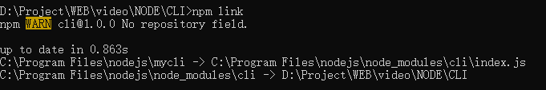
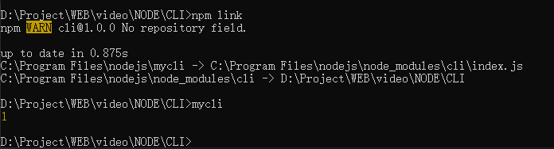
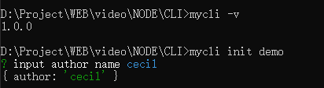

今天的问题链有三：

- 如何利用 Node 操作命令行
- 脚手架工具常用的包有哪些
- 如何自己实现一个 vue-cli

## 如何利用 node 操作命令行

问题：

> 我们运行 npm run build 执行了什么？

其实我们在 `package.json` 文件里可以看到这几行代码：

```json
"scripts": {
  "dev": "webpack dev server",
  "start": "npm run dev",
  "build": "node build/build.js"
}
```

也就是说，执行命令的时候，在电脑上使用 node 执行了 build 目录下的 build.js 而已。

我们来看一个 build.js 文件：

```js
'use strict'
require('./check-versions')()

process.env.NODE_ENV = 'production'

// 一个打包进度条，提示正在打包中
const ora = require('ora');
// nodejs 不能直接读取或者删除一个文件夹，这个库是帮助我们删除文件夹的
const rm = require('rimraf')
// node 内置的路径处理模块
const path = require('path')
// 在命令行中显示字体颜色的模块
const chalk = require('chalk')
const webpack = require('webpack')
const config = require('./config')
const webpackConfig = require('./webpack.prod.conf')

// 开启进度条
const spinner = ora('building for production...')
spinner.start()

// 实际这行代码意思就是会先删除掉 dist 目录
rm(path.join(config.build.assetsRoot, config.build.assetsSubDirectory), err => {
  if (err) throw err
  // webpack 本质就是一个方法，在命令行执行和在代码中调用 webpack 方法本质是一样的
  webpack(webpackConfig, (err, stats) => {
    // 关闭进度条
    spinner.stop()
    // 有错误抛出
    if (err) throw err
    // 以下都是往线程中写了一堆的消息
    process.stdout.write(stats.toString({
      colors: true,
      modules: false,
      children: false, // 
      chunks: false,
      chunkModules: false
    }) + '\n\n')
    
    if (stats.hasErrors()) {
      console.log(chalk.red('Build failed with errors.\n'))
      process.exit(1)
    }
    
    console.log(chalk.cyan('Build complete.\n'))
    console.log(chalk.yellow(
    	'Tip: built files are meant to be served over an HTTP server.\n' +
      'Opening index.html ober file:// won\'t work.\n'
    ))
  })
})
```

那有了这个之后，我们还可以在这个基础上去添加拓展一些其他功能，比如再添加一些其他信息，或者使用 dll 优化等等。

> dll 先打包第三方库的文件，然后再打包项目本身

::: tip 小知识

在命令行直接输入 webpack 和在 package.json 中定义一个脚本命令执行 webpack 有什么不同？

1. 在命令行直接输入 webpack 是使用全局的 webpack 来打包的。
2. 而在 package.json 中则是利用项目本身的 webpack 来进行打包的。

:::

## 脚手架工具常用的包有哪些

那除了上述我们说到的包之外，还有一些其他也常用的包：

- commander - 定义命令，解析命令[文档](https://github.com/tj/commander.js/blob/HEAD/Readme_zh-CN.md#%e5%ae%89%e8%a3%85)

  ::: tip

  安装：`npm install commander`

  页面中使用：

  ```js
  const commander  = require("commander");
  // 定义版本号
  commander.version('1.0.0', '-v --version');
  // 定义指令
  commander.command('init <name>').action(() => {
    // 命令回调，输入命令后，需要做的事情
  
  });
  // 自定义执行
  commander.option('-h', 'cecil`s cli');
  ```

  :::

- inquirer - 做出交互，如提问

- Chalk - 命令行输出有色字体[文档](https://github.com/chalk/chalk#readme)

  ::: tip

  安装：`npm i chalk`

  这个库并不能直接在控制要输出，只是还是结合 `console.log` 来改变文字的颜色或者背景。

  文件中使用：

  ```js
  // 输出字体库
  const chalk = require("chalk");
  // 改变字体的颜色
  console.log(chalk.red.bgBlue('来看看chalk'));
  // 当然我们也可以使用自定义的方法，使用 rgb 和 bgRgb 来设置颜色
  console.log(chalk.rgb(212,99,23).bgRgb(33,44,66)('自定义的颜色'));
  // 我们也可以将其和 ora 来结合起来使用
  const spinner = ora(chalk.rgb(212,99,23).bgRgb(33,44,66)('转起来！')).start();
  ```

  :::

- Ora - loading 效果，图标[文档](https://github.com/sindresorhus/ora#readme)

  ::: tip

  安装：`npm install ora`

  文件中使用：

  ```js
  // loading 库
  const ora  = require("ora");
  // 开始在控制台 loading
  const spinner = ora('加油！').start();
  // 改变转动圆圈的颜色
  spinner.color = 'yellow';
  // 我们可以设置其在两秒之后终止
  setTimeout(() => {
    spinner.stop();
  }, 2000);
  ```

  :::

## 如何自己实现一个 vue-cli

### Vue-cli 属于什么工具？

它是一个项目脚手架，它的作用：

- 下载项目初始化模板
- 定义项目规则
- 定义项目操作命令

### 一个脚手架的工作流程

输入初始化命令 --》 执行交互的 js --》与用户交互 --》根据用户指令下载模板 --> 模板下载成功

- 输入初始化命令之后，当在命令行输入命令的时候，就会去执行一段 JS，这就跟在项目文件里用 node 执行 js 文件是一样的。在执行的过程中，会运用到一些前面说的依赖包，用这些包提供的 API 来跟用户进行交互。然后根据用户指令去下载对应的模板到本地。

那么我们要在哪里去定义 CLI 命令？比如 webpack 命令和 vue 命令这种？

在 package.json 当中，要定义脚手架的命令的话，我们在里面再加一个 bin 的配置项，如下：

```json
{
  "bin": {
    // 定义命令名称：要执行的文件
    "my-cli": "./index.js"
  }
}
```

定义好之后呢，我们在命令行还要再执行一个命令：

```shell
npm link
```

什么作用呢？它可以将咱们的自定义命令连接到本地的命令集中，这样我们在执行 `mycli` 的时候才不会报错。

> npm link 在执行的时候可能会报错，多执行几次即可。而如果我们将项目发布到 npm 上，并全局安装就可以不使用 npm link 来连接本地命令集了。

成功之后，如图：



然后在命令行执行 `mycli` 就不会出现找不到命令的错误信息了。

前面我们说过执行命令，其实就是执行 `index.js`，那让我们再次回到 `index.js` 中去。

我们可以在 `index.js` 中打一个日志，看看在命令行会输出什么？

```js
// index.js
console.log(1);
```

结果发现，执行命令后，并没有任何反应，且会报错。这是因为在电脑本身来说，是不会执行 JavaScript 的，所以这里我们需要先告诉电脑，我们需要在什么环境下去执行 JavaScript——Node。

```js
#!/usr/bin/env node
// 上面一句代码表示告诉电脑，自己去查找 node 所在的路径，然后用 node 来执行下面代码。
console.log(1);
```

> 第一行代码并不是指某个目录，而是告诉电脑，让它去查 node 的路径

写完之后，我们再重新 `npm link` 一下，并在之后再次执行 `mycli`，会在命令行看到打印出来的 1.



那接下来，就是交互了，提问用户需不需要一些安装依赖、单元测试或是代码检查等等。

```js
#!/usr/bin/env node

// 给用户提供指令
const commander = require('commander');
// 给用户提问
const inquirer = require('inquirer');

// 定义版本
commander.version('1.0.0', "-v --version");

// name 可以在 action 中接收到
commander.command('init <name>').action(name => {
  // 开始提问，可以提问多个问题，所以是一个数组
  // 提问的对象里有三个重要的属性
  // 1. type: input => 随意输入的提  radio => 单选
  // 2. name 定义问题的 key
  // 3. message: 提问的内容
  // 提问完之后返回一个 promise，接收到用户的回答
  inquirer.prompt([
    {
      type: 'input',
      name: 'author',
      message: 'input author name'
    }
  ]).then((answer) => {
    console.log(answer);
  })
})

// 定义完之后，必须调用 commander 的 parse 方法来接收命令
// process.argv 当前命令的额外输入
commander.parse(process.argv)
```

完成之后，再重新 npm link 一下，并输入咱们定义好的指令：



OK，此时前三项已经完成了，接下来就是下载模板。

那么下载模板有两种方式：

1. 和脚手架放在一起
2. 将模板放在 git 上

我们来看看第一种方式，直接跟脚手架放在一起，然后用 node 的文件模块将模板读取出来，然后再写到用户指定的路径上。

我们新建一个 bin 目录，用来做用户输入指令后要进行的操作：

```js
// ./bin/inedx.js

// node 不能读取整个文件夹
// 怎么做？—— 数据驱动思维：将要做的效果，转成一种数据结构，然后通过操作数据来实现
const fs = require('fs');
const ora = require('ora');
const chalk = require('chalk');

// 接收到传来的用户指令后，通过 node 来进行模板的读写
// fs.readdir API 读取到文件夹下有哪些东西，不能读取整个文件夹
// 这里我们先判断是文件还是文件夹，然后再串联成一组数据
/**
   * 比如说一个二维数组
   * [
   *  ['dir', './src'],
   *  ['files', './app.js'],
   *  ['dir', './src/route']
   * ]
   */

const demoPath = './project';
function cli(name) {
  const spinner = ora(chalk.rgb(212,99,23).bgRgb(33,44,66)('下载中...'));
  
  fs.mkdir('./' + name, function() {
    const arr = makeArr();
    down(arr, name, spinner);
  })
}

// 生成数组方法
function makeArr() {
  const arr = [];
  const newArr = read(arr, demoPath);
  return newArr;
}

// 读取方法
function read(arr, path) {
  // readdirSync 是同步读取 readdir 是异步读取
  const files = fs.readdirSync(path);
  // files => ['./src', './app.js']
  files.forEach(item => {
    // 拿到当前每一项的完整路径
    const currentPath = path + '/' + item;
    // 拿到路径后检查状态
    const stat = fs.statSync(currentPath);
    
    // 根据类型放入不同的数组
    if (stat.isDirectory()) {
      arr.push(['dir', currentPath]);
      // 如果是一个目录，我们需要递归调用此方法本身
      read(arr, currentPath)
    } else {
      arr.push(['file', currentPath])
    }
  })
  return arr;
}

// 生成下载方法
function down(arr, name, spinner) {
  const targetPath = './' + name; // 下载的目标目录
  
  // 开启循环
  while(arr.length > 0) {
    const item = arr.shift();
    const path = targetPath + '/' + item[1].replace('./project', '.')
    if (item[0] === 'file') {
      const data = fs.readFileSync(item[1]);
      fs.writeFileSync(path, data);
    } else {
      fs.mkdirSync(path);
    }
  }
  finish(spinner);
}

// 完成退出
function finish(spinner) {
  spinner.stop();
  console.log(chalk.green('下载完成'))
}

module.exports = cli;
```

然后再次执行命令，并输入一个要 copy 的文件目录后，就会在当前目录下载好模板。

> 如果是放在 Git 上就不用这么辛苦，可以使用 down-git-repo

## 前端工程化包含哪些内容

- 命令行工具
- 构建（webpack）
- 规范（代码规范--eslint，项目约定--目录结构）
- 集成与部署（CI/CD，部署，Docker）
- 测试（单元测试，e2e）
- 代码管理（git）

> 如果要做一个项目 Leader，那这六个环节务必要精通。

