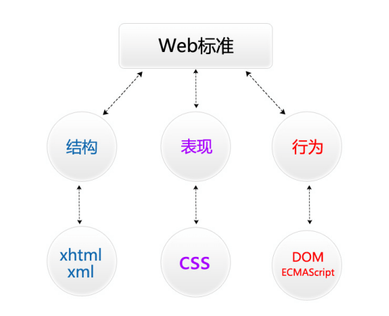

### 一、web标准的概念及组成



### 二、W3C制定的结构和表现的标准;

- **结构**：(xhtml ,xml)

- **表现**：(css)

ECMA制定的行为的标准;

- **行为：**（DOM ,ECMASCRIPT）

- 结构和表现标准：
  - （1）W3C( World Wide Web Consortium )万维网联盟，创建于1994年是Web技术领域最具权威和影响力的国际中立性技术标准机构。(制定了结构和表现的标准，非赢利性的。)
  - （2）行为标准：DOM，ECMASCRIPT（ECMA制定的）欧洲电脑场商联合会。

### 调试工具 -浏览器

1）PC端调试工具的使用 -浏览器

  > 测试浏览器(**chrome**, **ie**, **firefox**)

2）移动端调试工具chrome可以测试移动端页面（有很多模拟器）

### 三、HTML及相关概念的介绍

 **HTML** **指的是超文本标记言** (Hyper Text Markup Language)

 **XHTML指可扩展超文本标记语言**（标识语言）（EXtensible HyperText Markup Language）。

 **HTML5指的是HTML的第五次重大修改**（第5个版本）

> (HTML5 是 W3C 与 WHATWG 合作的结果)
>
> WHATWG网页超文本应用技术工作小组是一个以推动网络HTML 5 标准为目的而成立的组织。在2004年，由Opera、Mozilla基金会和苹果这些浏览器厂商组成。

 

## HTML5 **基本结构** （新建一个html文件时默认有那些代码）

1. 文档声明**\<!DOCTYPE html>**

   作用：告知浏览器网页使用哪种 html 或 xhtml 规范

   h5 文档声明：

   1. \<!doctypy html>
   2. \<!DOCTYPE HTML>
   3. \<!DOCTYPE html>

2. 网页的根标签或根元素是`html`，所有网页的内容和标签都放在`html`之间。

3. html 包含两大部分：**head** 和 **body**

   1. head 部分：主要用来设置一些 **meta** 头元素信息，如关键词描述，字符编码，引入一些外部文件（css和js文件），设置网页标题。 head 部分设置的内容不会显示到浏览器中。
   2. body 部分：所有要在浏览器中显示的网页内容及包含网页内容的标签都要放在body部分

```html
<!--命名文档类型-->
<!DOCTYPE html>
<!--说明我们写的是标记语言-->
<html></html>
<!--文件头部-->
<head></head>
<!--文件标题（显示在状态栏上的内容）-->
<title></title>
<!--编码格式-->
<meta charset="utf-8" />
<!--文件主体(所有要写的内容)-->
<body></body>
```

### **文件命名规则：用英文，不用中文**

> 名称全部用小写英文字母、数字、下划线的组合，其中不得包含汉字、空格和特殊字符；必须以英文字母开头。

###  **HTML基本语法**

1. 常规标记

```html
<标记  属性=“属性值”  属性=“属性值” ></标记>
```

2. 空标记

```html
<标记 属性=“属性值”  />
```

**说明：**

> 1. 写在<>中的第一个单词叫做标记，标签，元素。
> 2. 标记和属性用空格隔开，属性和属性值用等号连接，属性值必须放在“”号内。
> 3. 一个标记可以没有属性也可以有多个属性，属性和属性之间不分先后顺序。
> 4. 空标记没有结束标签，用“/”代替。

### **XHTML常用标记**

1.  文本标题（**h1-h6**）

```html
<h1>一级标题</h1>
<h2>二级标题</h2>
...
<h6>六级标题</h6>
```

### **正文有两种形式（段落文本和文字列表）**

1. 段落(p)

```html
<p>段落文本内容</p>
```

> 标识一个段落(段落与段落之间有段间距)

2. 空格 

> （所占位置没有一个确定的值,这与当前字体字号都有关系）.

3. 换行(br)

```html
\<br />
```

> 换行是一个空标记(强制换行)

4. 加粗

   > 加粗有两个标记
   >
   > ​	1.\<**b**>加粗内容\</**b**>
   >
   > ​	2.\<**strong**>加粗内容\</**strong**>

5. 倾斜

   > 倾斜标记
   >
   > ​	1.\<em>\</em>
   >
   > ​	2.\<i>\</i>

6. 水平线

```html
<hr />
```

7. 列表(ul,ol,dl)

   ​	HTML中有三种列表，分别是：**无序列表**，**有序列表**，**自定义列表**

   ​	* 无序列表

   ​	无序列表组成：

```html
<ul>
  <li></li>
  <li></li>
  <li></li>
．．．．．．
</ul>
```

​		*有序列表

​		有序列表组成：

```html
<ol>
  <li></li>
  <li></li>
  <li></li>
  ．．．．．．
</ol>
```

​		*自定义列表

```html
<dl>
 <dt>名词</dt>
 <dd>解释</dd>
  ．．．．．．
</dl>
```

8. 插入图片

```html
\
```

> **注:所要插入的的图片必须放在站点下**

> ​	**title的作用**: 在你鼠标悬停在该图片上时显示一个小提示，鼠标离开就没有了，HTML的绝大多数标签都支持title属性，title属性就是专门做提示信息的
>
> ​	**alt的作用**:alt属性是在你的图片因为某种原因不能加载时在页面显示的提示信息，它会直接输出在原本加载图片的地方。

**相对路径的写法：**

> 1. 当当前文件与目标文件在同一目录下，直接书写目标文件文件名+扩展名；
>
> 2. 当当前文件与目标文件所处的文件夹在同一目录下，写法如下：
>
>    文件夹名/目标文件全称+扩展名；
>
> 3. 当当前文件所处的文件夹和目标文件所处的文件夹在同一目录下，写法如下：
>
>    ../目标文件所处文件夹名/目标文件文件名+扩展名；	

9. 超链接的应用

语法：

```html
\<a href="目标文件路径及全称/连接地址" alt="替换文本" title="提示文本">链接文本/图片\</a>

\<a href="#">\</a><!-- 空链接  直接跳到网页顶部，刷新了页面 -->
```

> 属性：target:页面打开方式
>
> 属性值：**_blank** 新窗口打开
>
> 属性值：**_self** 本窗口打开

```html
\<a href="#"  target="_blank">新页面打开\</a>
```

10. 数据表格的作用及组成

:muscle:作用：显示数据

```html
<table width="value" height="value" border="value" bgcolor="value" cellspacing="value" cellpadding="value">
  <tr>
    <td></td>
    <td></td>
  </tr>
</table>
```

​	注：一个tr表示一行;一个td表示一列(一个单元格)

::: tip

​	**数据表格的相关属性**

​	1）width="表格的宽度"

​	2）height="表格的高度"

​	3）border="表格的边框"

​	4）bgcolor="表格的背景色"

​	5）cellspacing="单元格与单元格之间的间距"

​	6）cellpadding="单元格与内容之间的空隙"

​	7）对齐方式：align="left/center/right"; valign=”top/middle/bottom”;

​	8)合并单元格属性：

​	**colspan**=“所要合并的单元格的列数"合并列;

| 一行 |      |
| ---- | ---- |
| 一行 | 一行 |

​	**rowspan**=“所要合并单元格的行数”合并行;

| 一行 | 一行 |
| ---- | ---- |
| 一行 |      |

:::

11. 表单的应用

:muscle:表单的作用：用来收集用户的信息的;
1. 表单框

```html
<form name="表单名称" method="post/get"  action=""></form>

<!-- 文本框 -->
<input type="**text**" value="默认值"/>

<!-- 密码框 -->
<input type="password" />
<input type="password" placeholder="密码" />

<!-- 提交按钮 -->
<input type="submit" value="按钮内容" />

<!-- 重置按钮 -->
<input type="reset" value="按钮内容" />

<!-- 单选框/单选按钮 -->
<input type="radio" name="ral" />
<input type="radio" name="ral" />
<input type="radio" name="ral" checked="checked" />

<!-- 复选框 -->
<input  type="checkbox"  name="like" />
<input type="checkbox" name="like" disabled="disabled" /> 
<!-- (disabled="disabled" :禁用) -->
<!-- (checked="checked" :默认选中) -->

<!-- 下拉菜单 -->
<select name="">
	<option>菜单内容</option>
</select>

<!-- 多行文本框（文本域） -->
<textarea name="textareal" cols="字符宽度" rows="行数"></textarea>

<!-- 按钮 -->
<input  name="'"  type="button" value="按钮内容" />
<!-- 注：（button和submit的区别是 ，submit是提交按钮 起到提交信
息的作用，button只起到跳转的作用，不进行提交。） -->
```

12. div的用法

```html
<div id="id名" class="class名"></div>
```

> 文档区域，文档布局对象

13. span的用法

```html
<!-- 文本结点（某一小段文本，或是某一个字） -->
<span></span>
```

14. iframe框架

**iframe** 元素会创建包含另外一个文档的内联框架（即行内框架）

| key         | value                 | 备注                          |
| ----------- | --------------------- | ----------------------------- |
| height      | pixels<br />%         | 规定 firame的高度             |
| width       | pixels<br />%         | 规定 firame的宽度             |
| src         | URL                   | 规定 firame中显示的文档的URL  |
| frameborder | 1<br />0              | 规定是否显示框架周围的边框    |
| scrolling   | yes<br />no<br />auto | 规定是否在 iframe中显示滚动条 |

::: tip

html和xhtml的区别：

xhtml并没有增加任何新的标签，只是语法要求更加严格，例如：

1. 标签必须闭合
2. 标记名称必须小写

::: 

 

 

 

 

 

 

 

 

 