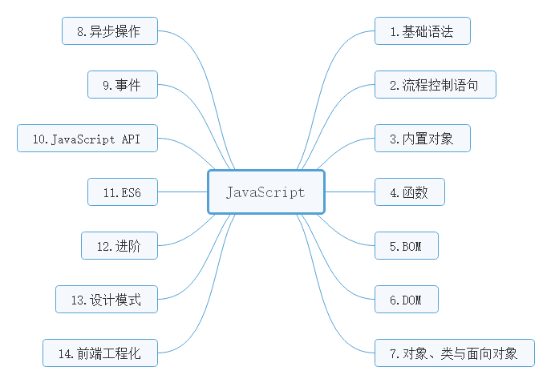

:question: **什么是JavaScript？**

  JavaScript 是一种基于对象和事件驱动的客户端脚本语言，最初的设计是为了检验HTML表单输入的正确性，起源于Netscape公司的LiveScript语言。

JavaScript与Java没有关系，只是为了赶上发布时间，网景把Livescript改名为JavaScript，以便搭上媒体当时热炒Java的顺风车。

:eye_speech_bubble: **JavaScript 的发展历史**（<a href="https://javascript.ruanyifeng.com/introduction/history.html" target="_blank">点击这里查看</a>）

**JavaScript的组成**

 完整的JavaScript是由以下三部分组成：

- ECMAScript（语法）
- BOM（浏览器对象类型）
-  DOM（文档对象类型）

**在 HTML 中使用JavaScript**

可以在 head 或 body 中使用 \<script> 嵌入 javascript 脚本。

JavaScript 是 Web 的编程语言。

所有现代的 HTML 页面都使用 JavaScript。

它是世界上最流行的脚本语言，在你的电脑、手机、平板上浏览的所有网页，以及无数基于H5的手机APP，交互逻辑都是由 JavaScript 驱动的。

JavaScript已被公认为主流的编程语言，能够实现复杂的计算与交互，包括闭包、匿名函数，甚至元编程等特性。

现在的JavaScript可以做手机APP，客户端软件，甚至是服务端。

Web浏览器只是ECMAScript实现可能存在的一种**宿主环境(host environment)**。宿主环境提供ECMAScript的基准实现和与环境自身交互必需的扩展。

它已然成为了一名全能型选手。
