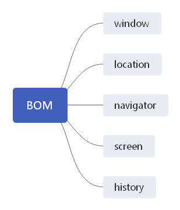

浏览器对象模型(BOM, Browser Object Model)，用于支持访问和操作浏览器的窗口，提供了与网页无关的浏览器功能对象。

虽然 ECMAScript 把 BOM 描述为 JavaScript 的核心，但实际上它是使用 JavaScript 开发 web 应用程序的核心。

BON真正独一无二的地方，就是它是唯一一个没有相关标准的JavaScript实现。

BOM的一些扩展：

- 弹出新浏览器窗口
- 移动、缩放和关闭浏览器窗口的能力
- window对象
- navigator对象，提供关于浏览器的详尽信息
- location对象，提供浏览器加载页面的详尽信息
- screen对象，提供关于用户屏幕分辨率的详尽信息
- performance对象，提供浏览器内存占用、导航行为和时间统计的详尽信息
- history对象

