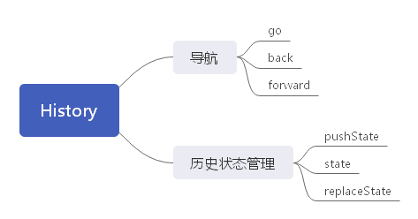

history 对象表示当前窗口首次使用以来用户的导航历史记录。这个对象不会暴露用户访问过的URL，但可以通过它在不知道实际 URL 的情况下前进和后退。



## 导航

### go

go() 方法可以在用户历史记录中沿任何方法导航，可以前进也可以后退。只接收一个参数，如果是一个整数，那么正值表示前进多少步，负值表示后退多少步。

```js
// 后退一页
history.go(-1)
// 前进一页
history.go(1)
// 前进两页
history.go(2)
```

也接收一个字符串，这种情况下浏览器会导航到历史中包含该字符串的第一个位置。最接近的位置可能涉及后退，也可能涉及前进。如果历史记录中没有匹配的项，则这个方法什么都不做。

```js
// 导航到最近的 wrox.com 页面
history.go("wrox.com")
// 导航到最近的 nczonline.net 页面
history.go("nczonline.net")
```

go() 还有两个简写方法: back() 和 forward()。顾名思义，这两个方法模拟了浏览器的后退按钮和前进按钮。

history 对象还有一个 length 属性，表示历史记录中有多个条目。有了它也能反映历史记录中的数量，包括可以前进和后退的页面。

history 对象通常被用于创建**后退**和**前进**按钮，以及确定页面是不是用户历史记录中的第一条记录（即history.length === 1）。

## 历史状态管理

为了解决历史记录管理问题，首先出现了 hashchange 事件。HTML5 也为 history 对象增加了方便的状态管理特性。

hashchange 会在页面 URL 的散列变化时被触发，开发者可以在此时 执行某些操作。

状态管理 API 则可以让开发者改变浏览器 URL 而不会加载新页面。为此，可以使用 history.pushState() 方法。这个方法接收3个参数：一个 state 对象、一个新状态的标题和一个（可选的）相对 URL。

```js
let stateObj = { foo: 'bar' };
history.pushState(stateObj, 'My title', 'baz.html')
```

此方法执行后，状态信息就会被推到历史记录中，浏览器地址栏也会改变以反映新的相对 URL。即使 location.href 返回的是地址栏中的内容，浏览器也不会向服务器发送请求。

**第一个参数**应该包含正确初始化页面状态所必需的信息。为了防止滥用，这个状态的对象大小是有限制的，**通常在 500KB ~ 1MB 以内**。

因为 pushState() 会创建新的历史记录，所以也会相应地启用 "后退" 按钮。此时单击 “后退” 按钮，就会触发 window 对象上的 popstate 事件。popstate 事件的事件对象有一个 state 属性，其中包含通过 pushState() 第一个参数传入的 state 对象：

```js
window.addEventLinstener('popstate'. (event) => {
    let state = event.state;
    if (state) {  // 第一个页面加载时状态是 null，因为此时还没有 state
        processState(state);
    }
})
```

基于这个状态，应该吧页面重置为状态对象所表示的状态（因为浏览器不会自动做这些）。

可以通过 history.state 获取当前的状态对象，也可以使用 replaceState() 并传入与 pushState() 同样的前两个参数来更新状态。更新状态不会创建新历史记录，只会覆盖当前状态：

```js
history.replaceState({ newFoo: 'newBar' }, 'New title')
```

传给 pushState() 和 replaceState() 的 state 对象应该**只包含可以被序列化的信息**。因此，DOM元素之类并不适合放到状态对象里保存。

::: warning 注意

使用 HTML5 状态管理时，要确保通过 pushState() 创建的每个 “假” URL 背后都对应着服务器上一个真实的物理 URL。否则，单击 “刷新” 按钮会导致 404 错误。所有的 SPA 框架都必须通过服务器或者客户端的某些配置解决这个问题。

:::