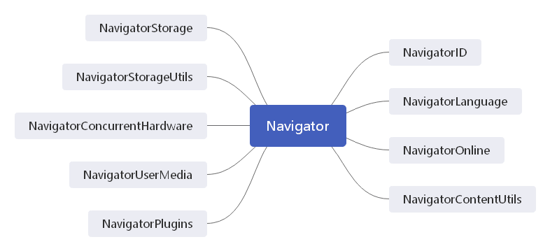

navigator 是客户端标识浏览器的标准。只要浏览器启动 JavaScript，navigator 对象就一定存在。

navigator 实现了上图所示的接口定义的属性和方法，下标列出了这些接口定义的属性和方法：

| 属性/方法                     | 说明                                                         |
| ----------------------------- | ------------------------------------------------------------ |
| activeVrDisplays              | 返回数组，包含 ispresenting 属性为 true 的 VRDisplay 实例    |
| appCodeName                   | 即使在非 Mozilla 浏览器中也会返回 "Mozilla"                  |
| appName                       | 浏览器全名                                                   |
| appVersion                    | 浏览器版本。**通常与实际的浏览器版本不一致**                 |
| battery                       | 返回暴露 Battery Status API 的 BatteryManager 对象           |
| buildId                       | 浏览器的构建编号                                             |
| connection                    | 返回暴露 Network Information API 的 NetworkInformation 对象  |
| cookieEnabled                 | 返回布尔值，表示是否启动了 cookie                            |
| credentials                   | 返回暴露 Credentials Management API 的 CredentialsContainer 对象 |
| deviceMemory                  | 返回单位为GB的设备内存容量                                   |
| doNotTrack                    | 返回用户的"不跟踪"(do-not-track)设置                         |
| geolocation                   | 返回暴露 Geolocation API 的 Geolocation 对象                 |
| getVRDisplays()               | 返回数组，包含可用的每个 VRDisplay 实例                      |
| getUserMedia()                | 返回与可用媒体设备硬件相关的流                               |
| hardwareConcurrency           | 返回设备的处理器核心数量                                     |
| javaEnabled                   | 返回布尔值，表示浏览器是否启用了 Java                        |
| language                      | 返回浏览器的主语言                                           |
| languages                     | 返回浏览器偏好的语言数组                                     |
| locks                         | 返回暴露 Web Locks API 的 LockManager 对象                   |
| mediaCapabilities             | 返回暴露 Media Capabilities API 的 MediaCapabilities 对象    |
| mediaDevices                  | 返回可用的媒体设备                                           |
| maxTouchPoints                | 返回设备触摸屏支持的最大触点数                               |
| mimeTypes                     | 返回浏览器中注册的 MIME 类型数组                             |
| onLine                        | 返回布尔值，表示浏览器是否联网                               |
| oscpu                         | 返回浏览器运行设备的操作系统和CPU                            |
| permissions                   | 返回暴露 Permissions API 的 Permissions 对象                 |
| platform                      | 返回浏览器运行的系统平台                                     |
| plugins                       | 返回浏览器安装的插件数组。IE——数组包含页面中所有 embed 元素  |
| product                       | 返回产品名称（通常是"Gecko"）                                |
| productSub                    | 返回产品的额外信息（通常是"Gecko"的版本）                    |
| registerProtocolHandler()     | 将一个网站注册为特定协议的处理程序                           |
| requestMediaKeySystemAccess() | 返回一个期约，解决为 MediaKeySystemAccess对象                |
| sendBeacon()                  | 异步传输一些小数据                                           |
| serviceWorker                 | 返回用来与 serviceWorker 实例交互的 ServiceWorkerContainer   |
| share()                       | 返回当前平台的原生共享机制                                   |
| storage                       | 返回暴露 Storage API 的 StorageManager 对象                  |
| userAgent                     | 返回浏览器的用户代理字符串                                   |
| vendor                        | 返回浏览器的厂商名称                                         |
| vendorSub                     | 返回浏览器的厂商更多信息                                     |
| vibrate()                     | 触发设备振动                                                 |
| webdriver                     | 返回浏览器当前是否被自动化程序控制                           |

navigator 对象的属性通常用于确定浏览器的类型。

