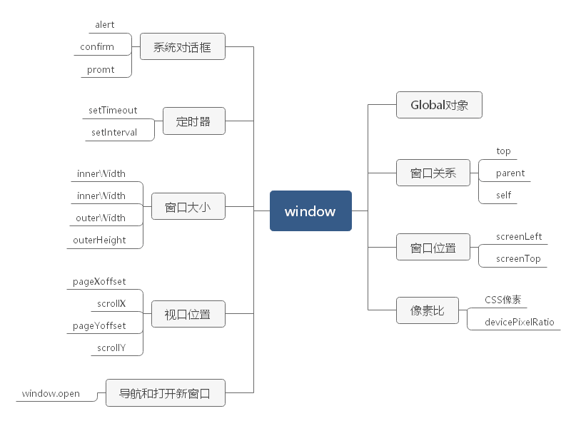

BOM 的核心是 window 对象，表示浏览器的实例。

它在浏览器中有两重身份：

1. Global 对象——即网页中定义的所有对象、变量和函数都以 window 作为其 Global 对象
2. 浏览器窗口的 JavaScript 接口

## Global 作用域

因为 window 对象被复用为 ECMAScript 的 Global 对象，所以通过 var 声明的所有**全局**变量和函数都会变成 window 对象的属性和方法。

```js
var age = 29;
var sayAge = () => alert(this.age);

alert(window.age);  // 29
sayAge();  // 29
window.sayAge()  // 29
```

访问未声明的变量会抛出错误，但是可以在 window 对象上查询是否存在可能未声明的变量。

```js
// 抛出异常，变量 oldValue 未声明
var newValue = oldValue

// 不会抛出错误，因为这里是属性查询
// newValue 会被设置为 undefined
var newValue = window.oldValue
```

JavaScript 中有很多对象都暴露在全局作用域中，比如 location 和 navigator，因而它们也是 window 对象的属性。

## 窗口关系

- top 对象**始终指向最上层窗口**，即浏览器窗口本身。
- parent 对象则始终指向**当前窗口的父窗口。**
- self 对象是终极 window 对象，始终会指向 window。

> 最上层的 window 如果不是 window.open() 打开的，那么其 name 属性就不会包含值。

## 窗口位置

窗口的位置也就是 window 对象的位置可以通过 screenLeft 和 screenTop 属性来表示，是**窗口相对于屏幕**左侧和顶部的位置。返回值的单位是 CSS 像素。

可以使用 **moveTo()** 和 **moveBy()** 方法移动窗口。都接收两个参数：

- moveTo：新位置的绝对坐标 x 和 y;
- moveBy：相对当前位置的两个方向上移动的像素数。

```js
// 把窗口移动到左上角
window.moveTo(0,0)

// 把窗口向下移动 100 像素
window.moveBy(0,100)
```

## 像素比

CSS 像素是 web 开发中使用的统一像素单位。为了在不同设备上统一标准，使不同像素密度的屏幕的展示相统一，又有了缩放系数——window.devicePixelRatio。

window.devicePixelRation 表示物理像素与逻辑像素之间的缩放系数。举个例子：

> 手机屏幕的**物理**分辨率为1920*1080，但因为其像素可能非常小，所以浏览器就需要将其分辨率降为较低的**逻辑**分辨率，比如640 * 320。那这里物理像素与 CSS 像素之间的转换就由 window.devicePixelRatio 属性提供。对于分辨率从 1920 * 1080 转换为 640 * 320 的设备，window.devicePixelRation 的值就为3。这样的话，12 像素（css像素）的文字就需要 36 像素的物理像素来显示。

## 窗口大小

所有现代浏览器都支持 4 个属性：innerWidth、innerHeight、outerWidth 和 outerHeight。

- outer** 都返回浏览器**窗口自身**的大小（不管是在最外层 window 上使用，还是在 frame 中使用）；
- inner** 都返回浏览器窗口中**页面视口**的大小（不包含浏览器的边框和工具栏）。

::: tip

document.documentElement.clientWidth 和 document.documentElement.clientHeight 返回页面视口的宽度和高度

:::

我们在确定页面视口大小的时候，可以使用 document.compatMode 来检查页面是否处于标准模式。通过它来决定获取视口宽高的方法。

```js
let pageWidth = window.innerWidth,
    pageHeight = window.innerHeight;
if (typeof pageWidth != 'number') {
    if (document.compatMode == 'CSS1Compat') {
        pageWidth = document.documentElement.clientWidth;
        pageHeight = document.documentElement.clientHeight;
    } else {
        pageWidth = document.body.clientWidth;
        pageHeight = document.body.clientHeight;
    }
}
```

在移动设备上，除了 Mobile Internet Explorer 之外的移动浏览器，document.documentElement.clientWidth 和 document.documentElement.clientHeight 返回的布局视口的大小，即渲染页面的实际大小。布局视口是相对于可见视口的概念，可见视口只能显示整个页面的一小部分。

而 Mobile Internet Explorer 上 window.innerWidth 和 window.innerHeight 返回视口的大小，也就是屏幕上页面可视区域的大小。

那么我们可以使用 resizeTo() 和 resizeBy() 方法来调整窗口大小。它们都接收两个参数：

- resizeTo：接收新的宽度和高度；
- resizeBy：接收宽度和高度要缩放多少；

```js
// 缩放到100 * 100
window.resizeTo(100, 100)

// 缩放到 200 * 150
window.resizeBy(100, 50)
```

## 视口位置

视口位置我们也可以理解为页面中内容相对于视口滚动条的位置。有两对属性，返回相等的值：

- X轴：window.pageXoffset/window.scrollX
- Y轴：window.pageYoffset/window.scrollY

可以使用 scroll()、scrollTo() 和 scrollBy() 三种方法来滚动页面：

- scroll()：接收要滚动到的坐标x,y；
- scrollTo()：接收要滚动到的坐标x,y；
- scrollBy()：接收要滚动的距离；

```js
// 相对于当前视口向下滚动 100 像素
window.scrollBy(0, 100)

// 相对于当前视口向右滚动 40 像素
window.scrollBy(40, 0)

// 滚动到页面左上角
window.scrollTo(0,0)

// 滚动到距离页面左边及顶边各 100 像素的位置
window.scrollTo(100,100)
```

这几个方法也接收一个 options 参数，除了提供偏移值，还可以通过 behavior 属性告诉浏览器是否平滑移动。

```js
// 正常滚动
window.scrollTo({
    left: 100,
    top: 100,
    behavior: 'auto'
})
// 平滑滚动
window.scrollTo({
    left: 100,
    top: 100,
    behavior: 'smooth'
})
```

## 导航和打开新窗口

window.open() 方法既可以用来导航到某个指定的 URL，也可以用来打开新的浏览器窗口。

接收 4 个参数：

1. 要加载的 URL
2. 目标窗口
3. 特性字符串
4. 表示新窗口在浏览器历史记录中是否替代当前加载页面的布尔值（通常只有在不打开新窗口时才会使用）

```js
// 与 a 标签 href="http://www.wrox.com" target="topFrame" 相同
window.open("http://www.wrox.com", "topFrame")
```

第二个参数也可以是一个特殊的窗口名，比如 `_self`、`_parent`、`_top`和`_blank`。

如果第二个参数不是已有窗口，则会打开一个新窗口或者标签页。而第三个参数——用于指定新窗口的配置。如果没有设置，则会带有所有默认的浏览器特性。

我们先来看看都有哪些选项：

| 设置       | 值          | 说明                                        |
| ---------- | ----------- | ------------------------------------------- |
| fullscreen | yes 或者 no | 表示新窗口是否最大化。仅IE支持              |
| height     | 数值        | 新窗口的高度。这个值**不能小于100**         |
| left       | 数值        | 新窗口的x 轴坐标。这个值**不能是负值**      |
| location   | yes 或者 no | 表示是否显示地址栏。不同浏览器的默认值不同  |
| menubar    | yes 或者 no | 表示是否显示菜单栏。默认是 no               |
| resizable  | yes 或者 no | 表示是否可以拖动改变新窗口的大小。默认为 no |
| scrollbars | yes 或者 no | 表示是否可以在内容过长时滚动。默认为 no     |
| status     | yes 或者 no | 表示是否显示状态栏。不同浏览器默认值不同    |
| toolbar    | yes 或者 no | 表示是否显示工具栏。默认为 no               |
| top        | 数值        | 新窗口的 y 坐标。这个值**不能是负值**       |
| width      | 数值        | 新窗口的宽度。这个值**不能小于 100**        |

这些设置需要以逗号分隔的键值对出现，并以等号连接（**不能包含空格**）：

```js
window.open("http://www.wxw.com", "xxxwindow", "height=400,width=400,top=10,left=10")
```

window.open()方法还返回了一个对新建窗口的引用。它与普通的 window 对象没有区别，只是为控制新窗口提供了方便。

```js
let win = window.open("http://www.wxw.com", "xxxwindow", "height=400,width=400,top=10,left=10");

// 缩放
win.resizeTo(500, 500)
// 移动
win.moveTo(100, 100)

// 还可以使用 close() 方法来关闭新打开的窗口
win.close()
```

close() 方法只能用于 window.open() 创建的弹出窗口。在关闭窗口以后，窗口的引用还在，但只能用于检查其 closed 属性了。

```js
alert(win.closed)  // true
```

::: tip

所有现代浏览器都内置了屏蔽弹窗的程序，因此大多数意料之外的弹窗都会被屏蔽。如果浏览器内置的弹窗屏蔽程序阻止了弹窗，那么 window.open() 很可能会返回 null。所以只要检查这个方法的返回值就可以知道弹窗是否被屏蔽了。

:::

## 定时器

JavaScript 在浏览器中都是单线程执行的，但是允许使用定时器指定在某个时间之后或者每隔一段时间就执行相应的代码。

- setTimeout：指定在一段时间后执行某些代码；
- setInterval：指定每隔一段时间执行某些代码；

都接收两个参数：

- 要执行的代码
- 在执行回调函数前等待德时间（毫秒）

JavaScript 是单线程的，所以每次只能执行一段代码。为了调度不同代码的执行，JavaScript 维护了一个任务队列。其中的任务会按照添加到队列的先后顺序执行。setTimeout 的第二个参数只是告诉 JavaScript 引擎在指定的毫秒数之后把任务添加到这个队列。如果队列是空的，则会立即执行该代码。如果队列不是空的，则代码必须等待前面的任务执行完毕才能执行。

调用 setTimeout 的时候，会返回一个表示该超时排期的数值 ID。这个超时ID是被排期执行代码的唯一标识符，可用于取消该任务。

::: tip

所有超时执行的代码函数都会在全局作用域中的一个匿名函数中运行，因此函数中的 this 值在非严格模式下始终指向 window ，而在严格模式下是 undefined。假如给 setTimeout 提供了一个箭头函数，那么 this 会保留为定义它时所在的词汇作用域。

:::

setInterval 与 setTimeout 的使用方法类似，只不过指定的任务会每隔指定时间就执行一次，直到取消循环定时或者页面卸载。

setTimeout 也能实现这种模式：

```js
let num = 0;
let max = 10;
let incrementNumber = function () {
    num++;
    
    // 如果还没有达到最大值，再设置一个超时任务
    if (num < max) {
        setTimeout(incrementNumber, 500)
    } else {
        alert('Done')
    }
}

setTimeout(incrementNumber, 500)
```

**这个模式是设置循环任务的推荐做法。**

setInterval() 在实践中很少会在生产环境下使用，因为一个任务结束和下一个任务开始之间的时间间隔是无法保证的，有些循环定时任务可能会因此而被跳过。

一般来说，最好不要使用 setInterval()。

## 系统对话框

alert()、confirm()、promt() 这些对话框都是同步的模态对话框，即在它们显示的时候，都会暂停代码的执行，在它们消失后，代码才会恢复执行。

**alert()**

它只接收一个参数，如果传给 alert 的参数不是一个原始字符串，则会调用这个值的 toString() 方法将其转换为字符串。

**confirm()**

确认框有两个按钮：取消和确定。

- confirm() 方法返回 true 表示单击了确认按钮
- confirm() 方法返回 false 表示单击了取消按钮

**promt()**

提示框，可以提示用户输入消息。

如果用户点击了 OK 按钮，则 promt() 会返回文本框中的值。反之，promt() 会返回 null。