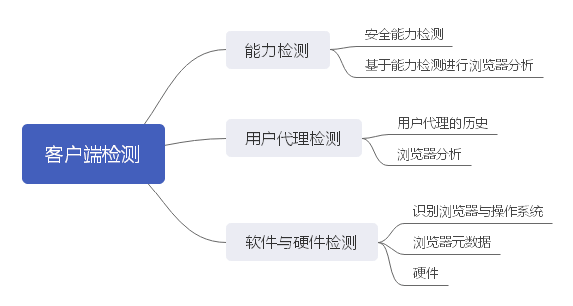

先来看看客户端检查需要学习哪些内容？

客户端检测一直是 Web 开发中饱受争议的话题，这些话题普遍围绕*所有浏览器应支持一系列公共特性*展开。理想情况下是这样的。但是在显示中，浏览器之间的差异和莫名其妙的行为，让客户端检测变成一种补救措施，而且也成为了开发策略的重要一环。

我们要知道的是客户端检测应该是解决问题的最后一个举措。任何时候，只要有更适的方案可选，都应该毫不犹豫地选择。首先要设计最常用的方案，然后再考虑为特定的浏览器进行补救。