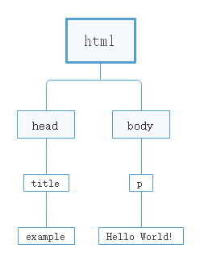

文档对象模型(DOM, Document Object Model) 是一个应用编程接口，用于在HTML中使用扩展的XML。

DOM将整个页面抽象为一组分层节点。

HTML或XML页面的每个组成部分都是一种节点，包含不同的数据。

```html
<html>
    <head>
        <title>Example</title>
    </head>
    <body>
        <p>
            Hello World!
        </p>
    </body>
</html>
```

DOM将以上代码表示为一组分层节点。如图：



DOM通过创建表示文档的树，让开发者可以随心所欲地控制网页的内容和结构。使用DOM API，可以轻松地删除、添加、替换、修改节点。