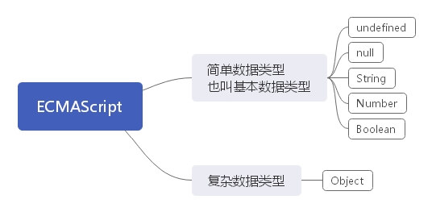

#### **一、JavaScript的数据类型**

#### **一、基本数据类型**

- **undefined**

  - 此类型只有一个值，即特殊的undefined。
  - 一般而言，不存在需要贤士地把一个变量设置为undefined值的情况

- **null**

  - 表示一个空对象指针
  - 如果定义的变量准备在将来用于保存对象，那么最好将该变量初始化为null而不是其他值
  - undefined值是派生自null值的，所以undefined==null的返回结果为true

- **Number**

  - 表示整数和浮点数

  - **NaN**：即非数值（Not a Number）是一个特殊的数值——（非数字）

    - 任何涉及NaN的操作（例如NaN/10）都会返回NaN。
    - NaN与任何值都不相等，包括NaN本身。
    - typeof NaN 打印出来为 number
    - **isNaN(n)**——检测n是否是"非数值"
      - 返回值： Boolean 类型的值
      - 参数：可以是任何类型
      - 对接收到的数值，先尝试转换为数值，再检测是否为非数值，所以`isNaN("16")`是 false

  - 数值转换

    - Number()——可以用于任何数据类型
    - parseInt()
      - 会忽略字符串前面的空格，直至找到第一个非空格字符。
      - 转换空字符串返回NaN
      - 提供第二个参数——转换时使用的基数（即多少进制）
    - parseFloat()
      - 从第一个字符开始解析每个字符，知道遇见一个无效的浮点数字符为止。
      - 除了第一个小数点有效外，parseFloat() 和 parseInt() 的第二个却别在于它始终都会忽略前导的零

    > parseInt() 和 parseFloat() 则专门用于把字符串转换成数值。但是有个前提条件是需要转换的字符串需要以数字开头，否则会被转换成NaN.

- **String**

  - String 类型用于表示由零或多个16位Unicode字符组成的字符序列，即字符串。字符串可以由双引号或单引号表示。
  - 字符转换
    - str.toString()
      - 将 str 转换为字符串
      - 返回 str 的一个副本
      - str 是要转换的内容，可以是数值、布尔值、对象和字符串
    - String()
      - 在不知道要转换的值是不是 null 或 undefined 的情况下，还可以使用 String() 函数，它能够将任何类型的值转换为字符串

- **Boolean**

  - 用于表示真假的类型，true真false假
  - 类型转换
    - 除0之外的所有数字，转换为布尔值 都为true
    - 除""之外的所有字符，转为布尔型都为 true
    - null 和 undefined 转为布尔型则为 false

#### **二、复杂数据类型**

Object