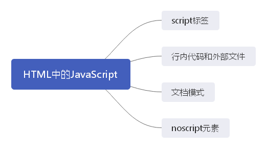

[[toc]]

## **script标签**

将JavaScript插入HTML的主要方法是使用script元素。

8个属性：

1. async：可选。表示应该立即下载脚本，但不能阻止其他页面动作。只对外部脚本文件有效。
2. charset: 可选。表示使用的src属性指定的代码字符集。
3. crossorigin：可选。配置相关请求的CORS（跨源资源共享）设置。默认不使用CORS。
4. defer：可选。
5. integrity：可选。允许比对接收到的资源和指定的加密签名，以验证子资源完整性。这个属性可以用于确保内容分发网络（CDN）不会提供恶意内容。
6. language：废弃。
7. src: 可选。表示包含要执行的代码的外部文件。
8. type：可选。代替language，表示代码块中脚本语言的内容类型（也称MIME类型）。按照惯例，这个值始终都是`"text/javascript"`，尽管`"text/javascript"`和`"text/ecmascript"`都已经废弃了。如果这个值是module，则代码会被当成ES6模块，而且只有这个时候代码中才能出现import和export关键字。

**使用script的方式有两种：**

1. 通过它直接在网页中嵌入JavaScript代码

   ```html
   <script>
     fucntion sayHi() {
         console.log('Hi!');
     }
   </script>
   ```

   包含在 script 中的代码会被从上到下解释。上述代码块中，被解释的是一个函数定义，并且该函数会被保存在解释器环境中。在 script 元素中的代码被计算完成之前，页面的其余内容不会被加载，也不会被显示。

   ::: danger

   在使用行内JavaScript代码时，要注意代码中不能出现字符串\</script\>。

   ```html
   <script>
     function sayScript() {
         console.log("</script>");
         // 添加转义字符后可避免报错
   	  console.log("<\/script>");
     }
   </script>
   ```

   浏览器解析行内脚本的方式决定了它在看到字符串\</script\>时，会将其当成结束的\</script\>标签。想避免这个问题，只需要转义字符`"\"`即可。

   :::

2. 在网页中引用外部JavaScript文件

   ```html
   <script src="./demo.js"></script>
   ```

   要包含外部文件中的JavaScript，就必须使用**src**属性。这个属性的值时一个URL，指向包含JavaScript代码的文件。

   与解释行内JavaScript一样，在解释外部JavaScript文件时，页面也会阻塞（阻塞时间也包含了下载文件的时间）。

   ::: warning

   **注意**    按照惯例，外部JavaScript文件的扩展名是js。这不是必需的，因为浏览器不会检查所包含JavaScript文件的扩展名。这就为使用服务器端脚本语言动态生成JavaScript代码，或者在浏览器中将JavaScript扩展语言（如TS，或者react的JSX）转译为JavaScript提供了可能性。<b>不过要注意，服务器经常会根据文件扩展来确定响应正确的MIME类型。</b>如果不打算使用.js扩展名，就要保证服务器能返回正确的MIME类型。

   :::

   另外，使用了<b>src</b>属性的script标签不应该再在其标签内部包含其他的JavaScript代码。如果两者都提供的话，浏览器只会下载并执行脚本文件，从而忽略行内代码。

   浏览器在解析不同域文件资源时，会向**src**属性指定的路径发送一个**GET**请求，以取得相应资源。这个初始的请求不受浏览器同源策略限制，但返回并执行的JavaScript则受限制。

#### **标签位置**

过去，所有`script`标签都被放在页面的`head`标签内。

这种做法的主要目的是把外部的CSS和JavaScript文件都集中放到一起。但是，把所有JavaScript文件都放在`head`标签里，会**导致页面渲染速度明显延迟，在此期间浏览器窗口完全空白**。这是因为浏览器解析是从上向下执行，而在执行到JavaScript代码时，需要把所有的JavaScript代码都下载、解析和解释完成后，才能开始渲染页面（**页面在浏览器解析到body标签时开始渲染**）。

为了解决这个问题，现代web应用程序通常将所有JavaScript引用放到body元素中的页面内容后面。

#### **推迟执行脚本**

HTML4.01为 script 元素定义了一个 `defer` 的属性。表示脚本在执行的时候不会改变页面结构。因此，这个脚本完全可以在整个页面解析完之后再运行。添加这个属性，会告诉浏览器应该**立即开始下载，但执行应该推迟**。

defer 属性只对外部脚本文件才有效。

#### **异步执行脚本**

HTML5 为script标签定义了async属性。也就是异步属性，它会告诉浏览器立即开始下载脚本。标记为asyn的脚本并不能保证能按照它们出现的次序执行，因为异步加载，不能保证加载完成的时间。

异步脚本不应该在加载期间修改DOM。

#### **动态加载脚本**

使用DOM动态添加script元素同样可以加载指定的脚本。

```javascript
let script = document.createElement('script');
script.src = 'demo.js';
document.head.appendChild(script);
```

默认情况下，以这种方式创建的script标签是以**异步**方式加载的。相当于添加了async属性。但是所有的浏览器都支持 createElement 方法，但不是所有浏览器都支持 async 属性。因此，如果要统一动态脚本的加载行为，可以明确将其设置为同步加载：

```javascript
let script = document.createElement('script');
script.src = 'demo.js';
script.async = false;
document.head.appendChild(script);
```

以这种方式获取的资源对浏览器预加载器是不可见的。这会严重影响它们在资源获取队列中的优先级。从而导致可能会严重影响性能。要想让预加载器知道这些动态请求文件的存在，可以在文档头部显式声明它们：

```html
<link rel="preload" href="demo.js" />
```

## **行内代码和外部文件**

虽然可以直接在HTML中嵌入JavaScript代码，但通常认为最佳实践是尽可能将JavaScript代码放在外部文件中。理由如下：

1. **可维护性。**JavaScript代码如果分散到很多HTML页面，会导致维护困难。
2. **缓存。**浏览器会根据特定的设置缓存所有外部链接的JavaScript文件，这意味着如果两个页面用到同一个文件，则该文件只需下载一次。从而页面加载会更快。
3. **适应未来。**

## **noscript**

noscript 元素可以包含任何可以出现的 body 中的 HTML 元素，script 元素除外。

它主要是为了对于早期浏览器不支持JavaScript的问题，从而出现的一个优雅降级的处理方案。

以下两种情况下，浏览器将显示包含在noscript中的内容。否则，浏览器不会渲染其中的内容：

- 浏览器不支持脚本
- 浏览器对脚本的支持被关闭