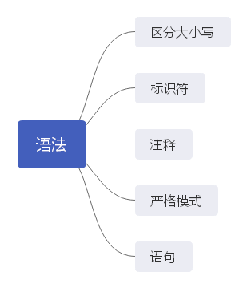

[[toc]]

## **区分大小写**

ECMAScript 中的一切（变量、函数名和操作符）都区分大小写。

## **JavaScript的标识符**

1. 什么是标识符？

   变量、函数、属性的名字，或者函数的参数

2. 标识符的命名规则：

   1. 由字母、数字、下划线或美元符号组成
   2. 不能以数字开头
   3. 不能使用关键字、保留字、true、false和null等作为标识符

## **JS的注释与分号**

ECMAScript采用C语言风格的注释：

```javascript
// 	单行注释

/*
多行注释
多行注释
*/	
```

## **严格模式**

严格模式是一种不同的JavaScript解析和执行模型，ECMAScript3的一些不规范写法在这种模式下会被处理，对于不安全的活动将被抛出错误。

要对整个脚本启用严格模式，在脚本开头加一行：

```javascript
'use strict';
```

是一个预处理指令。

目的：不破坏ECMAScript3的语法.

也可以单独指定一个函数在严格模式下执行，只要把这个预处理指令放到函数体开头即可：

```javascript
function dosomething() {
    "use strict";
    // 函数体
}
```

## **语句**

ECMAScript语句结束使用分号，如果省略，则由解析器确定语句的结尾。

加分号有助于防止省略造成的问题，比如：

- 可以避免输入内容不完整
- 便于开发者通过删除空行来压缩代码
- 有助于提升性能，因为解析器会尝试在合适的位置补上分号以纠正语法错误。

## **关键字与保留字**

按照规定，保留的关键字不能用作标识符或属性名。

ECMA-262第6版规定的所有关键字如下：

| break    | do       | in         | typeof  |
| -------- | -------- | ---------- | ------- |
| case     | else     | instanceof | var     |
| catch    | export   | new        | void    |
| class    | extends  | return     | while   |
| const    | finally  | super      | with    |
| continue | for      | switch     | yield   |
| debugger | function | this       | default |
| if       | throw    | delete     | import  |
| try      |          |            |         |

**保留字**同样也不能用作标识符或属性名。

## **什么是变量**

ECMAScript 的变量是松散类型

> 松散类型：可以用来保存任何类型的数据
>
> 换句话说，每个变量仅仅是一个用于保存值的占位符而已。

## **变量的声明与赋值**

1. 变量声明：

   变量的声明可以使用 var、let、const 操作符

   语法：**(var/let/const)**变量名

2. 变量赋值：

   声明的同时赋值：var 变量名 = 值

   先声明后赋值： 变量名 = 值（不适用于const）

> 一次声明多个变量，用逗号隔开，如：var sex, age, name = 'marry';

	#### **var 关键字**

使用 var 定义变量的时候，如果不初始化变量的值，变量会保存一个特殊值 undefined。

1. var 声明作用域

   使用 var 操作符定义的变量会成为包含它的**函数的局部变量**。如在函数内部定义了一个变量，那么意味着该变量将在函数退出的时候被销毁。

   ```javascript
   function test() {
       var message = 'hello';  // 局部变量
   }
   test();
   console.log(message);  // 抛出错误
   ```

   在函数 test 调用完之后就随即被销毁。

   但是，如果在函数内部定义变量时省略 var 操作符，可以创建一个全局变量。

   ```javascript
   function test() {
       message = 'hello';  // 全局变量
   }
   test();
   console.log(message);  // 'hello'
   ```

   虽然可以通过省略 var 操作符定义全局变量，但是不推荐这么做。一来不规范，二来在局部作用域中定义的全局变量很难维护。

2. var 声明提升

   

## **typeof**

功能：检测变量类型

语法：`typeof(变量)`或`typeof 变量`

返回值：String类型，值有可能是`string number boolean object undefined function`其中的一种

例子：

```javascript
var age = 18, name='cecil';
console.log(typeof age);    // string
console.log(typeof name);    // number
```
