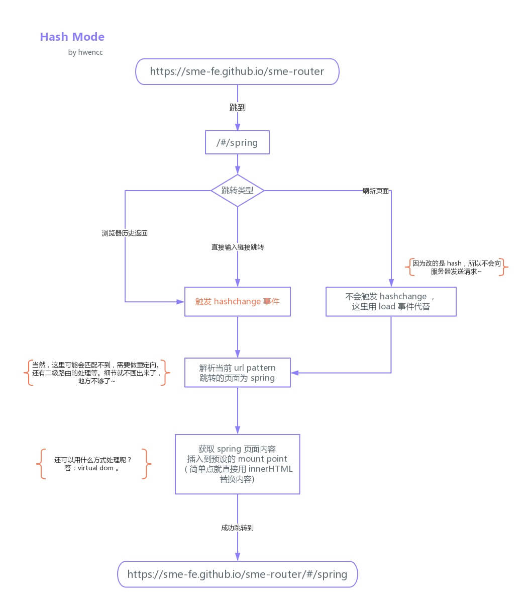
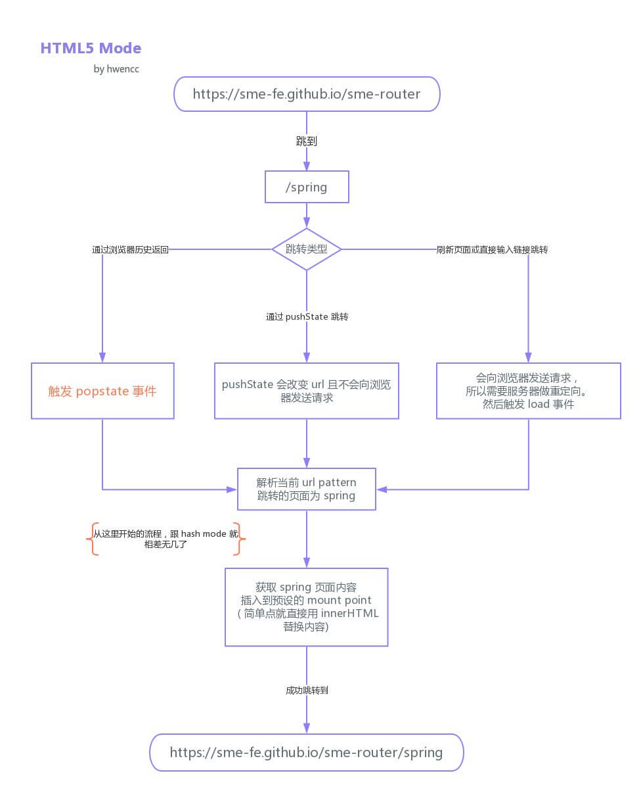

## 什么是前端路由？

路由概念最早出于后端，通过用户请求我的 URL 导航到具体的 html 页面。

现在的前端路由不同于传统路由，不需要服务器解析，而是可以通过 hash 函数或者 history API 来实现。在前端开发中，我们可以使用路由设置访问路径，并根据路径与组件的映射关系切换组件的显示，而这整个过程都是在同一个页面实现的，并不涉及页面之间的跳转——这就是SPA。

也可以说，前端路由的出现，是因为单页应用的广泛使用。

## 前端路由的优缺点？

- 优点

  用户体验好，不需要每次都从服务器全部获取，快速展现给用户

- 缺点

  - 使用浏览器的前进，后退键的时候会重新发送请求，没有合理地利用缓存
  - 单页面无法记住之前滚动的位置，无法在前进、后退的时候记住滚动的位置

## 实现原理

前端路由本质上是检测 url 的变化，截获 url 地址，然后解析来匹配路由规则。

那么让 JavaScript 来检测和截获 url ？——此时 hash 登场了：

```shell
https://www.baidu.com/hash#articl
```

这种后面 hash 值的变化，并不会导致浏览器向服务器发出请求，浏览器不发出请求，也就不会刷新页面。而每次 hash 值的变化，还会触发 `hashchange` 这个事件，通过这个事件我们可以知道 hash 值都发生了哪些变化。



图片来源：https://www.zhihu.com/question/53064386

hash 的实现相对来说要简单方便些，而且不用服务器来支持。

在 HTML5 发布后，多了两个 API ，`pushState` 和 `replaceState`，通过这两个 API 可以改变 url 地址且不会发送请求。同时还有 `onpopstate` 事件。通过这些就能用另一种方式来实现前端路由了，但原理都是跟 hash 实现相同的。用了 HTML5 的实现，单页路由的 url 就不会多出一个`#`，变得更加美观。但因为没有 `#` 号，所以当用户刷新页面之类的操作时，浏览器还是会给服务器发送请求。为了避免出现这种情况，所以这个实现需要服务器的支持，需要把所有路由都重定向到根页面。



图片来源：https://www.zhihu.com/question/53064386