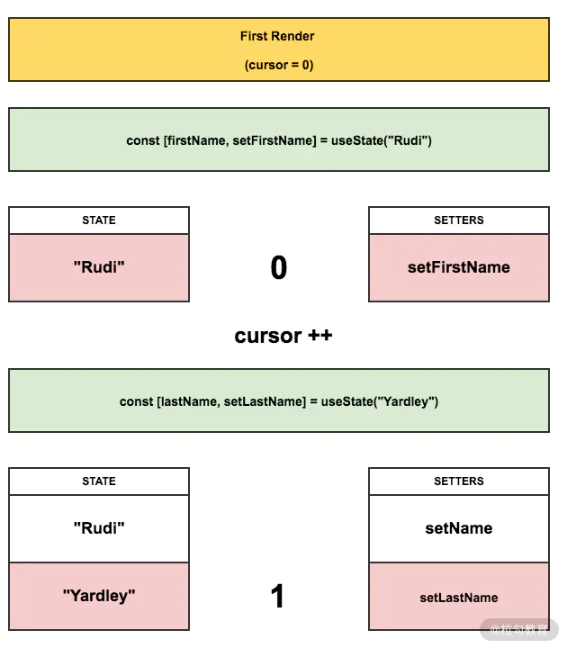
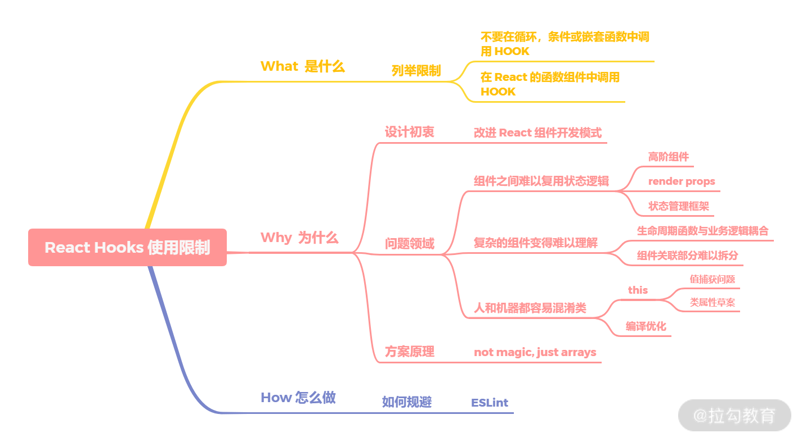

对于 React Hooks 是什么这个问题，我们可以到官网文档上去做了解。

首先 Hook 的概念是在 React 16.8 中新增的特性。它是做什么的呢？——可以让你在不编写 class 的情况下使用 state 以及其他的 React 特性。

那么 Hook 的诞生动机是什么呢？或者这样问：它的设计初衷是什么呢？

## 初衷

在 React 团队过去编写和维护数以万计组件的五年时间里，他们遇到了一些问题。

### （1）组件之间难以复用状态逻辑

什么意思呢？假如有一个高阶组件复用逻辑，做一个检查登录，然后在这个组件里就做了一件事，那就是把**登录判断逻辑抽取出来**，放置到 checkLogin 组件中。那此时组件之间的状态逻辑就通过这样一个高阶组件共享出来了。但是如果遇到更加复杂的场景，多级组件需要共享状态，就需要使用 Redux 或者 Mobx 来解决了。

而且对于高阶组件来说，这类的方案可能需要重新组织你的组件结构，这可能会很麻烦，使得你的代码难以理解。所以这就引出了一个更深层次的问题：React 需要为共享状态逻辑提供更好的原生途径。

### （2）复杂的组件变得难以理解

这个主要指出生命周期函数没能提供最佳的代码编程实践范式。这点相对来说更好理解一些，比如 componentDidMount，在下面的案例中变成了一个大杂烩，我们在这里设置页面标题、订阅聊天状态信息、拉取用户信息、拉取按钮权限信息，componentDidMount 函数内部逻辑随意堆砌，内容杂乱，缺乏专注性，往往还会对上下文产生以来。如果在你 componentDidMount 中使用 ChatAPI.subscribe，那么你就需要在 componentWillUnmount 中去 unsubscribe 它。

订阅与取消订阅并没有直接关联在一起，而是通过生命周期函数去使用，这非常的反模式，也就导致组件难以分解，且到处都是状态逻辑。当然，之前提到过得状态管理框架可以解决类似问题，但它也是有成本的。如下代码所示：

```jsx
class Example extends React.Component {
    componentDidMount() {
        // 设置页面标题
        document.title = `User Profile`;
        // 订阅聊天状态信息
        ChatAPI.subscribeToFriendStatus(
        	this.props.friend.id,
            this.handleStatusChange
        )
        // 拉取用户信息
        fetchUserProfile()
        // 拉取按钮权限信息
        fetchButtonAuthority()
    }
    componentWillUnmount() {
        // 取消订阅
        ChatAPI.subscribeFromFriendStatus(
        	this.props.friend.id,
            this.handleStatusChange
        )
    }
}
```

在这个例子里，相互关联且需要对照修改的代码被进行了拆分，而完全不相关的代码却在同一个方法中组合在了一起。这样一来很容易产生BUG，并且导致逻辑不一致，而且后期维护也比较麻烦。

在多数情况下，不可能将组件拆分为更小的粒度，因为状态逻辑无处不在。这也给测试带来了一定挑战。同时，这也是很多人将 React 与状态管理库结合使用的原因之一。但是，这往往会引入了很多抽象概念，需要你在不同的文件之间来回切换，使得复用变得更加困难。

为了解决这个问题，**Hook 将组件中相互关联的部分拆分成更小的函数（比如设置订阅或者请求数据）**，而非强制按照生命周期划分。

### （3）难以理解的 class

class 类容易令初学者甚至熟手犯错，还会给机器带来困扰：

- this 问题首当其冲，对于这个问题，我们在[类组件与函数组件有什么区别](./classVSfunction.html)一讲中也有介绍，可移步至该篇；
- 还有一个与 this 相关的问题就是用 bind 函数包一下来绑定事件。虽然现在我们都通过了类属性的方案，也可以使用 Babel 插件提前开发了，但整个天仍然是草案的阶段，还不稳定；
- class 不能很好地压缩，并且会使热重载出现不稳定的情况；
- 最后一个问题是在类中难以做编译优化，React 团队一直在做前端编译层的优化工作，比如常数折叠（constant folding）、内联展开（inline expansion）以及死码删除（Dead code elimination) 等。

所以基于以上原因，选择以函数组件为基础进行设计。

## 方案原理

通过在函数中调用 useState 会返回当前状态与更新状态的函数。就像下面案例一样，count 的起始值是 0，然后，通过 useState 赋值初始值，然后获取当前状态 count 与函数 setCount。那么在点击按钮时调用 setCount，修改 count 的值。本质上 state hook 替代了类组件中 setState 的作用：

```jsx
import { useState } from 'react';
function Example() {
    // 声明一个新的状态变量，我们将其称为 ‘count’
    const [ count, setCount ] = useState(0);
    return (
        <div>
        	<p>You clicked {count} times</p>
            <button onClick={() => setCount(count + 1)}>
            	Click me
            </button>
        </div>
    )
}
```

这种写法颇有奇妙感。Rudi Yardley 在 2018 年的时候写过一篇 《React hooks: not magic, just arrays》详细地阐释了它的设计原理，并通过一个案例来说明。在案例中 RenderFunctionComponent 组件有两个 useState，分别用于修改 firstName 与 lastName。

```jsx
function RenderFunctionComponent() {
  const [firstName, setFirstName] = useState("Rudi");
  const [lastName, setLastName] = useState("Yardley"); 
  return ( <Button onClick={() => setFirstName("Fred")}>Fred</Button> ); 
}
```

当初次渲染时，就会有两对 state 与 setter 被放入数组中，其中第 0 个就是 FirstName 那组，第 1 个就是 LastName 那组。如下图所示：



那么在后续渲染中，也会保持这样一个规律获取对应的组。那这里就会产生一个问题：如果在 if 条件中调用 useState 会怎样呢？就会造成数组的取值错位，所以不能在 React 的循环、条件或嵌套函数中调用 Hook。

这里我们用数组来简化描述，实质上 React 源码的实现是采用的**链表**。在整体设计结构上你会发现 Hooks 的设计是贴近函数组件的，那么在类组件方面，为了未来的优化探索，Hooks 直接选择了不支持，但 React 并没有禁止两者混用，甚至鼓励两者混用。React 团队并不希望我们使用 Hooks 重写以前的类组件，那没有什么意义，而是希望在未来 Hooks 变成主流的开发方式。

那么从以上分析中，我们可以得出两条使用的限制：

- 不要在循环、条件或嵌套函数中调用 Hook；
- 在 React 的函数组件中调用 Hook；

## 怎么合理处理它们呢？

因为 React 的内在设计原理，所以我们不可能绕过限制规则，但可以在代码中禁止错误的使用方式。我们在工程的 ESLint 中引入 eslint-plugin-react-hooks 完成自动化检查即可。在处理代码编写方式的问题时，都应该优先想到从 Lint 工具入手。

## 小结

React Hooks 的限制主要有两条：

- 不要在循环、条件或嵌套函数中调用 Hook；
- 在 React 的函数组件中调用 Hook。

那为什么会有这样的限制呢？就得从 Hooks 的设计说起。Hooks 的设计初衷是为了改进 React 组件的开发模式。在旧有的开发模式下遇到了三个问题。

1. 组件之间难以复用状态逻辑。过去常见的解决方案是高阶组件、render props 及状态管理框架。
2. 复杂的组件变得难以理解。生命周期函数与业务逻辑耦合太深，导致关联部分难以拆分。
3. 人和机器都很容易混淆类。常见的有 this 的问题，但在 React 团队中还有类难以优化的问题，他们希望在编译优化层面做出一些改进。

这三个问题在一定程度上阻碍了 React 的后续发展，所以为了解决这三个问题，Hooks 基于函数组件开始设计。然而第三个问题决定了 Hooks 只支持函数组件。

那为什么不要在循环、条件或嵌套函数中调用 Hook 呢？**因为 Hooks 的设计是基于数组实现**。在调用时按顺序加入数组中，如果使用循环、条件或嵌套函数很有可能导致数组取值错位，执行错误的 Hook。当然，实质上 React 的源码里不是数组，是链表。

这些限制会在编码上造成一定程度的心智负担，新手可能会写错，为了避免这样的情况，可以引入 ESLint 的 Hooks 检查插件进行预防。

