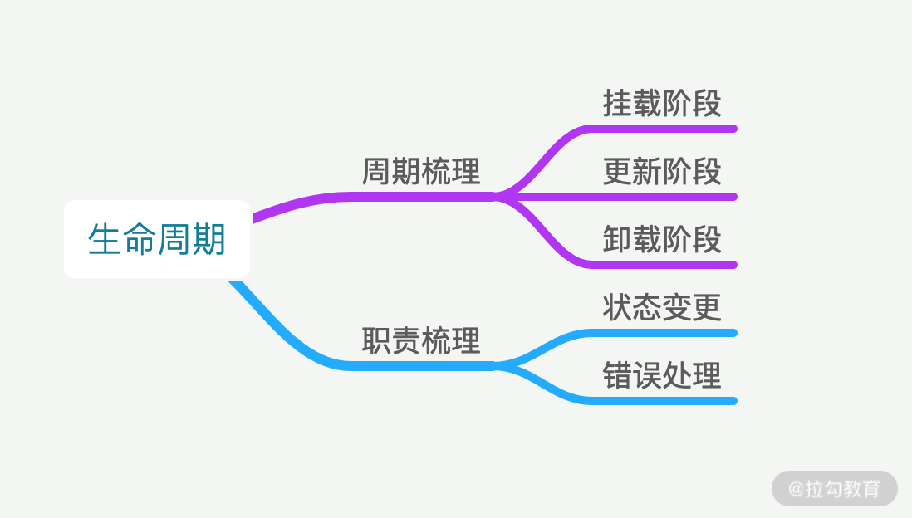
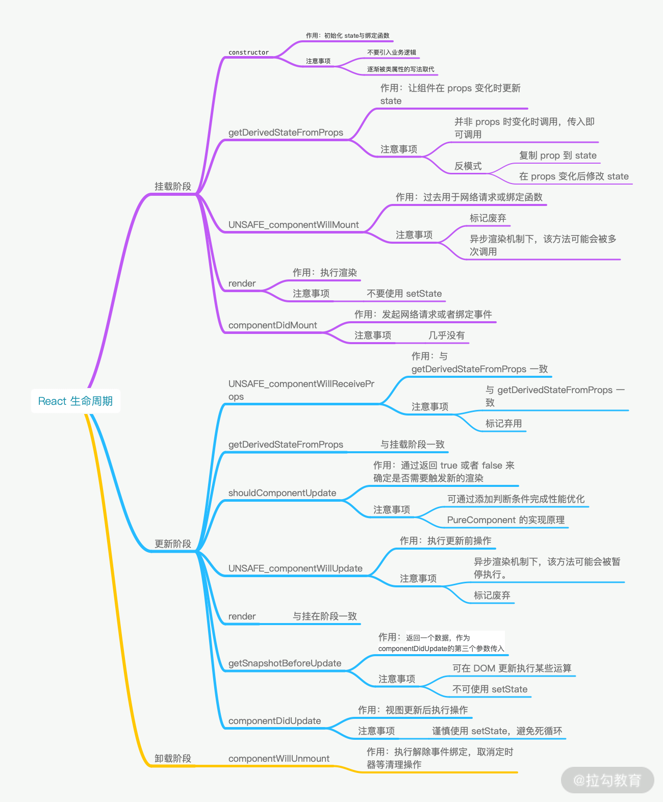

[原文链接](https://kaiwu.lagou.com/course/courseInfo.htm?courseId=566#/detail/pc?id=5793)

看到文章标题，我们首先有一个思考：你遇到过多少坑？

当然对于我们来说遇到很多坑了，那么在面试中，我们需要将比较棘手的，比较印象深刻的个别叙述出来会更有说服力。

在代码编写中，遇到的坑往往会有两种：

- 在不恰当的时机调用了不合适的代码
- 在需要调用时，却忘记了调用

在生命周期中出现的坑，那就一定跟生命周期有关。所以，**通过梳理生命周期，明确周期函数职责，确认什么时候该做什么事儿，以此来避免坑**。

首先，我们需要确立讨论的范围：

- 基于周期的梳理，确认生命周期函数的使用方式；
- 基于职责的梳理，确认生命周期函数的使用范围；

**以此建立时机与操作的对应关系**。



## 概念

首先，当我们在讨论 React 组件生命周期的时候，一定是在讨论类组件（Class Component）。函数式组件并没有生命周期的概念，因为它本身就是一个函数，只会从头执行到尾。

生命周期是一个抽象的概念，能让开发者产生联想记忆的往往是那些函数，比如 componentDidMount、componentWillMount 等等。然而这些函数并不是它的生命周期，只是在生命周期中按顺序被调用的函数。挂载 -> 更新 -> 卸载这一 React 组件完整的流程，才是生命周期。

## 流程梳理

接下来我们按照生命周期中函数的调用顺序，逐一举例被调用的函数。

#### 挂载阶段

挂载阶段是指组件从初始化到完成加载的过程。

**constructor**

constructor 是类通用的构造函数，常用于初始化。所以在过去，constructor 通常用于初始化 state 与绑定函数。常见的写法如下：

```jsx
import React from 'react'
class Counter extends React.Component {
    constructor(props) {
        super(props)
        this.state = {
            count: 0,
        }
        this.handleClick = this.handleClick.bind(this)
    }
    handleClick() {
        // do some stuff
    }
    render() {
        return null
    }
}
```

那为什么会强调过去呢，因为当类属性开始流行之后，React 社区的写法发生了变化，即去除了 constructor。

```jsx
import React from 'react'
class Counter extends React.Component {
       state = {
          count: 0,
       }

       // 类属性第三阶段提案
       handleClick = () => {
         // do some stuff
       }
      render() {
         return null
      }
}
```

社区那个去除 constructor 的原因非常明确：

- constructor 中并不推荐去处理初始化以外的逻辑；
- 本身 constructor 并不属于 React 的生命周期，它只是 Class 的初始化函数；
- 通过移除 constructor，代码也会变得更为简洁；

**getDerivedStateFromProps**

该函数的作用是使组件在 props 变化时更新 state，那么它什么时候才会起效呢？它的触发时机是：

- 当 props 被传入时；
- state 发生变化时；
- forceUpdate 被调用时；

最常见的一个错误是认为只有 props 发生变化时，getDerivedStateFromProps 才会被调用，而实际上只要父级组件重新渲染时，getDerivedStateFromProps 就会被调用。所以是外部参数，也就是 props 传入时就会发生变化。以下是官方文档中的例子：

```jsx
    class ExampleComponent extends React.Component {
      // 在构造函数中初始化 state，
      // 或者使用属性初始化器。
      state = {
        isScrollingDown: false,
        lastRow: null,
      };

      static getDerivedStateFromProps(props, state) {
        if (props.currentRow !== state.lastRow) {
          return {
            isScrollingDown: props.currentRow > state.lastRow,
            lastRow: props.currentRow,
          };
        }

        // 返回 null 表示无需更新 state。
        return null;
      }
    }
```

依据官方的说法，它的使用场景是很有限的。由于太多错误使用的案例，React 官方团队甚至写了一篇[你可能不需要使用派生 state](https://zh-hans.reactjs.org/blog/2018/06/07/you-probably-dont-need-derived-state.html)。文中主要列举了两种反模式的使用方式：

- 直接复制 prop 到 state;
- 在 props 变化后修改 state.

这两种写法除了增加代码的维护成本外，没有带来任何好处。

**UNSAFE_componentWillMount**

也就是 componentWillMount，本来用于组件即将加载前做某些操作，但目前被标记为弃用。因为在 React 的异步渲染机制下，该方法可能会被多次调用。

一个常见的错误是 componentWillMount 跟服务端同构渲染的时候，如果在该函数里面发起网络请求，拉取数据，那么会在服务器端与客户端分别执行一次。所以更推荐在 componentDidMount 中完成数据拉取操作。

**render**

render 函数返回的 JSX 结构，用于描述具体的渲染内容。但切记，render 函数并没有真正的去渲染组件，渲染时依靠 React 操作 JSX 描述结构来完成的。还有一点需要注意，render 函数应该是一个纯函数，不应该 在里面产生副作用，比如调用 setState 或者绑定事件。

那为什么不能 setState 呢？因为 render 函数在每次渲染时都会被调用，而 setState 会触发渲染，就会造成死循环。

那又为什么不能绑定事件呢？因为容易被频繁调用注册。

**componentDidMount**

componentDidMount 主要用于组件加载完成时做某些操作，比如发起网络请求或者绑定事件，该函数是接着 render 之后调用的。但是 componentDidMount 一定是在真实 DOM 绘制完成之后调用吗？在浏览器端，我们可以这么认为。

但在其他场景下，尤其是 React Native 场景下，componentDidMount 并不意味着真实的界面已经绘制完毕。尤其机器的性能限制，视图可能还在绘制中。

#### 更新阶段

更新阶段是指外部 props 传入，或者 state 发生变化时的阶段。该阶段我们着重介绍下以下 6 个函数：

**UNSAFE_componentWillReceiveProps**

该函数已被标记弃用，因为其功能可悲函数 getDerivedStateFromProps 所代替。

另外，当 getDerivedStateFromProps 存在时，UNSAFE_componentWillReceiveProps 不会被调用。

**getDerivedStateFromProps**

同挂载阶段的表现一致。

**shouldComponentUpdate**

该方法通过返回 true 或者 false 来确定是否需要触发新的渲染。因为渲染触发最后一到关卡，所以也是性能优化的必争之地。通过添加判断条件来阻止不必要的渲染。

React 官方提供了一个通用的优化方案，也就是 PureComponent。PureComponent 的核心原理就是默认实现了 **shouldComponentUpdate** 函数，在这个函数中对 props 和 state 进行浅比较，用来判断是否触发了更新。

```js
shouldComponentUpdate(nextProps, nextState) {
    // 浅比较仅比较值与引用，并不会对 Object 中的每一项值都进行比较
    if (shadowEqual(nextProps, this.props) || shadowEqual(nextState, this.state)) {
        return true
    }
    return false
}
```

**UNSAFE_componentWillUpdate**

同样已废弃，因为后续的 React 异步渲染设计中，可能会出现组件暂停更新渲染的情况。

**render**

同挂载阶段一致。

**getSnapshotBeforeUpdate**

getSnapshotBeforeUpdate 方法是配合 React 新的异步渲染的机制，在 DOM 更新发生前被调用，返回值将作为 componentDidUpdate 的第三个参数。

官方用例如下：

```js
class ScrollingList extends React.Component {
  constructor(props) {
    super(props);
    this.listRef = React.createRef();
  }
 
  getSnapshotBeforeUpdate(prevProps, prevState) {
    // Are we adding new items to the list?
    // Capture the scroll position so we can adjust scroll later.
    if (prevProps.list.length < this.props.list.length) {
      const list = this.listRef.current;
      return list.scrollHeight - list.scrollTop;
    }
    return null;
  }
 
  componentDidUpdate(prevProps, prevState, snapshot) {
    // If we have a snapshot value, we've just added new items.
    // Adjust scroll so these new items don't push the old ones out of view.
    // (snapshot here is the value returned from getSnapshotBeforeUpdate)
    if (snapshot !== null) {
      const list = this.listRef.current;
      list.scrollTop = list.scrollHeight - snapshot;
    }
  }
 
  render() {
    return (
      <div ref={this.listRef}>{/* ...contents... */}</div>
    );
  }
```

**componentDidUpdate**

正如上面的案例，getShapshotBeforeUpdate 的返回值会作为 componentDidUpdate 的第三个参数使用。

componentDidUpdate 中可以使用 setState，会触发重新渲染，但是一定要小心使用，避免死循环。

#### 卸载阶段

卸载阶段就容易很多了，只有一个回调函数。

**componentWillUnmount**

该函数主要用于执行清理工作。一个比较常见的 Bug 就是忘记在 componentWillUnmount 中取消定时器，导致定时操作依然在组件销毁后不停执行。所以一定要在该阶段解除事件绑定，取消定时器。

基于以上所述，我们可以建立一个自己的知识导图了。



## 职责梳理

在梳理整个生命周期之后，需要再强调两个事情。

- 什么情况下会触发重新渲染。
- 渲染中发生报错后会怎样？又该如何处理？

如果我们的 React 应用足够复杂、渲染层级足够深时，一次重新渲染，就会非常消耗性能，导致卡顿的问题。下面三种情况都会触发重新渲染。

**函数组件**

**函数组件任何情况下都会重新渲染**。它并没有生命周期，但官方提供了一种方式优化手段，那就是 React.memo。

```js
const MyComponent = React.memo(function MyComponent(props) {
    /* 使用 props 渲染 */
})
```

React.memo 并不是阻断渲染，而是跳过渲染组件的操作并直接复用最近一次渲染的结果，这与 shouldComponentUpdate 是完全不同的。

**React.Component**

如果不实现 shouldComponentUpdate 函数，那么有两种情况触发重新渲染。

- 当 state 发生变化时。这个很好理解，是常见的情况。
- 当父级组件的 props 传入时。无论 props 有没有变化，只要传入就会引发重新渲染。

**React.PureComponent**

PureComponent 默认实现了 shouldComponentUpdate 函数。所以仅在 props 与 state 进行浅比较后，确认有变更时才会触发重新渲染。

**错误边界**

错误边界是一种 React 组件，这种组件可以捕获并打印发生在其子组件树任何位置的 JavaScript 错误，并且，它会渲染出备用 UI，如下 React 官方所给的示例：

```js
class ErrorBoundary extends React.Component {
  constructor(props) {
    super(props);
    this.state = { hasError: false };
  }
  static getDerivedStateFromError(error) {
    // 更新 state 使下一次渲染能够显示降级后的 UI
    return { hasError: true };
  }
  componentDidCatch(error, errorInfo) {
    // 你同样可以将错误日志上报给服务器
    logErrorToMyService(error, errorInfo);
  }

  render() {
    if (this.state.hasError) {
      // 你可以自定义降级后的 UI 并渲染
      return <h1>Something went wrong.</h1>;
    }
    return this.props.children; 
  }
}
```

无论是 React，还是 React Native，如果没有错误边界，在用户端看到的现象会是这样的：在执行某个操作时，触发了 Bug，引发了崩溃，页面突然白屏。

**但是渲染时报错，只能通过 componentDidCatch 捕获**。这是在做线上页面报错监控时，极其容易忽略的点。

## 小结

首先，避免生命周期中的坑需要做好两件事：

1. 不在恰当的时候调用了不该调用的代码；
2. 在需要调用的时候，不要忘记调用。

其次，有7种情况容易造成生命周期的坑：

1. getDerivedStateFromProps 容易编写反模式代码，使受控组件与非受控组件区分模糊。
2. componentWillMount 在 React 中已被标记弃用，不推荐使用，主要原因是新的异步渲染架构会导致它被多次调用。所以网络请求及事件绑定代码应移至 componentDidMount 中。
3. componentWillReceiveProps 同样被标记弃用，被 getDerivedStateFromProps 所取代，主要原因是性能问题。
4. shouldComponentUpdate 通过返回 true 或者 false 来确定是否需要触发新的渲染。主要用于性能优化。
5. componentWillUpdate 同样是由于新的异步渲染机制，而被标记废弃，不推荐使用，原先的逻辑可结合 getSnapshotBeforeUpdate 与 componentDidUpdate 改造使用。
6. 如果在 componentWillUnmount 函数中忘记解除事件绑定，取消定时器等清理操作，容易引发 bug。
7. 如果没有添加错误边界处理，当渲染发生异常时，用户将会看到一个无法操作的白屏，所以一定要添加。

最后，还有一个讨论就是：**React 的请求应该放在哪里，为什么？**

那么对于异步请求，应该放在 componentDidMount 中去操作。从时间顺序来看，除了 componentDidMount 还可以有以下选择：

- constructor：可以放，但是从设计来说不推荐。constructor 主要用于初始化 state 与函数绑定，并不承载业务逻辑。而且随着类属性的流行，constructor 已经很少使用了。
- componentWillMount：已被标记废弃，在新的异步渲染架构下会触发多次渲染，容易引发BUG，不利于未来 React 升级后的代码维护。

所以，**React 的请求放在 componentDidMount 里是最好的选择。**

**几个小问题**

1. componentWillReceiveProps 能解释以下为什么会有所谓的性能问题。getDerivedStateFromProps也是会在每次组件进行渲染的时候进行调用的，这样根本没区别啊。是因为原来的能调用setState么？

   ::: tip

   componentWillReceiveProps 更新状态是同步进行的，而 getDerivedStateFromProps  的设计更适用于异步场景。但如果只是写写中后台页面，那完全是没有问题的。性能问题常常会出现在深层级的巨型前端应用中，只有在那种场景下讨论才会有意义。即便当下使用不到这些知识，只是记下，未来也会很有帮助的

   :::

2. 不是都在render函数里通过onClick绑定事件的吗？为啥说不能在render函数内绑定事件？

   ::: tip

   这里的“绑定事件”，是指 addEventListener 一类的绑定事件。但 bind和箭头函数在 onClick 中绑定事件也会造成一些问题

   :::

3. 新的异步机制是怎么导致">componentWillUpdate、componentWillMount 废弃的？

   ::: tip

   可以看下 dan 的视频 https://zh-hans.reactjs.org/blog/2018/03/01/sneak-peek-beyond-react-16.html 

   :::