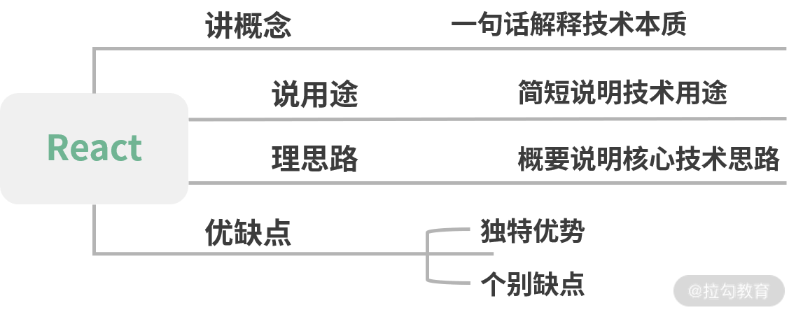
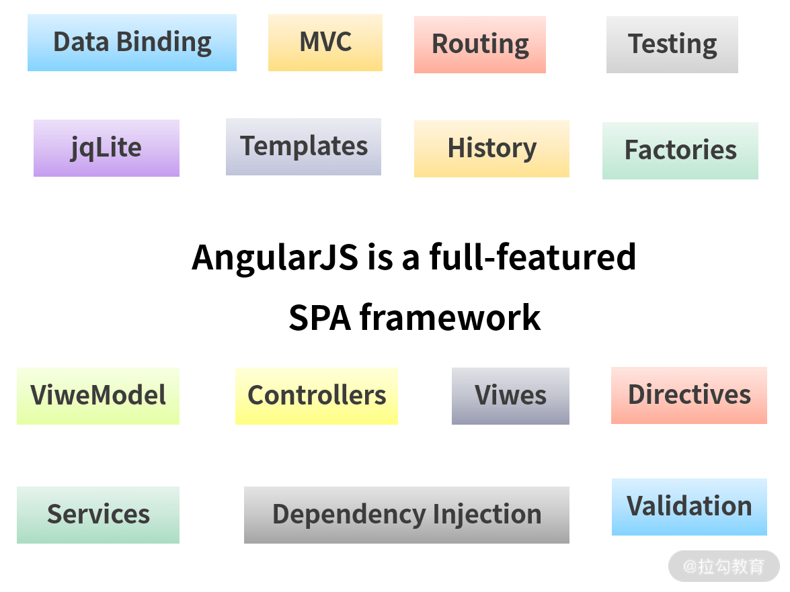

我们在面试中经常会遇到有关 react 的问题就是：谈谈你对 react 的理解。[原文链接](https://kaiwu.lagou.com/course/courseInfo.htm?courseId=566#/detail/pc?id=5791)

## 如何思考？

其实这一类的概念题，大部分人都会陷入一个线性思考的误区，也就是一种直线的、单向的思维方式，一般就是想到什么讲什么，缺乏全盘考虑。看似简单地提问其实不仅能够反映出你对 React 的了解程度，还能反映出你在工作中的状态以及思考问题的思路：

- 是出现一个问题解决一个问题，不断被外界推着线性往前走；
- 还是能够高屋建瓴地思考全局

而且我们既要重视知识本身，也要重视表达方法。

那对于这类的概念题，讲究一个四字口诀“**讲说理列**”，即“讲概念，说用途，理思路，优缺点，列一遍”。

- 讲概念：用简洁的话说清楚该技术是什么。最好能用一句话描述。
- 说用途：描述该技术的用途。能够具体结合适合场景，拓展性的描述。
- 理思路：梳理该技术的核心思路或运作流程。这个地方可深可浅，如果对其有足够深入的了解，建议详细地展开说明。
- 优缺点，列一遍：对该技术栈的优缺点进行列举。列举优缺点肯定有与其他技术方案横向对比的过程，那么在这个过程中，切忌刻意地踩一捧一，容易引发面试官的反感。

## 怎么回答

首先我们从上面可知，回答问题需要采用非线性的结构化模式阐述答案。基于四字口诀这一表达技巧，很容易延伸出我们作答的大体框架。

- 讲概念需要讲什么？讲技术本质。
- 说用途是说什么？说使用场景。
- 理思路是理什么？理核心技术思路。
- 列优缺点是列什么？是通过对比调研业界流行的技术方案，去发掘 React 的独特优势，去找出 React 的缺点。



## 概念

React 本质上就是一个网页UI框架。诞生于 jQuery、AngularJS 与 Backbone.js 相继流行的时代。

> jQuery 诞生于 2005 年，浏览器兼容性是当时最大的问题。为了解决这个问题， jQuery 封装 DOM 操作，提供样式选择器，封装了 AJAX、链式操作等大量基础函数。但从如今的视角来看，jQuery 并没有解决代码如何组织的问题，甚至不能称之为框架，本质上它只是一个工具函数合集。

如上所说，jQuery 对于解决代码组织问题是欠缺的，当前端工程变得复杂和庞大，如何组织代码结构，有效提升代码复用性和可维护性，就成为了大家有待解决的问题。

09年的时候，angularJS 出世，带着 Java 开发的先进经验闯入了前端世界中。AngularJS 的分层设计是齐全且优秀的，覆盖了整个 Web 开发的方方面面，是一个大而全的前端框架。

 

但也正是因为它庞大复杂的概念，你在使用 AngularJS 进行开发的时候，需要编写大量的面条代码，你会感觉自己并不是在写前端，而是在写 AngularJS。jQuery 时代和 AngularJS 时代，一个最明显的区别在于，jQuery 时代是与浏览器斗争，而 AngularJS 时代，更像是与 AngularJS 斗争。代码如何组织是清晰了，可数不清的概念，让 AngularJS 看起来更像一个披着前端皮的 Java 框架。甚至会有人感慨，这一切值得吗？

当然也有值得的地方，AngularJS 的双向绑定就是当时最大的特色。双向绑定在中后台网页开发中极大地提升了开发效率。中后台页面几乎全是列表与表单，双向绑定使值与视图动态可以自动更新，节约了几乎一半以上手动编写代码的时间。

回顾历史会发现，前端项目在不断地工程化，同时也不断地发展出新的概念。但这两个问题还是难以解决：

- 与后端不同的是前端主要以 UI 组件为基础，需要一个可以使组件复用的开发方案，过去常见的复用方案是拼装模板；
- 前端工程越来越庞杂，组件作为基本单位应该是可以通过编写单元测试来维持稳定性的。

基于过去的模式，要做到这两点是非常困难的。你会发现过去的框架通常是从页面的维度去思考，然后零星装上 jQuery 的各种小插件。

初次接触 React 的同学会发现，开发 React 的思维模式是完全不同的，概念也极为简单。如果用一个非常简洁的公式来表达，那就是：

> View = fn(props)

这个公式表达了给定相同的输入状态， 函数总是会生成一致的组件。只有做到输入与输出恒定，那么它才是可测的。

其次 fn 内部也可以是无数个组件构成的。React 中只有组件，没有页面，没有控制器，也没用模型。没有页面？那就用组件组合生成一个页面，没有控制器，那就用组件充当控制器。就像搭建乐高玩具一样。

当然 React 的变量会更多一些，将 state 和 context 考虑进去，那也是可以表达的：

> View = fn(props, state, context)

从实际编码上来讲，fn 可能是一个类组件，也可能是纯函数组件，也可能在函数中产生影响 UI 生成的副作用，比如直接操作 DOM 或者绑定事件等。经典公式总是会展示理想情况，就像 E=mc² 简化了大量的外界干扰因素，但这不妨碍它表达了一个结论，即在 React 中只需要关心两件事：**数据与组件**。

那为什么会把基本单位定位于组件呢？如果对设计模式有印象的话，你是否还记得“组合优于继承”的铁律？即在构建 UI 视图时，组合组件始终是最优的解决方案。

而 React 是通过组件化的方式解决视图层开发复用的问题，本质是一个组件化框架。

## 用途

React 的用途当然是**构建视图啦。由于 React 虚拟 DOM 的关系，在适用场景上远比传统框架更为广泛**：

- 首先无论是 PC 网页还是移动端网页，都是完全支持的；
- 其次由于 React Native，也可以用于开发 iOS 与 Android 应用；
- 还有 React 360 可以开发 VR 应用；
- 冷门儿的如 ink，也可以使用 React 开发命令行应用。

## 核心思路

**React 核心思路有三点：分别是声明式、组件式与通用性**（官方称之为：一次学习，随处编写）。

### 声明式

**声明式编程的优势在于直观，可以做到一目了然，也便于组合**。

如果是命令式编程，那么会是这样：

```html
<div class="block"></div>
<script>
const block = $('.block');
block.css('color', 'red');
</script>
```

如果是 React，则会这样写：

```js
const Block = (props) => <div style={{ color: 'red' }}></div>
```

相较于上面的写法，Block 不仅结构上更容易阅读，而且更容易与其他组件代码进行组合。

### 组件化

**组件化可以降低系统间功能的耦合性，提供功能内部的聚合性**。对前端工程化及代码复用有极大的好处。React 组件化最大的区别在于没有使用模板进行编写，而是采用了声明式的 JSX。

### 通用性

这就要说到 React 的虚拟 DOM。React 将 DOM 抽象为虚拟 DOM，开发者并不会直接操作 DOM。正因为有这样一层封装，使得 React 不再局限于 Web 开发，而能走向更宽广的平台，出现更繁荣的生态。无论是 Native、VR 还是 Shell 命令，只要兼容虚拟 DOM 层，那么都可以直接运行 React。

## 优缺点

那么我们说核心设计思路就是 React 的优点：

1. 声明式
2. 组件化
3. 通用性

**缺点**：由于 React 并不是一个一揽子框架，比如路由一类的功能，React 团队更希望交给社区来解决。所以导致在技术选型与学习使用上有比较高的成本。但也正因为社区蓬勃发展，非官方的一揽子解决方案还是有的，比如 DvaJS、React-coat 等填补了生态位的缺失。所以 React 也是一个使用者上限与下限差距极大的框架。

## 总结

首先，React 是一个用于构建用户界面的 JavaScript 库，那我们也可以理解为它是一个网页UI框架，通过组件化的方式解决视图层开发复用的问题，本质是一个组件化框架。

其次，它的核心设计思路有三点：

1. 声明式：声明式的优势在于直观与组合；
2. 组件化：组件化的优势在于视图的拆分与模块复用，可以更容易做到高内聚低耦合。
3. 通用性：而通用性在于一次学习，随处编写，这正是靠着虚拟 DOM 来保证实现的。

上述的核心设计思路也是 React 框架自身的优势所在，但是相对的，它的劣势也很明显，就是没有像 angular 一样提供一整套的前端解决方案，在开发大型前端应用时，需要向社区寻找并整合解决方案。这就对于开发者在技术选型和学习适用上造成了一定的成本。

那其实如果在面试过程中，我们还可以尝试拿到更多的主动性，即补充类似如下的回答：

- 承接在优势后，可以再谈一下自己对 React 优化的看法、对虚拟 DOM 的看法；
- 向自己主导过得 React 项目上引导，谈一谈 React 相关的工程架构与设计模式。

## 延伸

项目中 React 的使用方式：

- script 标签直接引入；
- 脚手架方式；

首先我们来说一下 script 标签直接引入的方式：

```html
<div id="box"></div>

<script src="https://unpkg.com/react@16/umd/react.development.js" crossorigin></script>
<script src="https://unpkg.com/react-dom@16/umd/react-dom.development.js" crossorigin></script>

<script>
	// 创建 react 对象
    let el = React.createElement(
      'p',
      { className: 'danger', key: 3 },
      'hello world'
    )
    
    // 使用 ReactDOM 进行元素渲染
    ReactDOM.render(ele, box);
</script>
```

最终在页面上展示出来的就是一个 div，内容是 hello world。

那如果我们需要实现一个有嵌套层级的 html 元素需要怎么去实现呢？比如实现下面的层级：

```html
<div class="login">
    <p class="danger">hello world</p>
    <label for="uname">用户名</label>
    <input type="text" id="uname">
</div>
```

那这个时候其实我们可以由官网文档得知，React.createElement 这个 API 其实最后一个参数 children，也可以是一个数组或者说是一个节点，不仅限于文字。

```js
React.createElement(
  type,
  [props],
  [...children]  // 内容、子元素
)
```

所以要实现这个 html 的结构，我们可以按照下列的代码进行实现：

```js
// 创建虚拟DOM
let el = React.createElement(
    'p',
    { className: 'danger', key: 3 },
    'hello world'
)

let label = React.createElement(
    'label',
    { htmlFor: 'uname', key: 0 },
    '用户名'
)

let input = React.createElement(
    'input',
    { type: 'text', id: 'uname', key: 1 }
)

let ele = React.createElement(
    'div',
    { className: 'login', key: 2 },
    [
        el, label, input
    ]
)

// 使用 ReactDOM 进行元素渲染
ReactDOM.render(ele, box)
```

以上就是使用 script 标签元素直接引入 react 库的方式。

再下来就是使用脚手架 CRA(create-react-app) 的方式来快速创建一个 React 应用：

1. 前提： node 版本必须大于 8.10
2. 下载全局脚手架工具
3. 运行全局脚手架工具，创建空白项目
4. 进入空白项目，运行开发服务器
5. 客户端访问测试