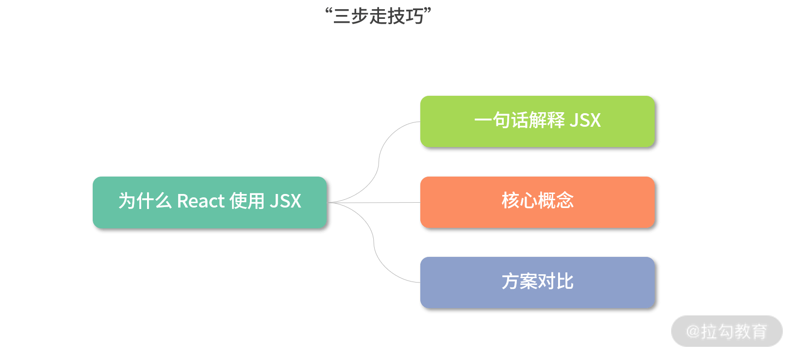
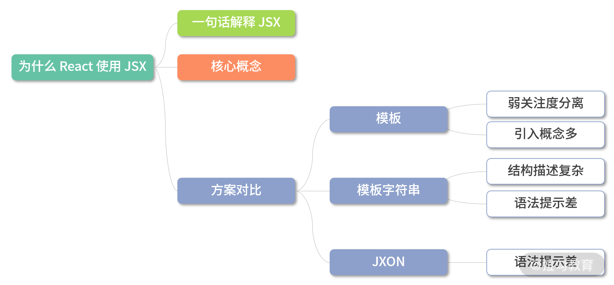
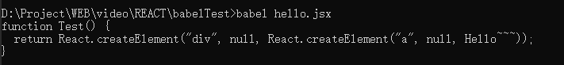

[原文链接](https://kaiwu.lagou.com/course/courseInfo.htm?courseId=566#/detail/pc?id=5792)

而在面试中，“为什么采用该技术方案”这一类问题是主考官最爱提的。这类问题其实在考察你的两个方面：

- 技术广度，深挖知识面涉猎广度，对流行框架的模板方案是否知悉了解；
- 技术方案调研能力。

使用“三步走技巧”来回答为什么 React 要使用 JSX：

1. 一句话解释 JSX——首先能一句话说清楚 JSX 到底是什么。
2. 核心概念——JSX用于解决什么问题？如何使用？
3. 方案对比——与其他方案对比，说明 React 选用 JSX 的必要性。



### 一句话解释

按照 React 官方的解释，**JSX 是一个 JavaScript 的语法扩展，或者说是一个类似于 XML 的 EMCAScript 语法扩展**。它本身没有太多的语法定义，也不期望引入更多的标准。

实际上，在 16 年的时候，JSX 公布过 2.0 的建设计划与小部分新特性，但很快被 Facebook 放弃掉了。整个计划在公布不到两个月的时间里便停掉了。其中一个原因是 JSX 的设计初衷，即并不希望引入太多的标准，也不期望 JSX 加入浏览器或者 ECMAScript 标准。

那这是为什么呢？这就涉及了 JSX 的核心概念。

### 核心概念

其实 React 本身并不强制使用 JSX。在没有 JSX 的时候，React 实现一个组件以来于使用 React.createElment 函数。代码如下：

```js
class Hello extends React.Component {
    render () {
        return React.createElement(
        	'div',
            null,
            `Hello ${this.props.toWhat}`
        )
    }
}
ReactDOM.render(
    React.createElement(Hello, { toWhat: 'World' }, null),
    document.getElementById('root')
)
```

而 JSX 更像是一种语法糖，通过类似 XML 的描述方式，描写函数对象。在采用 JSX 之后，这段代码可以这样写：

```jsx
class Hello extends React.Component {
    render() {
        return <div>Hello {this.props.toWhat}</div>
    }
}
ReactDOM.render(
	<Hello toWhat="World" />
    document.getElementById('root')
)
```

通过这样的对比，你可以清晰地发现，**代码变得更为简洁，而且代码结构层次更为清晰**。

因为 React 需要将组件转化为虚拟DOM树，所以我们在编写代码时，实际上是在手写一颗结构树。而**XML在树结构的描述上天生具有可读性强的优势**。

但这样可读性强的代码仅仅是写程序的同学看的，实际上在运行的时候，会使用 Babel 插件将 JSX 语法的代码还原为 React.createElement 的代码。

那既然可以用插件帮我们编译转换代码，那为什么不直接使用模板呢？通过下一部分的反感对比可以解决你的问题。

### 方案对比

#### 设计初衷

谈论其他方案之前，就需要谈到 React 的设计初衷，也是计算机科学里面非常重要的概念，叫做关注点分离。

> 关注点分离在计算机科学中，是将代码分割为不同部分的设计原则，是面向对象的程序设计的核心概念。其中每一部分会有各自的关注焦点。
>
> 关注点分离的价值在于简化程序的开发和维护。当关注点分离时，各部分可以重复使用，以及独立开发和更新。具有特殊价值的是能够稍后改进或修改一段代码，而无需知道其他部分的细节必须对这些部分进行相应的更改。

在 React 中，关注点的基本单位是组件。在接触一段时间 React 开发后，你会发现 React 单个组件式高内聚的，组件之间耦合度很低。

那模板不能做到吗？

#### 模压

**React 团队认为引入模板是一种不佳的实现**。因为模板分离了技术栈，而非关注点的模板同事又引入了更多的概念。比如新的模板语法、模板指令等，以 angular 为例，我们可以看一下有多少新概念的引入。

```html
<!doctype html>
<html ng-app="docsBindExample">
  <head>
    <script src="http://code.angularjs.org/1.2.25/angular.min.js"></script>
    <script src="script.js"></script>
  </head>
  <body>
    <div ng-controller="Ctrl1">
      Hello <input ng-model='name'> <hr/>
      <span ng-bind="name"></span> <br/>
      <span ng:bind="name"></span> <br/>
      <span ng_bind="name"></span> <br/>
      <span data-ng-bind="name"></span> <br/>
      <span x-ng-bind="name"></span> <br/>
    </div>
  </body>
</html>
angular.module('docsBindExample', [])
  .controller('Ctrl1', function Ctrl1($scope) {
    $scope.name = 'Max Karl Ernst Ludwig Planck (April 23, 1858 –        October 4, 1947)';
  });
```

这段代码有很强的疏离感，引入了非常多 Angular 独有的概念。但 JSX 并不会引入太多新的概念，它仍然是 JavaScript，就连条件表达式和循环都仍然是 JavaScript 的方式。如下代码所示：

```jsx
const App = (props) => {
    return (
        { props.isShow ? <a>show</a> : <a>hidden</a> }
        { props.names.map(name => <a>{ name }</a>) }
    ) 
}
```

即便是粗略的比较代码，也可以看出 React 代码更简洁，更具有可读性，更贴近 HTML。

那模板字符串也可以套用 HTML，所以用模板字符串不行吗？

#### 模板字符串

我们来看下面的例子：

```js
var box = jsx`
	<${Box}>
        ${
          shouldShowAnswer(user) ?
          jsx`<${Answer} value=${false}>no</${Answer}>` :
          jsx`
            <${Box.Comment}>
             Text Content
            </${Box.Comment}>
          `
        }
      </${Box}>
`
```

这显然不是一个容易的方案，代码结构变得更复杂了，而且开发工具的代码提示也会变得很困难。

#### JXON

JXON 非常类似于当下的 JSX，它的结构是这样的：

```jsx
    <catalog>
      <product description="Cardigan Sweater">
       <catalog_item gender="Men's">
         <item_number>QWZ5671</item_number>
         <price>39.95</price>
         <size description="Medium">
           <color_swatch image="red_cardigan.jpg">Red</color_swatch>
           <color_swatch image="burgundy_cardigan.jpg">Burgundy</color_swatch>
         </size>
         <size description="Large">
           <color_swatch image="red_cardigan.jpg">Red</color_swatch>
           <color_swatch image="burgundy_cardigan.jpg">Burgundy</color_swatch>
         </size>
       </catalog_item>
       <catalog_item gender="Women's">
         <item_number>RRX9856</item_number>
         <discount_until>Dec 25, 1995</discount_until>
         <price>42.50</price>
         <size description="Medium">
           <color_swatch image="black_cardigan.jpg">Black</color_swatch>
         </size>
       </catalog_item>
      </product>
      <script type="text/javascript"><![CDATA[function matchwo(a,b) {
        if (a < b && a < 0) { return 1; }
        else { return 0; }
    }]]></script>
    </catalog>
```

## 小结

首先，JSX 是一个 JavaScript 的语法扩展，结构类似 XML。

> JSX 主要用于声明 React 元素，但 React 中并不强制使用 JSX。即使使用了 JSX，也会在构建过程中，通过 Babel 插件编译为 React.createElement。所以 JSX 更像是 React.createElement 的一种语法糖。

所以在这里可以看出，React 团队并不想引入 JavaScript 本身以外的开发体系。而是希望通过合理的关注点分离保持组件开发的纯粹性。

接下来是与 JSX 以外的三种技术方案进行对比。

首先是模板，React 团队认为模板不应该是开发过程中的关注点，因为引入了模板语法、模板指令等概念，是一种不佳的实现方案。

其次是模板字符串，模板字符串编写的结构会造成多次内部嵌套，使整个结构变得复杂，并且优化代码提示也会变得困难重重。

最后是 JXON，同样因为代码提示困难的原因而被放弃。

所以 React 最后选用了 JSX ，因为 JSX 与其设计思想贴合，不需要引入过多新的概念，对编辑器的代码提示也是极为友好的。



## 进阶

**Babel 插件如何实现 JSX 到 JS 的编译？**在 React 面试中，这个问题很容易被追问，也经常被要求手写。

它的实现原理是这样的，Babel 读取代码并解析，生成 AST，再将 AST 传入插件层进行转换，在转换时就可以将 JSX 的结构转换为 React.createElement 的函数。如下代码所示：

```js
module.exports = function (babel) {
    var t = babel.types;
    return {
        name: 'custom-jsx-plugin',
        visitor: {
            JSXElement(path) {
                var openingElement = path.node.openingElement;
                var tagName = openingElement.name.name;
                var args = []; 
                args.push(t.stringLiteral(tagName)); 
                var attribs = t.nullLiteral(); 
                args.push(attribs); 
                var reactIdentifier = t.identifier("React"); //object
                var createElementIdentifier = t.identifier("createElement"); 
                var callee = t.memberExpression(reactIdentifier, createElementIdentifier)
                var callExpression = t.callExpression(callee, args);
                callExpression.arguments = callExpression.arguments.concat(path.node.children);
                path.replaceWith(callExpression, path.node); 
            }
        }
    }
}
```

我们可以新建一个目录，比如 babelTest。

然后新建一个 `.babelrc` 汶口按摩，这个文件是 babel 的配置文件。因为需要自己实现 plugins，所以先写上。

```json
{
    "plugins": []
}
```

然后实现一个解析 JSX 文件的插件，取名叫 `./jsx-parser`。

```js
module.exports = function () {
    return {
        manipulateOptions: function manipulateOptions(opts, parserOpts) {
            parserOpts.plugins.push('jsx');
        }
    }
}
```

把它加入到 plugins 里，就像下面这样：

```json
{
    "plugins": ['./jsx-parser']
}
```

这是第一步，可以识别到 jsx 文件，那么第二步就是将刚刚那段源码放置在新建的 jsx-plugins 文件中去。

```json
{
    "plugins": ['jsx-plugin', './jsx-parser']
}
```

接下来就需要一个 jsx 文件进行试验，新建 hello.jsx，写入下面的内容：

```jsx
function Test() {
    return <div><a>Hello~~~</a></div>
}
```

完工，最后是在安装 babel 之后用 babel 执行它。

```shell
babel hello.jsx
```



就会在控制台打印出 hello,jsx 被编译后的代码。