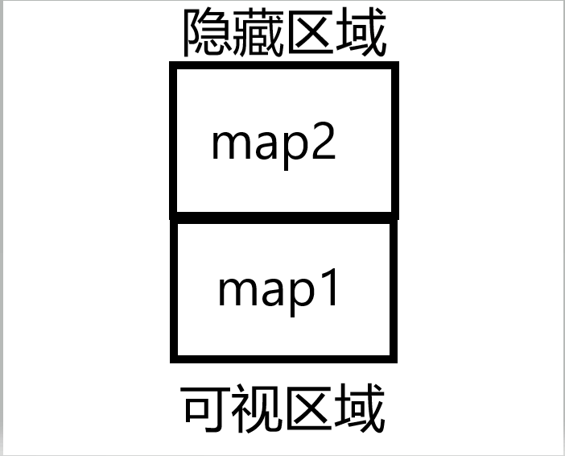
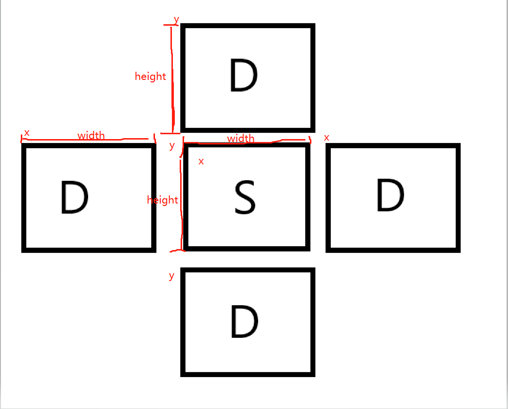

在之前的准备工作都做好之后，我们就可以开始在实际要进行操作的页面上大展手脚了。

## 地图动起来
首先我们要解决的就是让地图先动起来，这里我们只需要做最简单的无缝滚动即可。那么如何做呢？

这里我们需要两张地图，一张显示在可视区域，一张在可视区域上方，属于被隐藏的区域：



那么我们只需要在进入页面之后，让两张图的 Y 坐标递增，就可以做到让地图下移的视觉效果，然后当可视区域范围内的地图的 Y 坐标大于地图高度时，将当前地图的 Y 坐标重置成负的地图高度，就做到了无缝滚动的结果。

而这里的递增效果，我们可以使用 pixi.js 中的 ticker 来实现。实现之后我们在离开当前页面的时候销毁掉这个定时器。

根据分析的结果，我们来修改一下 Map.js：
```js
import { h, defineComponent, ref, onMounted, onUnmounted } from '@vue/runtime-core';
import mapImage from '@/assets/map.jpg';
import { game } from '../Game';

// 只展示 map
export default defineComponent({
  setup(props, ctx) {
    const viewHeight = 900;  // 图的高度
    const mapY1 = ref(0);  // 图一的 y 坐标
    const mapY2 = ref(-viewHeight);  // 图二的 y 坐标

    // 无缝轮播，使用 pixi.js 中封装的事件循环 ticker，实现 interval
    const speed = 5;  // 速度

    const moveLoop = () => {
      mapY1.value += speed;
      mapY2.value += speed;

      if (mapY1.value >= viewHeight) {
        mapY1.value = -viewHeight
      }
      if (mapY2.value >= viewHeight) {
        mapY2.value = -viewHeight
      }
    }
    onMounted() {
      game.ticker.add(moveLoop)
    }
    
    onUnmounted() {
      game.ticker.remove(moveLoop)
    }

    return {
      mapY1,
      mapY2
    }
  },
  render(ctx) {
    return h("Container", [
      h("Sprite", {
        texture: mapImg,
        y: ctx.mapY1
      }),
      h("Sprite", {
        texture: mapImg,
        y: ctx.mapY2
      })
    ])
  }
})
```

ref 这里是做响应式数据处理，Vue3 中再没有 data 去处理响应式数据了，它将所有的数据处理和生命周期都放在了 setup 入口函数里。这样可以使整个应用程序更加灵活，而非像 Vue2.x 那样将所有数据结构都规划好。

入口函数中将设置的响应式数据 return 出去，这样可以将数据挂载到 ctx 上，并在 render 中去使用。

此时属于地图组件的无缝轮播效果就做好了。

当然，我们在这里最好是加上一些优化，比如进入到地图页面时，地图再进行无缝滚动的效果，而当离开时，清除掉无缝滚动效果，释放内存。

## 我方飞机
接下来就是在地图上添加我方战机进去。

我们照旧先写一个我方飞机的组件出来，在这个组件里，我们需要一张我方飞机的图片，还需要一个初始化的 x 坐标和 y 坐标。当然，如果要让飞机动起来，我们还需要监听 keydown，即键盘按下的事件。而这个事件我们需要到父组件去监听，然后将对应的坐标传到子组件进来。

我们先将我方飞机画出来：
```js
// ./Plane.js

import { h, defineComponent, watch, reactive, toRefs } from '@vue/runtime-core';
import planeImg from '@/assets/plane.png';

export default defineComponent({
  props: ['x', 'y'],  // 父组件传递来的数据
  setup(props, ctx) {
    const point = reactive({
      x: props.x,
      y: props.y
    })

    watch(props, (value) => {
      point.x = value.x
      point.y = value.y
    })

    return {
      point
    }
  }
  render(ctx) {
    return h("Container", {
      x: ctx.point.x,    // 飞机的 x 坐标
      y: ctx.point.y     // 飞机的 y 坐标
    }, [
      h("Sprite", {
        texture: planeImg
      })
    ])
  }
})
```

我们这里为什么要使用 reactive 再来创建一个响应式对象呢？

这是因为此时 props 对象是一个只读的响应式对象，所以当父级的值发生变化时，我们并不能去直接使用，而是需要用 watch 去监听 props 的变化，再将其赋值给创建的新的响应式数据，最后将这个数据返回出去。

这个时候，我们就可以使用已经挂载到 ctx 上的 x 和 y 值，来控制飞机的飞行方向和速度。

除了使用 watch 之外，还有一种方法——toRefs：
```js
// ./Plane.js

import { h, defineComponent, watch, reactive, toRefs } from '@vue/runtime-core';
import planeImg from '@/assets/plane.png';

export default definedComponent({
  props: ['x', 'y'],
  setup(props, ctx) {
    const { x, y } = toRefs(props);

    return {
      x,
      y
    }
  }
  render({x, y}) {
    return h("Container", {
      x,
      y
    }, [
      h("Sprite", {
        texture: planeImg
      })
    ])
  }
})
```

当我们直接解构 props 时，得到的 x 和 y，只是一个初始值，跟上述一样，并且此时并不是 proxy 对象，这是一个响应式丢失问题，为了解决这个问题，我们需要借助 toRefs 方法将其重新转为响应式对象，这样解构出来的 x 和 y 也就是响应式数据了。最后将得到的数据返回出去即可。

做完这些工作之后，我们到父组件去写操作飞机移动的逻辑：
```js
// ./GamePage.js

// 定义一个 usePlaneInfo 的方法
function usePlaneInfo() {
  const planeInfo = reactive({
    x: 150,
    y: 450,
    width: 258,
    height: 364
  })

  // 键盘控制飞机的移动
  const speed = 15;
  window.addEventListener("keydown", (e) => {
    switch(e.code) {
      case "ArrowUp":
        planeInfo.y -= speed;
        break;
      case "ArrowDown":
        planeInfo.y += speed;
        break;
      case "ArrowLeft":
        planeInfo.x -= speed;
        break;
      case "ArrowRight":
        planeInfo.x += speed;
        break;
      default:
        break;
    }
  })

  return planeInfo
}

import { h, defineComponent, reactive } from '@vue/runtime-core';
import Plane from './Plane'

export default defineComponent({
  setup(props, ctx) {
    const planeInfo = usePlaneInfo()

    return {
      planeInfo
    }
  }
  render(ctx) {
    return h("Container", [
      h("Plane", {
        x: ctx.planeInfo.x,
        y: ctx.planeInfo.y
      })
    ])
  }
})
```

此时当我们按下键盘的上下左右时，就会控制飞机在地图上的移动。

## 敌方飞机
现在我方飞机有了，那还得有敌方飞机，实现方法和思路都有一样的，不同的是，敌方飞机不需要我们去操控，而是在创建后，自动向下移动。
```js
// ./EnemyPlane.js

import { h, defineComponent, toRefs } from '@vue/runtime-core';
import enemyPlaneImg from '@/assets/enemy.png';

export default defineComponent({
  props: ['x', 'y'],
  setup(props) {
    const { x, y } = toRefs(props)

    return {
      x, y
    }
  }
  render({ x, y }) {
    return h("Container", {
      x,
      y
    }, [
      h("Sprite", {
        texture: enemyPlaneImg
      })
    ])
  }
})
```

在父组件中引用，并将下移逻辑添加到里面：
```js
// ./GamePage.js
import { h, defineComponent, reactive, onMounted, onUnmounted } from '@vue/runtime-core';
import EnemyPlane from './EnemyPlane.js';
import { game } from './Game';

export default defineComponent({
  

  function useCreateEnemyPlanes() {
    const enemyPalnes = reactive([
      {
        x: 50,
        y: 0,
        width: 308,
        height: 207
      }
    ])
    return enemyPalnes
  }

  // 我们可以将敌我双方的逻辑写到一个回调中，先将其称之为战斗逻辑
  function useFighting(enemyPalnes) {
    const handlerTicker = () => {
      enemyPalnes.forEach((enemyPlane) => {
        enemyPlane.y++
      })
    }

    // 在页面渲染后执行定时
    onMounted() {
      game.ticker.add(handlerTicker)
    }

    // 在页面销毁时清掉定时,释放内存
    onUnmounted() {
      game.ticker.remove(handlerTicker)
    }
  }

  setup() {
    const enemyPalnes = useCreateEnemyPlanes()

    return {
      enemyPalnes
    }
  }
  render(ctx) {
    const createEnemyPlanes = () => {
      return ctx.enemyPalnes.map(enemyPlaneInfo => {
        return h(EnemyPlane, { x: enemyPlaneInfo.x, y: enemyPlaneInfo.y })
      })
    }

    return h("Container", [
      ...createEnemyPlanes()
    ])
  }
})
```

这样就把敌方飞机向下移动的效果完成了，并且在离开这个页面时，会销毁下移的定时，保证了应用程序的垃圾回收机制，不会造成内存泄露。

## 碰撞检测
重头戏来了，我方飞机有了，敌方飞机也有了，如何判断他们相撞呢？

我们先假设不相撞的情况，敌军飞机我们简称D，我方飞机我们简称S：
1. D 的 x 坐标加 D 的宽度小于 S 的 x 坐标；
2. D 的 y 坐标加 D 的高度小于 S 的 y 坐标；
3. S 的 x 坐标加 S 的高度小于 D 的 x 坐标；
4. S 的 y 坐标加 S 的高度小于 D 的 y 坐标；



以上四种状态都为 true 时表示敌我双方的飞机没有发生碰撞，我方飞机此时大喊：莫挨老子😒！！。

那我们在这种情况下取反——敌我双方飞机发生了碰撞，我们新建一个 utils 文件夹，里面新建一个 index.js 用来做碰撞检测：
```js
// ./utils/index.js

export const hitTestObject = (objA, objB) => {
  // 找出所有没有碰撞的结果
  // 然后取反
  // 就得出碰撞上的结果

  return (
    objA.x + objA.width >= objB.x &&
    objA.y + objA.height >= objB.y &&
    objB.x + objB.width >= objA.x &&
    objB.y + objB.height >= objA.y
  )
}
```

写好碰撞检测算法之后，我们在 GamePage 中去使用一下，在战斗逻辑 `useFighting` 函数中调用：
```js
import { hitTestObject } from  './utils/index'

function useFighting(enemyPlanes, planeInfo, emit) {
  const handlerTicker = () => {
    // 游戏主循环
    enemyPlanes.forEach((enemyPlaneInfo) => {
      // y 坐标递增，飞机向下移动
      enemyPlaneInfo.y++

      // 调用碰撞检测
      if (hitTestObject(enemyPlaneInfo, planeInfo)) {
        // 游戏结束
        emit("changePage", "EndPage")
      }
    })
  }
}
```

当 hitTestObject 方法返回 true 的时候，说明敌我双方飞机发生了碰撞。此时我们传递一个信息到父组件，告知父组件撞机了，要跳转到结束页面。在父组件接收子组件传递的消息时，需要使用 on 来进行拼接，并将 on 后面的第一个字母大写，也就是在父组件中，我们接收 emit 传递出来的值时，需要使用类似 `onChangePage` 这种方式。

这里我们在父组件中通过改变 string 来实现组件切换。

首先定义一个初始变量，用来做判断逻辑的条件，初始值为 StartPage。

然后通过改变这个变量，触发判断逻辑的代码块，这里还需要使用 computed 计算属性来创建一个新的变量，而这个变量才是真正要去渲染的组件。

```js
// ./App.js

import { h, defineComponent, ref, computed } from '@vue/runtime-core'
import StartPage from './StartPage'
import EndPage from './EndPage'

export default defineComponent({
  setup(props, ctx) {
    let currentPageName = ref('StartPage')

    const currentPage = computed(() => {
      if (currentPageName === 'StartPage') {
        return StartPage
      } else if (currentPageName === 'EndPage') {
        return EndPage
      }
    })

    return {
      currentPage,
      currentPageName
    }
  }
  render(ctx) {
    return h("Container", [
      h(ctx.currentPage, {
        onChangePage(page) {
          ctx.currentPageName = page
        }
      })
    ])
  }
})
```

这样在检测到敌我飞机发生碰撞之后，就可以完成组件切换的效果，从而跳转到结束页面。

结束页面跟开始页面很相似：
```js
// ./EndPage

import { h, defineComponent } from '@vue/runtime-core';
import endPageImg from '../../assets/end_page.jpg';
import restartBtnImg from '../../assets/restartBtn.png';

export default defineComponent({
  setup(props, ctx) {
    const onClick = () => {
      ctx.emit('changePage', 'GamePage')
    }

    return {
      onClick
    }
  },
  render(ctx) {
    return h("Container", [
      h("Sprite", {
        texture: endPageImg
      }),
      h("Sprite", {
        texture: restartBtnImg,
        width: 228,
        height: 515,
        interactive: true,  // 点击事件开关
        onClick: ctx.onClick
      })
    ])
  }
})
```

emit 出去的消息被父组件拿到之后会继续触发我们之前说到的切换组件逻辑。

当当当~，飞机和碰撞都完成之后，开始发射炮弹了，同志们！

## 我方子弹
对于子弹，我方子弹是逻辑是，按下空格后发射一枚，发射方向向上，发射位置跟随我方飞机的位置，向上的过程中碰到敌方子弹和飞机时，销毁自身和碰撞到的敌机或敌弹。

所以对于我方子弹的产生是这样的：
1. 有一个产生子弹的方法；
2. 监听键盘按键，按下空格调用一次方法，产生子弹；
3. 子弹产生位置为当前飞机正中心；
4. 子弹产生后向上移动
5. 移动过程碰撞到敌方飞机及子弹后，碰撞双方同时销毁

我们根据上述顺序，先新建一个 Bullets.js 文件：
```js
// ./Bullets.js

import { h, defineComponent, toRefs } from '@vue/runtime-core';
import bulletImg from '../../assets/bunny-self.png'

export default defineComponent({
  setup(props, ctx) {
    // 我们使用 toRefs 来解决解构之后产生的响应式丢失问题
    const { x, y } = toRefs(props)

    return {
      x, y
    }
  },
  render({ x, y }) {
    return h("Container", {
      x,
      y
    }, [
      h("Sprite", {
        texture: bulletImg
      })
    ])
  }
})
```

现在咱们已经完成了创建子弹的部分，接收一个从父组件传递过来的坐标，用来作为子弹创建时的坐标位置。而这里父组件的坐标，又是从我方飞机组件里通过监听 keydown 事件传递出去的。
```js
// ./Plane.js
import { h, defineComponent, toRefs } from '@vue/runtime-core';
import planeImg from '../../assets/plane.png'

export default defineComponent({
  props: ['x', 'y'],
  setup(props, ctx) {
    const { x, y } = toRefs(props)

    // 监听键盘 keydown 事件，空格发射子弹，并传递当前飞机坐标
    window.addEventListener("keydown", (e) => {
      if (e.code === 'Space') {
        // 发射子弹
        ctx.emit("attack", {
          x: x.value + 100,
          y: y
        })
      }
    })

    return {
      x, y
    }
  },
  render({ x, y }) {
    return h("Container", {
      x,
      y
    }, [
      h("Sprite", {
        texture: planeImg
      })
    ])
  }
})
```
此时，已经监听了键盘的 keydown 事件，接下来我们到父组件中去使用子弹的组件。

我们在战斗逻辑里面，也加上子弹产生后移动以及碰撞的效果：
```js
// ./GamePage.js
import { h, defineComponent, onMounted, onUnmounted, reactive } from '@vue/runtime-core';
import Plane from './Plane'
import Bullet from './Bullet'
import EnemyPalne from './EnemyPalne'
import { hitTestObject } from './utils/index'
import { game } from './Game';

export default defineComponent({
  setup(props, { emit }) {
    // 我方飞机
    const planeInfo = usePlaneInfo()

    // 敌方飞机
    const enemyPlanes = useEnemyPlanes()

    // 我方子弹
    const { bullets, addBullet } = useCreateBullets()

    // 战斗逻辑
    useFighting(enemyPlanes, bullets, planeInfo, emit)

    // 发射子弹函数
    const onAttack = (bulletInfo) => {
      addBullet(bulletInfo)
    }

    return {
      planeInfo,
      enemyPlanes,
      bullets,
      onAttack
    }
  },
  render(ctx) {

    // 创建敌方
    const createEnemyPlanes = () => {
      return ctx.enemyPlanes.map((enemyPlaneInfo) => {
        return h(EnemyPalne, { x: enemyPlaneInfo.x, y: enemyPlaneInfo.y })
      })
    }
    // 创建我方子弹
    const createSelfBullets = () => {
      return ctx.bullets.map((info) => {
        return h(Bullet, { x: info.x, y: info.y })
      })
    }

    return h("Container", [
      h(Plane, {
        x: ctx.planeInfo.x,
        y: ctx.planeInfo.y,
        onAttack: ctx.onAttack
      }),
      ...createEnemyPlanes(),
      ...createSelfBullets()
    ])
  }
})

function usePlaneInfo() {
  const planeInfo = reactive({ x: 150, y: 450, width: 258, height: 364 })

  const speed = 15;
  window.addEventListener("keydown", (e) => {
    switch(e.code) {
      case "ArrowUp":
        planeInfo.y -= speed;
        break;
      case "ArrowDown":
        planeInfo.y += speed;
        break;
      case "ArrowLeft":
        planeInfo.x -= speed;
        break;
      case "ArrowRight":
        planeInfo.x += speed;
        break;
      default:
        break;
    }
  })

  return planeInfo
}

function useEnemyPlanes() {
  const enemyPlanes = reactive([
    {
      x: 50,
      y: 0,
      width: 308,
      height: 207
    }
  ])

  return enemyPlanes
}

function useCreateBullets() {
  const bullets = reactive([])

  const addBullte = (info) => {
    bullets.push({...info, width: 61, height: 99 })
  }

  return { bullets, addBullte }
}

function useFighting(enemyPlanes, bullets, planeInfo, emit) {
  const handleTicker = () => {
    enemyPlanes.forEach((enemyPlane, enemyIndex) => {
      // 敌方飞机向下移动
      enemyPlane.y++

      // 碰撞检测算法，矩形碰撞算法（不严谨）
      if (hitTestObject(enemyPlane, planeInfo)) {
        // 碰撞后切换到结束页面
        emit("changePage", "EndPage")
      }
      
      // 我方子弹和敌方飞机碰撞检测
      bullets.forEach((bullet, bulletIndex) => {
        if (hitTestObject(bullet, enemyPlane)) {
          // 直接在数组中删除这一项
          bullets.splice(bulletIndex, 1)
          enemyPlanes.splice(enemyIndex, 1)
        }
      })
    })

    // 移动我方子弹
    bullets.forEach((bullet) => {
      bullet.y--
    })
  }

  // 组件渲染后开始移动并检测碰撞
  onMounted() {
    game.ticker.add(handleTicker)
  }

  // 组件离开后将这个 定时器要移除掉，利于垃圾回收
  onUnmounted() {
     game.ticker.remove(handleTicker)
  }
}
```

以上就完成了基础的飞机大战的架子，接下来我们继续优化和完善它。

## 敌方飞机子弹
在完成我方飞机子弹之后，我们再做出敌方飞机子弹来，逻辑和我方子弹类似，少了手动发射，而成为了自动发射，方向为下移。

我们为了方便，可以将敌方子弹和我方子弹公用同一个类来实现，只是在方向和图片路径上根据敌我双方的不同而不同。这里修改一下 Bullets.js，将其作为一个抽象类出来，里面主要用作初始化子弹属性和渲染，不作任何逻辑：
```js
// ./Bullets.js
import { h, defineComponent, toRefs } from '@vue/runtime-core'
import bulletImg from '../../assets/bunny-self.png'
import bunnyImagePath from "../../assets/bunny.png";

export const SelfBulletInfo = {
  width: 61,
  height: 99,
  rotation: 0,  // 是否转动角度
  dir: -1
}

export const EnemyBulletInfo = {
  width: 61,
  height: 99,
  rotation: 0,  // 是否转动角度
  dir: 1
}

export default defineComponent({
  props: ['x', 'y', 'rotation', 'dir', 'id'],
  setup(props, ctx) {
    const { x, y, rotation, dir } = toRefs(props)

    return {
      x,
      y,
      rotation,
      dir
    }
  },
  render({ x, y, rotation, dir }) {
    return h("Sprite", {
      x,
      y,
      rotation,
      texture: dir === 1 ? bunnyImagePath: bulletImg
    })
  }
})
```

这样的话，我们只需要从父组件传入对应的属性即可。

这样我们再回到父组件 GamePage.js 中，来创建我方子弹和敌方子弹，我方子弹是挂在我方飞机上的，敌方子弹是挂在敌方飞机上的，所以还有这俩飞机的逻辑：
```js
// ./GamePage.js
import {
  h,
  defineComponent,
  reactive,
  onMounted,
  onUnmounted,
} from "@vue/runtime-core";
import Plane, { PlaneInfo } from "../component/Plane";
import EnemyPalne, { enemyPlaneInfo } from "../component/EnemyPalne";
import Bullet, { SelfBulletInfo, EnemyBulltInfo } from "../component/Bullet";

// 定义一个简易版的 hash 值，用来标记 子弹id 和 敌方飞机 Id
let hashCode = 0;
const createHashCode = () => {
  return hashCode++
}

export default defineComponent({
  steup(props, ctx) {
    // 创建我方飞机
    const planeInfo = usePlaneInfo();
    // 我方子弹
    const { bullets, addBullet, destorySelfBullet } = useCreateBulltes();
    // 敌方子弹
    const { enemyBullets, addEnemyBullet } = useCreateEnemyBulltes();

    // 发射子弹函数
    const onAttack = (bulletInfo) => {
      addBullet(bulletInfo.x, bulletInfo.y);
    };

    return {
      bullets,
      enemyBullets,
      addEnemyBullet
    }
  },
  render(ctx) {
    // 创建敌方
    const createEnemyPlanes = (info, index) => {
      return h(EnemyPalne, {
        key: 'EnemyPlane' + index,
        x: info.x,
        y: info.y,
        width: info.width,
        height: info.height,
        onAttack({ x, y }) {
          ctx.addEnemyBullet(x, y)
        }
      });
    };

    // 创建我方子弹和敌方子弹
    const createBullets = (info) => {
      return h(Bullet, {
        key: 'Bullet' + info.id,
        x: info.x,
        y: info.y,
        id: info.id,
        width: info.width,
        height: info.height,
        rotation: info.rotation,
        dir: info.dir,
        onDestory({id}) {
          ctx.destorySelfBullet(id)
        }
      })
    }

    return h("Container", [
      h(Plane, {
        x: ctx.planeInfo.x,
        y: ctx.planeInfo.y,
        speed: ctx.planeInfo.speed,
        onAttack: ctx.onAttack,
      }),
      ...ctx.bullets.map(createBullets),
      ...ctx.enemyBullets.map(enemyBullets)
    ])
  }
})

// 创建我方子弹
function useCreateBulltes() {
  const bullets = reactive([]);

  const addBullet = (x, y) => {
    const id = createHashCode();
    const width = SelfBulletInfo.width;
    const height = SelfBulletInfo.height;
    const rotation = SelfBulletInfo.rotation;
    const dir = SelfBulletInfo.dir;
    bullets.push({ x, y, width, height, rotation, dir, id });
  };

  // 销毁子弹
  const destorySelfBullet = (id) => {
    const index = bullets.findIndex(info => info.id == id)
    if (index !== -1) {
      bullets.splice(index, 1)
    }
  }

  return { bullets, addBullet, destorySelfBullet };
}
// 创建敌方子弹
function useCreateEnemyBulltes() {
   const enemyBullets = reactive([]);

  const addEnemyBullet = (x, y) => {
    const id = createHashCode();
    const width = EnemyBulltInfo.width;
    const height = EnemyBulltInfo.height;
    const rotation = EnemyBulltInfo.rotation;
    const dir = EnemyBulltInfo.dir;
    enemyBullets.push({ x, y, width, height, rotation, dir, id });
  };

  return { enemyBullets, addEnemyBullet };
}

// 创建我方飞机的方法前面有，自己看
```

做完子弹之后呢，我们需要做的就是继续优化了。

首先，我们将一些数据单独提成一个文件，作为公用的 config 文件来做：
```js
//./page/index.js
import StartPage from './StartPage'
import EndPage from './EndPage'
import GamePage from './GamePage'

export const PAGE = {
  start: 'StartGame',
  game: 'GamePage',
  end: 'EndPage'
}

const pageMap = {
  [PAGE.start]: StartPage,
  [PAGE.game]: GamePage,
  [PAGE.end]: EndPage,
}

export const getPageComponent = (pageName) => {
  return pageMap[pageName]
}
```

此后我们在其他页面就直接引 PAGE 和 getPageComponent 方法就可以了。

再有，将监听按键事件也抽离出来：
```js
// ./useKeyBoard.js
import { onMounted, onUnmounted } from "@vue/runtime-core";

export const useKeyboard = (map) => {
  const handleKeydown = (e) => {
    const callbackObj = map[e.code]
    if (callbackObj && callbackObj.keydown) callbackObj.keydown(e)
  }
  const handleKeyup = (e) => {
    const callbackObj = map[e.code]
    if (callbackObj && callbackObj.keyup) callbackObj.keyup(e)
  }

  onMounted(() => {
    window.addEventListener("keydown", handleKeydown)
    window.addEventListener("keyup", handleKeyup)
  })

  onUnmounted(() => {
    window.removeEventListener("keydown", handleKeydown)
    window.removeEventListener("keyup", handleKeyup)
  })
}
```

这样的话，我们就不需要在每个页面都去 window.addEventListener 了，只需要在使用的页面调用 useKeyboard 函数，并将对应的方法参数传递进去即可。

我们现在的飞机，只能上下左右移动，不能对角线移动，且不怎么流畅，接下来我们将移动的逻辑也抽离出来作为一个单独的文件来使用：
```js
// ./useKeyboardMove.js
import { game } from "../Game";
import { ref, onMounted, onUnmounted } from "@vue/runtime-core";

/**
 * @description 键盘移动
 * @param x 初始化 x 坐标
 * @param y 初始化 y 坐标
 * @param speed 移动速度
 */

// 定义数据结构——上下为一组。左右为一组
const commandType = {
  upAndDown: 'upAndDown',
  leftAndRight: 'leftAndRight'
}

// 飞机移动函数
export const useKeyboardMove = ({ x, y, speed }) => {
  // 坐标
  const moveX = ref(x);
  const moveY = ref(y);

  // 飞行方向数组
  const moveCommand = []

  // 定义类型
  const downCommand = {
    type: commandType.upAndDown,
    dir: 1,
    id: 1
  }

  const upCommand = {
    type: commandType.upAndDown,
    dir: -1,
    id: 2
  }

  const leftCommand = {
    type: commandType.leftAndRight,
    dir: -1,
    id: 3
  }

  const rightCommand = {
    type: commandType.leftAndRight,
    dir: 1,
    id: 4
  }

  const findUpAndDownCommand = () => moveCommand.find((command) => command.type === commandType.upAndDown)
  

  const findLeftAndRightCommand = () => moveCommand.find((command) => command.type === commandType.leftAndRight)
  

  const isExistCommand = (command) => {
    const id = command.id;
    const result = moveCommand.find((c) => c.id === id)
    if (result) return true
    return false
  }

  const removeCommand = (command) => {
    const id = command.id;
    const index = moveCommand.findIndex((c) => c.id === id)
    moveCommand.splice(index, 1)
  }

  const handlerTicker = () => {
    const upAndDownCommand = findUpAndDownCommand()
    if (upAndDownCommand) {
      console.log('1111');
      moveY.value += speed * upAndDownCommand.dir
    }

    const leftAndRightCommand = findLeftAndRightCommand()
    if (leftAndRightCommand) {
      moveX.value += speed * leftAndRightCommand.dir
    }
  }

  const commandMap = {
    ArrowLeft: leftCommand,
    ArrowRight: rightCommand,
    ArrowUp: upCommand,
    ArrowDown: downCommand
  }

  const handleKeyDown = (e) => {
    const command = commandMap[e.code]
    if (command && !isExistCommand(command)) {
      moveCommand.unshift(command)
      console.log(command, moveCommand);
    }
  }

  const handleKeyUp = (e) => {
    const command = commandMap[e.code]
    if (command) {
      removeCommand(command)
    }
  }

  onMounted(() => {
    game.ticker.add(handlerTicker)
    window.addEventListener("keydown", handleKeyDown)
    window.addEventListener("keyup", handleKeyUp)
  })

  onUnmounted(() => {
    game.ticker.remove(handlerTicker)
    window.removeEventListener("keydown", handleKeyDown)
    window.removeEventListener("keyup", handleKeyUp)
  })

  return {
    x: moveX,
    y: moveY
  }
}
```

同样的，我们把敌机移动和子弹移动都抽离出来：
```js
// ./moveBullets.js
import { stage } from "../config/index";

const bulletSpeed = 7;
const topLine = -100;
const bottomLine = stage.height + 50;

const isOverBorder = (val) => {
  if (val > bottomLine) {
    return true
  }

  if (val < topLine) {
    return true
  }

  return false
}

export const moveBullets = (bullets) => {
  bullets.forEach((bullet, index) => {
    const dir = bullet.dir;
    bullet.y += bulletSpeed * dir
    if (isOverBorder(bullet.y)) {
      bullets.splice(index, 1)
    }
  });
}


// ./moveEnemyPlane.js
import { stage } from "../config/index";

export const moveEnemyPlane = (enemyPlanes) => {
  enemyPlanes.forEach((enemyPlane, index) => {
    if (!enemyPlane.moveInfo) {
      enemyPlane.moveInfo = {}
      enemyPlane.moveInfo.dir = 1
      enemyPlane.moveInfo.count = 0
    }

    enemyPlane.y++;
    enemyPlane.x += 1 * enemyPlane.moveInfo.dir
    enemyPlane.moveInfo.count++
    if (enemyPlane.moveInfo.count > 120) {
      const factor = Math.random() > 0.5 ? 1 : -1;
      // 随机转换方向
      enemyPlane.moveInfo.dir = enemyPlane.moveInfo.dir * factor
      enemyPlane.moveInfo.count = 0
    }

    // 检测是否到边界了
    if (isArrivedRightBorder(enemyPlane)) {
      enemyPlane.x = stage.width - enemyPlane.width
    }

    if (isArrivedLeftBorder(enemyPlane)) {
      enemyPlane.x = 0
    }
  });
}

function isArrivedRightBorder(enemyPlane) {
  return enemyPlane.x + enemyPlane.width >= stage.width
}

function isArrivedLeftBorder(enemyPlane) {
  return enemyPlane.x <= 0
}
```

我们将地图的长宽也提取出来：
```js
// ./config/index.js
export const stage = {
  width: 750,
  height: 900
}
```

在之后的其他组件中调用时，有了以上几个抽象组件后，就方便了很多。比如敌机组件：
```js
// ./EnemyPalne.js
import { h, defineComponent, toRefs, onMounted, onUnmounted } from '@vue/runtime-core';
import enemyPlaneImg from '../../assets/enemy.png'

export const enemyPlaneInfo = {
  width: 308,
  height: 207,
  life: 3
}

// 敌方飞机
export default defineComponent({
  props: ['x', 'y'],
  setup(props, ctx) {
    // 解构会丢失引用，所以这里需要使用 toRefs
    // toRefs 和 reactive 的区别：
    const { x, y } = toRefs(props)

    useAttack(ctx, x, y);

    return {
      x, y
    }
  },
  render(ctx) {
    return h("Sprite", {
      x: ctx.x,  // 容器的 x
      y: ctx.y,   // 容器的 y
      texture: enemyPlaneImg
    })
  }
})

// 发射子弹
const useAttack = (ctx, x, y) => {
  const attackInterval = 2000;
  let intervalId;

  onMounted(() => {
    intervalId = setInterval(() => {
      ctx.emit("attack", {
        x: x.value + 105,
        y: y.value + 200,
      })
    }, attackInterval)
  })

  onUnmounted(() => {
    clearInterval(intervalId)
  })
}
```

优化完这些组件之后，基本就完成了飞机大战，[完整代码地址](https://gitee.com/hsx33/vue3_-demo/tree/master/play-plane)