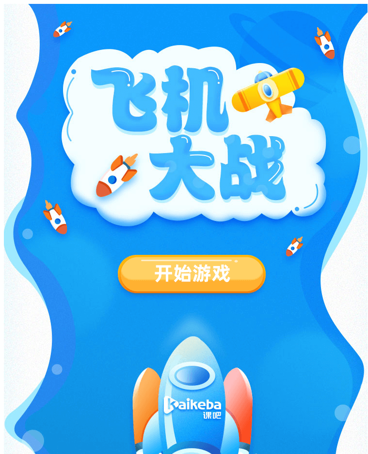

- 认识 composition API

## 设计动机

- 更好的逻辑复用与代码组织（相对于 mixin 而言更加灵活）
- 更好的类型推导（Vue2在设计之初对类型的推导并没有做的很好）

## 飞机大战

- 页面跳转
- 地图滚动
- 我方战机
- 敌方飞机
- 碰撞检测
- 发射子弹

在开始之前，我们需要在 webpack.config.js 中添加一个 file-loader 来处理图片：

```js
// ./webpack.config.js
const { resolve } = require('path')

module.exports = {
  entry: './main.js',
  output: {
    filename: '[name].js',
    path: resolve(__dirname, './dist')
  },
  devtool: 'source-map',
  devServer: {
    contentBase: resolve(__dirname, './dist')
  },
  module: {
    rules: [
      {
        test: /\.(png|jpe?g|gif)$/i,
        use: [
          {
            loader: 'file-loader',
            options: {
              outputPath: 'assets/',
              publicPath: ''
            }
          }
        ]
      }
    ]
  }
}
```

然后回到自定义渲染器 runtime-canvas 上面新增几个 API：

```js
// ./runtime-canvas/index.js
import { createRenderer } from '@vue/runtime-core';
import { Graphics, Text } from 'pixi.js'

// 创建一个 renderer
const renderer = createRenderer({
  createElement(type) {
    // 根组件 App 里的虚拟DOM 标签
    console.log(type);
    // 绘制一个矩形
    // 使用 pixi 
    let element;
    if (type === "rect") {
      element = new Graphics()
      element.beginFill(0xff0000)  // 红色矩形
      element.drawRect(0,0,500,500)  // x y 宽高
      element.endFill()  // 结束绘制
    }
    if (type === "circle") {
      element = new Graphics()
      element.beginFill(0xffff00)  // 红色矩形
      element.drawCircle(0,0,50)  // x y 半径
      element.endFill()  // 结束绘制
    }
    return element
  },
  patchProp(el, key, prevValue, nextValue) {
    // pixi
    // el.x = value
    // el.y = value
    el[key] = nextValue
  },
  setElementText(node, text) {
    const cText = new Text(text)
    node.addChild(cText)
  },
  createText(text) {
    return new Text(text)
  },
  insert(el, parent) {
    console.log(el);      // createElement 创建的 canvas
    console.log(parent);  // pixi 的容器

    // 把元素添加到容器里
    parent.addChild(el)
  },
  // 新加
  // 处理注释
  createComment() {},
  // 获取父节点
  parentNode() {},
  // 获取兄弟节点
  nextSibling() {},
  // 删除节点调用
  remove(el) {
    const parent = el.parent;
    parent && parent.removeChild(el);
  }
})

export function createApp(rootComponent) {
  return renderer.createApp(rootComponent)
}
```

接下来我们开始进行构建飞机大战：

1. 构建一个开始界面

### 构建开始界面

那么首先我们在 src 中新建一个 page 文件夹，用来存放页面并在里面新建一个 StartPage.js：

```js
// ./src/page/StartPage.js
import { h, defineComponent } from '@vue/runtime-core';
import startPageImg from '../../assets/start_page.jpg';
import startBtnImg from '../../assets/startBtn.png';

export default defineComponent({
  render() {
    // 首先设置开始页面的背景图片
    // <div></div>
    // 使用 pixi.js

    // Container 表示外层容器
    // Sprite 表示图片 texture 表示图片路径
    return h("Container", [
      h("Sprite", {
        texture: startPageImg
      }),
      h("Sprite", {
        texture: startBtnImg,
        x: 228,
        y: 515
      })
    ])
  }
})
```

然后我们就需要改一下渲染器里的 API 了，主要是 createElement 和 patchProps 这两个 API，因为里面涉及到渲染图片和图片路径属性：

```js
mport { Graphics, Text, Container, Sprite, Texture } from 'pixi.js'

createElement(type) {
    // 根组件 App 里的虚拟DOM 标签
    console.log(type);
    // 绘制一个矩形
    // 使用 pixi 
    let element;
    switch (type) {
        case 'Container':
            element = new Container()
            break;
        case 'Sprite':
            element = new Sprite()
            break;
        case 'rect':
            element = new Graphics()
            element.beginFill(0xff0000)  // 红色矩形
            element.drawRect(0,0,500,500)  // x y 宽高
            element.endFill()  // 结束绘制
            break;
        case 'circle':
            element = new Graphics()
            element.beginFill(0xffff00)  // 黄色圆形
            element.drawCircle(0,0,50)  // x y 半径
            element.endFill()  // 结束绘制
            break;
        default:
            break;
    }
    return element
},
patchProp(el, key, prevValue, nextValue) {
    // pixi
    // el.x = value
    // el.y = value
    // el[key] = nextValue 测试，只是用来测试文字
    // Texture.from(nextValue) 用来构建一张图片
    switch (key) {
        case 'texture':
            el.texture = Texture.from(nextValue);
            break;

        default:
            el[key] = nextValue;
            break;
    }
},
```

那再将 StartPage 组件导入 App.js 中：

```js
// 根组件
import { defineComponent, h } from '@vue/runtime-core'
// import Circle from './component/Circle'
import StartPage from './page/StartPage'

export default defineComponent({
    render() {
        /**
     * 这是测试 demo 画了一个矩形和一个圆
     * 创建 vnode，为了支持 tree shaking 所有的模块都需要导入进来
     * const vnode = h("rect", { x: 100, y: 100 }, [
     * '这是 vue3',
     * h("circle", { x: 150, y: 150 })
     * h(Circle)
     * ]);
     * return vnode
     */
        return h("Container", [h(StartPage)])
    }
})
```

即可在页面中看到飞机大战的开始页面已经好了：



接下来就是点击开始之后切换到正儿八经的游戏页面了：

2. 切换组件进入游戏

### 构建地图页面

那首先我们进入游戏以后是需要一个地图来支撑的，所以这里我们还需要一个地图页面，同样在 page 目录下新建一个 GamePage.js：

```js
// ./page/GamePage.js
import { h, defineComponent } from '@vue/runtime-core';
import mapImg from '../../assets/map.jpg'

// 只展示 map
export default defineComponent({
    render() {
        return h("Container", [
            h("Sprite", {
                texture: mapImg
            })
        ])
    }
})
```

这个页面我们只需要地图即可，所以关键点放在了如何从开始页面切换到地图页面。注意，我们这里并不是切换路由，这里是直接切换组件，所以需要的只是一个点击事件：

```js
render(ctx) {
    // 首先设置开始页面的背景图片
    // <div></div>
    // 使用 pixi.js

    // Container 表示外层容器
    // Sprite 表示图片 texture 表示图片路径
    return h("Container", [
      h("Sprite", {
        texture: startPageImg
      }),
      h("Sprite", {
        texture: startBtnImg,
        x: 228,
        y: 515,
        interactive: true,  // 点击开关，设置为 true 才可点击
        onClick: () => {
            console.log('click')
        }
      })
    ])
  }
```

那么在 pixi.js 中我们还需要在 runtime-canvas 中再对 onClick 属性进行判断：

```js
patchProp(el, key, prevValue, nextValue) {
    // pixi
    // el.x = value
    // el.y = value
    // el[key] = nextValue 测试，只是用来测试文字
    // Texture.from(nextValue) 用来构建一张图片
    switch (key) {
        case 'texture':
            el.texture = Texture.from(nextValue);
            break;
        case 'onClick':
            // pixi 监听 pointertap 来触发点击事件
            el.on('pointertap', nextValue);
            break;
        default:
            el[key] = nextValue;
            break;
    }
},
```

根据 pixi 的 API ，要监听点击事件是要通过 pointertap 来实现的。所以这里我们来监听它。

配置好之后就可以实现点击事件了。

那么现在就是需要将子组件点击后的消息发送给父组件，父组件接收之后再进行页面组件的切换，所以问题来了，在 Vue 3 中如何实现 emit ？

首先，在 vue3 中新增了一个入口函数——setup，所有东西都要在这个函数中进行调用。

```js
setup(props, ctx) {
    // 没有了 this
    // 源码中 ctx => SetupContext => 三个参数 { attrs, slots, emit }
    // 可以返回一个对象，这个对象会被挂载到 ctx 上，然后将 ctx 传到 render
    
    // 我们将点击事件写到 setup 中来并挂载到 ctx 上面
    const onClick = () => {
        ctx.emit('changePage', 'GamePage')
    }
    
    return {
        onClick
    }
}
```

当将 setup 函数设置好以后，再去 render 函数中传入 ctx，并将对应的 onClick 修改：

```js
render(ctx) {
    // 首先设置开始页面的背景图片
    // <div></div>
    // 使用 pixi.js

    // Container 表示外层容器
    // Sprite 表示图片 texture 表示图片路径
    return h("Container", [
      h("Sprite", {
        texture: startPageImg
      }),
      h("Sprite", {
        texture: startBtnImg,
        x: 228,
        y: 515,
        interactive: true,  // 点击开关，设置为 true 才可点击
        onClick: ctx.onClick
      })
    ])
  }
```

注意这里的一个参数**interactive**，我们必须将它设置为 true，用来开启点击事件。

OK，接下来就是重头戏了，我们需要在父组件中去接收子组件传递过来的值，并对应的切换组件：

```js
// 根组件
import { defineComponent, h, computed, ref } from '@vue/runtime-core'
import StartPage from './page/StartPage'
import GamePage from './page/GamePage'

export default defineComponent({
  setup() {
    // 改变 string 来实现组件切换
    // 在 vue3 中使用 ref 来创建响应式对象 接收值类型的
    let currentPageName = ref('StartPage')
    /**
     * {
     *   value: 'StartPage',
     *   _v_isRef: true
     * }
     */

    // 使用计算属性来修改对应的组件
    // computed 创建出来的也是 ref 响应式对象
    const currentPage = computed(() => {
      if (currentPageName.value === 'StartPage') {
        return StartPage
      } else if (currentPageName.value === 'GamePage') {
        return GamePage
      }
    })

    return {
      currentPage,
      currentPageName
    }
  },
  render(ctx) {
    /**
     * 这是测试 demo 画了一个矩形和一个圆
     * 创建 vnode，为了支持 tree shaking 所有的模块都需要导入进来
     * const vnode = h("rect", { x: 100, y: 100 }, [
     * '这是 vue3',
     * h("circle", { x: 150, y: 150 })
     * h(Circle)
     * ]);
     * return vnode
     */
    return h("Container", [h(ctx.currentPage, {
      onChangePage(page) {
        // 接收子组件传递的消息，框架规定使用 on 拼接，并将第一个字母大写
        // 在 render 里会自动把 value 解构出来，所以不用手动调用
        ctx.currentPageName = page
      }
    })])
  }
})
```

我们先在 setup 函数中定义一个响应式对象，使用 **ref** 来创建，同时使用 **computed** 来根据前一个数据返回不同的组件：

```js
setup() {
    let currentPageName = ref('StartPage');
    
    const currentPage = computed(() => {
      if (currentPageName.value === 'StartPage') {
        return StartPage
      } else if (currentPageName.value === 'GamePage') {
        return GamePage
      }
    })
    
    return {
      currentPage,
      currentPageName
    }
}
```

再在 render 函数中使用 ctx 中的变量来操控要渲染的组件即可：

```js
render(ctx) {
    return h("Container", [
        h(ctx.currentPage, {
            onChangePage(page) {
                ctx.currentPageName = page
            }
        })
    ])
}
```

onChangePage 这里是从子组件传过来的，接收子组件传递的消息，vue3规定使用 on 来进行拼接，且第一个字母（返回来的）要大写。

::: tip

ref 构建的响应式数据的格式是这样的：

```js
{
    value: '值',
    _v_isRef: true
}
```

所以在 setup 函数中要获取 currentPageName 的时候需要加上 `.value`，至于为什么在 render 函数中不用，是因为 render 函数内部会自动把 value 解构出来，所以不用手动调用。

:::