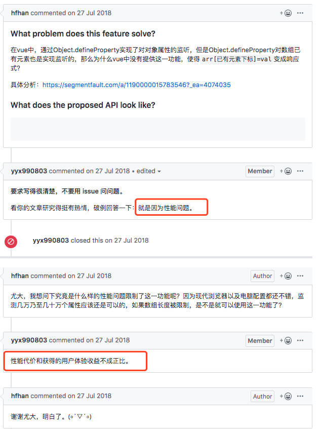

## 什么是响应式？

直观一点讲：数据改变页面更新，页面更新改变数据。当然名字也很多，比如双向数据绑定、数据驱动等等。

## Vue2.x 响应式原理

Vue2.x 实现数据双向绑定的原理是调用了 Object 的 `defineProperty` API。通过 `setter\getter` 来劫持各个属性。这里还涉及到发布订阅模式，当属性数据变动的时候，就会发布信息给订阅者，触发相应的监听回调。

常规方式去添加和修改对象属性：

```js
var obj = {}
obj.name = 'cecil';
onsole.log(obj);  // { name: 'cecil' }
```

而使用 `Object.defineProperty` 添加或修改对象属性的话，我们先要知道 `defineProperty` 的一些属性和方法：

首先我们说 `Object.defineProperty` 方法会直接在一个对象上定义一个新属性，或者说修改一个对象的现有属性，并返回此对象。

语法：
```js
Object.defineProperty(
  obj,              // 要定义属性的对象
  prop,             // 要定义或修改的属性名或 Symbol
  descriptor        // 要定义或修改的属性描述符
)
```

我们经常会用赋值的方式添加属性，这种属性是可枚举的，在枚举对象属性时会被枚举到（`for...in` 或 `Object.keys` 方法），可以改变这些属性的值，也可以删除这些属性。

默认情况下，使用 `Object.defineProperty` 添加的属性值是不可修改的。但是也允许修改默认的额外配置项。

对象里目前存在的属性描述符有两种主要形式：
::: tip
1. 数据描述符：一个具有值的属性，该值是可写的，当然也可以是不可写的；
2. 存取描述符：是由 `getter` 和 `setter` 函数所描述的属性。
:::

一个描述符只能是这两者其中之一，不能同时具有两种描述符。

这两种描述符都是对象。它们共享一下属性：
::: tip
- enumerable: 属性是否可枚举，默认是 false
- configurable: 属性是否可被删除，以及除 `value` 和 `writable` 特性外的其他特性是否可以被修改，默认是 false
- writable: 属性是否只读，默认 false
- value：属性的值，默认是 undefined
:::

存取描述符还具有以下可选键值：
::: tip
- get：属性的 `getter` 函数，如果没有 `getter`，则默认为 `undefined`。当访问该属性时，会调用此函数。执行时不传入任何参数，但是会传入 `this` 对象（由于继承关系，这里的 `this` 并不一定是定义该属性的对象）。该函数的返回值会被用作属性的值。
- set：属性的 `setter` 函数，如果没有 `setter`，则默认为 `undefined`。当属性值被修改时，会调用此函数。该方法会接受一个参数（也就是被赋予的新值），会传入赋值时的 `this` 对象。
:::

画个表应该更直观：
|  | configurable | enumerable | value | writable | get | set |
| - | - | - | - | - | - | - |
| 数据描述符 | 可以 | 可以 | 可以 | 可以 | 不可以 | 不可以 |
| 存取描述符 | 可以 | 可以 | 可以 | 可以 | 可以 | 可以 |

> 这些选项不一定是自身属性，也要考虑继承来的属性。为了确保保留这些默认值，在设置之前，可能要冻结 `Object.prototype`，明确指定所有的选项，或者通过 `Object.create(null)` 将 `__proto__(en-US)` 属性指向 `null`。

这里需要注意一点的就是继承。

如果访问者的属性是被继承的，那它的 `get` 和 `set` 方法会在子对象的属性被访问或者修改时被调用。如果这些方法用一个变量存值，该值会被所有对象共享。如果不想这样，就在内部设置一个值即可。

```js
function myclass() {
}

var value;
Object.defineProperty(myclass.prototype, "x", {
  get() {
    return value;
  },
  set(x) {
    value = x;
  }
});

Object.defineProperty(myclass.prototype, "y", {
  get() {
    return this.stored_x;
  },
  set(x) {
    this.stored_x = x;
  }
});


var a = new myclass();
var b = new myclass();
// 数据共享
a.x = 1;
console.log(b.x); // 1

// 数据不共享，不像访问者属性，值属性始终在对象自身上设置，而不是一个原型
a.y = 1;  // 1
console.log(b.y); // undefined
```

当然，如果一个不可写的属性被继承，它仍然可以防止修改对象的属性。

## 一，数据描述

```js
var vm = {}
Object.defineProperty(vm, 'name', {
  value: 'cecil',
  writable: true,
  configurable: true,
  enumerable: true
})

console.log(vm);  // { name: 'cecil' }

Object.defineProperty(vm, 'age', {
  value: 27,
  writable: false,
  configurable: false,
  enumerable: true
})

vm.age = 18;
console.log(vm.age);  // 依旧是 27，因为是只读，不可被修改
```

## 二、存储描述

```js
/**
 * set 方法 当我们修改属性的时候，会执行这个方法，新属性的值作为参数传递进来，默认值为 undefined
 * get 方法，当我们访问属性的时候，会执行这个方法，默认值是 undefined
 */

let name = '',
    getCount = 0,
    setCount = 0;

Object.defineProperty(vm, 'obs', {
  get: function () {
    console.log(`访问了 GET ${++getCount}次`);
    return name;
  },
  set: function (val) {
    console.log(`设置了 SET ${++setCount}次`);
    name = val;
  }
})

vm.obs;
vm['obs'];
vm.obs = '憨憨';
vm.obs = '真憨憨';
```

::: tip 缺陷
### 缺陷一：无法检测到对象属性的添加和删除

这个很好理解，因为 JavaScript 本身的动态性，可以为对象追加新的属性或者删除其中的某个属性，而 `Object.defineProperty` API 创建的响应式对象，只能监听已有属性的修改变化，但是对于新添加或者删除的属性，就没办法监听到。

### 缺陷二：不能检测数组长度的变化，准确的说是通过改变length而增加的长度，所以也就不能监听到原生数组的一些方法

为什么会这样呢？

首先我们要知道数组的 `length` 属性，被初始化为：
```js
{
  enumberable: false,
  configurable: false,
  writable: true
}
```

也就是说 `length` 属性默认是不可枚举的，也是不能被删除和修改（不是赋值）的。那此时如果再要使用 `defineProperty` 去修改 `length` 的话就是行不通的。

而当我们给数组添加新值之前，Vue 在构造函数中就已经为所有属性做了检测绑定的操作，所以后续动态添加的值和属性肯定也是监听不到的。 

而 Vue2.x 官方文档中也指出，不能监听在数组中利用索引直接设置一个项，和修改数组的长度。第二个的原因，前面已经指出为什么了。那第一个的原因，是为什么呢？是 `Object.defineProperty` API 自身不具备这种能力吗？

来看个例子吧

```js
function defineReactive(data, key, value) {
  Object.defineProperty(data, key, {
    enumerable: true,
    configurable: true,
    get: function () {
      console.log(`GET KEY ${key} VALUE ${value}`);
      return value;
    },
    set: function (val) {
      console.log(`SET KEY ${key} VALUE ${value}`);
      value = val;
    }
  })
}

function observe(data) {
  Object.keys(data).forEach((key) => {
    defineReactive(data, key, data[key]);
  })
}

let arr = [1, 2, 3]
observe(arr);
```

然后我们在控制台可以测试一下：


可以看到，通过索引来改变 `arr[2]` 是可以触发 set 的，那 Vue2.x 为什么没有实现呢？



Vue 的作者尤雨溪解释是因为性能问题。
:::

所以从这里来看的话，`Object.defineProperty` API 对于数组和对象来说，其表现是一样的，数组的索引可以看成是对象的 `key`：
- 当我们访问数组或者对象的某个属性值时，就会触发 `getter` 和 `setter`；
- 对于数组来说，只要是新增的值，都不会被监听到；
- 而如果使用 pop 或者 shift 方法删除数组中的元素，则会更新索引，从而触发 `getter` 和 `setter`。

## Vue3.x 响应式原理

Vue3.x 版本跟 Vue2.x 相比，变化还是蛮大的，首先从响应式实现原理上就做出了很大的改变，Vue2.x 是使用 `Object.defineProperty` 来实现的响应式，而 Vue3.x 则是使用 `Proxy` 代理来实现的响应式。

从代码结构上 Vue3.x 的响应式代码是放在 `./packages/reactivity` 目录里的，而且其本身都是使用 TypeScript 进行重构的。

我们说 Vue3.0 是基于 proxy 来做数据劫持代理的，这是 ES6 新增的 API，有些浏览器是不支持的，而且在兼容性上只兼容 IE11+，现在 Vue3.0 已经不再支持 IE 浏览器（IE 浏览器正在逐渐退出历史舞台）。

proxy 和 reflect 都是 ES6 为了操作对象引入的 API。

Proxy 可以对目标对象的读取，函数调用等操作进行拦截，然后进行操作处理，它不直接操作对象，而是像代理模式一样，通过对象的代理对象进行操作，在进行这些操作的时候，可以额外的添加一些其他的操作。

## 实现迷你Vue3的响应式

```js
// 触发视图更新
const updateView = (update) => {
  console.log(`视图更新 ${update}`);
}

const isObject = target => typeof target === 'object' && (target !== null)

// Vue3.0 暴露出来的是 reactive，但是实际调用的是 createReactiveObject 方法
const reactive = target => {
  if (!isObject(target)) return;
  const handlers = {
    set(target, key, val) {
      updateView('SET');
      return Reflect.set(target, key, val)
    },
    get(target, key) {
      updateView('GET');
      return Reflect.get(target, key);
    }
  }

  const proxy = new Proxy(target, handlers);

  return proxy;
}

const state = reactive({
  name: 'cecil_he',
  info: {
    age: 16,
  },
  arr: [1,2,3,4]
});

state.name = '憨憨';
state.info.age = 18;
state.arr = ['a', 'b', 'c']
console.log(state); // get 会执行 5 次
```

那使用 Proxy 的好处在哪里呢？

基于 Proxy 和 Reflect，可以做到原生支持响应式，可以原生监听数组，可以监听对象属性的添加和删除，并且不需要一次性遍历 data 属性，从而显著提供性能。

reflect 可以用于获取目标对象的行为，它与 Object 类似，但是更容易进行读，为操作对象提供了一种更优雅的方式。

Vue3.0 的 vdom 是全部通过 Typescript 重写了的，其核心思想：跳过静态节点，只处理动态节点，弱化了类的概念，通过组合 API 提供代码的可复用性和可维护性。

**那么我们如何实现一个迷你版的 Vue 呢**？

这里我们借助 Vue3.0 的 reactivity 响应式库来写一个迷你版 Vue。

首先我们要知道在 Vue3.0 里响应式库已经被抽离出来，可以单独去用了，所以我们新建一个项目叫 `mini-vue`：

```shell
mkdir mini-vue

cd mini-vue

npm init -y

touch index.html
```

然后在 `index.html` 中引入入口文件 `main.js`，因为是使用 `script` 标签的方式去引入的，所以这里需要加上 `type=module`:

```html
<!DOCTYPE html>
<html lang="en">
<head>
  <meta charset="UTF-8">
  <meta http-equiv="X-UA-Compatible" content="IE=edge">
  <meta name="viewport" content="width=device-width, initial-scale=1.0">
  <title>Document</title>
</head>
<body>
  <div id="app"></div>
  <!-- 因为在浏览器端，所以 script 要加上 type -->
  <script type="module" src="./main.js"></script>
</body>
</html>
```

然后我们去创建 `main.js`:

```js
import { createApp } from './core/index.js';
import { App } from './App.js'

createApp(App).mount(document.querySelector('#app'))
```

这里面呢，`core` 目录是存放核心代码的地方，而 `App` 相信大家都很熟悉了，就是我们的根组件。

在说这个核心目录之前，我们先看看如何简单粗暴的利用 `reactivity` 库实现数据驱动视图的效果。

```js
// 首先安装vue3.0 里响应式库
npm i @vue/reactivity -S

// 然后引入浏览器的 js 文件
import { ref, reactive, effect } from './node_modules/@vue/reactivity/dist/reactivity.esm-browser.js'

// 计算属性 computed 底层就是 effect => 作用就是响应式的收集和触发依赖

const a = ref(10)
let b;

// 一进来就执行
effect(() => {
  b = a.value + 10;
  console.log(b);
})
a.value = 20;
```

::: tip 代码执行解析

1. 在浏览器控制台会先出来一个 20，因为一进函数就执行了 effect
2. 然后出来一个 30，当a.value 的值改变之后，再次调用 effect 函数

**那它是什么时候触发的依赖收集呢**？

当代码一进来执行到 effect 里的 a.value 的时候，会触发 get 操作，从而将 effect 里的匿名函数收集进来，作为 a 的响应式数据的依赖存在。

**那么什么时候去触发依赖呢**？

当我们的 a 的值发生改变的时候，会触发 set 操作，从而遍历之前所有收集到的依赖，也就是之前在 effect 里的匿名函数，并且执行。

:::

我们来看一段更加直观的：

```js
const str = ref(10);

window.a = str;
const view = () => {

  // 最核心的点  update

  const div = document.createElement('div');
  div.textContent = 'hello mini-vue ->' + str.value;
  document.querySelector('#app').append(div);
}

effect(() => {
  view()
})
```

当我们刚进页面的时候，会发现页面上展示了 `hello mini-vue -> 10`，而当我们打开控制台，并且输入 `a++` 之后，就会发现，页面会新增一个 `div` 标签进去，显示 `hello mini-vue -> 11` ，重复操作，会重复添加标签，并且后面的值递增。

不过这里有一个很明显的问题，假如此时我们在添加一个 p 标签进去，如下：

```js
document.querySelector('#app').textContent = '';
const div = document.createElement('div');
const p = document.createElement('p');
div.textContent = 'hello mini-vue ->' + context.a.value;
p.textContent = 'ppp';
div.appendChild(p);
document.querySelector('#app').append(div);
```

那么当改变 `a.value` 的时候，里面的 `p` 标签页会一起被改变，这就会有一个性能问题，而为了解决这个性能问题，就需要引入 DIFF 算法。

还有一个问题就是我们总不能每次都调 `effect` 这个方法吧，在 render 函数中我们要做的就是返回一个视图出去即可。

所以总结起来，这里要解决的两个问题：

1. 公共流程我们需要抽离出来
2. 引入 DIFF 算法

那么解决第一个问题的方法，就是前面提到的核心代码目录 `core`。

1. `index.js`

   ```js
   // 入口文件，这个文件的主要作用是将功能代码抽离到一起，方便在项目中引用，不做任何逻辑处理
   export * from '../node_modules/@vue/reactivity/dist/reactivity.esm-browser.js'
   // 引入并导出 createApp
   export * from './createApp.js'
   // 引入并导出 h
   export * from './h.js'
   ```

2. `createApp.js`

   ```js
   import { effect } from './index.js'
   import { mountElment, diff } from './renderer.js'
   
   export function createApp(rootComponent) {  // 传进来一个根组件
     // app
     return {
       mount(rootContainer) {  // 直接传进来一个根容器进来
         
         const result = rootComponent.setup();
         let isMounted = false;
         let prevSubTree;
   
         effect(() => {
           // init
           if (!isMounted) {
             isMounted = true;
             // reset
             rootContainer.textContent = '';
             // const element = rootComponent.render(result);
             
             // 当我们返回虚拟节点树的时候，就不能使用上面的表达式了
             const subTree = rootComponent.render(result);
             // 而这里我们必须将其转换为一个真实的节点才能添加到浏览器当中去
             mountElment(subTree, rootContainer)
             // 之前的节点数据
             prevSubTree = subTree;
           } else {
             // 得到新的虚拟节点树
             const subTree = rootComponent.render(result);
             console.log(prevSubTree, subTree);
             // 使用 diff 算法进行对比
             diff(prevSubTree, subTree);
             prevSubTree = subTree;
           }
         })
       },
     }
   }
   ```

3. `h.js`

   ```js
   // create vnode
   
   /**
    * 我们先来分析一下怎么创建一个 DOM
    * 1. 首先我们需要一个标签 tag
    * 2. 还可能需要设置各种属性 props
    * 3. 还要有内容 children
    */
   
   export function h (tag, props, children) {
     return {
       tag,
       props,
       children
     }
   }
   ```

4. `renderer.js`

   ```js
   /**
    * 创建DOM节点
    * @param {节点标签} type 
    * @returns 节点
    */
   function createElement(type) {
     return document.createElement(type);
   }
   
   /**
    * 设置属性
    * @param {节点} el Object
    * @param {节点 key} key 
    * @param {*} prevValue 
    * @param {*} nextValue 
    */
   function patchProp(el, key, prevValue, nextValue) {
     if (nextValue === null) {
       el.removeAttribute(key);
   
       return;
     }
     el.setAttribute(key, nextValue);
   }
   
   function createTextNode(text) {
     return document.createTextNode(text);
   }
   
   function insert(el, parent) {
     parent.append(el);
   }
   
   function remove(el, parent) {
     parent.removeChild(el);
   }
   
   /**
    * 将虚拟节点转换为真实 DOM
    * @param {虚拟节点} vnode 
    * @param {添加到哪个容器} container 
    */
   export function mountElment (vnode, container) {
     // 如何把一个虚拟节点转换成真实节点
     // vnode ->  element
     const { tag, props, children } = vnode;
     // tag
     const element = (vnode.el = createElement(tag));
     // props
     Object.keys(props).forEach((key) => {
       patchProp(element, key, null, props[key]);
     });
     // children
     // string | array
     if (typeof children === 'string') {
       const textNode = createTextNode(children);
       insert(textNode, element);
     } else if (Array.isArray(children)) {
       // 此时的根节点是 element
       children.forEach((v) => mountElment(v, element));
     }
   
     // insert
     insert(element, container);
   }
   
   export function diff(n1, n2) {
     // tag
     if (n1.tag !== n2.tag) {
       // 替换挂载的 DOM
       n1.el.replaceWith(n2.el = createElement(n2.tag))
     } else {
       // 如何 tag 一致，那我们就对比 props 和 children
       // props
       const el = (n2.el = n1.el);
       const { props: oldProps } = n1;
       const { props: newProps } = n2;
       // 1. old { id: 1 }  new { id }
       Object.keys(newProps).forEach((key) => {
         if (oldProps[key] !== newProps[key]) {
           // 两个值不一样，需要更新
           patchProp(el, key, oldProps[key], newProps[key]);
         }
       });
       // 2. old { id, class } new { id }
       Object.keys(oldProps).forEach((key) => {
         if (!(key in newProps)) {
           patchProp(el, key, oldProps[key], null)
         }
       })
       // children
       // 在真实源码中是特别复杂的，今天实现的是一个暴力算法
       const { children: oldChildren } = n1;
       const { children: newChildren } = n2;
       // 1. newChildren -> string -> oldChildren (string | array)
   
       if (typeof newChildren === "string") {
         if (typeof oldChildren === "string") {
           if (newChildren !== oldChildren) {
             el.textContent = newChildren;
           }
         } else if (Array.isArray(oldChildren)) {
           el.textContent = newChildren;
         }
       }
       // 2. newChildren -> array ->  oldChildren (string | array)
       else if (Array.isArray(newChildren)) {
         if (typeof oldChildren === "string") {
           // reset
           el.textContent = ''
           newChildren.forEach((v) => mountElment(v, el));
         } else if (Array.isArray(oldChildren)) {
           /**
            * 1. 依次对比
            * new [a,b,c]
            * old [a,b,e]
            * 2. old 多出来的就需要删除
            * new [a,b]
            * old [a,b,c]
            * 3. new 多出来的就需要创建
            * new [a,b,c]
            * old [a,b]
            * 
            * 缺点--只是改变顺序，但是还是会重新创建，所以并不是最优的
            * old [a,b,c]
            * new [a,c,b]
            */
   
           // 求出公共长度
           const length = Math.min(newChildren.length, oldChildren.length);
           for(let i=0;i < length;i++) {
             const oldChild = oldChildren[i];
             const newChild = newChildren[i];
             diff(oldChild, newChild);
           }
   
           // old -> new ->  remove
           if (oldChildren.length > length) {
             for (let i = length; i < oldChildren.length; i++) {
               const vnode = oldChildren[i];
               remove(vnode.el, el);
             }
           }
   
           // new -> old ->  add
           if (newChildren.length > length) {
             for (let i = length; i < newChildren.length; i++) {
               mountElment(newChildren[i], el);
             }
           }
         }
       }
   
     }
     
   }
   ```

那么此时在 `App.js` 中：

```js
import { ref, h } from './core/index.js'

export const App = {
  render(context) {
    // const div = document.createElement('div');
    // div.textContent = 'hello mini-vue ->' + context.a.value;
    // return div

    // 使用 h 函数
    return h('div', { id: 1+context.a.value }, [h('p', {}, 'heihei'+context.a.value), h('p', {}, 'haha')])
  },
  setup() {
    const a = ref(10);
    window.a = a;
    return {
      a
    }
  }
}
```

