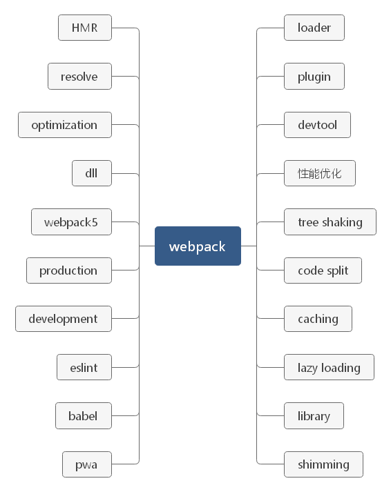

Webpack 是一个开源的 JavaScript 模块打包工具，其**最核心**的功能是**解决模块之间的依赖**，把各个模块按照特定的规则和顺序组织在一起，最终合并为一个JS文件（除非配置多个，最基本的情况为一个）。这个过程叫做模块打包。

Webpack 最初的目标就是实现前端项目的模块化，也就是说它所解决的问题是**如何在前端项目中更高效地管理和维护项目中的每一个资源**。

在 Webpack 看来，前端的所有资源文件都会作为模块处理。随着前端应用的日益复杂化，我们的项目已经逐渐膨胀到了不得不花大量时间去管理的程度。而模块化就是一种最主流的项目组织方式，它通过把复杂的代码按照功能划分为不同的模块单独维护，从而提高开发效率、降低维护成本。

它将根据模块的依赖关系进行静态分析，打包生成对应的静态资源（bundle）。

Webpack 有五个核心概念：

- Entry——入口

  - 指示 Webpack 以哪个文件为入口起点开始打包，分析构建内部依赖图。

- Output——输出

  - 指示 Webpack 打包后的资源 bundles 输出到哪里去，以及如何命名。

- Loader——预处理器

  - 让 Webpack 能够去处理那些非 JavaScript 文件。因为它自身只理解JavaScript。

- Plugins——插件

  - 可以用于执行范围更广的任务。

- Mode——模式

  - 对应开发模式。

    | 选项        | 描述                                                         | 特点                       |
    | ----------- | ------------------------------------------------------------ | -------------------------- |
    | development | 会将 process.env.NODE_ENV 的值设为 development。 启动 NamedChunksPlugin 和 NamedModulesPlugin。 | 能让代码本地调试运行的环境 |
    | production  | 会将 process.env.NODE_ENV 的值设为production。 启动FlagDependencyUsagePlugin, FlagincludedChunksPlugin, ModuleConcatenationPlugin, NoEmitOnErrorsPlugins, OccurrenceOrderPlugin, SideEffectsFlagPlugin 和 UglifyJsPlugin. | 能让代码优化上线运行的环境 |

除此之外，Webpack 还具备**代码拆分**的能力，它能够将应用中所有的模块按照我们的需要分块打包。这样一来，就不用担心全部代码打包到一起，产生单个文件过大，导致加载慢的问题。我们可以把应用初次加载所必需的模块打包到一起，其他的模块再单独打包，等到应用工作过程中实际需要用到某个模块，再异步加载该模块，实现**增量加载**，或者叫作**渐进式加载**，非常适合现代化的大型 Web 应用。

**学习新事物不是说学会它的所有用法你就能提高，因为这些照着文档操作基本上谁都可以做到，很多时候它的思想才是突破点。能搞明白新事物为什么这样设计，基本上就算出道了。**