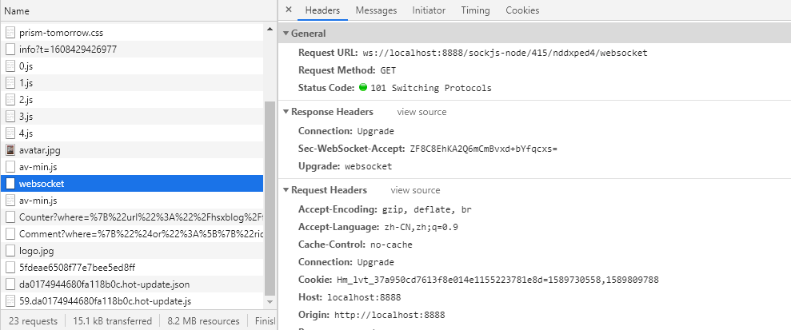
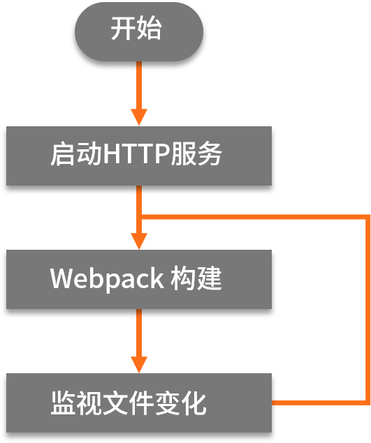
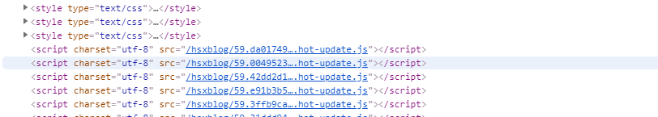
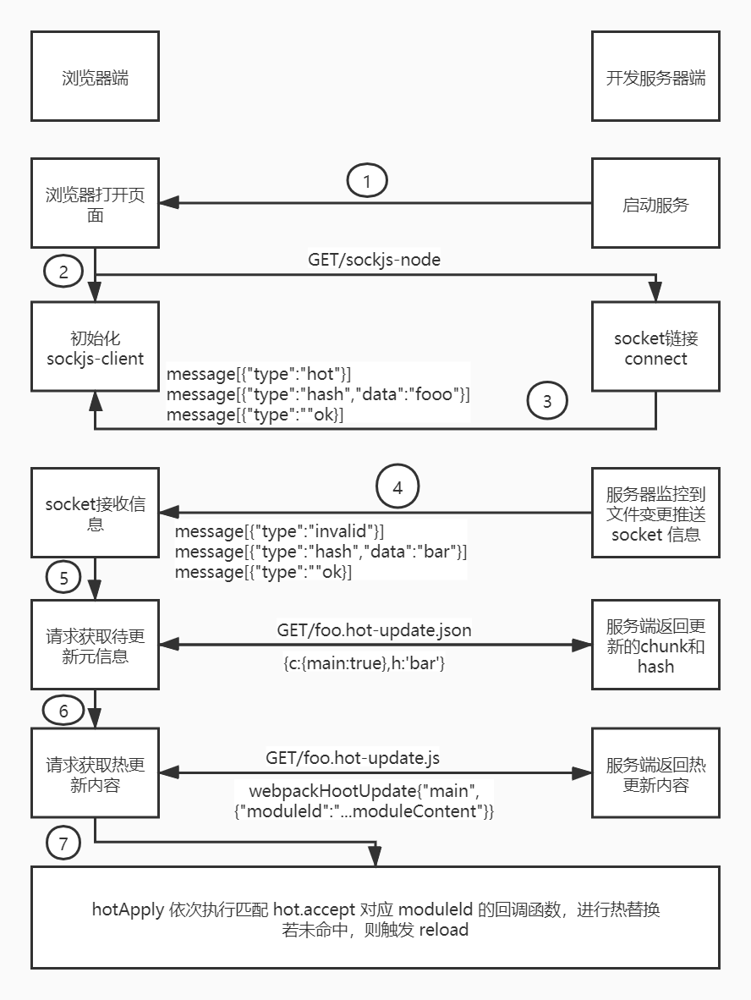
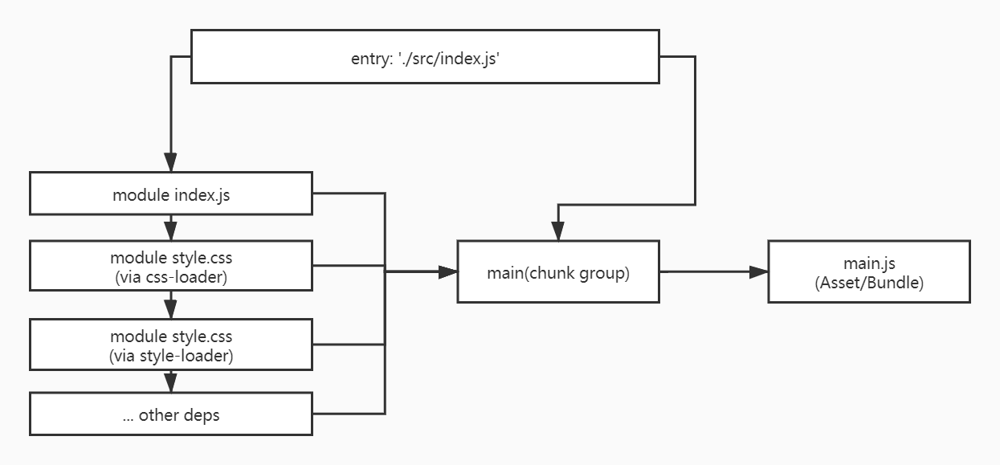
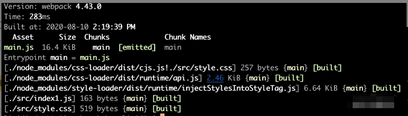
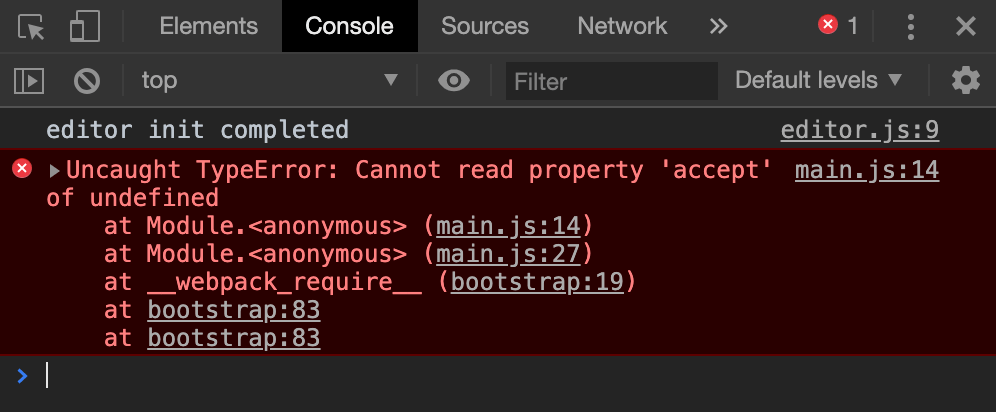
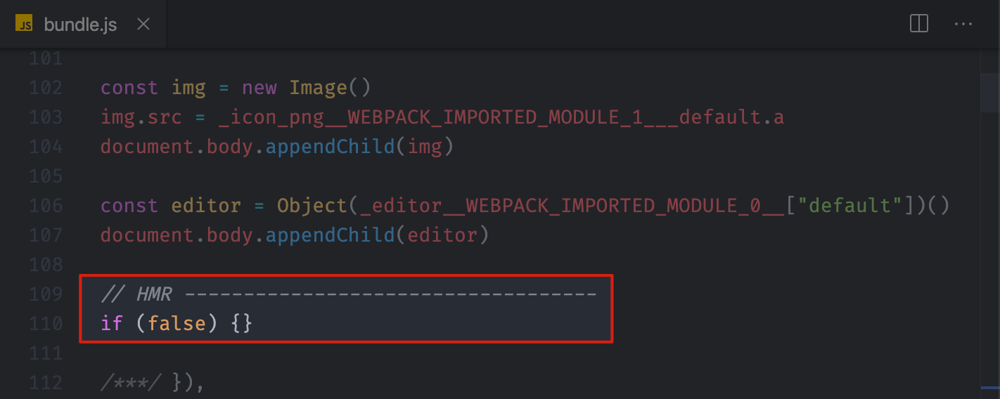

本文为笔者笔记，支持原创，[传送门](https://kaiwu.lagou.com/course/courseInfo.htm?courseId=416#/detail/pc?id=4416)

[[toc]]

## **什么是浏览器热更新**

- 热更新是保存后自动编译（auto compile）?
- 自动刷新浏览器（live reload）？
- 模块热替换（Hot Module Replacement）?

<strong style="color:orange">浏览器热更新</strong>，指的是：

在本地开发的同时打开浏览器进行预览，当代码文件发生变化时，浏览器自动更新页面内容的技术。

自动更新，表现为：

- 自动刷新整个页面
- 页面整体无刷新只更新页面的部分内容

## **一切依赖手动**

```javascript
// src/index0.js 
function render() { 
  div = document.createElement('div') 
  div.innerHTML = 'Hello World0'; 
  document.body.appendChild(div) 
} 
render() 

// webpack.config.basic.js 
module.exports = { 
  entry: './src/index0.js', 
  mode: 'development', 
} 

// package.json 
"scripts": { 
  "build:basic": "webpack --config webpack.config.basic.js"
}
```

当我们执行打包命令的时候，webpack会将 `entry` 中的源文件 `index0.js` 打包为 `dist/main.js`，**并退出流程。**

但是之后我们在改动源文件代码后，发现打包后的文件并没有更新，这是因为由于构建配置里没有任何对应处理。

而此时为了同步改动效果，我们需要再次手动执行该命令。

这种模式下，开发效率相较于其他模式会低很多。

## **watch模式**

webpack 中的 watch 模式，通过监控源码文件的变化来解决上面不能自动编译的问题。

```javascript
// webpack.config.watch.js
{
  watch: true
}

// package.json
"scripts": {
    "build:watch": "webpack --config webpack.config.watch.js"
}
```

同样进行打包后，当前进程并没有退出，而是继续**监控源文件内容是否发生变化**。当源文件发生变化后将再次执行该流程，直到用户主动退出。此时，打包内容也就随之更新了。

::: tip

除了在配置文件中加入参数外，也可以在 webpack 命令中增加 --watch 来实现。

:::

为了看到执行效果，需要在浏览器中进行预览，但是预览时会发现，即使产物文件发生变化，在浏览器里面仍然需要手动点击刷新才能看到变更后的效果。

所以，为了让我们能避免每次都手动刷新，需要更加有效的方法。

## **Live Reload**

热更新。

作用：为了使每次代码变更后浏览器中的预览页面能自动显示最新效果而无须手动点击刷新，需要**一种通信机制来连接浏览器中的预览页面与本地监控代码变更的进程**。

使用：webpack-dev-server

```javascript
// webpack.config.reload.js 
{
  devServer: { 
    contentBase: './dist', //为./dist目录中的静态页面文件提供本地服务渲染 
    open: true          //启动服务后自动打开浏览器网页 
  } 
} 

// package.json 
"scripts": { 
  "dev:reload": "webpack-dev-server --config webpack.config.reload.js" 
}
```

当我们启动项目以后，可以在日志里看到本地服务`http://localhost:8080`已启动，然后我们打开浏览器并输入网址，按F12打开控制台可以看到加载完页面和页面中引用的js文件后，服务还加载了路径前缀名为`/sockjs-node`的websocket链接。



通过  websocket 链接，就可以使打开的网页和本地服务间建立持久化的通信。当源代码发生变更时，我们就可以通过 Socket 通知到网页端，网页端在接到通知后会自动触发页面刷新。



不过这里需要注意的是，webpack-dev-server 为了提高工作速率，它并没有将打包结果写入到磁盘中，而是暂时存放在内存中，内部的 HTTP Server 也是从内存中读取这些文件的。这样一来，就会减少很多不必要的磁盘读写操作，大大提高了整体的构建效率。


但是随之而来还有一个问题，那就是：如果在一些表单中需要进行调试，如果当我们修改了源文件之后，发现页面被刷新了，之前输入表单里的数据都没有了，我们又不得不进行重复操作才能确认改动后的效果。这就又引出了一个新的方法——热替换。

## **热替换**

**热替换（Hot Module Replacement）**：为了解决页面刷新而导致的状态丢失问题。

```javascript
// src/index1.js 
import './style.css' 
...

// src/style.css 
div { color: red } 

// webpack.config.hmr.js 
{... 
  entry: './src/index1.js', 
  ... 
  devServer: { 
    ... 
    hot: true 
  }, 
  module: { 
    rules: [ 
      { 
        test: /\.css$/, 
        use: ['style-loader', 'css-loader'] 
      } 
    ] 
  } 
} 

// package.json 
"scripts": { 
  "dev:hmr": "webpack-dev-server --config webpack.config.hmr.js" 
}
```

- 首先我们在 devServer 配置中新增了 `hot:true`。
- 其次，新增 `module` 的配置，使用 style-loader 和 css-loader 来解析导入的 css 文件。
  - css-loader 处理的是将导入的 css 文件转化为模块供后续 loader 处理；
  - style-loader 则是负责将css模块的内容在运行时添加到页面的 style 标签中
- 当我们执行命令后，可以看到页面元素中css已经被添加到了页面头部新增的 style 标签中去了。

在修改源码中的 css 样式后，再回到网页，我们会发现：

1. 网络面板中，并没有重新请求，而是新增了两个请求：`hot-update.json`和`hot-update.js`。
2. 并且在页面元素中，在页面头部新增了 hot-update.js ，并替换了原先的 style 标签中的样式内容。



::: warning

注意：简单改动JS中的某些内容并不能达到热替换的效果。尽管网络同样新增了hot-update.json 和 hot-update.js ，但紧随其后的是如上一个实例一般的刷新了整个页面。[原因](./hot_update.html#模块热替换插件-hotmodulereplacementplugin)。

HMR功能对JS的处理，只能处理非入口JS文件的其他文件；而HTML也不能热更新（实际上可以在入口文件里加上HTML文件开启），因为就一个文件，原理和入口文件一样，开启热更新以后都会刷新页面。

:::

## **webpack中的热更新原理**

图中所示是 webpackDevServer 中 HMR 的基本流程图，完整的 HMR 功能主要包含了三方面的技术：

1. watch 示例中体现的，**对本地源代码文件内容变更的监控。**
2. instant reload 示例中体现的，**浏览器网页端与本地服务器端的 Websocket 通信。**
3. HMR 示例中体现的，是最核心的，**模块解析与替换功能。**



在这三种技术中，我们可以基于 Node.js 中提供的文件模块 fs.watch 来实现对文件和文件夹的监控，同样也可以使用 sockjs-node 或 socket.io 来实现 websocket 的通信。

## **webpack中的打包流程**

webpack术语：

- **module**：指在模块化编程中我们把应用程序分割成的独立功能的代码模块。
- **chunk**：指模块间按照引用关系组合成的代码块，一个chunk中可以包含多个 module。
- **chunk group**：指通过配置入口点（entry point）区分的块组，一个 chunk group 中可包含一到多个 chunk。
- **bundling**：webpack 打包的过程。
- **asset/bundle**：打包产物。

webpack 的打包思想：

1. 一切源代码文件均可通过各种 loader 转换为 JS 模块（**module**），模块之间可以互相引用。
2. webpack 通过入口点（**entry point**）递归处理各模块引用关系，最后输出为一个或多个产物包JS（bundle）文件。
3. 每一个入口点都是一个块组（**chunk group**），在不考虑分包的情况下，一个 chunk group 中只有一个 **chunk**，该 chunk 包含递归分析后的所有模块。每一个 chunk 都有对应的一个打包后的输出文件（**asset/bundle**）。





可以看到从 entry 中的 `'./src/index.js'`到打包产物的 dist/main.js，以模块的角度而言，其基本流程是：

1. 唯一 entry 创建一个块组（chunk group），name 为 main，包含了 ./src/index.js 这一个模块。
2. 在解析器中处理 ./src/index.js 模块的代码，找到了其依赖的 './style.css'，找到匹配的 loader: `css-loader`和 `style-loader`。
3. 首先通过 css-loader 处理，将 css-loader/dist/cjs.js!./src/style.css 模块（即把 css 文件内容转化为 js 可执行代码的模块，这里简称为 **Content模块**）和 css-loader/dist/runtime/api.js 模块打入到 chunk 中。
4. 然后通过 style-loader 处理，将 style-loader/dist/runtime/injectStylesIntoStyleTag.js 模块（这里我们简称为 **API模块**），以及处理后的 ./src/style.css模块（作用是运行时通过 API 模块将 Content 模块内容注入到 style 标签）导入 chunk 中。
5. 依次类推，直到所有依赖的模块均打入到 chunk 中，最后输出名为 main.js 的产物（我们称为 Asset 或 Bundle）。

那这些结果我们都可以到控制面板中的 Sources 面板中看到。

我们可以简化一下控制台中 style-loader 处理后的模块代码，只看其热替换相关的部分。

```javascript
// 为了清晰期间，我们将模块名称注释以及与热更新无关的逻辑省略，并将 css 内容模块路径赋值为
// 变量 cssContentPath 以便多处引用，实际代码可从示例运行时中查看 
var cssContentPath = "./node_modules/css-loader/dist/cjs.js!./src/style.css" 
var api = __webpack_require__("./node_modules/style-loader/dist/runtime/injectStylesIntoStyleTag.js"); 
var content = __webpack_require__(cssContentPath); 
// 调用  injectStylesIntoStyleTag 将样式注入 style 标签。返回值是一个函数
var update = api(content, options); 
// ... 
module.hot.accept( 
  cssContentPath, 
  function(){ 
    content = __webpack_require__(cssContentPath); 
    // 将新的样式内容更新到原 style 标签中
    update(content); 
  } 
) 

module.hot.dispose(function() { 
  // 移除注入的 style 标签。
  update(); 
});
```

可以看到，在运行时调用 API 实现将样式注入新生成的 style 标签，并将返回函数传递给 update 变量。

然后，在 module.hot.accept 方法的回调函数中执行 update(content)，在 module.hot.dispose 中执行 update()。

通过查看上面的API代码，可以发现 update(content)是将新的样式内容更新到原 style 标签中，而 update() 则是移除注入的 style 标签。

那么 module.hot 到底是什么呢？这里我们不得不说一下**模块热替换插件**。

## **模块热替换插件（HotModuleReplacementPlugin）**

那 module.hot 实际上时一个来自 webpack 的基础插件 HotModuleReplacementPlugin，该插件作为热替换功能的基础插件，其 API 方法导出到了 module.hot 的属性中。

**hot.accept**：传入依赖模块名和回调方法。当依赖模块发生更新时，其回调方法就会被执行，而开发者就可以在回调中实现对应的替换逻辑，即上面的用更新的样式替换原标签中的样式。

**hot.dispose**：传入一个回调，当代码上下文的模块被移除时，其回调方法就会被执行。如我们在源代码中移除导入的css模块时，运行时原有的模块中的 update() 就会被执行，从而在页面上就移除了对应的 style 标签。

所以这也就有了为什么我们替换 js 里的某些内容时，并没有触发热替换，而是整个页面的刷新：这是因为代码中并没有包含对热替换插件 API 的调用，代码的解析也没有配置额外能对特定代码调用热替换 API 的 loader。

当然，我们也可以实现一下 JS 中更新文本内容的热替换。

## **手动实现 JS 代码中的热替换**

```javascript
// ./text.js 
export const text = 'Hello World' 

// ./index2.js 
import {text} from './text.js' 
const div = document.createElement('div') 
document.body.appendChild(div) 
function render() { 
  div.innerHTML = text; 
} 
render() 

if (module.hot) { 
  module.hot.accept('./text.js', function() { 
    render() 
  }) 
}
```

对于开启 HMR 特性的环境中，我们可以访问到全局的 module 对象中的 hot 成员，这个成员也是一个对象，这个对象就是 HMR API 的核心对象，它提供了一个 accept 方法，用于注册当某个模块更新后的处理函数。accept 方法第一个参数接收的就是所监视的依赖模块路径，第二个参数就是依赖模块更新后的处理函数。

在这里我们把用于修改的文本文件单独作为一个 JS 模块，以便传入 hot.accept 方法。那么当文本发生变更时，可以观察到浏览器端显示最新内容的同时并未触发页面刷新。

当然，accept 方法也支持监控当前文件的变更，对应的 DOM 更新逻辑稍作调整也能达到无刷新效果，区别在于替换自身模块时示例中不可避免的需要操作DOM。

所以，**热替换的实现**：

1. 既依赖 webpack 核心代码中的 HotModuleReplacementPlugin 所提供的相关API，
2. 也依赖在具体模块的加载器中实现相应 API 的更新替换逻辑

因此，在配置中开启 hot: true 并不意味着任何代码的变更都能实现热替换。

在开发时遇到 HMR 不生效的情况时，可以优先确认对应加载器是否支持该功能，以及是否使用了正确的配置。

通过以上过程你应该能够发现，为什么 webpack 需要我们自己处理 JS 模块的热更新了：因为不同模块有不同的情况，不同的情况，在这里处理时肯定也是不同的。

## 常见问题

1. 如果处理热替换的代码（处理函数）中有错误，结果也会导致自动刷新。

   ```js
   // ./src/main.js
   // ... 其他代码
   module.hot.accept('./editor', () => {
     // 刻意造成运行异常
     undefined.foo()
   })
   ```

   直接测试会发现 HMR 不会正常工作，而且根本看不到异常。

   这是因为 HMR 过程报错导致 HMR 失败，HMR 失败过后，会自动回退到自动刷新，页面一旦自动刷新，控制台中的错误信息就会被清除，这样的话，如果不是很明显的错误，就很难被发现。

   在这种情况下，我们可以使用 hotOnly 的方式来解决，因为现在使用的 hot 方式，如果热替换失败就会自动回退使用自动刷新，而 hotOnly 的情况下并不会使用自动刷新，并且热替换逻辑中的错误信息也可以直接看到。

2. 对于使用了 HMR API 的代码，如果我们在没有开启 HMR 功能的情况下运行 webpack 打包，此时运行环境中就会报出 Cannot read property 'accept' of undefined 的错误。

   

   原因也很简单，因为 module.hot 是 HMR 插件提供的成员，没有开启这个插件，自然也就没有这个对象。

   解决办法：首先判断是否存在这个对象，然后再去使用就可以了。

3. 代码中写了很多与业务功能无关的代码，会不会对生产环境有影响？

   当我们关闭掉热替换，并且移除 HotModuleReplacePlugin 插件，打包后的代码如下：

   

   类似这种没有意义的判断，在压缩后会自动去掉，所以不会对生产环境有任何影响。