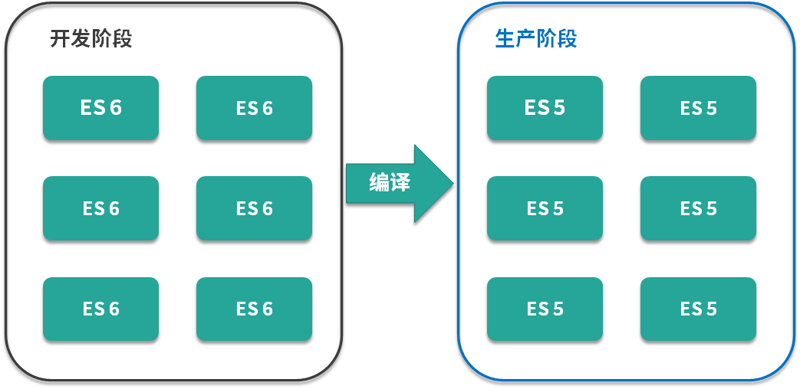
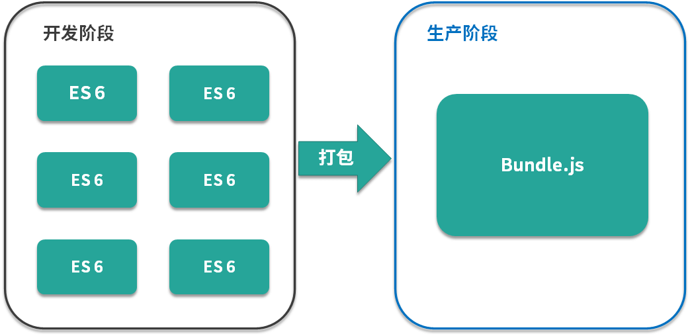
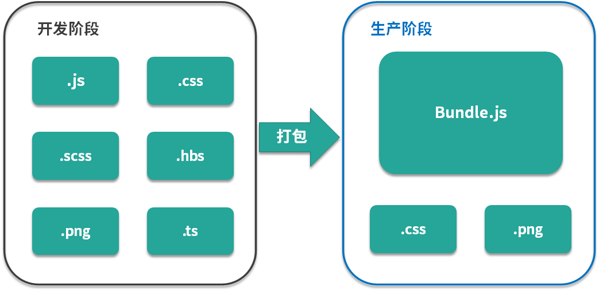

本文是笔者笔记，[原文链接](https://kaiwu.lagou.com/course/courseInfo.htm?courseId=550#/detail/pc?id=5276)

我们说 webpack 最初的目标就是实现前端项目的模块化，那今天咱们就来看看前端模块化的发展史。

[[toc]]

## 文件划分方式

最早的方式是通过文件划分来实现模块化，也就是 web 最原始的模块系统。具体做法是将每个功能及其相关状态数据各自单独放到不同的 JS 文件中，约定每个文件是一个独立的模块。使用某个模块将这个模块引入到页面中，一个 script 标签对应一个模块，然后直接调用模块中的成员（变量/函数）。

```md
└─ stage-1
    ├── module-a.js
    ├── module-b.js
    └── index.html
```

```javascript
// module-a.js 
function foo () {
   console.log('moduleA#foo') 
}
```

```javascript
// module-b.js 
var data = 'something'
```

```html
<!DOCTYPE html>
<html>
<head>
  <meta charset="UTF-8">
  <title>Stage 1</title>
</head>
<body>
  <script src="module-a.js"></script>
  <script src="module-b.js"></script>
  <script>
    // 直接使用全局成员
    foo() // 可能存在命名冲突
    console.log(data)
    data = 'other' // 数据可能会被修改
  </script>
</body>
</html>
```

缺点：

- 模块直接在全局工作，大量模块成员污染全局作用域；
- 没有私有空间，所有模块内的成员都可以在模块外部被访问或者修改；
- 一旦模块增多，容易产生命名冲突；
- 无法管理模块与模块之间的依赖关系；
- 在维护的过程中也很难分辨每个成员所属的模块。

这种原始 "模块化" 的实现方式完全依靠约定实现，一旦项目规模变大，这种约定就会暴露出种种问题，非常不可靠。

## 命名空间方式

基于上述问题，我们约定每个模块只暴露一个全局对象，所有模块成员都挂载到这个全局对象中，具体做法是在第一个阶段的基础上，通过将每个模块包裹为一个全局对象的形式实现，这种方式就好像为模块内的成员添加了命名空间，所以又称之为命名空间方式。

```javascript
// module-a.js
window.moduleA = {
    method1: function () {
        console.log('moduleA#method1')
    }
}
```

```javascript
// module-b.js
window.moduleB = {
  data: 'something'
  method1: function () {
    console.log('moduleB#method1')
  }
}
```

```html
<!DOCTYPE html>
<html>
<head>
  <meta charset="UTF-8">
  <title>Stage 2</title>
</head>
<body>
  <script src="module-a.js"></script>
  <script src="module-b.js"></script>
  <script>
    moduleA.method1()
    moduleB.method1()
    // 模块成员依然可以被修改
    moduleA.data = 'foo'
  </script>
</body>
</html>
```

但是这种命名空间的方式只是解决了命名冲突的问题，其他的问题依旧存在。

## IIFE

IIFE，全名——Immediately-Invoked Function Expression，也就是**立即执行函数表达式**。用它为模块提供私有空间。具体做法是将每个模块成员都放在一个立即执行函数所形成的私有作用域中，对于需要暴露给外部的成员，通过挂载到全局对象上的方式实现。

```javascript
// module-a.js
;(function() {
    var name = 'module-a'
    function method1() {
        console.log(name + '#method1')
    }
    window.moduleA = {
        method1: method1
    }
})()
```

```javascript
// module-b.js
;(function () {
  var name = 'module-b'
  function method1 () {
    console.log(name + '#method1')
  }
  window.moduleB = {
    method1: method1
  }
})()
```

这种方式带来了私有成员的概念，私有成员只能在模块成员内通过闭包的形式访问，这就解决了前面所提到的全局作用域污染和命名冲突的问题。

## IIFE 依赖参数

当然，我们在 IIFE 的基础之上，还可以利用 IIFE 参数作为依赖声明使用，这使得每一个模块之间的依赖关系变得更加明显。

```javascript
// module-a.js
;(function ($) { // 通过参数明显表明这个模块的依赖
  var name = 'module-a'
  function method1 () {
    console.log(name + '#method1')
    $('body').animate({ margin: '200px' })
  }
  window.moduleA = {
    method1: method1
  }
})(jQuery)
```

## 模块加载的问题

以上4个阶段是早期的开发者在没有工具和规范的情况下对模块化的实现方式，这些方式确实解决了很多在前端领域实现模块化的问题，但是模块加载的问题还没有得到解决。

```html
<!DOCTYPE html>
<html>
<head>
  <title>Evolution</title>
</head>
<body>
  <script src="https://unpkg.com/jquery"></script>
  <script src="module-a.js"></script>
  <script src="module-b.js"></script>
  <script>
    moduleA.method1()
    moduleB.method1()
  </script>
</body>
</html>
```

虽然上面几种方式都解决了模块代码的组织问题，但模块加载的问题被忽略了，我们都是通过 script 标签的方式直接在页面中引入的这些模块，这意味着模块的加载并不受代码的控制，时间久了维护起来会十分麻烦。试想一下，如果你的代码需要用到某个模块，如果 HTML 中忘记引入这个模块，又或是代码中移除了某个模块的使用，而 HTML 还忘记删除该模块的引用，都会引起很多问题和不必要的麻烦。

更为理想的方式应该是在页面中引入一个 JS 入口文件，其余用到的模块可以通过代码控制，按需加载进来。

## 模块化规范的出现

除了模块加载的问题以外，目前这几种通过约定实现模块化的方式，不同的开发者在实施的过程中会出现一些细微的差别，因此，为了统一不同开发者、不同项目之间的差异，我们就需要制定一个行业标准去规范模块化的实现方式。

再接合我们刚刚提到的模块加载的问题，我们现在的需求就是两点：

- 一个统一的模块化标准规范
- 一个可以自动加载模块的基础库

提到模块化规范，你可能会想到 CommonJS 规范，它是 Node.js 中所遵循的模块规范，该规范约定，一个文件就是一个模块，每个模块都有单独的作用域，通过 module.exports 导出成员，再通过 require 函数载入模块。现如今的前端开发者应该对其有所了解，但是如果我们想要在浏览器端直接使用这个规范，那就会出现一些新的问题。

如果你对 Node.js 的模块加载机制有所了解，那么你应该知道，CommonJS 约定的是**以同步的方式加载模块**，因为 **Node.js 执行机制是在启动时加载模块，执行过程中只是使用模块**，所以这种方式不会有问题。但是如果要在浏览器端使用同步的加载模式，就会引起大量的同步模式请求，导致应用运行效率低下。

所以在早期制定前端模块化标准时，并没有直接选择 CommonJS 规范，而是专门为浏览器端重新设计了一个规范，叫做 AMD （ Asynchronous Module Definition） 规范，即异步模块定义规范。同期还推出了一个非常出名的库，叫做 Require.js，它除了实现了 AMD 模块化规范，本身也是一个非常强大的模块加载器。

在 AMD 规范中约定每个模块通过 define() 函数定义，这个函数默认可以接收两个参数，第一个参数是一个数组，用于声明此模块的依赖项；第二个参数是一个函数，参数与前面的依赖项一一对应，每一项分别对应依赖项模块的导出成员，这个函数的作用就是为当前模块提供一个私有空间。如果在当前模块中需要向外部导出成员，可以通过 return 的方式实现。

```javascript
// AMD 规范定义一个模块
define(['jquery', './module2.js'], function($, module2) {
    return {
        start: function() {
            $('body').animate({ margin: '200px' })
            module2()
        }
    }
})
```

除此之外，Require.js 还提供了一个 require() 函数用于自动加载模块，用法与 define() 函数类似，区别在于 require() 只能用来载入模块，而  define() 还可以定义模块。当 Require.js 需要加载一个模块时，内部就会自动创建 script 标签去请求并执行相应模块的代码。

```javascript
// AMD 规范载入一个模块
require(['./modules/module1.js'], function (module1) {
    module1.start()
})
```

目前绝大多数第三方库都支持 AMD 规范，但是它使用起来相对复杂，而且当项目中模块划分过于细致时，就会出现同一个页面对 js 文件的请求次数过多的情况，从而导致效率降低。在当时的环境背景下，AMD 规范为前端模块化提供了一个标准，但这只是一种妥协的实现方式，并不能成为最终的解决方案。

同期出现的规范还有淘宝的 Sea.js，只不过它实现的是另外一个标准，叫作 **CMD**，这个标准类似于 CommonJS，在使用上基本和 Require.js 相同，可以算上是重复的轮子。但随着前端技术的发展，Sea.js 后来也被 Require.js 兼容了。

```javascript
// Require.js 兼容类似 CommonJS 规范
// 所有模块都通过 define 来定义
define(function(require, exports, module) {
    // 通过 require 引入依赖
    var $ = require('jquery')
    
    // 通过 exports 或者 module.exports 对外暴露成员
    module.exports = function () {
        console.log('module 2~')
        $('body').append('<p>module2</p>')
    }
})
```

## 模块化的标准规范

尽管上面介绍的这些方式和标准都已经实现了模块化，但是都仍然存在一些让开发者难以接受的问题。

随着技术的发展，JavaScript 的标准逐渐走向完善，可以说，如今的前端模块化已经发展得非常成熟了，而且对前端模块化规范的最佳实践方式也基本实现了统一。

- 在 Node.js 环境中，我们遵循 CommonJS 规范来组织模块。
- 在浏览器环境中，我们遵循 ES Modules 规范

而且在最新的 Node.js 提案中表示，Node 环境也会逐渐趋向于 ES Modules 规范，也就是说作为现阶段的前端开发者，应该重点掌握 ES Modules 规范。

因为 CommonJS 属于内置模块系统，所以在 Node.js 环境中使用时不存在环境支持问题，只需要直接遵循标准使用 require 和 module 即可。

但是对于 ES Modules 规范来说，情况会相对复杂一些。我们知道 ES Modules 是 ECMAScript 2015（ES6）中才定义的模块系统，也就是说它是近几年才制定的标准，所以肯定会存在环境兼容的问题。在这个标准刚推出的时候，几乎所有主流的浏览器都不支持。但是随着 Webpack 等一系列打包工具的流行，这一规范才开始逐渐被普及。

经过 5 年的迭代， ES Modules 已发展成为现今最主流的前端模块化标准。相比于 AMD 这种社区提出的开发规范，ES Modules 是在语言层面实现的模块化，因此它的标准更为完善也更为合理。而且目前绝大多数浏览器都已经开始能够原生支持 ES Modules 这个特性了，所以说在未来几年，它还会有更好的发展，短期内应该不会有新的轮子出现了。

## ES Modules 特性

那对于 ES Modules 的学习，可以从两个维度入手。

1. 首先，你需要了解它作为一个规范或者说标准，到底约定了哪些特性和语法；
2. 其次，你需要学习如何通过一些工具和方案去解决运行环境兼容带来的问题。

针对 ES Modules 本身的一些特性可以参考：

- [MDN官方的详细资料](https://developer.mozilla.org/zh-CN/docs/Web/JavaScript/Guide/Modules)
- [ECMAScript 官方详细资料](http://www.ecma-international.org/ecma-262/6.0/#sec-modules)

## 模块打包工具的出现

模块化可以帮助我们更好地解决复杂应用开发过程中的代码组织问题，但是随着模块化思想的引入，我们的前端应用又会产生了一些新的问题，比如：

1. 首先，我们所使用的 ES Modules 模块系统本身就存在环境兼容问题。尽管现如今主流浏览器的最新版本都支持这一特性，但是目前还无法保证用户的浏览器使用情况。所以我们还需要解决兼容问题。
2. 其次，模块化的方式划分出来的模块文件过多，而前端应用又运行在浏览器中，每一个文件都需要单独从服务器请求回来。零散的模块文件必然会导致浏览器的频繁发送网络请求，影响应用的工作效率。
3. 最后，谈一下在实现 JS 模块化的基础上的发散。随着应用日益复杂，在前端应用开发过程中不仅仅只有 JavaScript 代码需要模块化，HTML 和 CSS 这些资源文件也会面临需要被模块化的问题。而且从宏观角度来看，这些文件也都应该看作前端应用中的一个模块，只不过这些模块的种类和用途跟 JavaScript 不同。

对于开发过程而言，模块化肯定是必要的，所以我们需要在前面所说的模块化实现的基础之上引入更好的方案或者工具，去解决上面提出的 3 个问题，让我们的应用在开发阶段继续享受模块化带来的优势，又不必担心模块化对生产环境所产生的影响。

接下来我们先对这个更好的方案或者工具提出一些设想：

1. 第一，它需要具备编译代码的能力，也就是将我们开发阶段编写的那些包含新特性的代码转换为能够兼容大多数环境的代码，解决我们所面临的环境兼容问题。

   

2. 第二，能够将散落的模块再打包到一起，这样就解决了浏览器频繁请求模块文件的问题。这里需要注意，只是在开发阶段才需要模块化的文件划分，因为它能够帮我们更好地组织代码，到了实际运行阶段，这种划分就没有必要了。

   

3. 第三，它需要支持不同种类的前端模块类型，也就是说可以将开发过程中涉及的样式、图片、字体等所有资源文件都作为模块使用，这样我们就拥有了一个统一的模块化方案，所有资源文件的加载都可以通过代码控制，与业务代码统一维护，更为合理。

   

针对上面第一、第二个设想，我们可以借助 Gulp 之类的构建系统配合一些编译工具和插件去实现，但是对于第三个可以对不同种类资源进行模块化的设想，就很难通过这种方式去解决了，所以就有了**前端模块打包工具**。

**Webpack 以模块化思想为核心，帮助开发者更好的管理整个前端工程。**