本文为笔者笔记，原文[传送门](https://kaiwu.lagou.com/course/courseInfo.htm?courseId=550#/detail/pc?id=5285)

今天说的是 webpack 打包结果优化的两个高级特性：TreeShaking 和 SideEffects。

[[toc]]

## Tree Shaking

Tree Shaking 翻译过来的意思就是“摇树”。伴随着摇树的动作，树上的枯树枝和树叶就会掉落下来。

我们这里要介绍的 Tree-shaking 也是同样的道理，不过通过 Tree-shaking “摇掉”的是代码中那些没有用到的部分，这部分没有用的代码更专业的说法应该叫作**未引用代码（dead-code）**。

我们使用 Webpack 生产模式打包的优化过程中，就使用自动开启这个功能，以此来检测我们代码中的未引用代码，然后自动移除它们。

来看一个例子：

```md
└─ 09-tree-shaking
   ├── src
   │   ├── components.js
   │   └── main.js
   ├── package.json
   └── webpack.config.js
```

其中 components.js 中导出了一些函数，这些函数各自模拟了一个组件，具体代码如下：

```js
// ./src/components.js
export const Button = () => {
  return document.createElement('button')
  console.log('dead-code')
}

export const Link = () => {
  return document.createElement('a')
}

export const Heading = level => {
  return document.createElement('h' + level)
}
```

其中 Button 组件函数中，在 return 过后还有一个 console.log() 语句，很明显这句代码永远都不会被执行，所以这个 console.log() 就属于未引用代码。

在 main.js 文件中只是导入了 compnents.js，具体代码如下：

```js
// ./src/main.js
import { Button } from './components'
document.body.appendChild(Button())
```

但是注意这里导入 components 模块时，我们只提取了模块中的 Button 成员，那这就导致components 模块中很多地方都不会被用到，那这些地方就是冗余的，具体冗余部分如下：

```JS
// ./src/components.js
export const Button = () => {
  return document.createElement('button')
  // 未引用代码
  console.log('dead-code')
}
// 未引用代码
export const Link = () => {
  return document.createElement('a')
}
// 未引用代码
export const Heading = level => {
  return document.createElement('h' + level)
}
```

去除冗余代码是生产环境优化中一个很重要的工作，Webpack 的 Tree-shaking 功能就很好地实现了这一点。

我们打开命令行终端，这里我们尝试以 production 模式运行打包，具体命令如下：

```shell
npx webpack --mode=production
```

Webpack 的 Tree-shaking 特性在生产模式下会自动开启。打包完成以后我们打开输出的 bundle.js，具体结果如下：

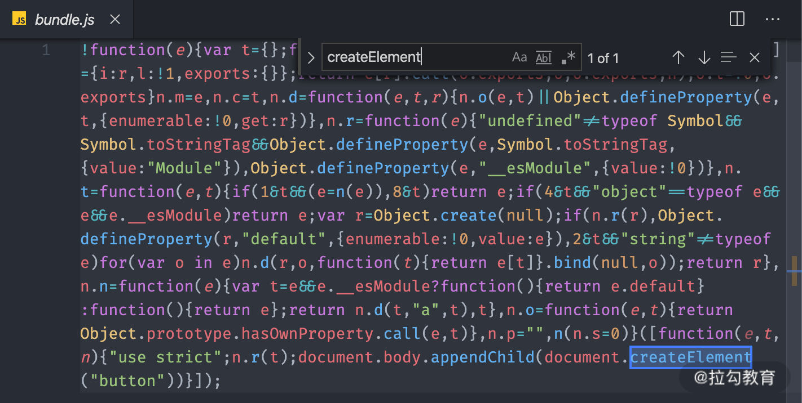

通过搜索你会发现，components 模块中冗余的代码根本没有输出。这就是经过 Tree-shaking 处理过后的效果。

试想一下，如果我们在项目中引入 Lodash 这种工具库，大部分情况下我们只会使用其中的某几个工具函数，而其他没有用到的部分就是冗余代码。通过 Tree-shaking 就可以极大地减少最终打包后 bundle 的体积。

需要注意的是，Tree-shaking 并不是指 Webpack 中的某一个配置选项，而是一组功能搭配使用过后实现的效果，这组功能在生产模式下都会自动启用，所以使用生产模式打包就会有 Tree-shaking 的效果。

### 开启 Tree Shaking

上述说生产环境下的 Tree Shaking 是自动开启的，那么在其他环境下，我们怎么手动开启 Tree-shaking呢？

在开启之前，我们先来看看没有开启 tree shaking 的时候，打包结果：

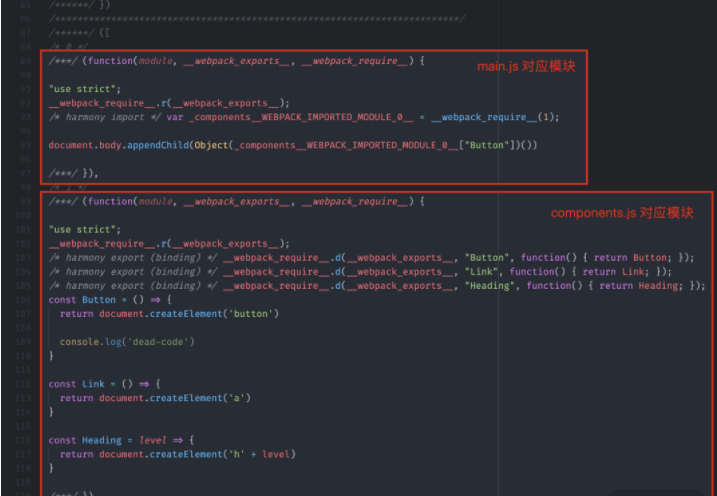

我们这里注意一下 components 对应的这个模块，虽然外部没有使用这里的 Link 函数和 Heading 函数，但是仍然导出了它们:

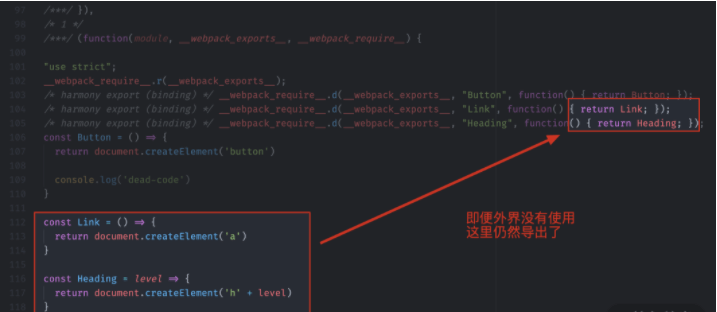

显然这种导出是没有任何意义的。

所以如果要实现在非生产模式下的 Tree Shaking，就得我们自己手动去开启。

首先，我们打开 Webpack 的配置文件，在配置对象中添加一个 optimization 属性，这个属性用来集中配置 Webpack 内置优化功能，它的值也是一个对象。

在 optimization 对象中我们可以先开启一个 usedExports 选项，表示在输出结果中只导出外部使用了的成员：

```js
// webpack.config.js
module.exports = {
    // ...其他配置项
    optimization: {
        // 模块只导出被使用的成员
        usedExports: true
    }
}
```

配置完成后，重新打包，然后我们再来看一下输出的 bundle.js：

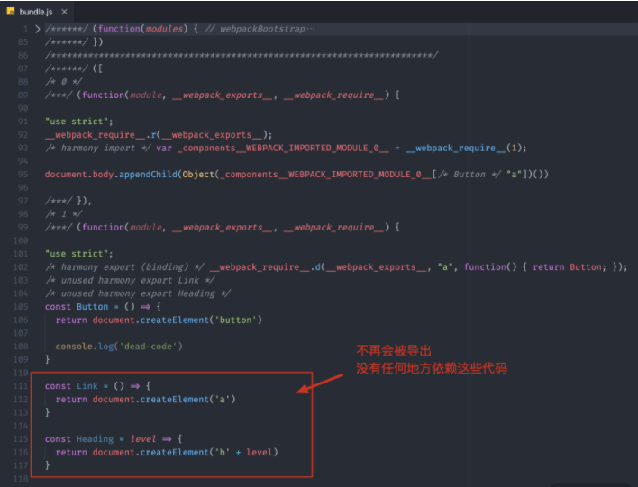

此时你会发现 components 模块所对应的函数，就不再导出 Link 和 Heading 这两个函数了，那它们对应的代码就变成了未引用代码。而且如果你使用的是 VS Code，会发现 VS Code 将这两个函数名的颜色变淡了，这是为了表示它们未被引用。

对于这种未引用代码，如果我们开启压缩代码功能，就可以自动压缩掉这些没有用到的代码。

我们可以回到配置文件中，尝试在 optimization 配置中开启 minimize：

```js
// webpack.config.js
module.exports = {
    // ...其他配置项
    optimization: {
        // 模块只导出被使用的成员
        usedExports: true,
        // 压缩输出结果
        minimize: true
    }
}
```

然后再次回到命令行重新运行打包:

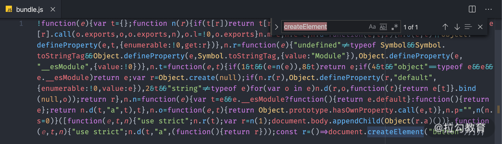

仔细查看打包结果，你会发现，Link 和 Heading 这些未引用代码都被自动移除了。

这就是 Tree-shaking 的实现，整个过程用到了 Webpack 的两个优化功能：

- usedExports：打包结果中只导出外部用到的成员；
- minimize：压缩打包结果。

如果我们把代码看成一颗大叔，那可以这样理解：

- usedExports 的作用就是标记树上哪些是枯枝烂叶；
- minimize 的作用就是负责把这些枯枝烂叶给摇下来。

我们根据上面的介绍这么理解 Tree Shaking：它是由 usedExports 和 minimize 一同组成的，先只导出外部用到的成员，然后在压缩的时候将未引用代码压缩掉，从而减少打包后的代码体积。

### 合并模块（扩展）

除了 usedExports 选项之外，我们还可以使用一个 concatenateModules 选项继续优化输出。

普通打包只是将一个模块最终放入一个单独的函数中，如果我们的模块很多，就意味着在输出结果中会有很多的模块函数。

concatenateModules 配置的作用就是尽可能将所有模块合并到一起输出到一个函数中，这样既提升了运行效率，又减少了代码的体积。

我们回到配置文件中，这里我们在 optimization 属性中开启 concatenateModules。同时，为了更好地看到效果，我们先关闭 minimize，具体配置如下：

```js
// webpack.config.js
module.exports = {
    // ...其他配置项
    optimization: {
        // 模块只导出被使用的成员
        usedExports: true,
        // 压缩输出结果
        minimize: false,
        // 尽可能合并每一个模块到一个函数中
        concatenateModules: true
    }
}
```

然后回到命令行终端再次运行打包。那此时 bundle.js 中就不再是一个模块对应一个函数了，而是把所有的模块都放到了一个函数中：

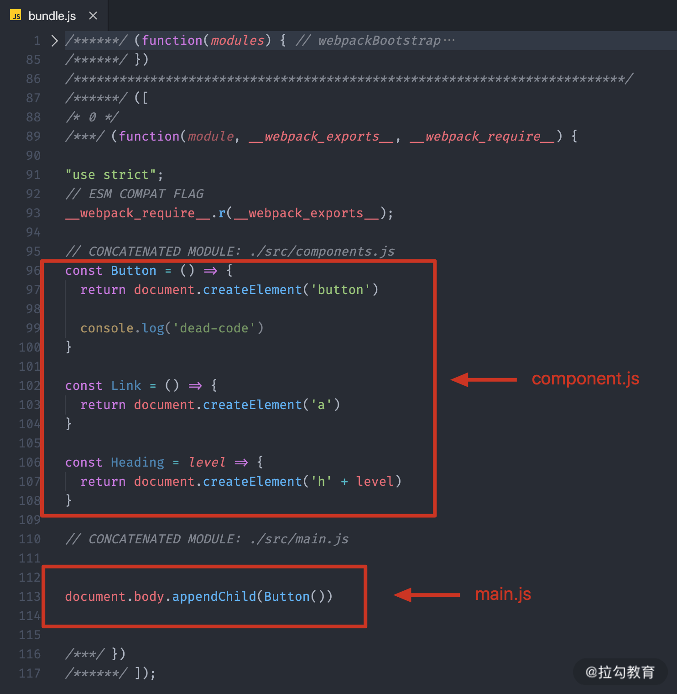

那这个特性又被称为**Scope Hoisting**，也就是作用域提升，它是 Webpack 3.0 中添加的一个特性。

如果再配合 minimize 选项，打包结果的体积又会减小很多。

### 结合 babel-loader 的问题

因为早期的 Webpack 发展非常快，那变化也就比较多，所以当我们去找资料时，得到的结果不一定适用于当前我们所使用的版本。而 Tree-shaking 的资料更是如此，很多资料中都表示*“为 JS 模块配置 babel-loader，会导致 Tree-shaking 失效”*。

针对这个问题，统一说明一下：

首先你需要明确一点：**Tree-shaking 实现的前提是 ES Modules，也就是说：最终交给 Webpack 打包的代码，必须是使用 ES Modules 的方式来组织的模块化**。

为什么这么说呢？

我们都知道 Webpack 在打包所有的模块代码之前，先是将模块根据配置交给不同的 Loader 处理，最后再将 Loader 处理的结果打包到一起。

很多时候，我们为了更好的兼容性，会选择使用 babel-loader 去转换我们源代码中的一些 ECMAScript 的新特性。而 Babel 在转换 JS 代码时，很有可能处理掉我们代码中的 ES Modules 部分，把它们转换成 CommonJS 的方式，如下图所示：


当然了，Babel 具体会不会处理 ES Modules 代码，取决于我们有没有为它配置使用转换 ES Modules 的插件。

很多时候，我们为 Babel 配置的都是一个 preset（预设插件集合），而不是某些具体的插件。例如，目前市面上使用最多的 @babel/preset-env，这个预设里面就有转换 ES Modules 的插件。所以当我们使用这个预设时，代码中的 ES Modules 部分就会被转换成 CommonJS 方式。那 Webpack 再去打包时，拿到的就是以 CommonJS 方式组织的代码了，所以 Tree-shaking 不能生效。

那我们这里具体来尝试一下。为了可以更容易分辨结果，我们只开启 usedExports：

```js
// ./webpack.config.js
module.exports = {
  mode: 'none',
  entry: './src/main.js',
  output: {
    filename: 'bundle.js'
  },
  module: {
    rules: [
      {
        test: /\.js$/,
        use: {
          loader: 'babel-loader',
          options: {
            presets: [
              ['@babel/preset-env']
            ]
          }
        }
      }
    ]
  },
  optimization: {
    usedExports: true
  }
}
```

配置完成过后，我们打开命令行终端，运行 Webpack 打包命令，然后再找到 bundle.js，具体结果如下：

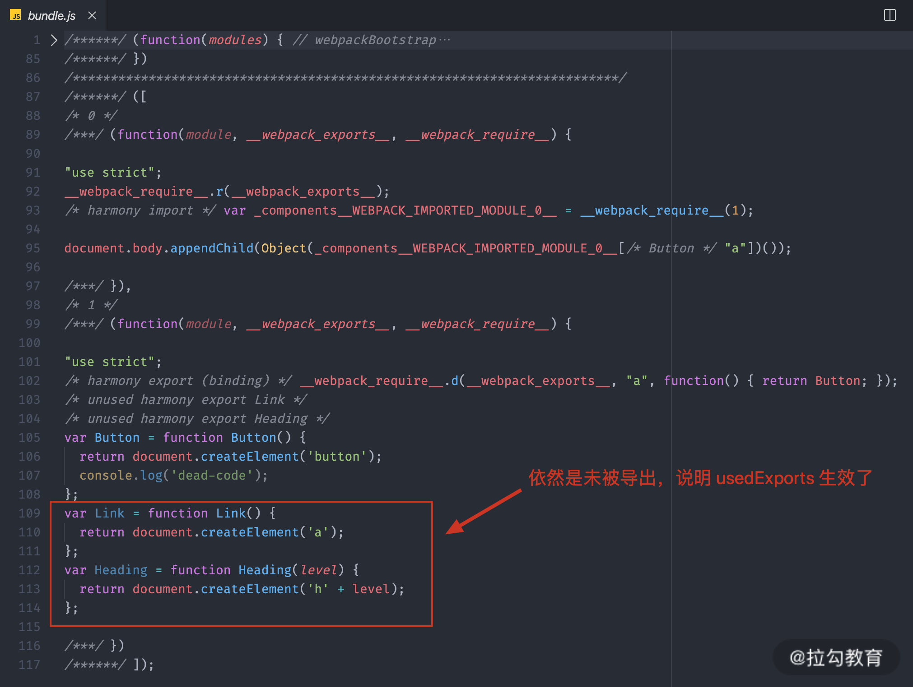

仔细查看你会发现，结果并不是像刚刚说的那样，这里 usedExports 功能仍然正常工作了，此时，如果我们压缩代码，这些未引用的代码依然会被移除。这也就说明 Tree-shaking 并没有失效。

那到底是怎么回事呢？为什么很多资料都说 babel-loader 会导致 Tree-shaking 失效，但当我们实际尝试后又发现并没有失效？

其实，这是因为在最新版本（8.x）的 babel-loader 中，已经自动帮我们关闭了对 ES Modules 转换的插件，你可以参考对应版本 babel-loader 的源码，核心代码如下：

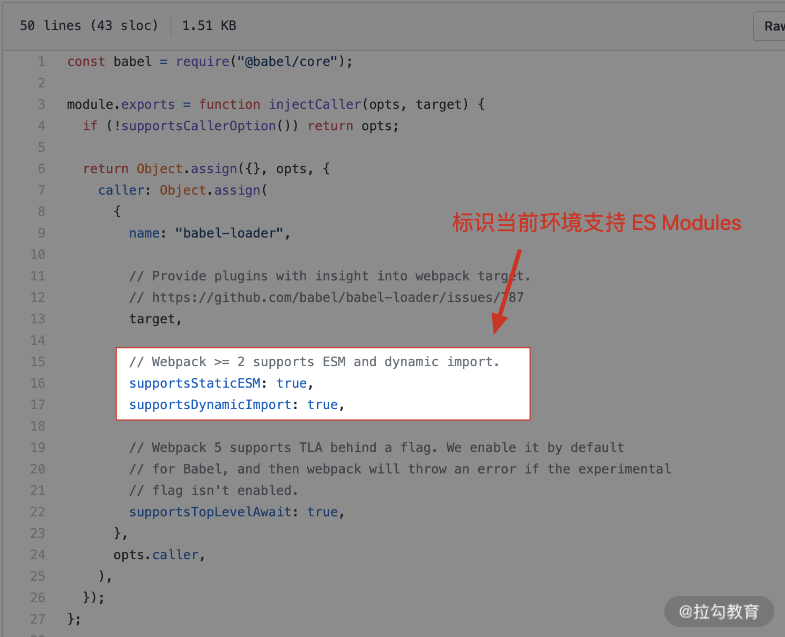

通过查阅 babel-loader 模块的源码，我们发现它已经在 injectCaller 函数中标识了当前环境支持 ES Modules。

然后再找到我们所使用的 @babal/preset-env 模块源码，部分核心代码如下：

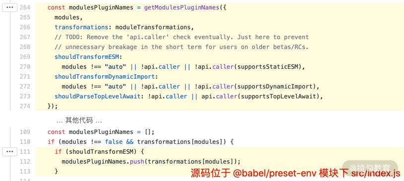

在这个模块中，根据环境标识自动禁用了对 ES Modules 的转换插件，所以**经过 babel-loader 处理后的代码默认仍然是 ES Modules，那 Webpack 最终打包得到的还是 ES Modules 代码，Tree-shaking 自然也就可以正常工作了**。

我们也可以在 babel-loader 的配置中强制开启 ES Modules 转换插件来试一下:

```js
// ./webpack.config.js
module.exports = {
  mode: 'none',
  entry: './src/main.js',
  output: {
    filename: 'bundle.js'
  },
  module: {
    rules: [
      {
        test: /\.js$/,
        use: {
          loader: 'babel-loader',
          options: {
            presets: [
              ['@babel/preset-env', { modules: 'commonjs' }]
            ]
          }
        }
      }
    ]
  },
  optimization: {
    usedExports: true
  }
}
```

给 Babel preset 添加配置的方式比较特别，这里很多人都会配错，一定要注意。它需要把预设数组中的成员定义成一个数组，然后这个数组中的第一个成员就是所使用的 preset 的名称，第二个成员就是给这个 preset 定义的配置对象。

我们在这个对象中将 modules 属性设置为 "commonjs"，默认这个属性是 auto，也就是根据环境判断是否开启 ES Modules 插件，我们设置为 commonjs 就表示我们强制使用 Babel 的 ES Modules 插件把代码中的 ES Modules 转换为 CommonJS。

完成以后，我们再次打开命令行终端，运行 Webpack 打包。然后找到 bundle.js，结果如下：

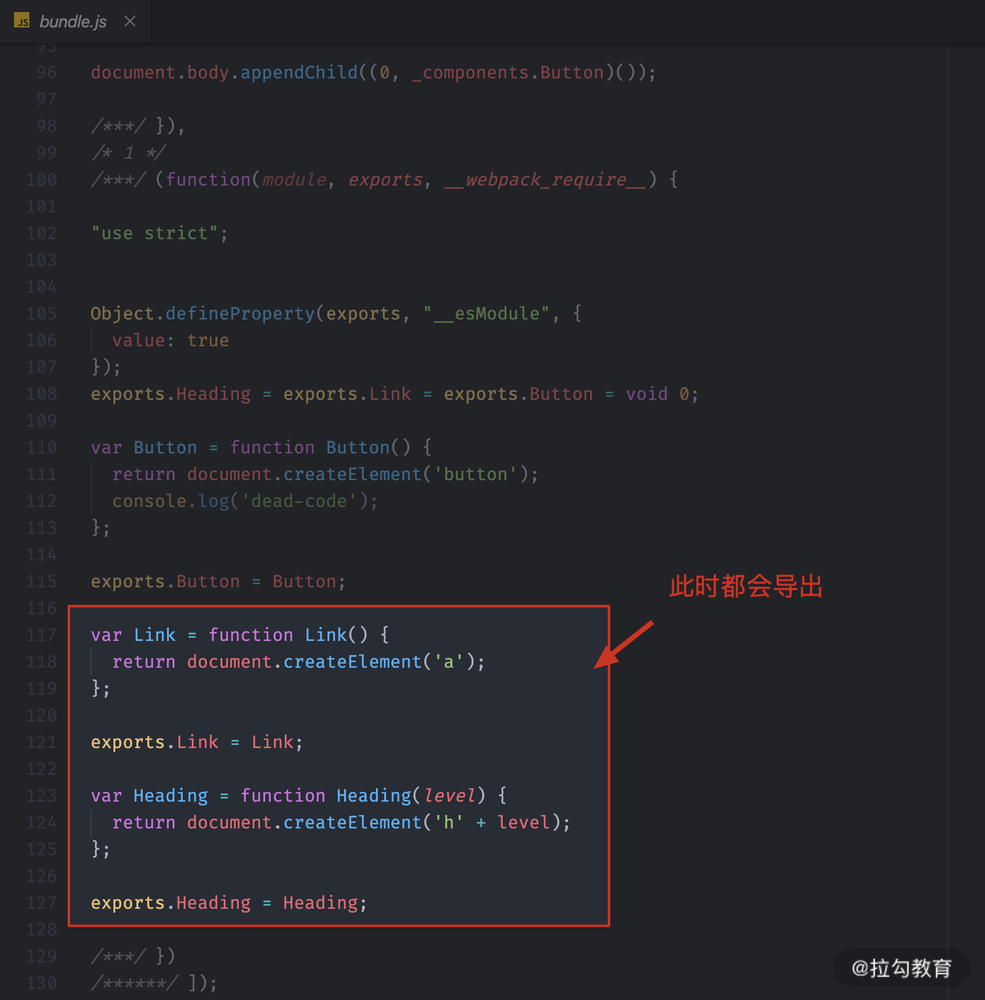

此时，你就会发现 usedExports 没法生效了。即便我们开启压缩代码，Tree-shaking 也会失效。

总结一下，这里通过实验发现，最新版本的 babel-loader 并不会导致 Tree-shaking 失效。如果你不确定现在使用的 babel-loader 会不会导致这个问题，最简单的办法就是在配置中将 @babel/preset-env 的 modules 属性设置为 false，确保不会转换 ES Modules，也就确保了 Tree-shaking 的前提。

## SideEffects

Webpack 4 中新增了一个 sideEffects 特性，它允许我们通过配置标识我们的代码是否有副作用，从而提供更大的压缩空间。

> TIPS：模块的副作用指的就是模块执行的时候除了导出成员，是否还做了其他的事情。

这个特性一般只有我们去开发一个 npm 模块时才会用到。因为官网把对 sideEffects 特性的介绍跟 Tree-shaking 混到了一起，所以很多人误认为它们之间是因果关系，其实它们没有什么太大的关系。

我们先把 sideEffects 特性本身的作用弄明白，你就更容易理解为什么说它跟 Tree-shaking 没什么关系了。

我们先来看一个场景：

```md
.
├── src
│   ├── components
│   │   ├── button.js
│   │   ├── heading.js
│   │   ├── index.js
│   │   └── link.js
│   └── main.js
├── package.json
└── webpack.config.js
```

基于上一个案例的基础上，我们把 components 模块拆分出多个组件文件，然后在 components/index.js 中集中导出，以便于外界集中导入，具体 index.js 代码如下：

```js
// ./src/components/index.js
export { default as Button } from './button'
export { default as Link } from './link'
export { default as Heading } from './heading'
```

这也是我们经常见到一种同类文件的组织方式。另外，在每个组件中，我们都添加了一个 console 操作（副作用代码）:

```js
// ./src/components/button.js
console.log('Button component~') // 副作用代码

export default () => {
  return document.createElement('button')
}

// 我们再到打包入口文件（main.js）中去载入 components 中的 Button 成员，具体代码如下：

// ./src/main.js
import { Button } from './components'

document.body.appendChild(Button())
```

那这样就会出现一个问题，虽然我们在这里只是希望载入 Button 模块，但实际上载入的是 components/index.js，而 index.js 中又载入了这个目录中全部的组件模块，这就会导致所有组件模块都会被加载执行。

我们打开命令行终端，尝试运行打包，打包完成过后找到打包结果，具体结果如下：

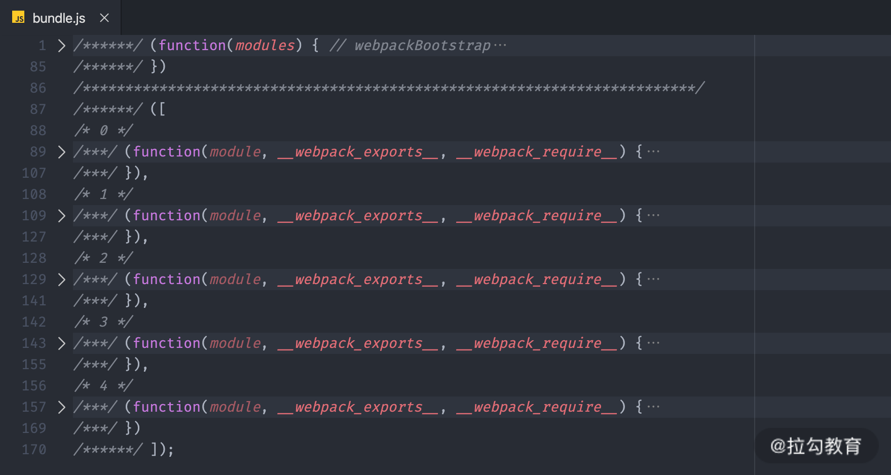

根据打包结果发现，所有的组件模块都被打包进了 bundle.js。

此时如果我们开启 Tree-shaking 特性（只设置 useExports），这里没有用到的导出成员其实最终也可以被移除，打包效果如下：

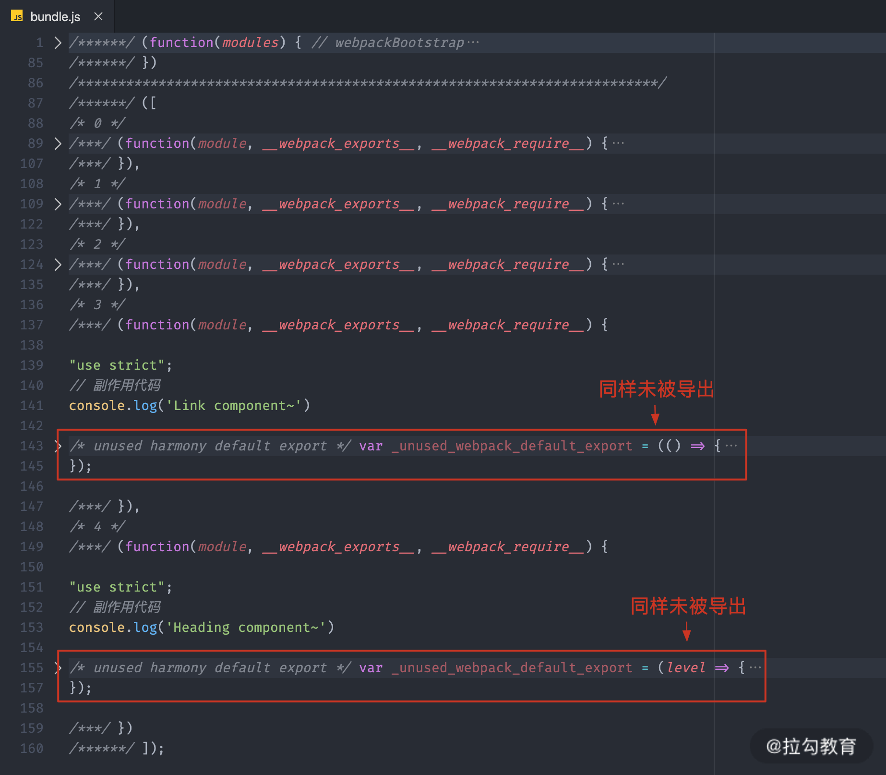

但是由于这些成员所属的模块中有副作用代码，所以就导致最终 Tree-shaking 过后，这些模块并不会被完全移除。

可能你会认为这些代码应该保留下来，而实际情况是，这些模块内的副作用代码一般都是为这个模块服务的，例如这里我添加的 console.log，就是希望表示一下当前这个模块被加载了。但是最终整个模块都没用到，也就没必要留下这些副作用代码了。

所以说，**Tree-shaking 只能移除没有用到的代码成员，而想要完整移除没有用到的模块，那就需要开启 sideEffects 特性了**。

### sideEffects 作用

我们打开 Webpack 的配置文件，在 optimization 中开启 sideEffects 特性，具体配置如下：

```js
// ./webpack.config.js
module.exports = {
  mode: 'none',
  entry: './src/main.js',
  output: {
    filename: 'bundle.js'
  },
  optimization: {
    sideEffects: true
  }
}
```

> TIPS：这个特性在 production 模式下同样会自动开启。

那此时 Webpack 在打包某个模块之前，会先检查这个模块所属的 package.json 中的 sideEffects 标识，以此来判断这个模块是否有副作用，如果没有副作用的话，这些没用到的模块就不再被打包。换句话说，即便这些没有用到的模块中存在一些副作用代码，我们也可以通过 package.json 中的 sideEffects 去强制声明没有副作用。

那我们打开项目 package.json 添加一个 sideEffects 字段，把它设置为 false，具体代码如下：

```json
{
  "name": "webpack-demo",
  "version": "0.1.0",
  "author": "cecil",
  "license": "MIT",
  "scripts": {
    "build": "webpack"
  },
  "devDependencies": {
    "webpack": "^4.43.0",
    "webpack-cli": "^3.3.11"
  },
  "sideEffects": false
}
```

这样就表示我们这个项目中的所有代码都没有副作用，让 Webpack 放心大胆地去“干”。

完成以后我们再次运行打包，然后同样找到打包输出的 bundle.js 文件，结果如下：

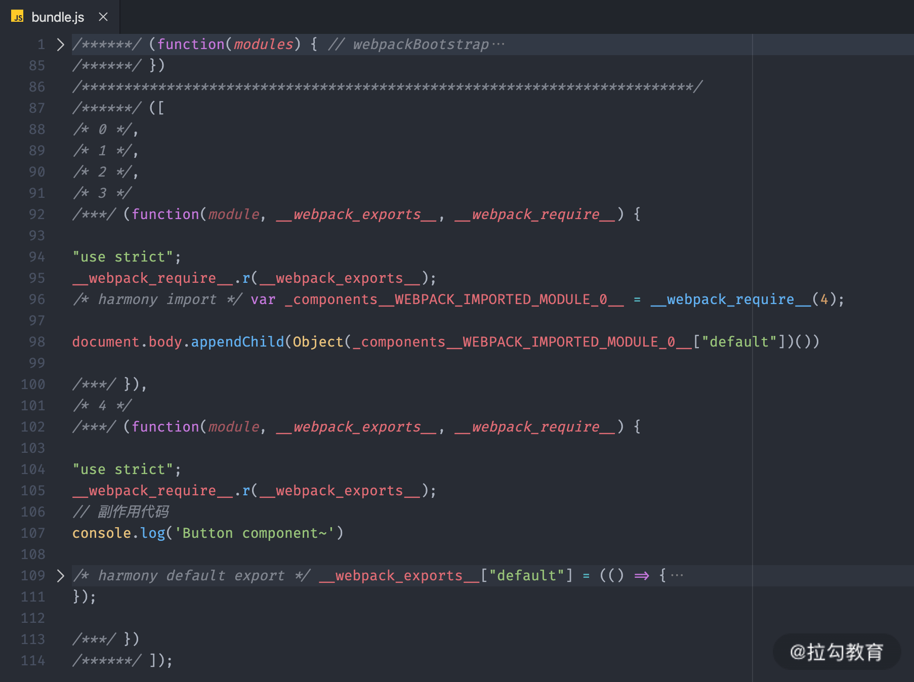

此时那些没有用到的模块就彻底不会被打包进来了。那这就是 sideEffects 的作用。

这里设置了两个地方：

- webpack.config.js 中的 sideEffects 用来开启这个功能；
- package.json 中的 sideEffects 用来标识我们的代码没有副作用；

### sideEffects 注意

使用 sideEffects 这个功能的前提是确定你的代码没有副作用，或者副作用代码没有全局影响，否则打包时就会误删掉你那些有意义的副作用代码。

例如：

```js
// ./src/extend.js
// 为 Number 的原型添加一个扩展方法
Number.prototype.pad = function (size) {
  const leadingZeros = Array(size + 1).join(0)
  return leadingZeros + this
}
```

在这个模块中并没有导出任何成员，仅仅是在 Number 的原型上挂载了一个 pad 方法，用来为数字添加前面的导零，这是一种很早以前常见的基于原型的扩展方法。

我们回到 main.js 中去导入 extend 模块，具体代码如下：

```js
// ./src/main.js
import './extend' // 内部包含影响全局的副作用

console.log((8).pad(3)) // => '0008'
```

因为这个模块确实没有导出任何成员，所以这里也就不需要提取任何成员。导入过后就可以使用它为 Number 提供扩展方法了。

这里为 Number 类型做扩展的操作就是 extend 模块对全局产生的副作用。

此时如果我们还是通过 package.json 标识我们代码没有副作用，那么再次打包过后，就会出现问题。我们可以找到打包结果，如下图所示：

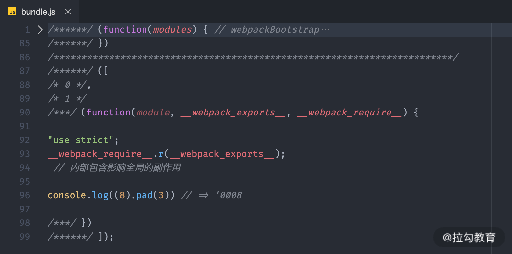

我们看到，对 Number 的扩展模块并不会打包进来。

缺少了对 Number 的扩展操作，我们的代码再去运行的时候，就会出现错误。这种扩展的操作属于对全局产生的副作用。

这种基于原型的扩展方式，在很多 Polyfill 库中都会大量出现，比较常见的有 es6-promise，这种模块都属于典型的副作用模块。

除此之外，我们在 JS 中直接载入的 CSS 模块，也都属于副作用模块，同样会面临这种问题。

所以说**不是所有的副作用都应该被移除，有一些必要的副作用需要保留下来**。

最好的办法就是**在 package.json 中的 sideEffects 字段中标识需要保留副作用的模块路径（可以使用通配符）**，具体配置如下：

```json
{
  "name": "webpack-demo",
  "version": "0.1.0",
  "author": "cecil",
  "license": "MIT",
  "scripts": {
    "build": "webpack"
  },
  "devDependencies": {
    "webpack": "^4.43.0",
    "webpack-cli": "^3.3.11"
  },
  "sideEffects": [
    "./src/extend.js",
    "*.css"
  ]
}
```

这样 Webpack 的 sideEffects 就不会忽略确实有必要的副作用模块了。

总结下来：对全局有影响的副作用代码不能移除，而只是对模块有影响的副作用代码就可以移除。