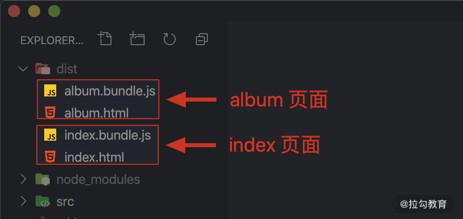
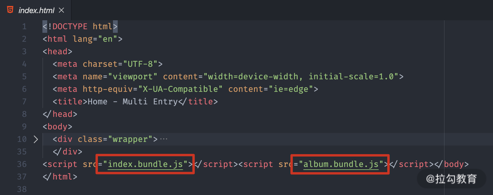
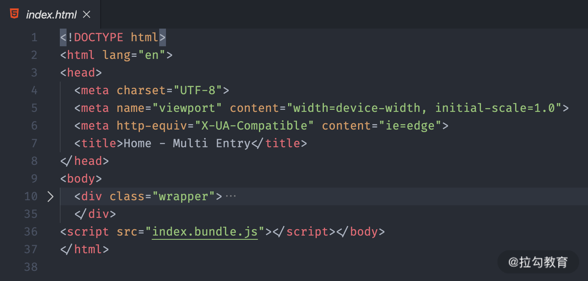
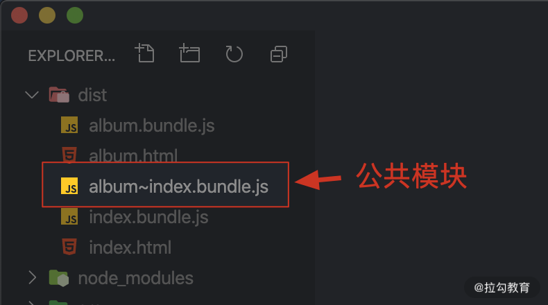
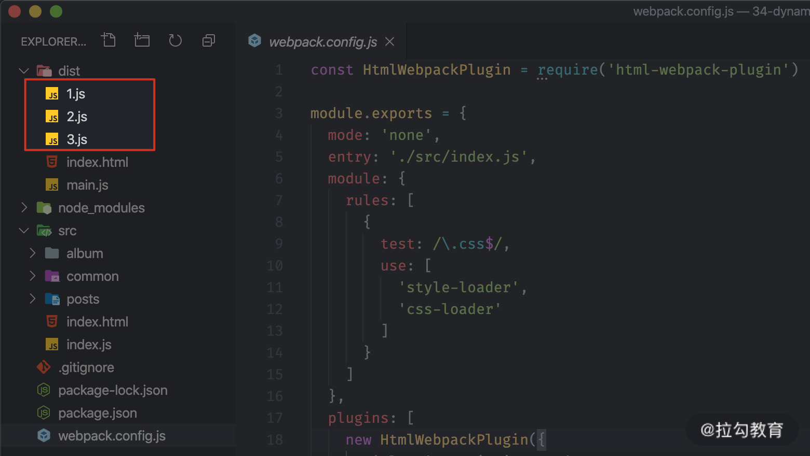
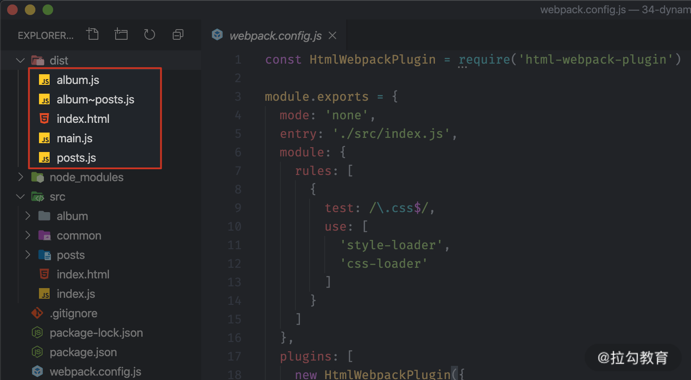

本文是笔者笔记，原文[传送门](https://kaiwu.lagou.com/course/courseInfo.htm?courseId=550#/detail/pc?id=5287)。

[[toc]]

首先我们为什么要使用 Code Splitting（分块打包）？

## All in One 的弊端

通过 webpack 实现前端项目整体模块化的优势固然明显，但是它也会存在一些弊端：它最终会将我们所有的代码打包到一起。但是如果我们的应用非常复杂，模块非常多，那么这种 All in One 的方式就会导致打包的结果过大，甚至超过 4 ~ 5M。

一般应用刚开始工作时，并不是所有的模块都是必需的。如果只需要一两个模块工作，也必须先把 bundle.js 整体都加载进来，那么应用的响应速度会受到很明显的影响，也会浪费大量的流量和带宽。

所以更合理的方案：**把打包的结果按照一定的规则分离到多个 bundle 中，然后根据应用的运行按需加载**。这样就可以降低启动成本，提高响应速度。

但是 Webpack 就是通过把项目中散落的模块打包到一起，从而提高加载效率，那么为什么这里又要分离？这不是自相矛盾吗？

其实这并不矛盾，只是物极必反罢了。Web 应用中的资源受环境所限，太大不行，太碎更不行。因为我们开发过程中划分模块的颗粒度一般都会非常的细，很多时候一个模块只是提供了一个小工具函数，并不能形成一个完整的功能单元。

如果我们不将这些资源模块打包，直接按照开发过程中划分的模块颗粒度进行加载，那么运行一个小小的功能，就需要加载非常多的资源模块。

再者，目前主流的 HTTP 1.1 本身就存在一些缺陷：

- 同一个域名下的并行请求是有限制的（6个）；
- 每次请求本身都会有一定的延迟；
- 每次请求除了传输内容，还有额外的请求头，大量请求的情况下，这些请求头加在一起也会浪费流量和带宽。

## Code Splitting

为了解决打包结果过大的问题，webpack 设计了一个分包功能：Code Splitting（代码分割）。

Code Splitting 通过把项目中的资源模块按照我们设计的规则打包到不同的 bundle 中，从而降低启动成本，提高响应速度。

代码分片可以用于获取更小的`bundle`，以及控制资源加载优先级，从而提高页面加载时间。它是在 chunk 生成之后，将原先以入口点来划分的 chunks 根据一定的规则（例如异步引入或分离公共依赖等），分离出 chunk 的过程。

webpack 实现分包的方式主要有两种：

- 根据业务不用配置多个打包入口，输出多个打包结果；
- 结合 ES Modules 的动态导入（Dynamic Import）特性，按需加载模块。

### 多入口打包

多入口打包一般适用于传统的多页面应用，最常见的划分规则就是一个页面对应一个打包入口，对于不同页面之间的公用部分，再提取到公共的结果中。

来看个例子：

```md
.
├── dist
├── src
│   ├── common
│   │   ├── fetch.js
│   │   └── global.css
│   ├── album.css
│   ├── album.html
│   ├── album.js
│   ├── index.css
│   ├── index.html
│   └── index.js
├── package.json
└── webpack.config.js
```

这个示例中有俩页面，分别是 index 和 album。代码组织的逻辑：

- index.js 负责实现 index 页面功能逻辑；
- album.js 负责实现 album 页面功能逻辑；
- global.css 是公用的样式文件；
- fetch.js 是一个公用的模块，负责请求 API。

配置文件内容如下：

```js
// ./webpack.config.js
const HtmlWebpackPlugin = require('html-webpack-plugin');

module.exports = {
    entry: {
        index: './src/index.js',
        album: './src/album.js'
    },
    output: {
        filename: '[name].bundle.js'
    },
    plugins: [
        new HtmlWebpackPlugin({
            title: 'Index',
            template: './src/index.html',
            filename: 'index.html'
        }),
        new HtmlWebpackPlugin({
            title: 'Album',
            template: './src/album.html',
            filename: 'album.html'
        }),
    ]
}
```

一般 entry 属性中只会配置一个打包入口，如果我们需要配置多个入口，可以把 entry 定义成一个对象。

::: tip

注意：这里 entry 是定义为对象而不是数组，因为如果是数组的话就会把这个多个文件打包到一起，还是一个入口。

:::

在这个对象中一个属性就是一个入口，属性名称就是这个入口的名称，值就是这个入口的文件路径。

如果我们的入口配置为多入口形式，那么输出文件名也需要修改，因为两个入口就有两个输出文件，不能都叫 bundle.js。我们这里使用 `[name]` 这种占位符来输出动态的文件名，`[name]` 最终会被替换为入口的名称。

除此之外，在配置中还通过 `html-webpack-plugin` 分别为 index 和 album 页面生成了对应的 HTML 文件。

完成配置后，我们就可以进行打包命令进行打包了，打包完成后的目录如下：



但是有个小问题就是我们现在输出的 HTML 文件里，都会加载两个 JS ：



我们希望的是每个页面只使用它对应的输出结果。

这里修改配置文件，在对应的 HtmlWebpackPlugin 配置项里，默认会自动注入所有的打包结果，如果需要指定所使用的 bundle，需要其 chunks 属性来设置。

> TIPS：每个打包入口都会形成一个独立的 chunk （块）。

```js
// ./webpack.config.js
const HtmlWebpackPlugin = require('html-webpack-plugin');

module.exports = {
    entry: {
        index: './src/index.js',
        album: './src/album.js'
    },
    output: {
        filename: '[name].bundle.js'
    },
    plugins: [
        new HtmlWebpackPlugin({
            title: 'Index',
            template: './src/index.html',
            filename: 'index.html',
            chunks: ['index']  // 指定使用 index.bundle.js
        }),
        new HtmlWebpackPlugin({
            title: 'Album',
            template: './src/album.html',
            filename: 'album.html',
            chunks: ['album']  // 指定使用 album.bundle.js
        }),
    ]
}
```

然后重新打包：



完成。

### 提取公共模块

多入口打包本身非常容易理解和使用，但是也有一个问题，就是不同的入口中一定会有一些公用的模块，如果按照目前这种多入口打包的方式，就会出现多个打包结果中会有相同的模块的情况。

这对应整个项目来说是可怕的，如果我们的公共模块有很多个，而且体积也很大，那项目在运行时的就会重复加载这些资源，会降低响应速度，不利于公共模块的缓存。

所以我们需要将这些公共的模块打包到一个 bundle 中。

在 webpack4 之前的版本中，我们通常会使用 `CommonsChunkPlugin` 插件来进行代码模块的拆分，它会将公共模块拆出来，最终合成的文件能够在最开始的时候加载一次，然后存到缓存中供后续使用。

而在4之后，使用 `SplitChunksPlugin` 代替。

我们需要在 webpack 的优化配置 optimization 中开启 splitChunks 功能即可：

```js
// ./webpack.config.js
module.exports = {
    entry: {
       index: './src/index.js',
       album: './src/album.js'
    },
    output: {
        filename: '[name].bundle.js' // [name] 是入口名称
    },
    optimization: {
        splitChunks: {
            // 设置为all，表示自动提取所有的公共模块到单独的 bundle 中
            chunks: 'all'
        }
    }
}
```

再次打包之后得到：



图中的文件就是 index  和 album 中公共的模块部分。

那么我们接下来看看它都有哪些默认配置：

```js
splitChunks: {
    chunks: 'async',
    minSize: {
        javascript: 30000,
        style: 50000,
    },
    maxSize: 0,
    minChunks: 1,
    maxAsyncRequests: 5,
    maxInitialRequests: 3,
    automaticNameDelimiter: '-',
    name: true,
    cacheGroups: {
        vendors: {
            test: /[\\/]node_modules[\\/]/,
            priority: -10,
        },
        default: {
            minChunks: 2,
            priority: -20,
            reuseExistingChunk: true
        }
    }
}
```

简单说下里面的配置项含义：

- **chunks**：即 `SplitChunks` 的**工作模式**。3个可选值：
  - **async**：默认情况下，`SplitChunks` 只对异步 `chunks` 生效，并不需要配置，作用是分离动态引入的模块（import('...')），在处理动态引入的模块时能够自动分离其中的公共依赖；
  - **initial**：则表示只对入口 `chunk` 生效；
  - **all**：表示 `SplitChunks` 将会对所有的 `chunks` 都生效；
- **minSize**：设置提取后的 `JavaScript chunk` 和 `CSS chunk` 代码体积大小的最小值。默认 `JavaScript chunk` 大小为30kB，`CSS chunk` 代码大小为50kB。
- **minChunks**：最小` chunk` 数为1。
- **maxAsyncRequests**：在按需加载过程中，默认并行请求的资源最大值小于等于5。
- **maxInitialRequests**：默认在首次加载时，并行请求的资源数最大值小于等于3。
- **name**：默认为 true。意味着 `SplitChunks` 可以根据 `cacheGroups` 和作用范围自动为新生成的 chunk 命名，并以 `automaticNameDelimiter` 分隔。
- **automaticNameDelimiter**：'~'，名称连接符
- **cacheGroups**：可以理解成分离 chunks 时的规则。
  - vendors：用于提取所有 node_modules 中符合条件的模块。
  - default：作用于被多次引用的模块。

当然，我们也不是说想怎么提取模块就怎么提取，还是需要满足一定的条件才可以，以下是 `SplitChunks` 默认情况下的提取条件：

- 提取后的 chunk 可被共享或者来自 node_modules 目录。即被多次引用或处于 node_modules 中的模块更倾向于是通用模块，比较适合被提取出来。
- 提取出来的 JavaScript chunk 体积大于30kB（压缩和 `gzip` 之前），CSS chunk 体积大于 50kB。
- 在按需加载过程中，并行请求的资源最大值小于等于5。
- 在首次加载时，并行请求的资源数最大值小于等于3。

::: tip

在设置了 splitChunk 以后还有一个问题需要注意：[传送门](./webpack_optimization)

:::

以上就是对 `splitChunk` 配置的大概介绍。

## 动态导入

除了多入口打包的方式，Code Splitting 更常见的实现方式还是结合 ES Modules 的动态导入特性，从而实现按需加载。

我们这里所说的按需加载，指的是项目运行过程中，需要某个资源模块时，才加载这个资源。这样就极大的降低了项目启动时需要加载的资源体积，提高了项目响应速度，同时也节省了带宽和流量。

Webpack 中支持使用动态导入的方式实现模块的按需加载，而且所有动态导入的模块都会被自动提取到单独的 bundle 中，从而实现分包。

相对于多入口的方式，动态导入会显得更加灵活，我们可以通过代码逻辑去控制需不需要加载某个模块，以及何时加载。而且我们**分包的目的，很重要的一点就是让模块实现按需加载，从而提高应用的响应速度**。

来看个例子：

```md
.
├── src
│   ├── album
│   │   ├── album.css
│   │   └── album.js
│   ├── common
│   │   ├── fetch.js
│   │   └── global.css
│   ├── posts
│   │   ├── posts.css
│   │   └── posts.js
│   ├── index.html
│   └── index.js
├── package.json
└── webpack.config.js
```

我们在入口文件中使用动态导入，会避免请求一个页面，而加载另一个页面的组件这种资源浪费的情况。因为这个时候，所有的组件都是惰性加载，即只有用到的时候才会去加载。

```js
// ./src/index.js
const update = () => {
    const hash = window.location.hash || '#posts'
    const mainElement = document.querySelector('.main')
    mainElement.innerHTML = ''
    if (hash === '#posts') {
        import('./posts/posts').then(({ default: posts }) => {
            mainElement.appendChild(posts())
        })
    } else if (hash === '#album') {
        import('./album/album').then(({ default: album }) => {
            mainElement.appendChild(album())
        })
    }
}

window.addEventListener('hashchange', update)
update()
```

::: tip

为了动态导入模块，可以将 import 关键字作为函数调用。当以这种方式使用时，import 函数返回的是一个 Promise 对象，这就是 ES Modules 标准中的 Dynamic Import。

:::

使用 import 函数动态导入模块后，返回了一个 promise 对象，然后在 then 方法中我们能够拿到模块对象。由于我们这里的 posts 和 album 模块是以默认成员导出，所以我们需要解构模块对象中的 default，先拿到导出成员，然后再正常使用这个导出成员。

再次打包后的结果如下：



此时 dist 目录下就会额外多出三个 JS 文件，其中有两个文件是动态导入的模块，另外一个文件是动态导入模块中公共的模块，这三个文件就是由动态导入自动分包产生的。

可以看到，整个过程中我们无需额外配置任何地方。只需要按照 ES Modules 动态导入的方式去导入模块就可以了，Webpack 内部会自动处理分包和按需加载。

### 魔法注释

所谓魔法注释，就是在 import 函数的形式参数位置，添加一个行内注释，这个注释有一个特定的格式：webpackChunkName: ''，这样就可以给分包的 chunk 起名字了。

```js
// 魔法注释
import(/* webpackChunkName: 'posts' */'./posts/posts')
  .then(({ default: posts }) => {
    mainElement.appendChild(posts())
  })
```

完成过后，我们再次打开命令行终端，运行 Webpack 打包，那此时我们生成 bundle 的 name 就会使用刚刚注释中提供的名称了:



当然，魔法注释可不止这一个功能，当你将 webpackChunkName 设置为一样时，那最终相同的 webpackChunkName 会被打包到一起。