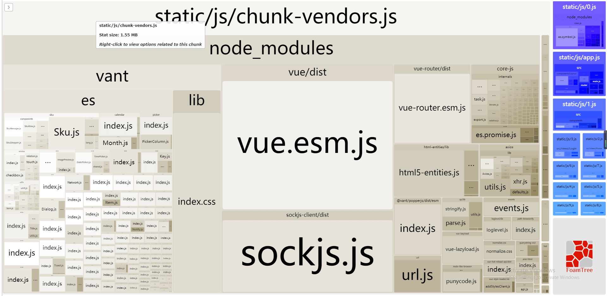
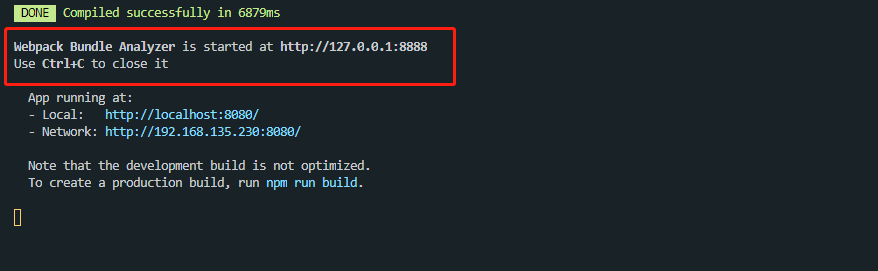

我们一般在项目打包后，不怎么注意打包后的产物大小，因为有的项目可能打完包之后，总共也就几兆大小。笔者最近做的项目，打完生产包之后的dist目录，总共才718KB。（就只有几个页面的微型项目）

但是对于要做项目优化而言，我们最好还是对打包后的产物进行分析，这样才能知道打包后的每个模块大小，进而“对症下药”。

那么我们在 Webpack 中要对打包产物进行分析，需要安装一个插件——`webpack-bundle-analyzer`，这个插件是用来生成webpack分析报告，帮助我们分析 webpack 打包之后的结果，观察各个静态资源的大小。


首先，我们先进行安装：
```shell
npm install webpack-bundle-analyzer -D
```

然后在webpack配置文件中引用：
```js
// ./webpack.config.js
const WebpackBundleAnalyzer = require('webpack-bundle-analyzer').BundleAnalyzerPlugin;

module.exports = {
  //...
  plugins: [
    new WebpackBundleAnalyzer()
  ]
  //...
}
```

然后再次启动项目时，就会启动一个端口号为 8888 的服务：


打开之后就是文章开头图片所展示的内容，它会把打包后的每个模块大小及所占比例都呈现在页面上，直观的显示了整个项目中的打包产物。我们可以依此来对一些大体积模块进行优化，提高构建速度，缩小打包后的产物体积，从而实现整体上的项目优化。

那么以上是针对 `webpack.config.js` 而言的配置，那么在 vue 中我们怎么去配置它呢？

首先，在 vue 项目中，vue-cli已经基于 webpack 构建，并带有合理的默认配置，当然我们也可以通过项目内的配置文件进行其他的一些配置，这个配置文件规定名称——`vue.config.js`。它是一个可选的配置文件，如果项目的根目录中存在这个文件，那么它就会被`@vue/cli-service`自动加载，我们接下来就需要在这个配置文件里去集成 `webpacl-bundle-analyzer`。

有两种方法：
1. configureWebpack
   它既可以是一个对象，也可以是一个函数。

   如果是一个对象，那么它最终会通过 `webpack-merge` 合并到最终的配置中。
   
   如果是一个函数，则会接收被解析的配置作为参数。该函数既可以修改配置并不返回任何东西，也可以返回一个被克隆或合并过的配置版本。
   ```js
    // ./webpack.connfig.js
    const WebpackBundleAnalyzer = require('webpack-bundle-analyzer').BundleAnalyzerPlugin;

    module.exports = {
      // ...
      configureWebpack: config => {
        config.plugins = [...config.plugins, new WebpackBundleAnalyzer()]
        // 或者直接 push 进去
        /*
          config.plugins.push(new WebpackBundleAnalyzer())
        */
      }
      // ...
    }
   ```
2. chainWebpack
   chainWebpack 是一个函数，会接收一个基于 `webpack-chain` 的 `ChainableConfig` 实例。允许对内部的 webpack 配置进行更细粒度的修改。`webpack-chain` 提供了一个 webpack 原始配置的上层抽象，使其可以定义具名的 loader 规则和具名插件。
   ```js
    // ./webpack.config.js
    module.exports = {
      // ...
      chainWebpack: config => {
        config
          .plugin('webpack-bundle-analyzer')
          .use(require('webpack-bundle-analyzer').BundleAnalyzerPlugin)
      }
      // ...
    }
   ```

配置完成之后，我们就可以启动服务，打开 `localhost:8888` 就可以对项目各个模块进行分析了。

其实 `vue-cli` 里已经集成了这个插件功能，我们到 `vue-cli` 官网点击左侧的**CLI服务**，然后选择 `vue-cli-service build`。可以看到文档里是这样描述的：
```md
用法：vue-cli-service build [options] [entry|pattern]

选项：

  --mode        指定环境模式 (默认值：production)
  --dest        指定输出目录 (默认值：dist)
  --modern      面向现代浏览器带自动回退地构建应用
  --target      app | lib | wc | wc-async (默认值：app)
  --name        库或 Web Components 模式下的名字 (默认值：package.json 中的 "name" 字段或入口文件名)
  --no-clean    在构建项目之前不清除目标目录
  --report      生成 report.html 以帮助分析包内容
  --report-json 生成 report.json 以帮助分析包内容
  --watch       监听文件变化
```

- `--report` 和 `--report-json` 会根据构建统计生成报告，它会帮助你分析包中包含的模块们的大小。

那么这里需要注意一点，npm 官方文档里是这么描述的：
::: tip
从 npm@2.0.0 开始，您可以在执行脚本时使用自定义参数。特殊选项由 `getopt` 用于分隔选项的结束。npm 会将 `--` 之后的所有参数直接传递给您的脚本：
```shell
npm run test -- --grep="pattern"
```
参数将只传递给 npm 运行，而不是任何前置或后置脚本。
:::

所以这里我们要启动 report：
```shell
npm run build -- --report

# 或者使用 yarn 来进行启动
# yarn build --erport
```