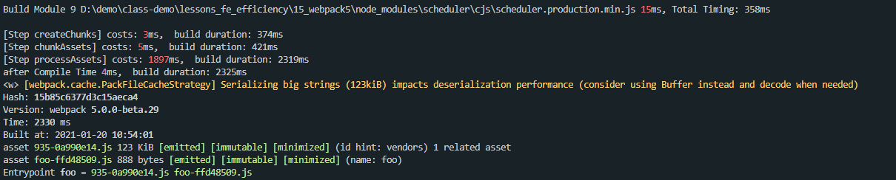
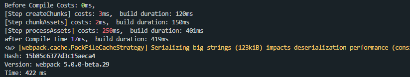
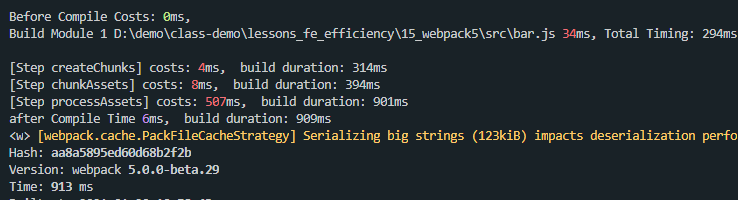

本文是笔者笔记，原文[传送门](https://kaiwu.lagou.com/course/courseInfo.htm?courseId=416#/detail/pc?id=4429)

[[toc]]

## Webpack5 中的效率优化点
- Persistent Caching
- Tree Shaking
- Logs

### Persistent Caching
webpack5 中缓存方面的变化。

那第一个应该就是**持久化缓存**。先来看看代码：
```js
// ./webpack.config.js
...
module.exports = {
  ...
  cache: {
    type: 'filesystem',
    cacheLocation: path.resolve(__dirname, '.appcache'),
    buildDependencies: {
      config: [__filename]
    }
  }
  ...
}
```
初次构建


在不修改代码进行再次构建


修改代码后再次构建


可以看到，初次构建时间花掉了2330ms，而在不修改代码的情况下再次构建所花费的时间422ms，修改代码后再次构建花费了913ms，多花费的时间体现在构建被修改的文件编译上，这就实现了**生产环境下的增量构建**。

### Cache 基本配置
在 webpack4 中，cache 只是单个属性的配置，所对应的赋值为 true 或 false，用来代表是否开启缓存，或者赋值为对象来表示在构建中使用的缓存对象。而在 webpack5 中，cache 配置除了原本的 true 和 false 之外，还增加了许多的自配置项。
- **cache.type**：缓存类型。值为 `memory` 或 `filesystem`，分别代表基于内存的临时缓存，以及基于文件系统的持久化缓存。在选择 filesystem 的情况下，下面的其他配置项生效。 
- **cache.cacheDirectory**：缓存目录。默认目录为 `node_modules/.cache/webpack` 。
- **cache.name**：缓存名称。同时也是 cacheDirectory 中的子目录命名，默认值为 webpack 的 `${config.name}-${config.mode}`。
- **cache.cacheLocation**：缓存真正的存放地址。默认使用的是上述两个属性的组合：`path.resolve(cache.cacheDirectory, cache.name)`。该属性在赋值情况下将忽略上面的 `cacheDirectory` 和 `name` 属性。

### 单个模块的缓存失效
webpack5 会跟踪每个模块的依赖项：fileDependencies、contextDependencies、missingDependencies。当模块本身或者其依赖发生变化时，webpack 能够找到所有受影响的模块，并重新进行构建处理。

出于性能考虑，webpack 不会跟踪具体的 node_modules 中第三方依赖包的模块，而是依据依赖包里的 package.json 中的 name 和 version 字段来判断模块是否发生变更。因此，单纯的修改 node_modules 中的模块内容，在构建时不会触发缓存的失效。

### 全局的缓存失效
当模块代码没有发生变化，但是构建处理过程本身发生变化时（例如升级 webpack 版本、修改了配置文件、改变了环境变量等），也可能对构建后的产物代码产生影响。因此在这种情况下不能复用之前缓存的数据，而需要让全局缓存失效，重新构建并生成新的缓存。在 Webpack 5 中提供了 3 种不同维度的全局缓存失效配置。

**buildDependencies**

第一种配置是`cache.buildDependencies`，用于指定可能对构建过程产生影响的依赖项。

它的默认选项是{defaultWebpack: ["webpack/lib"]}。这一选项的含义是，当 node_modules 中的 Webpack 或 Webpack 的依赖项（例如 watchpack 等）发生变化时，当前的构建缓存即失效。

上述选项是默认内置的，无须写在项目配置文件中。配置文件中的 buildDenpendencies 还支持增加另一种选项 {config: [__filename]}，它的作用是当配置文件内容或配置文件依赖的模块文件发生变化时，当前的构建缓存即失效。

**version**

第二种配置是 cache.version。当配置文件和代码都没有发生变化，但是构建的外部依赖（如环境变量）发生变化时，预期的构建产物代码也可能不同。这时就可以使用 version 配置来防止在外部依赖不同的情况下混用了相同的缓存。例如，可以传入 cache: {version: process.env.NODE_ENV}，达到当不同环境切换时彼此不共用缓存的效果。

**name**

缓存的名称除了作为默认的缓存目录下的子目录名称外，也起到区分缓存数据的作用。例如，可以传入 cache: {name: process.env.NODE_ENV}。这里有两点需要补充说明：
- **name 的特殊性**：与 version 或 buildDependencies 等配置不同，name 在默认情况下是作为缓存的子目录名称存在的，因此可以利用 name保留多套缓存。在 name 切换时，若已存在同名称的缓存，则可以复用之前的缓存。与之相比，当其他全局配置发生变化时，会直接将之前的缓存失效，即使切换回之前已缓存过的设置，也会当作无缓存处理。
- 当 cacheLocation 配置存在时，将忽略 name 的缓存目录功能，上述多套缓存复用的功能**也将失效**。

::: tip
在 Webpack 4 中，部分插件是默认启用缓存功能的（例如压缩代码的 Terser 插件等），项目在生产环境下构建时，可能无意识地享受缓存带来的效率提升，但是在 Webpack 5 中则不行。无论是否设置 cache 配置，Webpack 5 都将忽略各插件的缓存设置（例如 TerserWebpackPlugin），而由引擎自身提供构建各环节的缓存读写逻辑。因此，项目在迁移到 Webpack 5 时都需要通过上面介绍的 cache 属性来单独配置缓存。
:::

### Tree Shaking
那么我们之前说过，在 webpack 4 中的 Tree Shaking 功能在使用上存在限制：只支持 ES6 类型的模块代码分析，且需要相应的依赖包或需要函数声明为无副作用等。

**Nested Tree Shaking**

Webpack 5 增加了对嵌套模块的导出跟踪功能，能够找到那些嵌套在最内层而未被使用的模块属性。例如下面的示例代码，在构建后的结果代码中只包含了引用的内部模块的一个属性，而忽略了不被引用的内部模块和中间模块的其他属性：
```js
//./src/inner-module.js
export const a = 'inner_a'
export const b = 'inner_b'
//.src/nested-module.js
import * as inner from './inner-module'
const nested = 'nested'
export { inner, nested }
//./src/example-tree-nested.js
import * as nested from './nested-module'
console.log(nested.inner.a)
//./dist/tree-nest.js
(()=>{"use strict";console.log("inner_a")})();
```

**Inner Module Tree Shaking**

除了上面对嵌套引用模块的依赖分析优化外，Webpack 5 中还增加了分析模块中导出项与导入项的依赖关系的功能。通过 optimization.innerGraph（生产环境下默认开启）选项，Webpack 5 可以分析特定类型导出项中对导入项的依赖关系，从而找到更多未被使用的导入模块并加以移除。例如下面的示例代码：
```js
//./src/inner-module.js
export const a = 'inner_a'
export const b = 'inner_b'
export const c = 'inner_c'
//.src/nested-module.js
import * as inner from './inner-module'
const nested = 'nested'
export { inner, nested }
...
const useB = function () {
  return inner.b
}
export const usingB = function () {
  return useB()
}
//./src/example-tree-nested.js 同上面示例
import * as nested from './nested-module'
console.log(nested.inner.a)

//./dist/tree-nest.js (默认optimization.innerGraph = true)
... const t="inner_a",n="inner_b"} ...
//./dist/tree-nest.js (optimization.innerGraph = false)
... const t="inner_a"} ...
```
在 nested-module.js 中新增了导出项 usingB，该导出项间接依赖导入项 inner.b，而这一导出项在入口模块中并未使用。在默认情况下，构建完成后只保留真正被使用的 inner.a。但是如果将优化项 innerGraph 关闭（且需要同时设置 concatenateModules:false），构建后会发现间接引用的导出项没有被移除，该导出项间接引用的 inner.b 也被保留到了产物代码中。

**CommonJS Tree Shaking**

Webpack 5 中增加了对一些 CommonJS 风格模块代码的静态分析功能：
- 支持 exports.xxx、this.exports.xxx、module.exports.xxx 语法的导出分析。
- 支持 object.defineProperty(exports, "xxxx", ...) 语法的导出分析。
- 支持 require('xxxx').xxx 语法的导入分析。

```js
//./src/commonjs-module.js
exports.a = 11
this.exports.b = 22
module.exports.c = 33
console.log('module')
//./src/example-tree-commonjs.js
const a = require('./commonjs-module').a
console.log(a)
//./dist/tree-commonjs.js
()=>{var o={263:function(o,r){r.a=11,console.log("module")}}...
```
可以看到产物代码中只有被引入的属性 a 和 console 语句，而其他两个导出属性 b 和 c 已经在产物中被排除了。

那么 webpack5 中的持久化缓存会影响哪些构建环节呢？
- 编译模块：ResolverCachePlugin、Compilation/modules。
- 优化模块：FlagDependencyExportsPlugin、ModuleConcatenationPlugin。
- 生成代码：Compilation/codeGeneration、Compilation/assets。
- 优化产物：TerserWebpackPlugin、RealContentHashPlugin。

正是通过这样多环节的缓存读写控制，才打造出 Webpack 5 高效的持久化缓存功能。