[[toc]]

## 工作原理及剖析

webpack 官网已经很清楚的描述了它的工作原理。

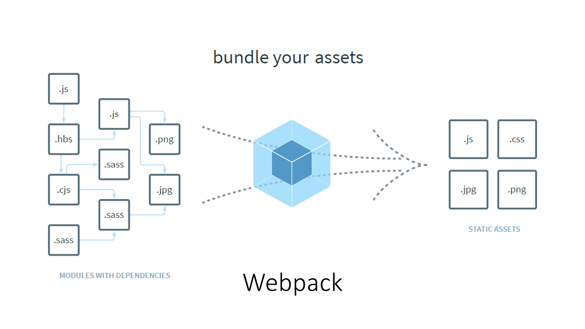

那么我们再更进一步的对其原理进行解析，在这种情况下，就需要有针对性的去查阅 webpack 的源代码了。

这里我们先提炼出 webpack 核心工作过程中的关键环节，明确查阅源码的思路：

1. webpack CLI 启动打包流程；
2. 载入 Webpack 核心模块，创建 Compiler 对象；
3. 使用 Compiler 对象开始编译整个项目；
4. 从入口文件开始，解析模块依赖，形成依赖关系树；
5. 递归依赖树，将每个模块交给对应的 Loader 处理；
6. 合并 Loader 处理完的结果，将打包结果输出到 dist 目录。

### 一、Webpack CLI

从 Webpack 4 开始 Webpack 的 CLI 部分就被单独抽到了 webpack-cli 模块中，目的是为了增强 Webpack 本身的灵活性。所以这一部分的内容我们需要找到 webpack-cli 所对应的源码。

我们这里分析的是 v3.3.11 版本的 webpack-cli，你可以参考该版本的[源码固定链接](https://github.com/webpack/webpack-cli/tree/v3.3.11)。

**Webpack CLI的作用**就是将 CLI 参数和 Webpack 配置文件中的配置整合，得到一个完整的配置对象。

Webpack CLI 的作用就是将 CLI 参数和 Webpack 配置文件中的配置整合，得到一个完整的配置对象。

这部分操作在 webpack-cli 的入口文件 bin/cli.js 中，这个文件中内容比较多，我们这里只截取部分核心代码，你可以对照截图中的行号找到源代码中对应的位置。

首先，Webpack CLI 会通过 yargs 模块解析 CLI 参数，所谓 CLI 参数指的就是我们在运行 webpack 命令时通过命令行传入的参数，例如 --mode=production。

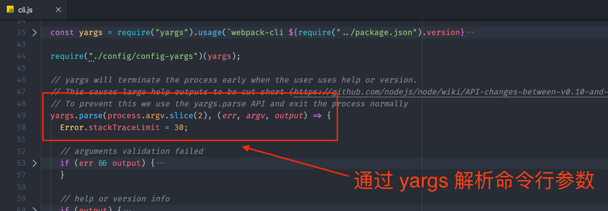

紧接着后面，调用了 bin/utils/convert-argv.js 模块，将得到的命令行参数转换为 Webpack 的配置选项对象，具体操作如下：

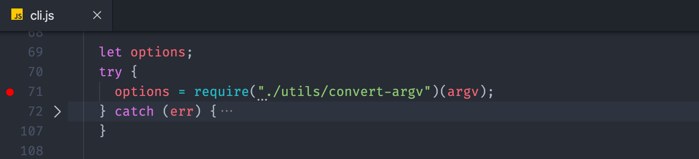

在 convert-argv.js 工作过程中，首先为传递过来的命令行参数设置了默认值，然后判断了命令行参数中是否指定了一个具体的配置文件路径，如果指定了就加载指定配置文件，反之则需要根据默认配置文件加载规则找到配置文件，具体代码如下：

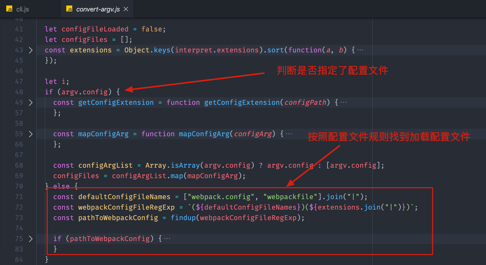

找到配置文件过后，将配置文件中的配置和 CLI 参数中的配置合并，如果出现重复的情况，会优先使用 CLI 参数，最终得到一个完整的配置选项。

有了配置选项过后，开始载入 Webpack 核心模块，传入配置选项，创建 Compiler 对象，这个 Compiler 对象就是整个 Webpack 工作过程中最核心的对象了，负责完成整个项目的构建工作。

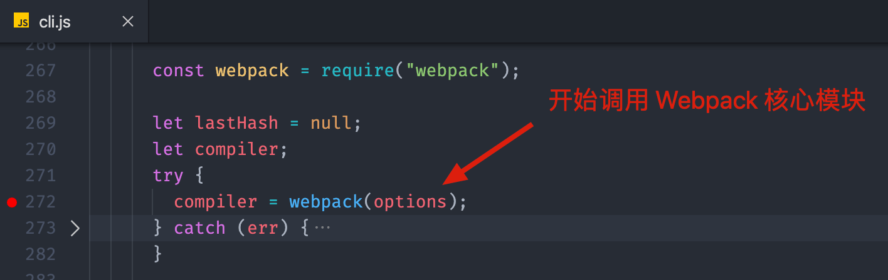

### 二、创建 Compiler 对象

随着 Webpack CLI 载入 Webpack 核心模块，整个执行过程就到了 Webpack 模块中，所以这一部分的代码需要回到 Webpack 模块中，我这里分析的是 v4.43.0 版本的 Webpack，可参考这个版本的[源代码的固定链接](https://github.com/webpack/webpack/tree/v4.43.0)。

同样，这里我们需要找到这个模块的入口文件，也就是 lib/webpack.js 文件。这个文件导出的是一个用于创建 Compiler 的函数，具体如下：

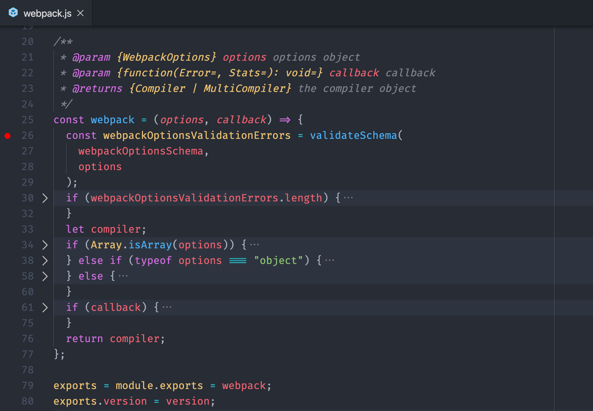

在这个函数中，首先校验了外部传递过来的 options 参数是否符合要求，紧接着判断了 options 的类型。

根据这个函数中的代码，我们发现 options 不仅仅可以是一个对象，还可以是一个数组。如果我们传入的是一个数组，那么 Webpack 内部创建的就是一个 MultiCompiler，也就是说 Webpack 应该支持同时开启多路打包，配置数组中的每一个成员就是一个独立的配置选项，实际上循环体里的回调还是递归调用 webpack 自身。而如果我们传入的是普通的对象，就会按照我们最熟悉的方式创建一个 Compiler 对象，进行单线打包。

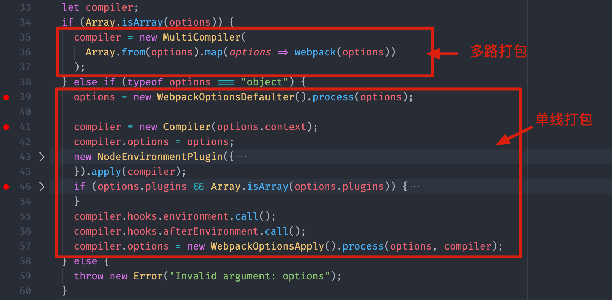

我们顺着主线接着往下看，如下图所示：在创建了 Compiler 对象过后，Webpack 就开始注册我们配置中的每一个插件了，因为再往后 Webpack 工作过程的生命周期就要开始了，所以必须先注册，这样才能确保插件中的每一个钩子都能被命中。

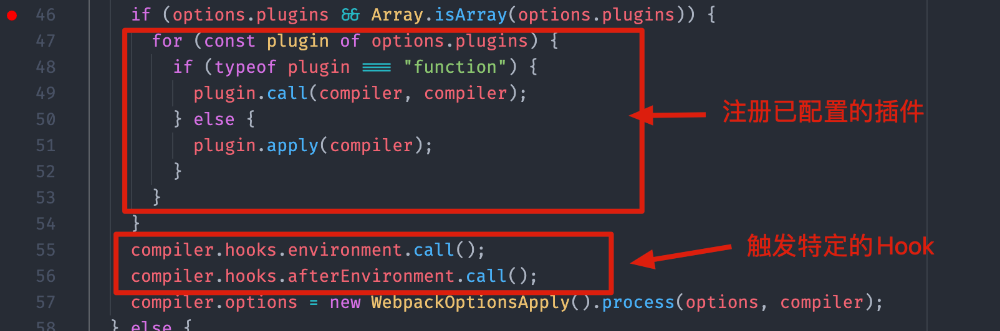

### 三、开始构建

完成 Compiler 对象的创建以后，紧接着这里的代码开始判断配置选项中是否启用了监视模式，具体操作如下：

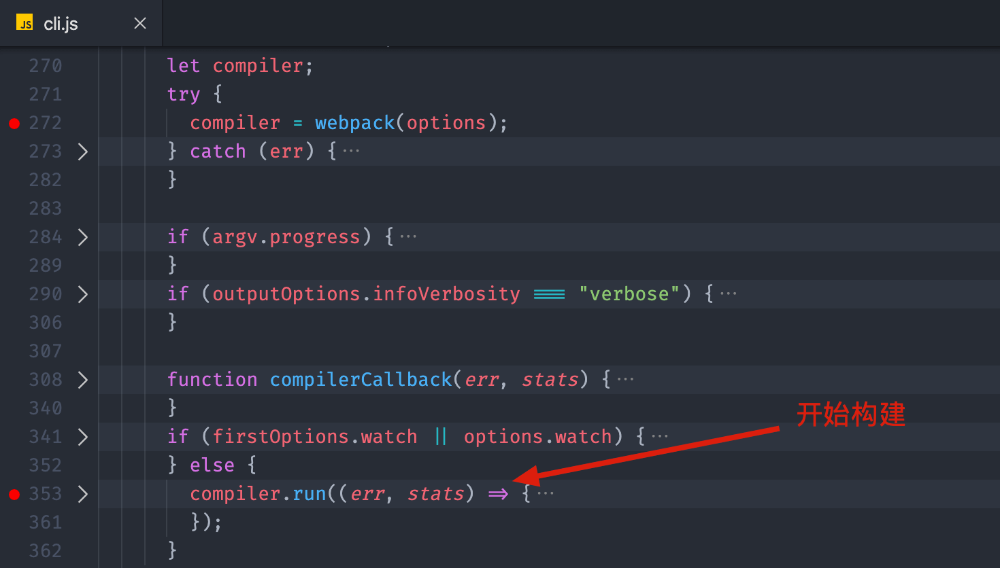

- 如果是监视模式就调用 Compiler 对象的 watch 方法，以监视模式启动构建，但这不是我们主要关心的主线。
- 如果不是监视模式就调用 Compiler 对象的 run 方法，开始构建整个应用。

这个 run 方法定义在 Compiler 类型中，具体文件在 webpack 模块下的 lib/Compiler.js 中，代码位置如下：

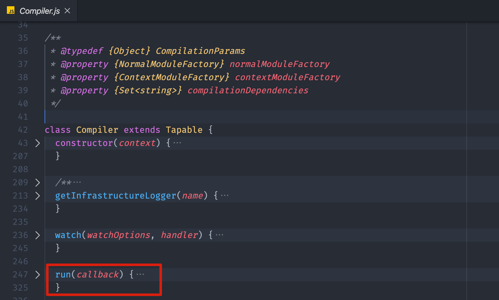

这个方法内部就是先触发了beforeRun 和 run 两个钩子，然后最关键的是调用了当前对象的 compile 方法，真正开始编译整个项目，具体代码位置如下：

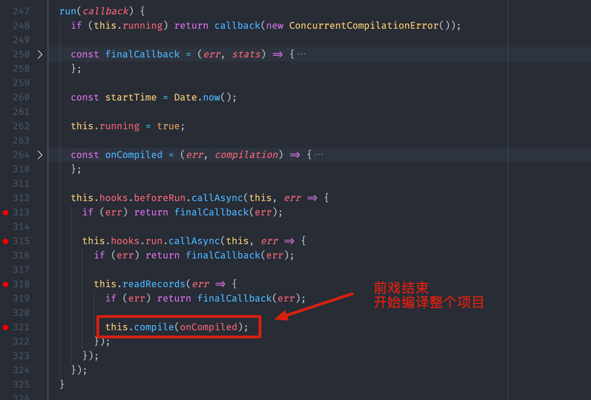

compile 方法内部主要就是创建了一个 Compilation 对象，Compilation 字面意思是“合集”，实际上，你就可以理解为一次构建过程中的上下文对象，里面包含了这次构建中全部的资源和信息。

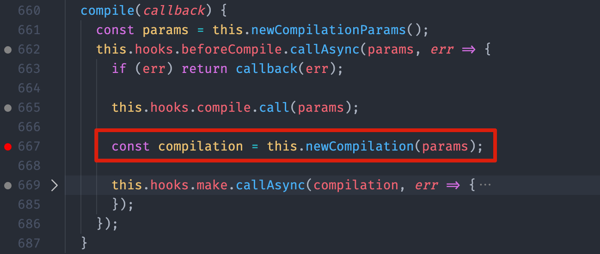

创建完 Compilation 对象过后，紧接着触发了一个叫作 make 的钩子，进入整个构建过程**最核心的 make 阶段**。

### 四、make 阶段

make 阶段主体的目标就是：根据 entry 配置找到入口模块，开始依次递归出所有依赖，形成依赖关系树，然后将递归到的每个模块交给不同的 Loader 处理。

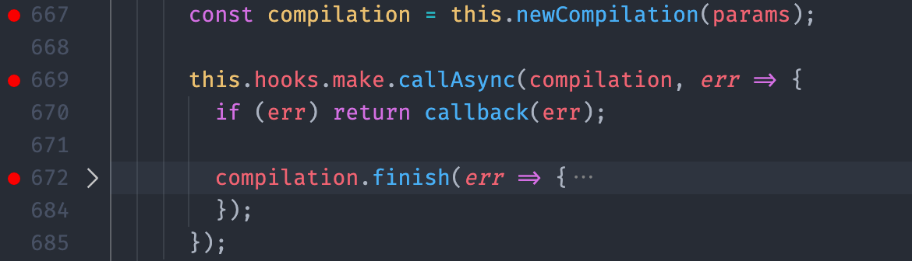

由于这个阶段的调用过程并不像之前一样，直接调用某个对象的某个方法，而是采用事件触发机制，让外部监听这个 make 事件的地方开始执行，所以从这里往后的代码可能找起来会费点劲儿。

这里我简单提示一下：想要知道这个事件触发后，哪些地方会开始执行，前提是得知道哪里注册了这个叫作 make 的事件。

Webpack 的插件系统是基于官方自己的 Tapable 库实现的，我们想要知道在哪里注册了某个事件，必须要知道如何注册的事件。Tapable 的注册方式具体如下：

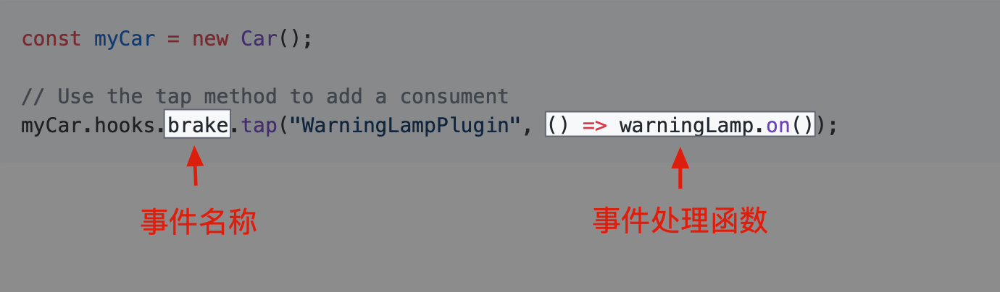

所以，我们只需要通过开发工具搜索源代码中的 make.tap，就应该能够找到事件注册的位置，具体操作如下：

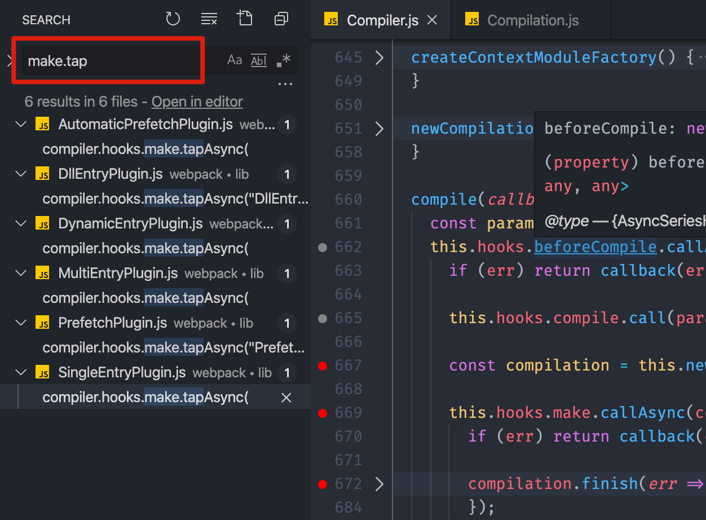

这里搜索到了六个插件中都注册了 make 事件，这些插件实际上是前面创建 Compiler 对象的时候创建的，刚刚因为没有影响，所以我们就忽略了：

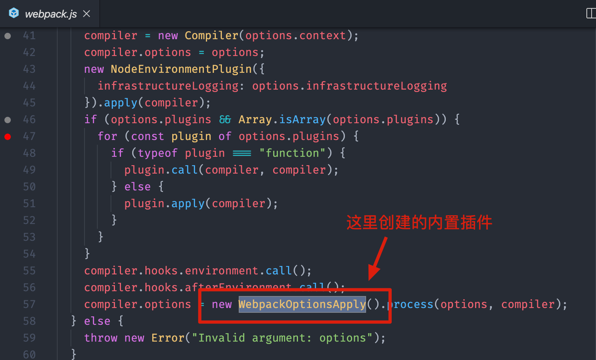

因为我们默认使用的就是单一入口打包的方式，所以这里最终会执行其中的 SingleEntryPlugin。

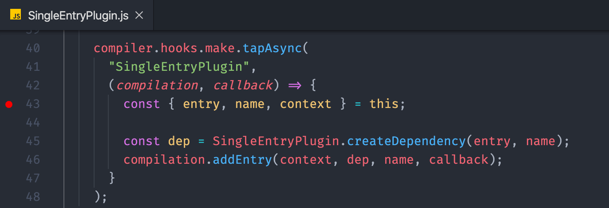

这个插件中调用了 Compilation 对象的 addEntry 方法，开始解析我们源代码中的入口文件，以此开始“顺藤摸瓜”式的寻找。

对于 make 阶段后续的流程，这里我们概括一下：

1. SingleEntryPlugin 中调用了 Compilation 对象的 addEntry 方法，开始解析入口；
2. addEntry 方法中又调用了 _addModuleChain 方法，将入口模块添加到模块依赖列表中；
3. 紧接着通过 Compilation 对象的 buildModule 方法进行模块构建；
4. buildModule 方法中执行具体的 Loader，处理特殊资源加载；
5. build 完成过后，通过 acorn 库生成模块代码的 AST 语法树；
6. 根据语法树分析这个模块是否还有依赖的模块，如果有则继续循环 build 每个依赖；
7. 所有依赖解析完成，build 阶段结束；
8. 最后合并生成需要输出的 bundle.js 写入 dist 目录。

## 工作过程

webpack 启动以后，会根据我们的配置，找到项目中的某个指定文件（一般这个文件都会是一个 JS 文件）作为入口。然后顺着入口文件中的代码，根据代码中出现的 import (ES Modules) 或者是 require(CommonJS) 之类的语句，解析推断出这个文件所依赖的资源模块，然后再分别去解析每个资源模块的依赖，周而复始，最后形成整个项目中所有用到的文件之间的依赖关系树。

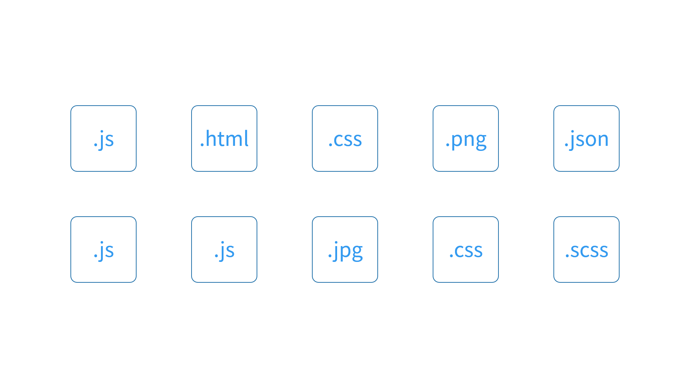

有了这个依赖关系树以后， webpack 会遍历（递归）这个依赖树，找到每个节点对应的资源文件，然后根据配置选项中的 Loader 配置，交给对应的 Loader 去加载这个模块，最后将加载的结果放入 bundle.js （打包结果）中，从而实现整个项目的打包。

对于依赖模块中无法通过 JavaScript 代码表示的资源模块，例如图片或字体文件，一般的 Loader 会将它们单独作为资源文件拷贝到输出目录中，然后将这个资源文件所对应的访问路径作为这个模块的导出成员暴露给外部。

整个打包过程中，Loader 机制起了很重要的作用，因为如果没有 Loader 的话，webpack 就无法实现各种各样类型的资源文件加载，那 webpack 也就只能算是一个用来合并 JS 模块代码的工具了。

我们来一起看下 Webpack 打包后生成的 bundle.js 文件，深入了解 Webpack 是如何把这些模块合并到一起，而且还能正常工作的。

为了更好的理解打包后的代码，我们先将 Webpack 工作模式设置为 none，这样 Webpack 就会按照最原始的状态进行打包，所得到的结果更容易理解和阅读。

按照 none 模式打包完成后，我们打开最终生成的 bundle.js 文件，如下图所示：

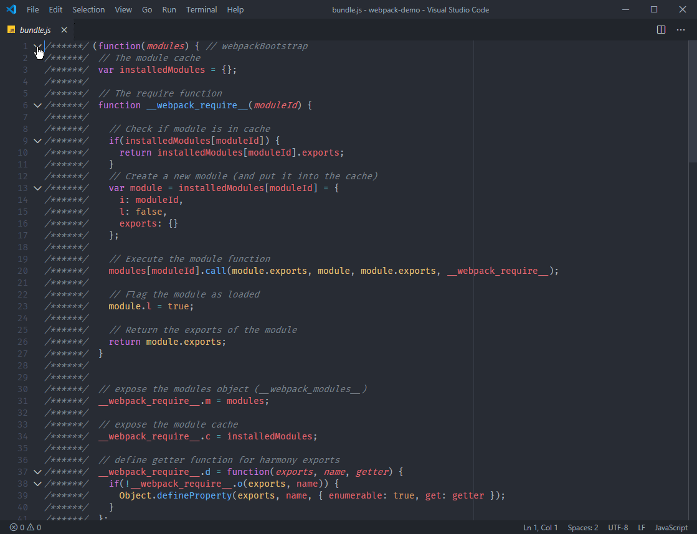

折叠代码后，再看下整体的结构：

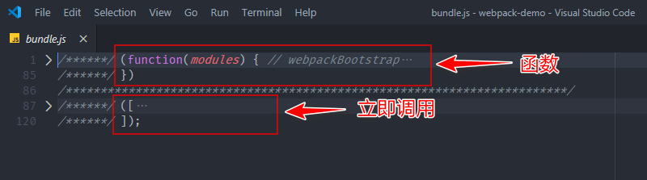

整体生成的代码其实就是一个立即执行函数，这个函数是 Webpack 工作入口（webpackBootstrap），它接收一个 modules 参数，调用时传入了一个数组。

展开这个数组，里面的元素均是参数列表相同的函数。这里的函数对应的就是我们源代码中的模块，也就是说每个模块最终被包裹到了这样一个函数中，从而实现模块私有作用域.

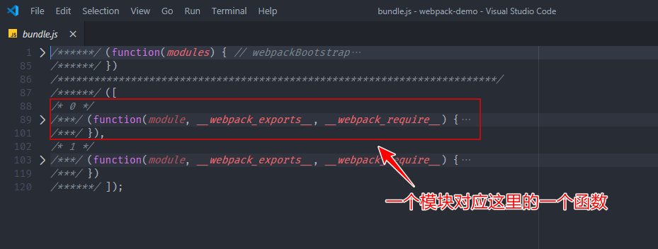

展开工作入口函数：

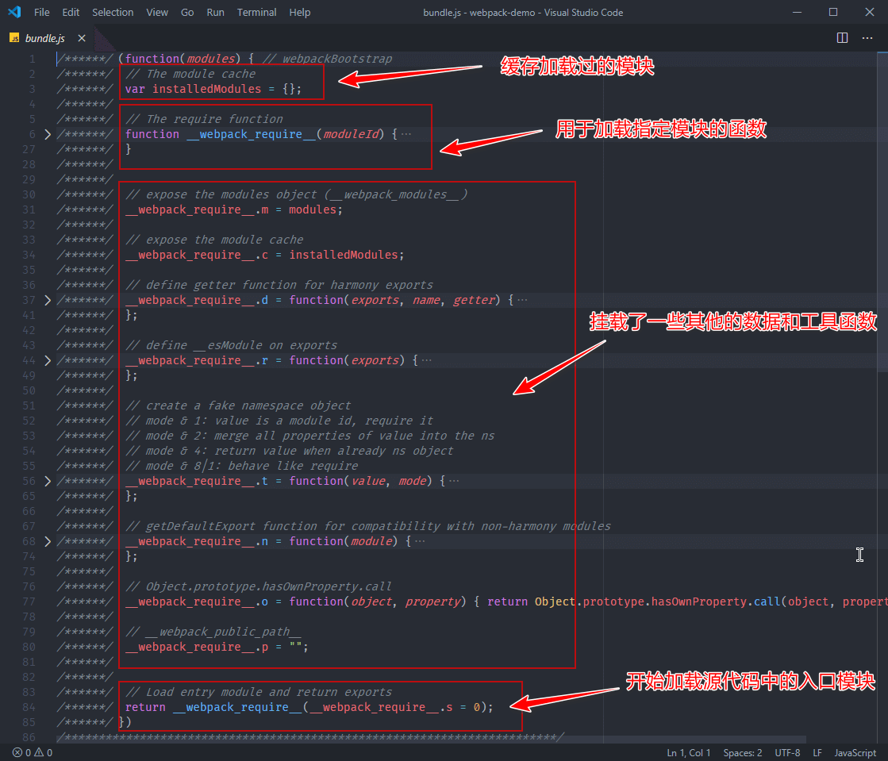

这个函数内部并不复杂，而且注释也很清晰。

1. 最开始定义了一个 installedModules 对象用于存放或者缓存加载过的模块。
2. 紧接着定义了一个 require 函数，顾名思义，这个函数是用来加载模块的。
3. 再往后就是在 require 函数上挂载了一些其他的数据和工具函数，这些暂时不用关心。
4. 最后调用了 require 函数，传入的模块 id 为 0，开始加载模块。模块 id 实际上就是模块数组的元素下标，也就是说这里开始加载源代码中所谓的入口模块。

